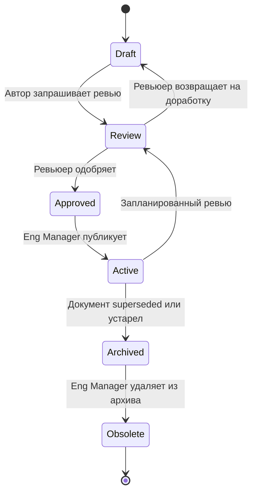

# DOCUMENT_LIFECYCLE.md — Sec Scanner Workspace

> **Дата:** 2026-07-15
> **Версия:** 1.0
> **Тип:** Операционный документ — Жизненный цикл документов
> **Владелец:** Engineering Manager
> **Статус:** Active
> **Связанные документы:** REPOSITORY_STANDARDS.md (Section 5 — legacy lifecycle), GOVERNANCE.md, DOCUMENT_STANDARDS.md, CONTRIBUTING.md

---

## 1. Назначение

Формальная модель жизненного цикла документов Workspace. Определяет стадии, критерии переходов, ответственных и правила, которые гарантируют: ни один документ не «зависает» в неопределённом состоянии, устаревшие документы не создают путаницу, история решений сохраняется.

**Эволюция от REPOSITORY_STANDARDS.md Section 5:** REPO-001 определил 4 стадии (Draft → Active → Deprecated → Archived) без формальных критериев переходов. Этот документ расширяет модель до 6 стадий и добавляет критерии, ответственных и автоматизацию.

---

## 2. Стадии жизненного цикла

### 2.1 Draft

**Определение:** Черновик. Документ создан, но не готов для использования при принятии решений.

**Расположение:** `docs/draft/`

**Критерии входа:**
- Документ создан по шаблону из DOCUMENT_STANDARDS.md
- Метаданные заполнены (дата, версия 0.1, статус Draft, владелец)

**Кто переводит в следующую стадию:**
- Автор (если документ простой, < 200 строк) — напрямую в Active
- Автор → Ревьюер (если документ стратегический или > 200 строк) — через Review

**Автоматические триггеры:**
- Draft без изменений > 2 TASK → Engineering Manager создаёт Issue «DOC-LIFECYCLE: Review or archive [DOCUMENT]» (приоритет P3)
- Draft без изменений > 4 TASK → автоматический переход в Archived

**Что можно делать:**
- Редактировать без ограничений
- Не обновлять связанные документы (Draft не является авторитетным источником)

---

### 2.2 Review

**Определение:** Документ проходит ревью. Авторитетный источник — предыдущая Active-версия (если существует) или нет (новый документ).

**Расположение:** `docs/draft/` (физически), статус в метаданных = Review

**Критерии входа:**
- Все разделы документа заполнены (нет пустых «TODO»)
- Ссылки на связанные документы указаны
- Автор считает документ готовым к ревью

**Кто ревьюирует:**
- Владелец документа (роль из метаданных) — обязанность
- Engineering Manager — формат и стандарты
- Дополнительный ревьюер — если документ затрагивает другую область (например, архитектурный документ ревьюит CTO)

**Критерии перехода в Approved:**
- DOCUMENT_STANDARDS.md соблюдён (метаданные, структура)
- Содержание не противоречит другим Active-документам
- Ссылки валидны
- Нет дублирования информации без перекрёстных ссылок
- Решения (если есть) следуют DECISION_MANAGEMENT_FRAMEWORK.md

**Критерии возврата в Draft:**
- Ревьюер нашёл противоречия, отсутствующие ссылки, или неполноту
- В этом случае ревьюер создаёт список замечаний, автор исправляет и повторно запрашивает Review

**Временной лимит:**
- Review должен быть завершён в течение 1 TASK после запроса
- Если ревьюер недоступен — эскалация на Founder

---

### 2.3 Approved

**Определение:** Документ прошёл ревью и готов к публикации. Промежуточная стадия между Review и Active.

**Расположение:** `docs/draft/` (физически), статус = Approved

**Критерии входа:**
- Ревью пройден (все замечания закрыты)

**Кто переводит в Active:**
- Engineering Manager — перемещает документ в целевую категорию (`docs/NN_category/`)

**Действия при переходе Approved → Active:**
1. Переместить файл из `docs/draft/` в целевую категорию
2. Обновить INDEX.md (добавить документ в навигацию)
3. Обновить PROJECT_OS.md (Document Index)
4. Обновить DOCUMENT_AUDIT.md
5. Если документ заменяет существующий — предыдущий документ пометить как Superseded и переместить в Archive

**Временной лимит:**
- Approved → Active должен произойти в течение 1 TASK
- Approved без действия > 1 TASK — эскалация

---

### 2.4 Active

**Определение:** Текущий, авторитетный документ. Используется для принятия решений.

**Расположение:** `docs/NN_category/` (соответствующей категории)

**Критерии входа:**
- Прошёл Review (или создан как простой документ < 200 строк)
- Зарегистрирован в INDEX.md и PROJECT_OS.md

**Кто обновляет:**
- Владелец документа (роль из метаданных)
- При каждом TASK, затрагивающем документ — patch-версия

**Автоматические триггеры:**
- Active без изменений > 3 месяца → Engineering Manager помечает «Требует ревью» (метка в DOCUMENT_AUDIT.md)
- Active без изменений > 6 месяцев → пометить для повторного Review через стадию Review

**Что можно делать:**
- Обновлять содержание (с увеличением версии)
- Обновлять ссылки
- Добавлять новые разделы (minor-версия)

---

### 2.5 Archived

**Определение:** Документ больше не используется для принятия решений, но сохранён для исторического контекста.

**Расположение:** `docs/archive/`

**Критерии входа:**
- Документ заменён новой версией (Superseded) — пометка `> **Superseded by:** [NEW_DOCUMENT.md]`
- Документ более не релевантен (проект изменил направление) — пометка `> **Archived reason:** [причина]`
- Решение из документа отменено — пометка `> **Superseded by:** DECISION-XXX (решение отменено)`

**Кто архивирует:**
- Engineering Manager (операционные, стандарты)
- CTO (архитектурные)
- CPO (продуктовые, стратегические)

**Действия при архивировании:**
1. Добавить пометку Superseded/Archived reason в метаданные
2. Переместить файл в `docs/archive/`
3. Обновить все ссылки в Active-документах (перенаправить на новый документ)
4. Обновить INDEX.md (удалить из навигации)
5. Обновить PROJECT_OS.md (переместить в раздел «Архивированные»)

**Что НЕ архивировать:**
- PROJECT_OS.md — всегда Active (конституция)
- DECISION_LOG.md (оба: продуктовый и Workspace) — решения никогда не удаляются
- AI_OPERATING_MODEL.md — действующий регламент
- GOVERNANCE.md — действующий документ управления
- DOCUMENT_STANDARDS.md — действующий стандарт

---

### 2.6 Obsolete

**Определение:** Архивный документ, который больше не несёт исторической ценности. Может быть удалён.

**Расположение:** `docs/archive/` (до удаления)

**Критерии входа:**
- Документ в Archived > 6 месяцев
- Нет ни одной ссылки на документ из Active-документов
- Engineering Manager подтвердил отсутствие исторической ценности

**Кто удаляет:**
- Engineering Manager (с подтверждением от владельца документа)

**Действия:**
1. Проверить: нет ссылок из Active-документов
2. Удалить файл из `docs/archive/`
3. Записать удаление в DOCUMENT_AUDIT.md: «[DOCUMENT] — удалён как Obsolete, [дата]»

---

## 3. Матрица переходов

| Из → В | Draft | Review | Approved | Active | Archived | Obsolete |
|---------|-------|--------|----------|--------|----------|----------|
| **Draft** | — | Автор запрашивает | — | Простой документ (< 200 строк) | 4+ TASK без изменений | — |
| **Review** | Ревьюер вернул | — | Ревьюер одобрил | — | — | — |
| **Approved** | — | — | — | Eng Manager публикует | — | — |
| **Active** | — | Запланированный ревью | — | — | Superseded / Устарел | — |
| **Archived** | — | — | — | Восстановление (редко) | — | 6+ месяцев, нет ссылок |
| **Obsolete** | — | — | — | — | — | Удалён |

---

## 4. Исключения из стандартного lifecycle

### 4.1 Навсегда Active (Permanently Active)

Эти документы не переходят в Archived:

| Документ | Причина |
|----------|---------|
| PROJECT_OS.md | Конституция — обновляется, не архивируется |
| AI_OPERATING_MODEL.md | Регламент — эволюционирует через версии |
| DECISION_LOG.md (оба) | Корпоративная память — решения никогда не удаляются |
| DECISION_MANAGEMENT_FRAMEWORK.md | Система управления решениями |
| GOVERNANCE.md | Управление Workspace |
| DOCUMENT_STANDARDS.md | Стандарт — эволюционирует через версии |
| DEFINITIONS.md | Справочник критериев — обновляется |

### 4.2 Динамические документы (без lifecycle)

Документы в `docs/reviews/` не проходят стандартный lifecycle:

- Создаются по шаблону, сразу Active
- Не требуют Review перед публикацией (шаблон обеспечивает качество)
- Архивируются только при quarterly audit (если содержат устаревшие выводы)

### 4.3 Sprint-документы

- `SPRINT_NN.md` — создаются как Active (шаблон обеспечивает структуру)
- После завершения спринта — остаются Active (исторический record)
- Не архивируются

---

## 5. Связь с REPOSITORY_STANDARDS.md

REPOSITORY_STANDARDS.md Section 5 определяет упрощённый lifecycle (Draft → Active → Deprecated → Superseded → Archived). При MIG-001 (Documentation Migration) Section 5 REPOSITORY_STANDARDS.md должен быть обновлён с ссылкой на этот документ:

> Полная модель жизненного цикла с критериями переходов: см. [DOCUMENT_LIFECYCLE.md](DOCUMENT_LIFECYCLE.md)

Маппинг стадий:

| REPOSITORY_STANDARDS (legacy) | DOCUMENT_LIFECYCLE (этот документ) |
|-------------------------------|-----------------------------------|
| Draft | Draft → Review → Approved |
| Active | Active |
| Deprecated | Active (с пометкой в DOCUMENT_AUDIT) |
| Superseded | Archived (с пометкой Superseded) |
| Archived | Archived / Obsolete |

---

## 6. Чеклист при создании документа

- [ ] Файл создан по шаблону из DOCUMENT_STANDARDS.md
- [ ] Метаданные заполнены (дата, версия, тип, владелец, статус Draft)
- [ ] Файл размещён в `docs/draft/`
- [ ] Если документ простой (< 200 строк) — можно пропустить Review, перейти напрямую в Active
- [ ] Если документ стратегический или > 200 строк — запросить Review
- [ ] При переходе в Active — зарегистрировать в INDEX.md, PROJECT_OS.md, DOCUMENT_AUDIT.md