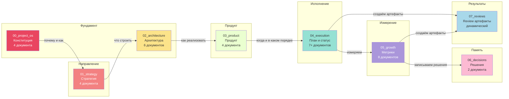
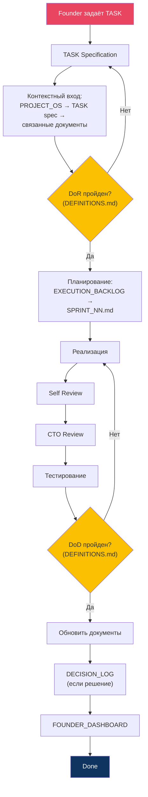
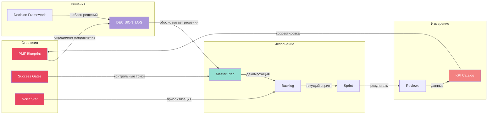
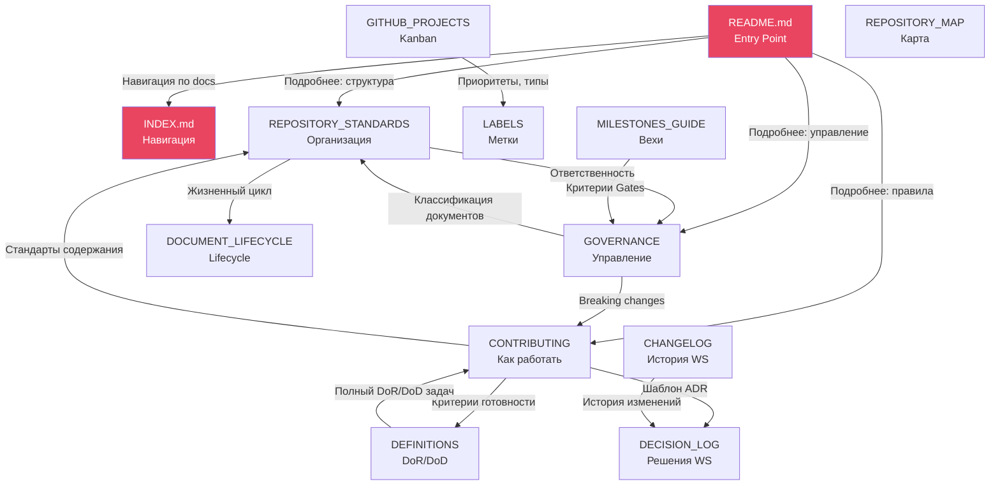
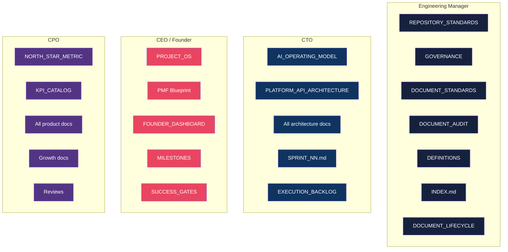

# REPOSITORY_MAP.md — Sec Scanner Workspace

> **Дата:** 2026-07-15
> **Версия:** 1.0
> **Тип:** Операционный документ — Визуальная карта репозитория
> **Владелец:** Engineering Manager
> **Статус:** Active
> **Связанные документы:** REPOSITORY_STANDARDS.md, INDEX.md, README.md

---

## 1. Иерархия каталогов

```mermaid
graph TD
    ROOT["sec-scanner-workspace/"]

    ROOT --> CFG["Корневые файлы<br/>(Конфигурация Workspace)"]
    ROOT --> GITHUB[".github/"]
    ROOT --> DOCS["docs/"]

    CFG --> C1["README.md — Entry Point"]
    CFG --> C2["CONTRIBUTING.md — Правила работы"]
    CFG --> C3["REPOSITORY_STANDARDS.md — Стандарты"]
    CFG --> C4["GOVERNANCE.md — Управление"]
    CFG --> C5["DEFINITIONS.md — DoR/DoD"]
    CFG --> C6["LABELS.md — GitHub Labels"]
    CFG --> C7["MILESTONES_GUIDE.md — Milestones"]
    CFG --> C8["GITHUB_PROJECTS.md — Kanban"]
    CFG --> C9["DECISION_LOG.md — Решения Workspace"]
    CFG --> C10["CHANGELOG.md — История Workspace"]
    CFG --> C11["INDEX.md — Навигация"]
    CFG --> C12["REPOSITORY_MAP.md — Эта карта"]
    CFG --> C13["DOCUMENT_LIFECYCLE.md — Lifecycle"]
    CFG --> C14["CODEOWNERS — Review права"]

    GITHUB --> GT[".github/ISSUE_TEMPLATE/"]
    GT --> T1["01_feature_request.md"]
    GT --> T2["02_bug_report.md"]
    GT --> T3["03_architecture_decision.md"]
    GT --> T4["04_product_improvement.md"]
    GT --> T5["05_technical_debt.md"]
    GT --> T6["06_research.md"]
    GITHUB --> PT["PULL_REQUEST_TEMPLATE.md"]

    DOCS --> D00["00_project_os/"]
    DOCS --> D01["01_strategy/"]
    DOCS --> D02["02_architecture/"]
    DOCS --> D03["03_product/"]
    DOCS --> D04["04_execution/"]
    DOCS --> D05["05_growth/"]
    DOCS --> D06["06_decisions/"]
    DOCS --> D07["07_reviews/"]
    DOCS --> D08["08_draft/"]
    DOCS --> DARCH["archive/"]

    style ROOT fill:#1a1a2e,color:#fff,stroke:#e94560
    style CFG fill:#16213e,color:#fff
    style GITHUB fill:#16213e,color:#fff
    style DOCS fill:#16213e,color:#fff
    style D00 fill:#0f3460,color:#fff
    style D01 fill:#0f3460,color:#fff
    style D02 fill:#0f3460,color:#fff
    style D03 fill:#0f3460,color:#fff
    style D04 fill:#0f3460,color:#fff
    style D05 fill:#0f3460,color:#fff
    style D06 fill:#0f3460,color:#fff
    style D07 fill:#0f3460,color:#fff
    style D08 fill:#533483,color:#fff
    style DARCH fill:#333,color:#999
```

---

## 2. Директории docs/ — назначение и содержимое

---

## 3. Поток информации при работе с задачей

---

## 4. Документ → Решение → Стратегия (поток обоснований)

---

## 5. Связи между корневыми файлами

---

## 6. Кто где работает (RACI визуально)

