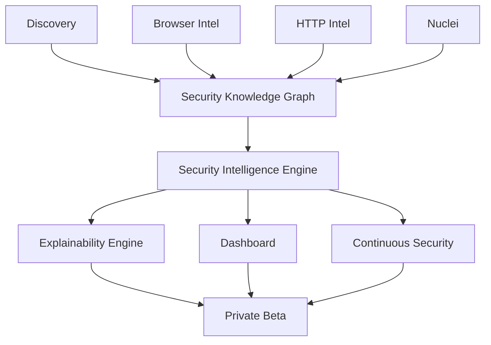
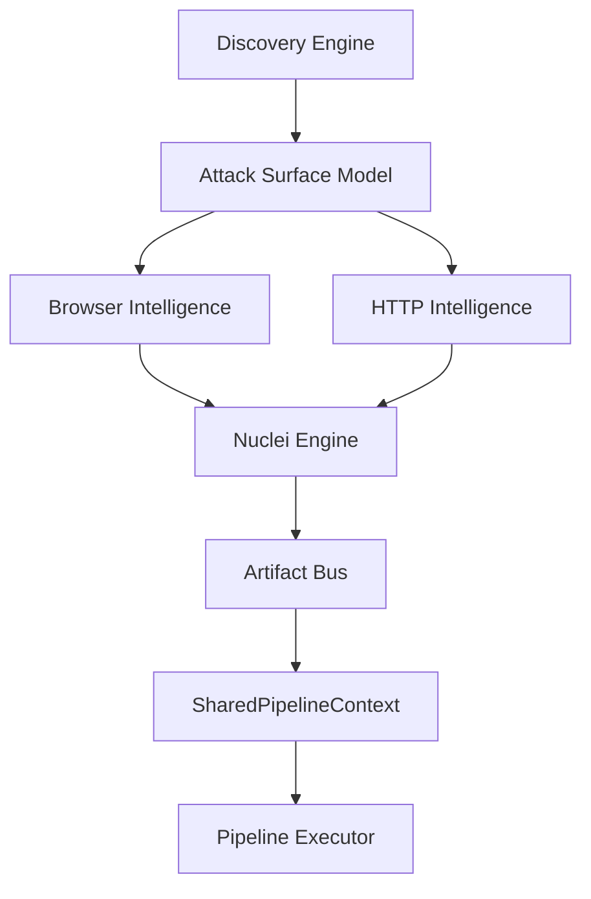
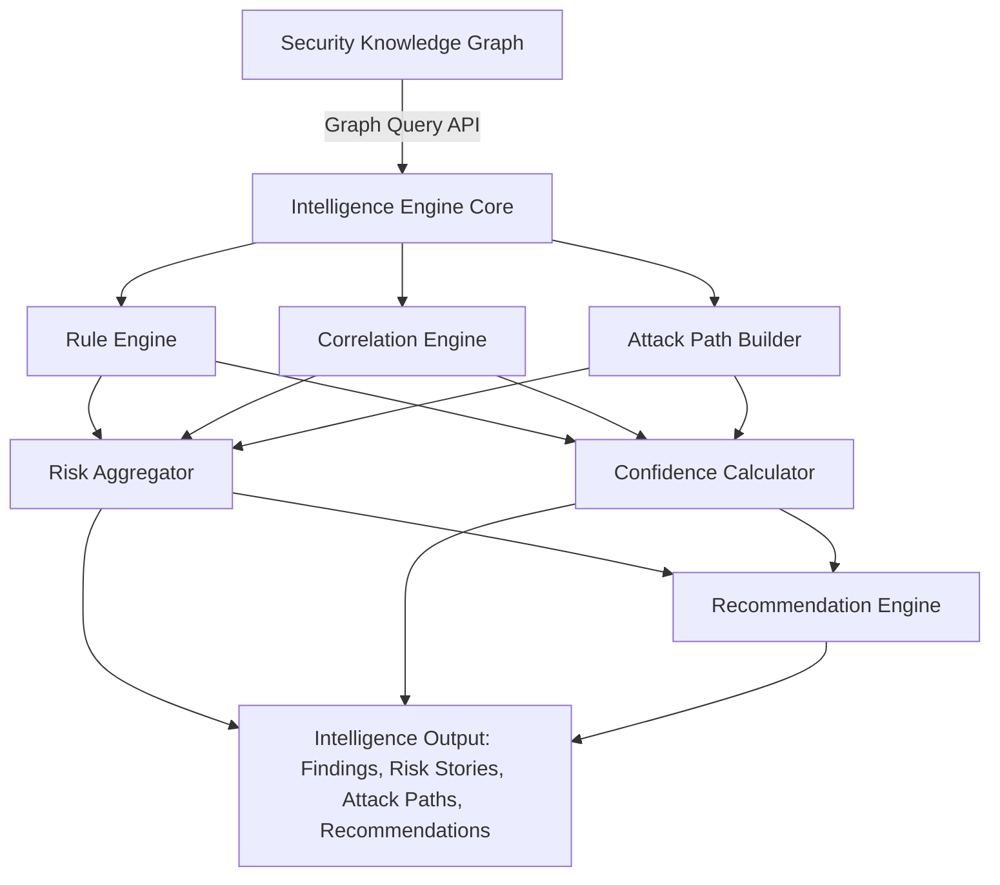
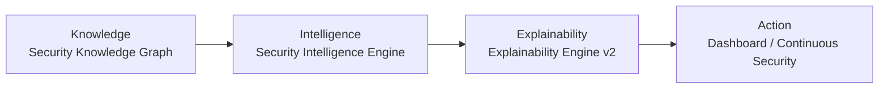
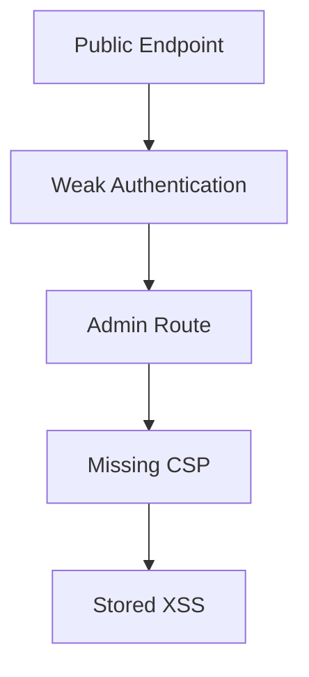

# PROJECT HANDOFF — Security Intelligence Platform

## Оглавление

1. [Главная цель проекта](#1-главная-цель-проекта)
2. [Архитектурные принципы](#2-архитектурные-принципы)
3. [Реализованные компоненты](#3-реализованные-компоненты)
4. [Архитектура платформы](#4-архитектура-платформы)
5. [Security Knowledge Graph (KG-001)](#5-security-knowledge-graph-kg-001)
6. [Security Intelligence Engine (EPIC-04)](#6-security-intelligence-engine-epic-04)
7. [SIE — Компонентная архитектура](#7-sie--компонентная-архитектура)
8. [Интеллектуальный поток](#8-интеллектуальный-поток)
9. [Правила корреляции и Attack Path](#9-правила-корреляции-и-attack-path)
10. [Ограничения и неизменяемые модули](#10-ограничения-и-неизменяемые-модули)
11. [Roadmap](#11-roadmap)
12. [Definition of Done](#12-definition-of-done)
13. [Глоссарий](#13-глоссарий)
14. [ADR шаблоны](#14-adr-шаблоны)

---

## 1. Главная цель проекта

**Стратегическое видение и позиционирование платформы**

Проект ставит перед собой амбициозную цель: создать не очередной DAST-сканер, а **интеллектуальную платформу анализа безопасности веб-приложений** нового поколения. Традиционные DAST-инструменты ограничены тем, что они лишь находят уязвимости, но не способны установить связи между ними, оценить реальный уровень риска и предложить объяснимые рекомендации. Данная платформа преодолевает эти ограничения через построение единой модели знаний, интеллектуальную корреляцию данных и детерминированную оценку рисков.

> Это AI-Native Security Intelligence Platform. DAST — лишь один из источников данных. Главная ценность продукта: единая модель знаний, корреляция данных, интеллектуальная оценка риска, объяснимость выводов и непрерывный анализ безопасности.
>
> — Стратегическое видение CTO

Конечное видение платформы разворачивается как последовательность слоёв, каждый из которых строится поверх предыдущего и расширяет аналитические возможности системы. От сбора данных (Discovery) через браузерную и HTTP-интеллект к построению графа знаний (Security Knowledge Graph), затем к интеллектуальному анализу (Security Intelligence Engine), объяснимости (Explainability Engine), визуализации (Dashboard) и, наконец, к непрерывному мониторингу (Continuous Security).



Каждый слой в этом конвейере является независимым модулем с чётко определённым интерфейсом. Это означает, что платформа может масштабироваться горизонтально: новые источники данных подключаются через Plugin API, новые аналитические движки строятся поверх Graph API, а новые пользовательские интерфейсы работают через единый Intelligence API. Такой подход гарантирует, что расширение платформы никогда не потребует изменения её ядра.

---

## 2. Архитектурные принципы

**Фундаментальные правила, определяющие эволюцию платформы**

Проект строится на строгих архитектурных принципах, которые обеспечивают устойчивость, предсказуемость и возможность долгосрочного развития. Эти принципы не являются декларативными пожеланиями — они формализованы и проверяются через Definition of Done для каждой задачи. Любое отклонение от принципов должно быть зафиксировано в ADR (Architecture Decision Record) с явным обоснованием.

| Принцип | Описание |
|---------|----------|
| **Clean Architecture** | Разделение ответственности между слоями: домен, приложение, инфраструктура. Бизнес-логика не зависит от фреймворков и внешних сервисов. |
| **DDD** | Domain-Driven Design: модель строится вокруг предметной области безопасности, а не вокруг технических аспектов сканирования. |
| **Plugin Architecture** | Любой движок сканирования подключается через Plugin API. Ядро не знает о конкретных реализациях — только о контрактах. |
| **Event Driven** | Компоненты взаимодействуют через события и Artifact Bus. Это обеспечивает слабую связность и возможность асинхронной обработки. |
| **Immutable Models** | Все доменные модели неизменяемы. Результаты сканирования, артефакты и выводы не могут быть модифицированы после создания. |
| **Engine Agnostic** | Платформа не зависит от конкретного сканирующего движка. Nuclei — лишь один из возможных адаптеров; замена не влияет на ядро. |
| **Test First** | TDD-подход: тесты пишутся до или вместе с реализацией. Минимальное покрытие — 90% для каждого нового модуля. |
| **Zero Regression** | Каждое изменение верифицируется на отсутствие регрессий. Существующие 500+ тестов должны проходить без единого падения. |
| **Documentation First** | Документация создаётся параллельно с кодом. ADR, Mermaid-диаграммы, архитектурные описания — обязательные артефакты каждой задачи. Код без документации не считается завершённым. |

Ключевое следствие этих принципов: **любое расширение платформы должно происходить без изменения ядра**. Это правило многократно проверено на практике — когда Nuclei Adapter, Discovery Engine, Browser Intelligence и HTTP Intelligence были созданы без единого изменения в существующих модулях. Тот же принцип применяется к Security Knowledge Graph и Security Intelligence Engine.

---

## 3. Реализованные компоненты

**Все завершённые EPIC и TASK с результатами**

### EPIC-01: Workspace `Complete`

Полный GitHub Workspace с SSOT (Single Source of Truth), включающий 67+ документов, Repository Standards, ADR, Roadmap, Architecture и Documentation System. Это фундамент, обеспечивающий воспроизводимость и прозрачность всех архитектурных решений. Каждый документ привязан к конкретному EPIC/TASK и содержит актуальную информацию о статусе, ответственном и артефактах.

### TASK-201: Scan Platform Foundation `Complete`

Создана модульная платформа сканирования, включающая Plugin API (контракт для подключения движков), Scan Context (контекст выполнения сканирования), Scan Job (модель задачи сканирования), Engine Registry (реестр доступных движков), Scan Orchestrator (оркестратор конвейера), Domain Models (доменные модели), Event System (система событий) и Error System (система обработки ошибок). Этот набор компонентов составляет ядро платформы, поверх которого строятся все последующие модули.

### TASK-202A: Nuclei Adapter `Complete`

Создан NucleiAdapter, реализующий интерфейс ScanEnginePlugin. Поддерживает парсинг JSONL-вывода, маппинг Findings, нормализацию Severity, формирование Evidence и обработку OAST (Out-of-Band). Внесено нулевых изменений в ядро — полная изоляция через Plugin API.

### TASK-202B: Discovery Engine `Complete`

Создан движок Attack Surface Discovery на базе Katana. Поддерживает URL Discovery, Forms, JS, Assets, API и Crawl Graph. Результаты публикуются через Artifact Bus, обеспечивая доступность для всех последующих модулей без прямых зависимостей.

### TASK-202C: Browser Intelligence Engine `Complete`

Создан Browser Intelligence Layer на базе Playwright. Поддерживает DOM-анализ, SPA-обработку, JWT/Cookies/Runtime, GraphQL, WebSocket, Service Workers и Browser Pool для параллельного анализа. Это один из наиболее сложных модулей платформы, обеспечивающий глубину понимания клиентской части приложения.

### TASK-202D: HTTP Intelligence Engine `Complete`

Поддержка TLS-анализа, Headers, Cookies, HTTP Profile, Infrastructure Fingerprinting, Rate Limit, Redirects и HTTP Behaviour. Модуль формирует профиль инфраструктуры цели, который используется для корреляции и построения цепочек эксплуатации.

### TASK-202E: Pipeline Executor `Complete`

Создано Execution Core с поддержкой параллельного выполнения, retry, pause, resume, failure recovery, metrics и Artifact Bus. Pipeline Executor управляет жизненным циклом сканирования и обеспечивает целостность данных даже при сбоях отдельных шагов.

### TASK-202F: Validation `Complete`

Получено 500+ тестов с покрытием 90%+ и нулевыми регрессиями. Это обеспечивает уверенность в стабильности платформы и служит гарантом того, что новые модули не сломают существующую функциональность.

---

## 4. Архитектура платформы

**Текущее состояние архитектуры и поток данных**

Текущая архитектура платформы представляет собой многослойную систему, в которой данные продвигаются сверху вниз: от сбора (Discovery) через интеллектуальные слои (Browser/HTTP Intelligence) к сканированию (Nuclei), затем к артефактам (Artifact Bus) и, наконец, к исполнению (Pipeline Executor). Все модули считаются завершёнными и образуют стабильный фундамент для следующего этапа — Security Knowledge Graph.



Ключевая особенность этой архитектуры — полная изоляция модулей. Discovery Engine не знает о Browser Intelligence, Browser Intelligence не знает о Nuclei, а Nuclei не знает о Pipeline Executor. Все они взаимодействуют исключительно через Artifact Bus и события. Это позволяет заменять, модернизировать или добавлять любой модуль без каскадных изменений в остальных компонентах. На практике это было подтверждено при реализации всех TASK-202x — ни один модуль не потребовал изменений в уже существующем коде.

---

## 5. Security Knowledge Graph (KG-001)

**Следующий фундамент платформы — модель знаний**

> **Статус: В реализации** `KG-001`
>
> Security Knowledge Graph — это не база данных. Это внутренняя модель знаний платформы, которая объединяет данные из всех источников в единый граф сущностей и связей. Граф строится исключительно через Artifact Bus, без прямого обращения к движкам сканирования.

KG-001 создаёт шесть ключевых компонентов: **Node Model** (модель узлов графа — endpoints, cookies, JWT, frameworks, findings), **Edge Model** (модель связей — dependency, exposure, authentication, vulnerability), **Graph Builder** (построитель графа из артефактов), **Identity Resolution** (разрешение идентичности — устранение дубликатов и слияние сущностей), **Provenance** (отслеживание происхождения каждого узла и связи) и **Graph Query API** (API для запросов к графу).

Источниками данных для графа служат четыре уже реализованных модуля: Discovery, Browser Intelligence, HTTP Intelligence и Nuclei. Каждый из них публикует артефакты через Artifact Bus, которые Graph Builder преобразует в узлы и связи. При этом существующие движки не требуют никаких изменений — они продолжают работать как прежде, а граф лишь подписывается на их артефакты.

**Критическое ограничение:** Graph строится исключительно через Artifact Bus. Никаких изменений существующих движков. Это гарантирует, что KG-001 не нарушит стабильность платформы и не потребует модификации уже протестированных компонентов. Данный принцип был успешно применён при создании всех предыдущих модулей и остаётся непреложным правилом архитектуры.

---

## 6. Security Intelligence Engine (EPIC-04)

**Детерминированный слой анализа поверх Security Knowledge Graph**

> **EPIC-04 / INT-001: Текущая задача** `В разработке`
>
> Создать Security Intelligence Engine (SIE) — независимый аналитический слой, который интерпретирует Security Knowledge Graph и генерирует выводы о состоянии безопасности. SIE не выполняет сканирование. Он анализирует уже построенный граф.

Security Intelligence Engine — это центральный аналитический модуль платформы, который превращает сырые данные графа знаний в осмысленные выводы о безопасности. SIE работает по принципу детерминированного анализа: одни и те же входные данные всегда дают один и тот же результат. Это принципиальное архитектурное решение, которое отличает платформу от систем, полагающихся на недетерминированные AI/LLM-модели.

Engine должен быть **immutable** (результаты анализа не изменяются после создания), **deterministic** (одинаковый граф даёт одинаковый результат), **explainable** (каждый вывод содержит полную трассировку: какие узлы, связи, правила и доказательства были использованы), **rule-driven** (анализ основан на декларативных правилах, а не на императивной логике), **расширяемым** (новые правила добавляются без изменения существующих) и **независимым от конкретного движка** (SIE работает только с Graph API).

> Это не AI-модуль и не LLM-интеграция. Все выводы должны быть воспроизводимыми и детерминированными. Задача — создать интеллектуальный слой, который в будущем сможет использоваться Explainability Engine, Dashboard, Continuous Security и, при необходимости, дополняться LLM как вспомогательным компонентом, но не зависеть от него.
>
> — Дополнительное указание CTO

SIE состоит из шести основных компонентов, каждый из которых решает конкретную аналитическую задачу: Rule Engine (декларативные правила анализа), Correlation Engine (поиск связей между сущностями), Attack Path Builder (построение цепочек эксплуатации), Risk Aggregator (агрегированная оценка риска), Confidence Calculator (оценка достоверности выводов) и Recommendation Engine (формирование рекомендаций). Все компоненты работают исключительно через Graph Query API и не обращаются к движкам сканирования напрямую.

**Intelligence Model** определяет следующие типы данных: IntelligenceFinding (результат интеллектуального анализа), RiskStory (история риска — связное описание угрозы), AttackPath (цепочка эксплуатации), Correlation (выявленная связь), Recommendation (рекомендация по устранению), EvidenceBundle (набор доказательств) и IntelligenceScore (оценка интеллекта). Каждая модель строго типизирована и содержит полную трассировку происхождения.

**API SIE** предоставляет шесть методов: analyze() (полный анализ графа), analyzeNode() (анализ отдельного узла), analyzeSubgraph() (анализ подграфа), buildAttackPaths() (построение цепочек эксплуатации), calculateRisk() (расчёт агрегированного риска) и generateRecommendations() (генерация рекомендаций). Все методы возвращают типизированные результаты с полной трассировкой.

```
analyze() — полный анализ Security Knowledge Graph
analyzeNode(nodeId) — анализ отдельного узла
analyzeSubgraph(nodeIds[]) — анализ подграфа
buildAttackPaths(targetId) — построение цепочек эксплуатации
calculateRisk(scope) — расчёт агрегированного риска
generateRecommendations(findings[]) — генерация рекомендаций
```

---

## 7. SIE — Компонентная архитектура

**Взаимодействие модулей Security Intelligence Engine**



| Компонент | Описание |
|-----------|----------|
| **Rule Engine** | Поддержка декларативных правил вида IF Condition A AND Condition B THEN Generate Intelligence. Правила типизированы и расширяемы без изменения существующих. Новые правила регистрируются через Rule Registry. |
| **Correlation Engine** | Находит связи между сущностями графа: Endpoint → Cookie → JWT → Framework → Finding. Выявляет паттерны, которые невозможно обнаружить при изолированном анализе отдельных находок. |
| **Attack Path Builder** | Строит возможные цепочки эксплуатации от точки входа до критического актива. Пример: Public Endpoint → Weak Auth → Admin Route → Missing CSP → Stored XSS. |
| **Risk Aggregator** | Объединяет Findings, HTTP, Browser, Discovery и Nuclei данные в единую оценку риска. Учитывает не только severity отдельных находок, но и их взаимное влияние. |
| **Confidence Calculator** | Для каждого вывода вычисляет Confidence Score на основе: Evidence Count (количество доказательств), Source Diversity (разнообразие источников), Data Freshness (свежесть данных). |
| **Recommendation Engine** | Для каждого риска формирует рекомендации с приоритетом, влиянием и предполагаемой сложностью исправления. Рекомендации связываются с конкретными узлами графа. |

**Производительность:** SIE предусматривает инкрементальный анализ (перерасчёт только изменённых частей графа), кэширование результатов, повторный анализ только затронутых подграфов и пакетную обработку. Это критично для Continuous Security, где анализ должен выполняться регулярно без полного перестроения результатов при каждом запуске.

---

## 8. Интеллектуальный поток

**Knowledge → Intelligence → Explainability → Action**

Фундаментальная цепочка платформы — **Knowledge → Intelligence → Explainability → Action** — определяет не только техническую архитектуру, но и последовательность ценности для пользователя. Каждый слой преобразует данные предыдущего в более высокую форму абстракции: сырые артефакты становятся знаниями, знания — интеллектуальными выводами, выводы — объяснимыми заключениями, а заключения — конкретными действиями.



Каждый этап этой цепочки добавляет новый уровень абстракции и ценности. Knowledge Graph даёт структурированное представление данных, но не делает выводов. Intelligence Engine анализирует граф и генерирует выводы, но не объясняет их. Explainability Engine добавляет контекст и обоснование, но не предлагает действий. Dashboard и Continuous Security превращают объяснения в конкретные задачи и мониторинг. Именно эта цепочка — не отдельный модуль, а **философия всей платформы**.

**Explainability Hooks** — ключевое требование к SIE. Каждый вывод должен содержать: какие узлы графа использовались, какие связи были задействованы, какие правила сработали и какие доказательства были использованы. Эта информация станет основой для Explainability Engine v2, который будет превращать технические выводы SIE в понятные человеку объяснения.

---

## 9. Правила корреляции и Attack Path

**Декларативные правила анализа и визуализация цепочек эксплуатации**

Правила корреляции — это сердцевина Rule Engine. Они описывают паттерны, которые SIE ищет в графе знаний. Каждое правило является декларативным: оно описывает условия (WHAT), а не алгоритм поиска (HOW). Это позволяет добавлять новые правила без изменения кода Rule Engine и гарантирует воспроизводимость результатов.

```
IF Missing CSP AND Inline Scripts AND Admin Panel
THEN High XSS Exposure
```

```
IF JWT Token AND Weak Cookie Settings AND No HSTS
THEN Authentication Weakness
```

```
IF Public API Endpoint AND No Rate Limiting AND Sensitive Data Exposure
THEN API Abuse Risk
```

```
IF Outdated Framework AND Known CVE AND Exposed Admin Interface
THEN Critical Exploitation Path
```

**Пример Attack Path** — цепочка эксплуатации, построенная Attack Path Builder на основе данных из Security Knowledge Graph. Каждое звено цепочки подкреплено конкретными узлами и связями в графе, а вся цепочка в целом получает оценку Confidence и Severity:



Attack Path Builder анализирует не только прямые связи, но и транзитивные зависимости. Если Endpoint A связан с Cookie B, который используется при аутентификации на Admin Route C, где отсутствует CSP D, и при этом обнаружен Stored XSS E — все эти звенья объединяются в единую цепочку с оценкой суммарного риска. При этом каждый узел цепочки сохраняет свою Provenance: откуда получена информация, когда она была обновлена, и насколько она актуальна.

---

## 10. Ограничения и неизменяемые модули

**Компоненты, которые запрещено модифицировать**

Одно из ключевых архитектурных правил платформы: существуют модули, которые **никогда нельзя менять**. Это не рекомендация, а жёсткое ограничение, обеспечивающее стабильность и предсказуемость развития системы. Любая новая функциональность должна строиться поверх существующей архитектуры, а не внутри неё. Если существующий модуль необходимо расширить, это делается через Plugin API, Event System или новые слои абстракции.

- Plugin API
- Engine Registry
- Pipeline Executor
- Scan Context
- Scan Job
- Security State Engine
- Explainability Engine
- Discovery Engine
- Browser Intelligence
- HTTP Intelligence
- Nuclei Adapter
- Security Knowledge Graph Foundation

Это правило было проверено на практике при реализации каждого из перечисленных модулей: Nuclei Adapter был создан без изменений в Plugin API, Discovery Engine — без изменений в Scan Orchestrator, а Browser Intelligence — без изменений в Pipeline Executor. Тот же принцип применяется к Security Intelligence Engine: он строится поверх Graph API и не модифицирует Security Knowledge Graph ни при каких обстоятельствах. При необходимости изменения API, создаётся расширение поверх существующего контракта, а не модификация самого контракта.

---

## 11. Roadmap

**Путь от текущего состояния к Private Beta**

Roadmap платформы представляет собой последовательность этапов, каждый из которых строится поверх предыдущего. Важно понимать, что это не параллельные задачи, а строго последовательные: Security Knowledge Graph является предусловием для Security Intelligence Engine, который, в свою очередь, является предусловием для Explainability Engine v2. Пропуск любого этапа нарушит целостность архитектуры.

- [x] **EPIC-01: Workspace** — 67+ документов, SSOT, Repository Standards, ADR, Roadmap
- [x] **TASK-201: Scan Platform Foundation** — Plugin API, Scan Context, Scan Job, Engine Registry, Orchestrator, Event System
- [x] **TASK-202A-F: Движки и валидация** — Nuclei, Discovery, Browser Intel, HTTP Intel, Pipeline, 500+ тестов
- [ ] **KG-001: Security Knowledge Graph** — *В реализации: Node/Edge Model, Graph Builder, Identity Resolution, Provenance, Query API*
- [ ] **EPIC-04: Security Intelligence Engine** — Rule Engine, Correlation, Attack Path, Risk Aggregator, Confidence, Recommendations
- [ ] **Explainability Engine v2** — Превращение технических выводов в понятные человеку объяснения
- [ ] **Dashboard** — Визуализация результатов анализа, интерактивные графики риска
- [ ] **Continuous Security** — Непрерывный мониторинг, инкрементальный анализ, уведомления
- [ ] **Private Beta** — Ограниченный запуск для первых пользователей

---

## 12. Definition of Done

**Критерии завершённости каждой задачи**

Каждая задача в проекте должна соответствовать строгим критериям завершённости. Definition of Done не является формальностью — это контракт между разработчиком и платформой, гарантирующий качество, воспроизводимость и совместимость каждого нового компонента. Ни одна задача не может быть закрыта, пока все пункты DoD не выполнены.

| # | Критерий | Описание |
|---|----------|----------|
| 1 | Типизированная архитектура | Все модели, интерфейсы и типы определены и документированы. Не допускается использование any/unknown без явного обоснования. |
| 2 | Mermaid-диаграммы | Компонентные, последовательные и потоковые диаграммы для каждого модуля. Визуальная документация обязательна. |
| 3 | ADR | Architecture Decision Record для каждого значимого архитектурного решения. Формат: статус, контекст, решение, последствия. |
| 4 | Документация | Полная документация модуля: API, модели, ограничения, примеры использования. Обновляется синхронно с кодом. |
| 5 | 90%+ покрытие тестами | Минимальное покрытие тестами нового кода — 90%. Unit, Integration и Rule-specific тесты. |
| 6 | Zero Regression | Все 500+ существующих тестов проходят без единого падения. Регрессии недопустимы. |
| 7 | Совместимость с платформой | Нулевые изменения в неизменяемых модулях. Новый код работает поверх существующей архитектуры. |

**Дополнительные критерии для INT-001:** создан полностью типизированный Security Intelligence Engine; реализован Rule Engine с расширяемой системой правил; поддерживается корреляция данных из Security Knowledge Graph; реализовано построение Attack Path; реализован расчёт Confidence и агрегированного Risk Score; доступен Recommendation Engine; обеспечено покрытие тестами не менее 90%; отсутствуют регрессии существующих компонентов.

---

## 13. Глоссарий

**Термины и аббревиатуры проекта**

| Термин | Определение |
|--------|-------------|
| **SIE** | Security Intelligence Engine — аналитический слой, интерпретирующий Security Knowledge Graph и генерирующий выводы о безопасности |
| **SKG / KG** | Security Knowledge Graph — графовая модель знаний платформы, объединяющая данные из всех источников |
| **Artifact Bus** | Шина артефактов — механизм публикации и подписки на результаты работы движков сканирования |
| **SSOT** | Single Source of Truth — единый источник правды, репозиторий всех документов и решений проекта |
| **ADR** | Architecture Decision Record — фиксация архитектурного решения с контекстом и последствиями |
| **OAST** | Out-of-Band Security Testing — техника тестирования безопасности через внешние каналы взаимодействия |
| **DAST** | Dynamic Application Security Testing — динамическое тестирование безопасности приложений |
| **DoD** | Definition of Done — критерии завершённости задачи |
| **Provenance** | Происхождение данных — отслеживание источника и цепочки трансформаций каждого узла графа |
| **Identity Resolution** | Разрешение идентичности — устранение дубликатов и слияние сущностей в графе |
| **Attack Path** | Цепочка эксплуатации — последовательность уязвимостей, ведущая от точки входа к критическому активу |
| **Confidence Score** | Оценка достоверности вывода на основе количества доказательств, разнообразия источников и свежести данных |
| **Risk Story** | Связное описание риска, объединяющее несколько находок в единую нарративную структуру |
| **Rule Registry** | Реестр правил — механизм регистрации и поиска декларативных правил анализа |

---

## 14. ADR шаблоны

**Шаблоны Architecture Decision Records для будущих решений**

Architecture Decision Records (ADR) — это механизм фиксации архитектурных решений, обеспечивающий прозрачность и воспроизводимость процесса проектирования. Каждый ADR описывает не только само решение, но и контекст, в котором оно было принято, а также последствия, которые оно влечёт. Ниже представлен шаблон ADR, который должен использоваться для всех значимых архитектурных решений в проекте.

**Название:** [Краткое название решения, например: "Использование декларативных правил в Rule Engine"]

**Статус:** Proposed | Accepted | Deprecated | Superseded

**Контекст:** Описание проблемы или ситуации, требующей архитектурного решения. Какие альтернативы рассматривались. Какие ограничения существуют. Какие требования должны быть удовлетворены.

**Решение:** Описание принятого решения. Почему выбрана именно эта альтернатива. Какие преимущества она даёт по сравнению с другими вариантами.

**Последствия:** Положительные: какие возможности открываются. Отрицательные: какие ограничения накладываются. Риски: что может пойти не так. Связанные ADR: на какие другие решения влияет данное решение.

**Связанные EPIC/TASK:** Ссылки на соответствующие задачи, в контексте которых было принято решение.

Примеры ADR, которые должны быть созданы при реализации EPIC-04: ADR-SIE-001 (Выбор декларативного формата правил), ADR-SIE-002 (Архитектура Correlation Engine), ADR-SIE-003 (Модель Attack Path), ADR-SIE-004 (Формула расчёта Confidence Score), ADR-SIE-005 (Стратегия агрегации риска), ADR-SIE-006 (Модель рекомендаций и приоритизации). Каждый из этих ADR должен быть создан до или параллельно с реализацией соответствующего компонента, а не ретроспективно.
