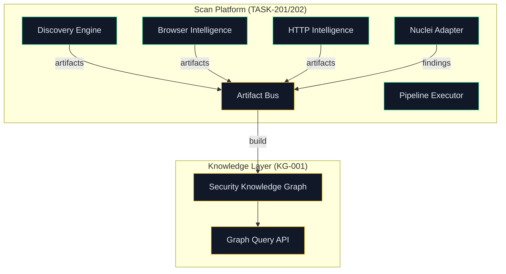
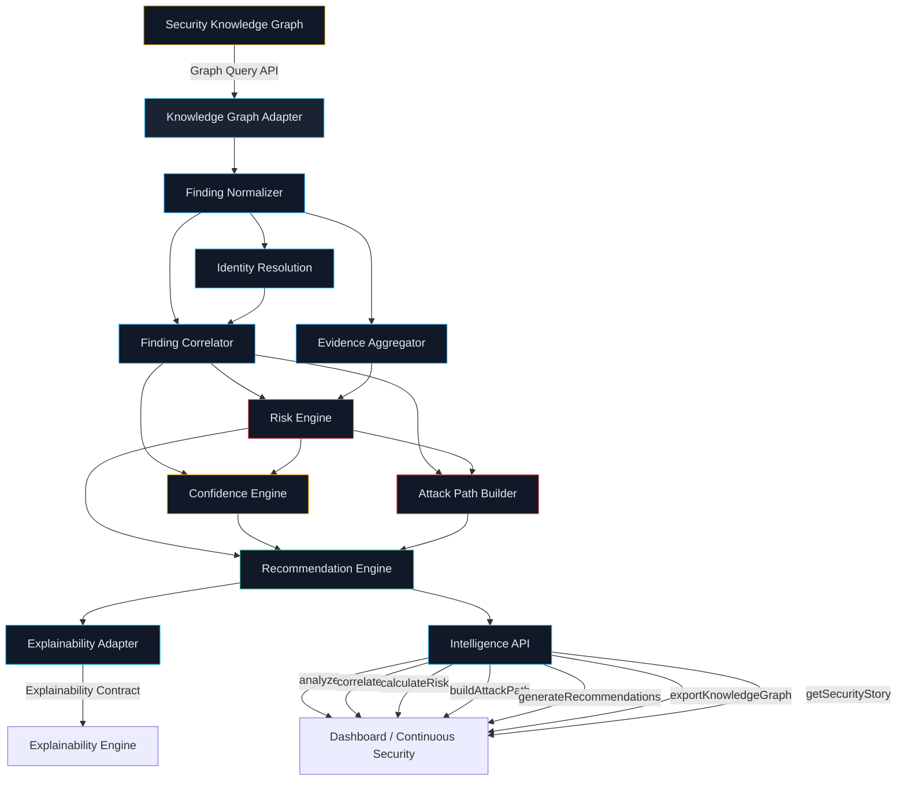
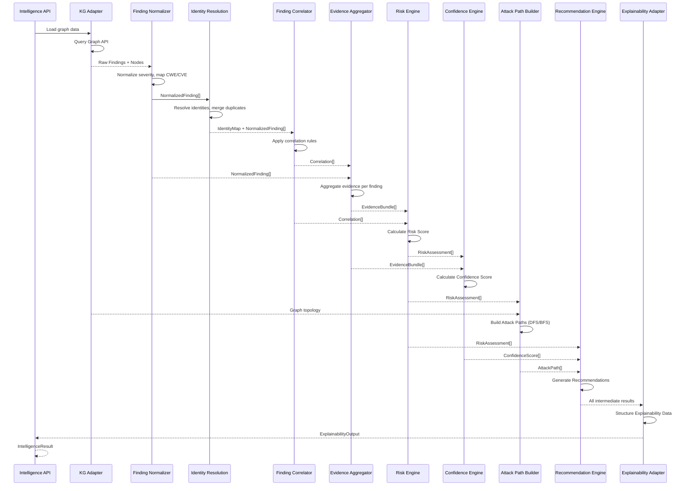
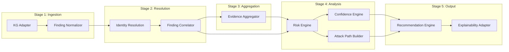
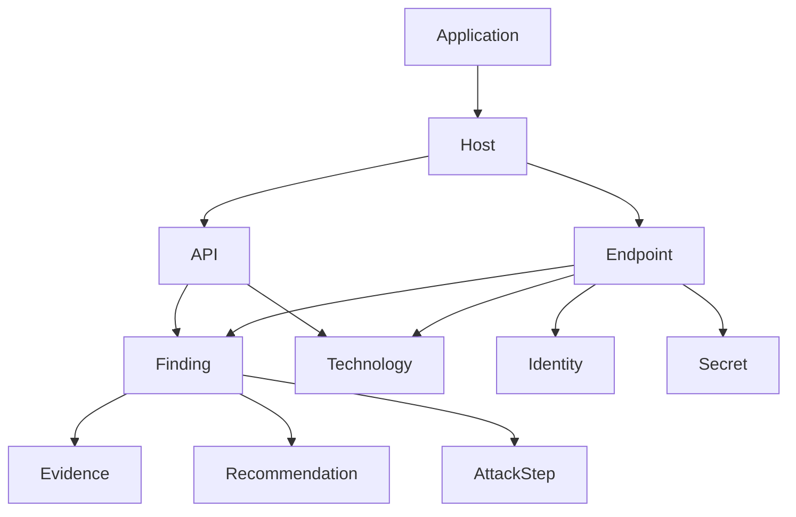
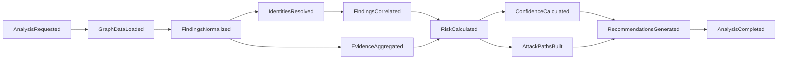

# RFC-001: Security Intelligence Engine (SIE)

**Статус:** Draft  
**Дата:** 2026-07-15  
**Автор:** Chief Software Architect  
**Рецензенты:** CTO, Principal Engineer, Security Architect, Staff Backend Engineer  
**Связанные документы:** [PROJECT_HANDOFF.md](../00_governance/PROJECT_HANDOFF.md) | [CTO_DECISIONS.md](../00_governance/CTO_DECISIONS.md) | [AI_CONTEXT.md](../00_governance/AI_CONTEXT.md) | [ENGINEERING_MEMORY.md](../00_governance/ENGINEERING_MEMORY.md) | [VISION.md](../00_governance/VISION.md)

---

## Table of Contents

1. [Executive Summary](#1-executive-summary)
2. [Problem Statement](#2-problem-statement)
3. [Goals](#3-goals)
4. [Non Goals](#4-non-goals)
5. [Existing Architecture](#5-existing-architecture)
6. [Proposed Architecture](#6-proposed-architecture)
7. [Component Overview](#7-component-overview)
8. [Data Flow](#8-data-flow)
9. [Domain Model](#9-domain-model)
10. [Knowledge Graph Model](#10-knowledge-graph-model)
11. [Correlation Engine](#11-correlation-engine)
12. [Risk Engine](#12-risk-engine)
13. [Attack Path Builder](#13-attack-path-builder)
14. [Recommendation Engine](#14-recommendation-engine)
15. [Explainability Contract](#15-explainability-contract)
16. [Event Model](#16-event-model)
17. [API Contract](#17-api-contract)
18. [Failure Handling](#18-failure-handling)
19. [Scalability](#19-scalability)
20. [Security Considerations](#20-security-considerations)
21. [Performance Considerations](#21-performance-considerations)
22. [Architecture Decision Records](#22-architecture-decision-records)
23. [Open Questions](#23-open-questions)
24. [Future Extensions](#24-future-extensions)

---

## 1. Executive Summary

Security Intelligence Engine (SIE) -- центральный аналитический модуль платформы, превращающий структурированные данные Security Knowledge Graph в осмысленные выводы о безопасности приложения. SIE не выполняет сканирование и не обращается к сканирующим движкам напрямую. Он работает исключительно через Graph Query API, анализируя уже построенный граф знаний.

Архитектура SIE строится на принципах детерминированности, неизменяемости, объяснимости и расширяемости. Каждый компонент engine получает данные из графа, производит вычисления и возвращает типизированный результат с полной трассировкой происхождения. Одинаковый граф всегда даёт одинаковый результат -- это фундаментальное отличие от недетерминированных AI/LLM-систем.

SIE состоит из 11 компонентов: Finding Normalizer, Finding Correlator, Identity Resolution, Evidence Aggregator, Risk Engine, Confidence Engine, Attack Path Builder, Recommendation Engine, Knowledge Graph Adapter, Explainability Adapter и Intelligence API. Каждый компонент имеет чёткую ответственность, определённые входы и выходы, и взаимодействует с другими через внутренние контракты.

---

## 2. Problem Statement

Текущая платформа успешно собирает данные из множества источников (Discovery, Browser Intelligence, HTTP Intelligence, Nuclei), но данные остаются изолированными. Каждая находка существует сама по себе, без связи с другими. Это создаёт ряд критических проблем:

**Изоляция находок.** Nuclei обнаруживает SQL Injection на эндпоинте `/api/users`, Browser Intelligence видит, что этот эндпоинт доступен без аутентификации, а HTTP Intelligence фиксирует отсутствие rate limiting. Каждая находка верна, но их комбинация означает критический риск, который не виден при изолированном анализе.

**Дублирование данных.** Один и тот же эндпоинт может быть обнаружен Discovery Engine, просканирован Nuclei и проанализирован Browser Intelligence. Без нормализации и дедупликации пользователь видит три записи вместо одной, что снижает доверие к результатам и затрудняет приоритизацию.

**Отсутствие оценки риска.** CVSS-скоринг отдельных уязвимостей не учитывает контекст приложения. Уязвимость с CVSS 7.5 на административном эндпоинте за аутентификацией может быть менее критичной, чем CVSS 5.3 на публичном API, обрабатывающем чувствительные данные.

**Нет цепочек атак.** Отдельные уязвимости могут комбинироваться в цепочки эксплуатации, ведущие от публичной точки входа к критическому активу. Без построения Attack Paths такая комбинационная угроза остаётся невидимой.

**Нет рекомендаций.** Пользователь получает список находок, но не получает конкретных, приоритизированных рекомендаций по их устранению с учётом контекста приложения.

---

## 3. Goals

1. **Агрегация и нормализация** -- объединение результатов всех движков в единую модель Finding с устранением дубликатов и разрешением идентичности
2. **Корреляция** -- выявление связей между находками, активами и доказательствами, которые невозможно обнаружить при изолированном анализе
3. **Оценка риска** -- детерминированный расчёт агрегированного риска с учётом severity, confidence, exploitability, exposure, reachability и бизнес-критичности
4. **Построение Attack Paths** -- автоматическое формирование цепочек эксплуатации от точки входа до критического актива
5. **Генерация рекомендаций** -- формирование приоритизированных, контекстных рекомендаций по устранению выявленных рисков
6. **Формирование Security Story** -- связное описание состояния безопасности приложения, объединяющее находки, корреляции, риски и рекомендации в единый нарратив
7. **Explainability Contract** -- обеспечение полной трассируемости каждого вывода для будущего Explainability Engine
8. **Zero Coupling** -- SIE не зависит от конкретных сканирующих движков и не требует изменений в TASK-201, TASK-202 и существующих API

---

## 4. Non Goals

1. **Не выполнение сканирования** -- SIE не инициирует и не управляет сканированием
2. **Не LLM/ML-модуль** -- все аналитические алгоритмы детерминированы и воспроизводимы
3. **Не замена Knowledge Graph** -- SIE использует KG как источник данных, а не заменяет его
4. **Не визуализация** -- Dashboard и UI не входят в зону ответственности SIE
5. **Не Explainability Engine** -- SIE формирует данные для Explainability, но не генерирует пользовательские объяснения
6. **Не修改 существующих модулей** -- TASK-201, TASK-202, Pipeline Executor, Scan Platform Foundation остаются неизменными
7. **Не real-time processing** -- SIE работает в batch/incremental режиме, а не в streaming
8. **Не внешний API** -- Intelligence API предназначен для внутренних потребителей платформы

---

## 5. Existing Architecture



Существующая платформа обеспечивает полный цикл сбора данных: Discovery Engine обнаруживает поверхность атаки, Browser Intelligence и HTTP Intelligence анализируют клиентскую и серверную части, Nuclei выполняет сканирование уязвимостей, все артефакты публикуются через Artifact Bus и используются для построения Security Knowledge Graph.

**Ключевое ограничение:** SIE подключается к платформе исключительно через Graph Query API. Он не подписывается на Artifact Bus напрямую, не обращается к движкам сканирования и не зависит от Pipeline Executor. Это гарантирует zero coupling с существующими модулями.

---

## 6. Proposed Architecture



SIE представляет собой пайплайн обработки данных, в котором информация проходит последовательную трансформацию: от сырых узлов графа через нормализацию, корреляцию, оценку риска и построение атак к рекомендациям и Security Story. Каждый этап добавляет новый уровень абстракции и ценности.

**Принцип неизменяемости:** Результат каждого компонента -- immutable-объект. Finding Normalizer создаёт NormalizedFinding, который не может быть изменён последующими компонентами. Correlator создаёт Correlation, Risk Engine создаёт RiskAssessment и т.д. Если результат нужно «обновить», создаётся новая версия с новой меткой времени.

**Принцип детерминированности:** Все алгоритмы SIE -- чистые функции от входного графа. Один и тот же граф всегда даёт один и тот же результат. Никаких случайных чисел, никаких эвристик с порогами, зависящими от времени суток. Исключение: порядок обработки может быть недетерминирован при параллельном выполнении, но итоговый результат -- всегда детерминирован благодаря коммутативности операций агрегации.

---

## 7. Component Overview

### 7.1 Finding Normalizer

| Атрибут | Значение |
|---------|----------|
| **Назначение** | Приведение сырых находок из разных источников к единой модели NormalizedFinding |
| **Ответственность** | Нормализация severity, маппинг CWE/CVE, унификация форматов, обогащение метаданными из графа |
| **Входные данные** | Сырые Findings из Knowledge Graph (nodes типа Finding) |
| **Выходные данные** | NormalizedFinding[] -- массив унифицированных находок |
| **Взаимодействие** | Knowledge Graph Adapter (чтение), Finding Correlator (запись) |
| **Ограничения** | Не изменяет исходные данные в графе. Не удаляет дубликаты (это делает Correlator). |

Finding Normalizer решает проблему гетерогенности данных. Каждый сканирующий движок формирует находки в собственном формате: Nuclei использует свой severity-маппинг, Browser Intelligence оперирует DOM-специфичными терминами, HTTP Intelligence работает с заголовками и TLS-параметрами. Normalizer приводит все находки к единой модели, которая становится основой для последующего анализа.

Процесс нормализации включает: маппинг severity на единую шкалу (Critical/High/Medium/Low/Info), присвоение CWE-классификации при отсутствии, унификацию формата URL, извлечение и стандартизацию Evidence, обогащение метаданными из связанных узлов графа (Host, Endpoint, Technology), формирование единого идентификатора Finding ID на основе детерминированного хеша.

### 7.2 Finding Correlator

| Атрибут | Значение |
|---------|----------|
| **Назначение** | Выявление связей между находками и устранение дубликатов |
| **Ответственность** | Группировка находок по корреляционным правилам, дедупликация, формирование Correlation-объектов |
| **Входные данные** | NormalizedFinding[] из Finding Normalizer |
| **Выходные данные** | Correlation[] -- массив выявленных связей, DeduplicationResult -- информация об устранённых дубликатах |
| **Взаимодействие** | Finding Normalizer (чтение), Identity Resolution (чтение), Risk Engine (запись), Confidence Engine (запись) |
| **Ограничения** | Не изменяет NormalizedFinding. Создаёт новые Correlation-объекты. |

Finding Correlator -- ключевой компонент, который превращает набор изолированных находок в связную модель. Корреляция выполняется по множеству измерений: URL, Host, Endpoint, CWE, CVE, Technology, Shared Evidence, Shared Identity, Shared Authentication. Правила корреляции настраиваемые и расширяемые через CorrelationRule Registry.

### 7.3 Identity Resolution

| Атрибут | Значение |
|---------|----------|
| **Назначение** | Разрешение идентичности -- определение, относятся ли разные находки к одному и тому же объекту |
| **Ответственность** | Слияние дублирующихся сущностей, формирование Identity Map, отслеживание Provenance |
| **Входные данные** | NormalizedFinding[], Knowledge Graph nodes |
| **Выходные данные** | IdentityMap -- маппинг Finding → Canonical Entity, MergedEntity[] |
| **Взаимодействие** | Finding Normalizer (чтение), Finding Correlator (чтение/запись) |
| **Ограничения** | Не удаляет данные. Создаёт маппинги и объединённые сущности. |

Identity Resolution решает фундаментальную проблему: один и тот же эндпоинт может быть обнаружен тремя разными источниками с разными URL-форматами (`https://example.com/api`, `https://example.com:443/api`, `example.com/api/`). Identity Resolution определяет, что все три записи относятся к одному объекту, и создаёт единую каноническую сущность.

### 7.4 Evidence Aggregator

| Атрибут | Значение |
|---------|----------|
| **Назначение** | Агрегация доказательств из разных источников для каждой находки |
| **Ответственность** | Объединение Evidence, оценка качества доказательств, формирование EvidenceBundle |
| **Входные данные** | NormalizedFinding[], Knowledge Graph edges и связанные nodes |
| **Выходные данные** | EvidenceBundle[] -- агрегированные наборы доказательств с оценкой качества |
| **Взаимодействие** | Finding Normalizer (чтение), Risk Engine (запись), Confidence Engine (запись) |
| **Ограничения** | Не оценивает риск -- только собирает и классифицирует доказательства. |

Evidence Aggregator собирает все доказательства, относящиеся к конкретной находке или группе коррелированных находок, из разных источников. Для SQL Injection на `/api/users` агрегатор соберёт: HTTP-запрос/ответ от Nuclei, DOM-снимок от Browser Intelligence, информацию об аутентификации от HTTP Intelligence, данные о технологии от Discovery.

### 7.5 Risk Engine

| Атрибут | Значение |
|---------|----------|
| **Назначение** | Детерминированный расчёт агрегированного риска |
| **Ответственность** | Вычисление Risk Score на основе множества параметров, формирование RiskAssessment |
| **Входные данные** | Correlation[], EvidenceBundle[], NormalizedFinding[] |
| **Выходные данные** | RiskAssessment[] -- оценка риска для каждой находки/группы |
| **Взаимодействие** | Finding Correlator (чтение), Evidence Aggregator (чтение), Confidence Engine (запись), Attack Path Builder (запись) |
| **Ограничения** | Не изменяет Finding. Создаёт независимую оценку RiskAssessment. |

Risk Engine не заменяет CVSS -- он дополняет его контекстной информацией из графа знаний. Математическая модель риска подробно описана в разделе 12.

### 7.6 Confidence Engine

| Атрибут | Значение |
|---------|----------|
| **Назначение** | Расчёт достоверности каждого вывода |
| **Ответственность** | Вычисление Confidence Score на основе качества и разнообразия доказательств |
| **Входные данные** | RiskAssessment[], EvidenceBundle[], Correlation[] |
| **Выходные данные** | ConfidenceScore[] -- оценка достоверности для каждого вывода |
| **Взаимодействие** | Risk Engine (чтение), Evidence Aggregator (чтение), Recommendation Engine (запись) |
| **Ограничения** | Не влияет на Risk Score -- только оценивает уверенность в корректности вывода. |

Confidence Engine реализует multi-factor credibility scoring: количество доказательств (Evidence Count), разнообразие источников (Source Diversity), свежесть данных (Data Freshness), согласованность доказательств (Cross-Validation), полнота покрытия (Coverage Score).

### 7.7 Attack Path Builder

| Атрибут | Значение |
|---------|----------|
| **Назначение** | Построение цепочек эксплуатации от точки входа до критического актива |
| **Ответственность** | Поиск путей в графе, оценка осуществимости, ранжирование по риску |
| **Входные данные** | RiskAssessment[], Knowledge Graph (nodes + edges) |
| **Выходные данные** | AttackPath[] -- массив цепочек эксплуатации с оценками |
| **Взаимодействие** | Risk Engine (чтение), Knowledge Graph Adapter (чтение), Recommendation Engine (запись) |
| **Ограничения** | Максимальная глубина поиска -- 10 шагов. Не моделирует атаки -- только анализирует существующие связи. |

Attack Path Builder использует модифицированный алгоритм DFS/BFS для поиска путей в графе знаний. Подробное описание алгоритма -- в разделе 13.

### 7.8 Recommendation Engine

| Атрибут | Значение |
|---------|----------|
| **Назначение** | Генерация приоритизированных рекомендаций по устранению рисков |
| **Ответственность** | Формирование рекомендаций, дедупликация, группировка, категоризация, связь с Attack Paths |
| **Входные данные** | RiskAssessment[], AttackPath[], ConfidenceScore[] |
| **Выходные данные** | Recommendation[] -- массив рекомендаций с приоритетами |
| **Взаимодействие** | Risk Engine (чтение), Attack Path Builder (чтение), Confidence Engine (чтение), Explainability Adapter (запись) |
| **Ограничения** | Работает после Correlation. Не предлагает нерелевантные рекомендации. |

### 7.9 Knowledge Graph Adapter

| Атрибут | Значение |
|---------|----------|
| **Назначение** | Единственная точка доступа SIE к Security Knowledge Graph |
| **Ответственность** | Инкапсуляция Graph Query API, кэширование, преобразование данных |
| **Входные данные** | Запросы от компонентов SIE |
| **Выходные данные** | Graph Data (nodes, edges, subgraphs) |
| **Взаимодействие** | Security Knowledge Graph (чтение), все компоненты SIE (чтение) |
| **Ограничения** | Read-only. Не модифицирует граф. Единственный компонент с правом чтения графа. |

Knowledge Graph Adapter реализует паттерн Anti-Corruption Layer: он изолирует компоненты SIE от деталей реализации Graph Query API, обеспечивая стабильный интерфейс даже при смене бэкенда графа (NetworkX → Neo4j).

### 7.10 Explainability Adapter

| Атрибут | Значение |
|---------|----------|
| **Назначение** | Формирование данных для Explainability Engine |
| **Ответственность** | Сбор трассировок, формирование ExplainabilityOutput, обеспечение контракта |
| **Входные данные** | Все промежуточные результаты SIE (Risk, Confidence, Correlation, AttackPath) |
| **Выходные данные** | ExplainabilityOutput -- структурированные данные для объяснения |
| **Взаимодействие** | Все компоненты SIE (чтение), Explainability Engine (запись) |
| **Ограничения** | Ничего не вычисляет. Только собирает и структурирует уже готовые данные. |

### 7.11 Intelligence API

| Атрибут | Значение |
|---------|----------|
| **Назначение** | Публичный интерфейс SIE для потребителей платформы |
| **Ответственность** | Оркестрация вызовов компонентов, управление сессиями анализа, кэширование |
| **Входные данные** | Запросы от Dashboard, Continuous Security, Explainability Engine |
| **Выходные данные** | IntelligenceResult -- агрегированный результат анализа |
| **Взаимодействие** | Все компоненты SIE (оркестрация), внешние потребители |
| **Ограничения** | Не содержит бизнес-логики. Только оркестрирует вызовы компонентов. |

---

## 8. Data Flow



Data Flow SIE следует строгому конвейеру: данные проходят через каждый компонент последовательно, причём каждый компонент добавляет новый уровень аналитики, не изменяя результаты предыдущих этапов. Это гарантирует воспроизводимость и объяснимость всего пайплайна.

**Pipeline Flow Diagram:**



---

## 9. Domain Model

### 9.1 Finding

```python
class Finding:
    id: FindingId                  # Детерминированный хеш
    title: str                     # Человекочитаемое название
    severity: Severity             # Critical | High | Medium | Low | Info
    cwe_ids: list[CweId]          # Связанные CWE
    cve_ids: list[CveId]          # Связанные CVE
    source: SourceType             # Nuclei | BrowserIntel | HttpIntel | Discovery
    raw_evidence: RawEvidence      # Исходные данные от движка
    normalized_evidence: NormalizedEvidence  # Нормализованные данные
    asset_id: AssetId             # Связанный актив
    url: Url                       # URL находки
    discovered_at: datetime        # Время обнаружения
    provenance: Provenance         # Происхождение данных
```

**Жизненный цикл:** Created (из сканирующего движка) → Normalized (Finding Normalizer) → Correlated (Finding Correlator) → RiskAssessed (Risk Engine) → Recommended (Recommendation Engine). Finding -- immutable, каждый этап создаёт новую версию.

### 9.2 Asset

```python
class Asset:
    id: AssetId                    # Канонический идентификатор
    type: AssetType                # Application | Host | Endpoint | API | Service
    canonical_url: Url             # Канонический URL после Identity Resolution
    aliases: list[Url]             # Альтернативные URL (до разрешения)
    technologies: list[Technology] # Обнаруженные технологии
    business_criticality: Criticality  # Low | Medium | High | Critical
    attack_surface_score: float    # Оценка поверхности атаки
    identity_id: IdentityId        # Связанная идентичность
```

**Жизненный цикл:** Discovered → Identified (Identity Resolution) → Enriched (Technology Detection) → RiskProfiled (Risk Engine).

### 9.3 Evidence

```python
class Evidence:
    id: EvidenceId
    type: EvidenceType             # HTTP | DOM | TLS | Header | Cookie | JWT | Network
    source: SourceType             # Откуда получено
    content: dict                  # Полное содержимое доказательства
    quality: EvidenceQuality       # High | Medium | Low | Unverified
    timestamp: datetime
    finding_ids: list[FindingId]   # Связанные находки
    provenance: Provenance
```

### 9.4 Relationship

```python
class Relationship:
    id: RelationshipId
    source_id: EntityId            # Исходная сущность
    target_id: EntityId            # Целевая сущность
    type: RelationshipType         # USES | CALLS | DEPENDS_ON | EXPOSES | LEADS_TO | ...
    weight: float                  # Вес связи (0.0–1.0)
    confidence: float              # Достоверность связи
    evidence_ids: list[EvidenceId] # Поддерживающие доказательства
    provenance: Provenance
```

### 9.5 Risk

```python
class Risk:
    id: RiskId
    finding_ids: list[FindingId]   # Связанные находки
    asset_ids: list[AssetId]       # Затронутые активы
    risk_score: float              # 0.0–100.0 (детерминированный)
    risk_level: RiskLevel          # Critical | High | Medium | Low | Info
    components: RiskComponents     # Детализация расчёта
    attack_paths: list[AttackPathId]  # Связанные цепочки атак
    confidence: float              # Достоверность оценки
    calculated_at: datetime
    provenance: Provenance
```

### 9.6 AttackPath

```python
class AttackPath:
    id: AttackPathId
    steps: list[AttackStep]        # Последовательность шагов
    entry_point: AssetId           # Точка входа
    target: AssetId                # Целевой актив
    overall_severity: Severity
    overall_risk_score: float
    feasibility: float             # Оценка осуществимости
    confidence: float
    evidence_chain: list[EvidenceId]  # Цепочка доказательств
    length: int                    # Количество шагов
```

### 9.7 Recommendation

```python
class Recommendation:
    id: RecommendationId
    type: RecommendationType       # Fix | Mitigate | Monitor | Accept
    priority: Priority             # P0 | P1 | P2 | P3
    title: str
    description: str
    affected_findings: list[FindingId]
    affected_attack_paths: list[AttackPathId]
    affected_assets: list[AssetId]
    category: RecommendationCategory  # Auth | Config | Patch | Network | Data
    effort: EffortLevel            # Low | Medium | High
    impact: ImpactLevel            # Low | Medium | High
    related_cwes: list[CweId]
```

### 9.8 KnowledgeNode

```python
class KnowledgeNode:
    id: NodeId
    type: NodeType                 # Application | Host | Endpoint | API | Finding | ...
    properties: dict               # Тип-специфичные свойства
    provenance: Provenance
    confidence: float
    created_at: datetime
    updated_at: datetime
```

### 9.9 KnowledgeEdge

```python
class KnowledgeEdge:
    id: EdgeId
    source_node_id: NodeId
    target_node_id: NodeId
    type: EdgeType                 # USES | CALLS | DEPENDS_ON | EXPOSES | LEADS_TO | ...
    weight: float
    confidence: float
    evidence_ids: list[EvidenceId]
    provenance: Provenance
```

### 9.10 Correlation

```python
class Correlation:
    id: CorrelationId
    type: CorrelationType          # SameUrl | SameHost | SameCwe | SharedEvidence | ...
    entity_ids: list[EntityId]     # Связанные сущности
    strength: float                # 0.0–1.0
    rule_id: CorrelationRuleId     # Правило, выявившее корреляцию
    evidence: CorrelationEvidence
    confidence: float
```

### 9.11 Confidence

```python
class Confidence:
    id: ConfidenceId
    entity_id: EntityId            # Для какой сущности
    score: float                   # 0.0–1.0
    components: ConfidenceComponents  # Детализация расчёта
    calculated_at: datetime
```

### 9.12 SecurityStory

```python
class SecurityStory:
    id: SecurityStoryId
    title: str                     # Связный заголовок
    summary: str                   # Краткое описание
    findings: list[FindingId]
    correlations: list[CorrelationId]
    risks: list[RiskId]
    attack_paths: list[AttackPathId]
    recommendations: list[RecommendationId]
    overall_posture: SecurityPosture  # Critical | Poor | Fair | Good | Excellent
    key_metrics: SecurityMetrics   # Агрегированные метрики
```

---

## 10. Knowledge Graph Model

### 10.1 Node Types



| Node Type | Свойства | Описание |
|-----------|----------|----------|
| **Application** | name, url, tech_stack, business_criticality | Корневой узел приложения |
| **Host** | hostname, ip, os, ports, services | Сервер/контейнер |
| **Endpoint** | path, method, params, auth_required, content_type | HTTP-эндпоинт |
| **API** | path, method, params, auth, rate_limit, schema | API-эндпоинт |
| **Finding** | title, severity, cwe, cve, evidence, source | Обнаруженная уязвимость |
| **Evidence** | type, content, quality, source, timestamp | Доказательство |
| **Technology** | name, version, category, cpe, known_cves | Используемая технология |
| **Service** | name, port, protocol, version, banner | Сетевой сервис |
| **Identity** | type, value, context, auth_mechanism | Идентичность (user, token, cookie) |
| **Secret** | type, location, exposure, rotation_policy | Обнаруженный секрет |
| **AttackStep** | type, description, severity, prerequisites | Шаг в цепочке атаки |
| **Recommendation** | title, type, priority, effort, impact | Рекомендация по устранению |

### 10.2 Edge Types

| Edge Type | Source → Target | Семантика | Вес по умолчанию |
|-----------|----------------|-----------|-------------------|
| **USES** | Endpoint → Technology | Эндпоинт использует технологию | 0.8 |
| **CALLS** | Endpoint → Endpoint / API | Один эндпоинт вызывает другой | 0.7 |
| **DEPENDS_ON** | Service → Service | Сервис зависит от другого сервиса | 0.6 |
| **CONNECTED_TO** | Host → Host | Сетевая связность | 0.5 |
| **OWNS** | Application → Host / Service | Владение ресурсом | 1.0 |
| **EXPOSES** | Endpoint → Finding / Secret | Эндпоинт раскрывает уязвимость | 0.9 |
| **LEADS_TO** | AttackStep → AttackStep | Цепочка атаки | 0.8 |
| **AFFECTS** | Finding → Asset / Technology | Находка влияет на объект | 0.7 |
| **MITIGATED_BY** | Finding → Recommendation | Рекомендация устраняет находку | 0.8 |

### 10.3 Правила формирования графа

1. **Provenance First:** Каждый узел и связь содержат Provenance -- откуда получены данные, какой движок их обнаружил, когда они были обновлены
2. **Confidence Weighting:** Вес связи умножается на Confidence источника
3. **Identity Merging:** Узлы, отождествлённые Identity Resolution, сливаются с сохранением всех свойств и связей
4. **Incremental Updates:** Граф обновляется инкрементально при получении новых артефактов, без полного перестроения
5. **No Orphan Nodes:** Каждый узел должен иметь хотя бы одну связь. Изолированные узлы помечаются как Unconnected

---

## 11. Correlation Engine

### 11.1 Correlation Rules

| # | Правило | Описание | Вес | Приоритет |
|---|---------|----------|-----|-----------|
| 1 | Same URL | Находки на одном URL | 1.0 | P0 |
| 2 | Same Host | Находки на одном хосте | 0.8 | P1 |
| 3 | Same Endpoint | Находки на одном эндпоинте (с учётом метода) | 0.95 | P0 |
| 4 | Same CVE | Находки с одинаковым CVE | 0.9 | P0 |
| 5 | Same CWE | Находки с одинаковым CWE | 0.7 | P2 |
| 6 | Same Technology | Находки в одной технологии | 0.6 | P2 |
| 7 | Same Component | Находки в одном компоненте/сервисе | 0.7 | P1 |
| 8 | Shared Evidence | Находки с общими доказательствами | 0.85 | P1 |
| 9 | Shared Identity | Находки с общей идентичностью | 0.75 | P1 |
| 10 | Shared Authentication | Находки с общим механизмом аутентификации | 0.8 | P1 |

### 11.2 Алгоритм корреляции

```
FUNCTION correlate(findings: NormalizedFinding[]) → Correlation[]:
    correlations = []
    
    # Step 1: Группировка по правилам
    FOR EACH rule IN correlation_rules (ORDERED BY priority DESC):
        groups = GROUP findings BY rule.key_extractor
        FOR EACH group IN groups WHERE len(group) > 1:
            correlation = CREATE Correlation(
                type = rule.type,
                entity_ids = [f.id FOR f IN group],
                strength = rule.weight * compute_group_cohesion(group),
                rule_id = rule.id,
                confidence = min(f.confidence FOR f IN group)
            )
            correlations.APPEND(correlation)
    
    # Step 2: Транзитивная корреляция
    # Если A коррелирует с B, а B с C, то A косвенно коррелирует с C
    transitive = COMPUTE_TRANSITIVE_CLOSURE(correlations, max_depth=3)
    correlations.EXTEND(transitive)
    
    # Step 3: Устранение ложных совпадений
    correlations = FILTER(correlations, c => c.strength >= MIN_CORRELATION_THRESHOLD)
    correlations = DEDUPLICATE(correlations)
    
    RETURN correlations
```

### 11.3 Устранение ложных совпадений

1. **Минимальный порог силы:** Корреляции со strength < 0.3 отбрасываются
2. **Cross-validation:** Корреляция подтверждается, если она выявлена минимум двумя независимыми правилами
3. **Контекстная фильтрация:** Корреляции между находками на разных хостах с разной технологией помечаются как WeakCorrelation
4. **Evidence-based verification:** Корреляции без подтверждающих Evidence получают пониженный Confidence

---

## 12. Risk Engine

### 12.1 Параметры оценки

| Параметр | Диапазон | Вес | Описание |
|----------|----------|-----|----------|
| Severity | 0.0–1.0 | 0.25 | Базовая критичность уязвимости |
| Confidence | 0.0–1.0 | 0.15 | Достоверность находки |
| Exploitability | 0.0–1.0 | 0.20 | Осуществимость эксплуатации |
| Exposure | 0.0–1.0 | 0.15 | Степень раскрытия (публичный/внутренний) |
| Reachability | 0.0–1.0 | 0.10 | Достижимость от точки входа |
| Business Criticality | 0.0–1.0 | 0.10 | Бизнес-критичность затронутого актива |
| Evidence Quality | 0.0–1.0 | 0.05 | Качество доказательств |

### 12.2 Математическая модель

```
RiskScore = Σ(w_i x p_i) x AdjustmentFactors

где:
  w_i -- вес параметра i
  p_i -- нормализованное значение параметра i
  AdjustmentFactors = f(correlation_count, attack_path_count)

Детализация:

  BaseScore = 0.25xS + 0.15xC + 0.20xE + 0.15xX + 0.10xR + 0.10xB + 0.05xQ

  CorrelationBoost = 1.0 + min(0.3, 0.1 x log(1 + correlation_count))
  AttackPathBoost = 1.0 + min(0.4, 0.15 x attack_path_count)

  RiskScore = clamp(BaseScore x CorrelationBoost x AttackPathBoost, 0.0, 1.0)

  RiskLevel:
    Critical  -- RiskScore >= 0.80
    High      -- RiskScore >= 0.60
    Medium    -- RiskScore >= 0.40
    Low       -- RiskScore >= 0.20
    Info      -- RiskScore <  0.20
```

### 12.3 Расчёт параметров

**Exploitability** определяется на основе: доступности публичного эксплойта (CVE database), сложности эксплуатации (Access Vector, Attack Complexity из CVSS), требований к аутентификации (None → 1.0, Single → 0.6, Multi → 0.2), взаимодействия с пользователем (None → 1.0, Required → 0.5).

**Exposure** рассчитывается как: публичный эндпоинт = 1.0, внутренний с аутентификацией = 0.4, localhost-only = 0.1.

**Reachability** определяется через анализ графа: существует ли путь от публичного узла до данной находки. Reachability = 1.0 если публично достижимо, 0.5 если достижимо через аутентификацию, 0.1 если изолировано.

**Business Criticality** берётся из метаданных актива: если актив помечен как Critical → 1.0, High → 0.7, Medium → 0.4, Low → 0.1.

---

## 13. Attack Path Builder

### 13.1 Алгоритм

```mermaid
graph TD
    START[Старт: Публичные эндпоинты] --> DISCOVER[Обнаружить исходящие связи]
    DISCOVER --> FILTER{Фильтр: только эксплуатируемые связи?}
    FILTER -->|Да| TRAVERSE[Обход: DFS/BFS]
    FILTER -->|Нет| PRUNE[Отсечение низковероятных путей]
    PRUNE --> TRAVERSE
    TRAVERSE --> CHECK{Целевой актив достигнут?}
    CHECK -->|Да| RECORD[Записать Attack Path]
    CHECK -->|Нет| DEPTH{Глубина < 10?}
    DEPTH -->|Да| DISCOVER
    DEPTH -->|Нет| ABORT[Прекратить обход]
    RECORD --> RANK[Ранжировать по Risk Score]
    RANK --> OUTPUT[AttackPath[]]
```

### 13.2 Формальные правила

1. **Точка входа** -- любой публичный узел (Exposure >= 0.8) или узел с Finding
2. **Целевой актив** -- узел с Business Criticality >= 0.7 или содержащий Secret
3. **Допустимые рёбра** -- LEADS_TO, EXPOSES, AFFECTS, USES, CALLS, DEPENDS_ON
4. **Максимальная глубина** -- 10 шагов
5. **Минимальный Confidence пути** -- средний Confidence всех рёбер >= 0.3
6. **Обнаружение циклов** -- если узел уже посещён в текущем пути, обход прекращается

### 13.3 Приоритизация

```
PathPriority = PathRiskScore x PathFeasibility / PathLength

где:
  PathRiskScore = max(step.risk_score FOR step IN path)
  PathFeasibility = geometric_mean(step.feasibility FOR step IN path)
  PathLength = len(path.steps)
```

Короткие пути с высоким риском и высокой осуществимостью получают приоритет. Длинные пути с низким риском -- низкий приоритет.

### 13.4 Альтернативные сценарии

Для каждой пары (entry_point, target) может существовать несколько альтернативных путей. Attack Path Builder сохраняет все найденные пути, но ранжирует их по приоритету. Альтернативные пути группируются и предоставляются как AlternativeAttackPaths в SecurityStory.

---

## 14. Recommendation Engine

### 14.1 Типы рекомендаций

| Тип | Описание | Критерий |
|-----|----------|----------|
| **Fix** | Непосредственное исправление | Для Finding с Confidence >= 0.7 |
| **Mitigate** | Смягчение последствий | Для Attack Path с Feasibility >= 0.5 |
| **Monitor** | Мониторинг изменений | Для Finding с Confidence < 0.5 |
| **Accept** | Принятие риска | Для Risk Score < 0.2 |

### 14.2 Генерация рекомендаций

Рекомендации генерируются на основе трёх источников: CWE Remedy Database (стандартные рекомендации для каждого CWE), Attack Path Break (разрыв цепочки атаки -- какая рекомендация разорвёт самый критический путь), и Correlation Insight (рекомендации на основе корреляций -- исправление одного корня устраняет несколько находок).

### 14.3 Дедупликация

Две рекомендации считаются дубликатами, если: они относятся к одному CWE, затрагивают один и тот же актив и предлагают одно и то же действие. Дубликаты сливаются с увеличением priority на один уровень.

### 14.4 Группировка

Рекомендации группируются по: категории (Auth, Config, Patch, Network, Data), затронутому активу, Attack Path (рекомендации, разрывающие один и тот же путь, группируются вместе), приоритету.

### 14.5 Категоризация и приоритет

```
Priority = P0  IF RiskScore >= 0.8 AND Confidence >= 0.7  → Immediate action
Priority = P1  IF RiskScore >= 0.6 AND Confidence >= 0.5  → Fix within sprint
Priority = P2  IF RiskScore >= 0.4 AND Confidence >= 0.4  → Plan for next sprint
Priority = P3  IF RiskScore < 0.4                          → Backlog
```

---

## 15. Explainability Contract

### 15.1 Принцип

Explainability Engine ничего не вычисляет. Он получает полностью готовую интеллектуальную модель от SIE и отвечает только за объяснение результатов в человекочитаемом формате.

### 15.2 ExplainabilityOutput

```python
class ExplainabilityOutput:
    # Для каждого вывода
    tracing: list[TraceStep]       # Полная трассировка вычислений
    data_sources: list[DataSource] # Какие данные использовались
    rules_applied: list[RuleRef]   # Какие правила сработали
    evidence_refs: list[EvidenceId]# Какие доказательства подтверждают
    
    # Для Attack Path
    path_explanation: list[StepExplanation]  # Объяснение каждого шага
    feasibility_reasoning: str     # Почему путь осуществим
    
    # Для Risk
    risk_breakdown: RiskComponents  # Детализация расчёта риска
    contributing_factors: list[Factor]  # Что повлияло на оценку
    
    # Для Recommendation
    recommendation_rationale: str  # Почему рекомендация предлагается
    impact_assessment: str         # Какой эффект ожидается
    attack_path_break: str         # Как рекомендация разрывает Attack Path
```

### 15.3 Контракт с Explainability Engine

```python
class ExplainabilityContract:
    """ + "SIE обязуется предоставить Explainability Engine:
    
    1. Полный tracing каждого вычисления
    2. Ссылки на все использованные данные (Data Sources)
    3. Ссылки на все сработавшие правила
    4. Ссылки на все подтверждающие Evidence
    5. Детализацию Risk Score с формулой и значениями
    6. Объяснение каждого шага Attack Path
    7. Обоснование каждой Recommendation
    
    Explainability Engine обязуется:
    1. Не выполнять вычисления
    2. Не модифицировать данные SIE
    3. Только форматировать и структурировать уже готовые данные
    """
```

---

## 16. Event Model

### 16.1 Внутренние события SIE



| Событие | Producer | Consumer | Данные |
|---------|----------|----------|--------|
| AnalysisRequested | Intelligence API | KG Adapter | analysis_scope |
| GraphDataLoaded | KG Adapter | Finding Normalizer | raw_findings, graph_nodes |
| FindingsNormalized | Finding Normalizer | Identity Resolution, Finding Correlator | normalized_findings |
| IdentitiesResolved | Identity Resolution | Finding Correlator | identity_map |
| FindingsCorrelated | Finding Correlator | Risk Engine, Evidence Aggregator | correlations |
| EvidenceAggregated | Evidence Aggregator | Risk Engine, Confidence Engine | evidence_bundles |
| RiskCalculated | Risk Engine | Confidence Engine, Attack Path Builder | risk_assessments |
| ConfidenceCalculated | Confidence Engine | Recommendation Engine | confidence_scores |
| AttackPathsBuilt | Attack Path Builder | Recommendation Engine | attack_paths |
| RecommendationsGenerated | Recommendation Engine | Explainability Adapter | recommendations |
| AnalysisCompleted | Intelligence API | External | intelligence_result |

### 16.2 События Artifact Bus

SIE подписывается на события Artifact Bus для инкрементального анализа:

| Событие | Действие SIE |
|---------|-------------|
| ScanCompleted | Запуск полного анализа |
| ArtifactPublished | Инкрементальный анализ затронутого подграфа |
| GraphUpdated | Перерасчёт Risk/Confidence для изменённых узлов |

---

## 17. API Contract

```python
class IntelligenceAPI:
    """Публичный API Security Intelligence Engine."""

    def analyze(scope: AnalysisScope) -> IntelligenceResult:
        """Полный анализ Security Knowledge Graph.
        
        Args:
            scope: Область анализа (full graph, subgraph, specific assets)
        
        Returns:
            IntelligenceResult с findings, risks, attack_paths, recommendations
        """

    def correlate(findings: list[FindingId]) -> list[Correlation]:
        """Корреляция указанных находок.
        
        Args:
            findings: Список ID находок для корреляции
        
        Returns:
            Список выявленных корреляций
        """

    def calculateRisk(
        scope: RiskScope,
        parameters: RiskParameters | None = None
    ) -> list[RiskAssessment]:
        """Расчёт агрегированного риска.
        
        Args:
            scope: Область расчёта (finding, asset, application)
            parameters: Опциональные параметры для переопределения весов
        
        Returns:
            Список оценок риска
        """

    def buildAttackPath(
        target: AssetId,
        entry_points: list[AssetId] | None = None
    ) -> list[AttackPath]:
        """Построение цепочек эксплуатации.
        
        Args:
            target: Целевой актив
            entry_points: Опциональные точки входа (иначе -- все публичные)
        
        Returns:
            Список Attack Paths, ранжированных по приоритету
        """

    def generateRecommendations(
        findings: list[FindingId] | None = None,
        min_priority: Priority = P3
    ) -> list[Recommendation]:
        """Генерация рекомендаций.
        
        Args:
            findings: Опциональный фильтр по находкам
            min_priority: Минимальный приоритет рекомендаций
        
        Returns:
            Список рекомендаций, ранжированных по приоритету
        """

    def exportKnowledgeGraph(
        format: ExportFormat = ExportFormat.GRAPHML,
        scope: ExportScope | None = None
    ) -> GraphExport:
        """Экспорт графа знаний.
        
        Args:
            format: Формат экспорта (GraphML, JSON, Cypher)
            scope: Область экспорта
        
        Returns:
            Экспортированные данные графа
        """

    def getSecurityStory(
        scope: StoryScope = StoryScope.APPLICATION
    ) -> SecurityStory:
        """Формирование Security Story.
        
        Args:
            scope: Область (application, asset, attack_path)
        
        Returns:
            SecurityStory -- связное описание состояния безопасности
        """
```

---

## 18. Failure Handling

### 18.1 Стратегия обработки ошибок

| Сценарий | Стратегия | Поведение |
|----------|-----------|-----------|
| KG Adapter не может загрузить данные | Retry with backoff | 3 попытки с экспоненциальной задержкой, затем AnalysisFailed |
| Finding Normalizer встречает неизвестный формат | Skip and log | Пропуск находки с логированием, анализ продолжается |
| Correlation Engine timeout | Partial results | Возврат корреляций, найденных до timeout |
| Risk Engine получает неполные данные | Degraded calculation | Расчёт с доступными параметрами, пониженный Confidence |
| Attack Path Builder: циклы в графе | Cycle detection | Обнаружение и пропуск циклов при обходе |
| Recommendation Engine: нет CWE | Generic recommendations | Использование generic-рекомендаций вместо CWE-specific |
| Полный сбой компонента | Circuit breaker | После 3 последовательных сбоев -- Circuit Open, fallback на cached results |

### 18.2 Гарантии

1. **No Data Loss:** Сбой одного компонента не приводит к потере данных предыдущих этапов
2. **Partial Results:** При невозможности полного анализа возвращаются частичные результаты с пометкой CompletenessLevel
3. **Idempotency:** Повторный вызов analyze() с теми же входными данными даёт тот же результат
4. **Auditability:** Каждый сбой логируется с полным контекстом для диагностики

---

## 19. Scalability

### 19.1 Горизонтальное масштабирование

SIE проектируется с учётом горизонтального масштабирования. Каждый компонент является stateless (состояние хранится в Knowledge Graph), что позволяет запускать несколько экземпляров одного компонента параллельно.

**Finding Normalizer:** Может обрабатывать находки параллельно (каждая находка независима). Параллелизм: N workers на N finding batches.

**Finding Correlator:** Требует доступа ко всем находкам для корреляции. Стратегия: Map-Reduce -- map-фаза распределяет находки по группам, reduce-фаза объединяет корреляции.

**Risk Engine:** Расчёт риска для разных находок независим. Параллелизм: N workers.

**Attack Path Builder:** Каждый путь строится независимо. Параллелизм: N workers для разных entry points.

### 19.2 Инкрементальный анализ

При обновлении графа (новые артефакты) SIE не выполняет полный повторный анализ. Вместо этого:

1. Определяются затронутые подграфы (affected subgraphs)
2. Перерасчёт выполняется только для затронутых сущностей
3. Результаты, не затронутые изменениями, используются из кэша

Это критично для Continuous Security, где анализ может выполняться ежедневно или при каждом коммите.

---

## 20. Security Considerations

1. **Read-Only Access:** SIE имеет read-only доступ к Knowledge Graph через Knowledge Graph Adapter. Никакие изменения в графе не производятся.
2. **No Secret Exposure:** SIE не логирует содержимое Evidence, которое может содержать секреты (JWT, cookies, API keys). Все логирование -- по ID и типу.
3. **Deterministic Results:** Отсутствие недетерминированности исключает возможность манипуляции результатами через входные данные.
4. **Input Validation:** Все входные данные валидируются через Pydantic-модели перед обработкой.
5. **Audit Trail:** Каждое вычисление содержит Provenance, позволяя отследить происхождение любого вывода.

---

## 21. Performance Considerations

### 21.1 Целевые показатели

| Метрика | Целевое значение |
|---------|-----------------|
| Полный анализ (1000 findings) | < 30 секунд |
| Инкрементальный анализ (10 новых findings) | < 5 секунд |
| Attack Path Builder (граф 10K узлов) | < 10 секунд |
| Risk Calculation (1000 findings) | < 5 секунд |
| API Response Time (cached) | < 100 ms |

### 21.2 Оптимизации

1. **Кэширование:** Результаты нормализации и корреляции кэшируются. При повторном анализе используются cached results для неизменённых данных.
2. **Batch Processing:** Finding Normalizer обрабатывает находки батчами для снижения overhead.
3. **Lazy Loading:** Knowledge Graph Adapter загружает подграфы по требованию, а не весь граф.
4. **Parallel Execution:** Компоненты, не зависящие друг от друга, выполняются параллельно (например, Evidence Aggregator и Identity Resolution).
5. **Index-Based Lookup:** Graph Query API использует индексы для быстрого поиска узлов по типу, свойствам и связям.

---

## 22. Architecture Decision Records

### ADR-INT-001: Knowledge Graph как центральная модель данных

**Контекст:** SIE может читать данные напрямую из Artifact Bus или через Knowledge Graph.  
**Решение:** SIE читает данные исключительно через Knowledge Graph.  
**Обоснование:** Единый источник истины (CTO Decision #3). KG обеспечивает нормализацию, Identity Resolution и Provenance, которые критичны для корректного анализа. Прямое чтение из Artifact Bus привело бы к дублированию логики нормализации и потенциальной рассинхронизации данных.  
**Последствия:** SIE зависит от доступности KG. Если KG недоступен, анализ невозможен.  
**Статус:** ACCEPTED

---

### ADR-INT-002: Intelligence Engine -- immutable

**Контекст:** Результаты анализа могут обновляться при получении новых данных.  
**Решение:** Все результаты SIE -- immutable. При обновлении создаётся новая версия с новой меткой времени.  
**Обоснование:** Immutable Architecture гарантирует аудитоспособность, воспроизводимость и отсутствие побочных эффектов (CTO Decision #7). Позволяет сравнивать результаты разных прогонов анализа.  
**Последствия:** Увеличение объёма хранимых данных. Требуется стратегия garbage collection для устаревших версий.  
**Статус:** ACCEPTED

---

### ADR-INT-003: Explainability вынесен в отдельный Adapter

**Контекст:** Объяснимость результатов может быть встроена в каждый компонент SIE или вынесена отдельно.  
**Решение:** Explainability Adapter -- отдельный компонент, который собирает данные от всех компонентов SIE и формирует ExplainabilityOutput.  
**Обоснование:** Разделение ответственности (Single Responsibility Principle). Компоненты SIE фокусируются на анализе, а Explainability Adapter -- на структурировании данных для объяснения. Это позволяет заменять или модернизировать Explainability Engine независимо от SIE.  
**Последствия:** Компоненты SIE должны явно предоставлять трассировочные данные через Provenance и TraceStep.  
**Статус:** ACCEPTED

---

### ADR-INT-004: Recommendation Engine работает после Correlation и Risk

**Контекст:** Рекомендации могут генерироваться на разных этапах анализа.  
**Решение:** Recommendation Engine получает данные только после завершения Correlation, Risk Calculation и Attack Path Building.  
**Обоснование:** Качественные рекомендации требуют полного контекста: какие находки коррелируют, каков их реальный риск, какие Attack Paths существуют. Генерация рекомендаций до корреляции привела бы к дублированию и неточностям.  
**Последствия:** Recommendation Engine -- финальный этап пайплайна. Сбой на ранних этапах задерживает генерацию рекомендаций.  
**Статус:** ACCEPTED

---

### ADR-INT-005: Risk Engine не изменяет Finding

**Контекст:** Risk Engine может обновлять severity находок на основе контекста.  
**Решение:** Risk Engine создаёт независимый RiskAssessment, не модифицируя исходные Finding.  
**Обоснование:** Immutable Models (CTO Decision #7). Исходная находка сохраняет свою целостность -- пользователь видит и оригинальную severity от сканера, и контекстную оценку риска от SIE. Это предотвращает потерю информации и обеспечивает прозрачность.  
**Последствия:** Потребители API должны использовать RiskAssessment.risk_level, а не Finding.severity для приоритизации.  
**Статус:** ACCEPTED

---

### ADR-INT-006: Knowledge Graph Adapter как Anti-Corruption Layer

**Контекст:** SIE может напрямую использовать Graph Query API или через адаптер.  
**Решение:** Knowledge Graph Adapter инкапсулирует все обращения к Graph Query API, предоставляя стабильный интерфейс для компонентов SIE.  
**Обоснование:** При смене бэкенда графа (NetworkX → Neo4j) изменения коснутся только адаптера, а не всех компонентов SIE. Это реализует паттерн Anti-Corruption Layer из DDD.  
**Последствия:** Адаптер добавляет тонкий слой абстракции, но изолирует SIE от инфраструктурных изменений.  
**Статус:** ACCEPTED

---

### ADR-INT-007: Детерминированный расчёт Confidence

**Контекст:** Confidence может рассчитываться через статистические модели или детерминированные алгоритмы.  
**Решение:** Confidence Engine использует детерминированный multi-factor scoring без вероятностных моделей.  
**Обоснование:** CTO Decision #6 -- все аналитические компоненты детерминированы. Статистические модели (Bayesian, Monte Carlo) вносят недетерминированность, нарушая воспроизводимость результатов.  
**Последствия:** Confidence Score -- взвешенная сумма наблюдаемых факторов, а не вероятность. Пользователи должны понимать разницу.  
**Статус:** ACCEPTED

---

## 23. Open Questions

1. **Версионирование графа:** Как управлять версиями Knowledge Graph при инкрементальных обновлениях? Полное перестроение vs. snapshot-изоляция?
2. **Корреляция между приложениями:** Должен ли SIE поддерживать корреляцию находок между разными приложениями (multi-tenant)?
3. **Настраиваемые веса Risk Engine:** Должны ли пользователи иметь возможность переопределять веса параметров Risk Score? Если да, как обеспечить воспроизводимость при разных конфигурациях?
4. **Максимальный размер графа:** Какова верхняя граница размера Knowledge Graph, при которой SIE сохраняет приемлемую производительность? Когда нужен переход на распределённый граф (Neo4j cluster)?
5. **Cache Invalidation:** Когда и как инвалидируются кэши SIE при обновлении графа? Стратегия TTL vs. event-driven invalidation?
6. **External Rule Registry:** Должны ли правила корреляции и правила риска храниться в коде или во внешнем хранилище (конфигурация, БД)?
7. **Attack Path Visualization:** Как визуализировать альтернативные Attack Paths в Dashboard? Treemap vs. Sankey vs. Graph?

---

## 24. Future Extensions

1. **Continuous Monitoring Mode:** SIE работает в фоне, автоматически перерассчитывая анализ при обновлении графа
2. **ML-Augmented Confidence:** Добавление ML-модели как вспомогательного источника для Confidence (не заменяя детерминированный расчёт)
3. **Custom Rule DSL:** Предметно-ориентированный язык для написания пользовательских правил корреляции
4. **Multi-Application Correlation:** Расширение корреляции на находки из разных приложений
5. **Temporal Analysis:** Анализ изменений во времени -- как менялась поверхность атаки и риск
6. **Compliance Mapping:** Автоматический маппинг находок на регуляторные требования (OWASP Top 10, PCI DSS, SOC 2)
7. **Threat Intelligence Integration:** Подключение внешних источников threat intelligence для обогащения корреляций
8. **Playbook Generation:** Автоматическая генерация remediation playbooks на основе Attack Paths и Recommendations

---

## Diagrams Index

| # | Диаграмма | Тип | Раздел |
|---|-----------|-----|--------|
| 1 | Existing Architecture | Architecture | Section 5 |
| 2 | Proposed Architecture (SIE) | Architecture | Section 6 |
| 3 | Component Diagram | Component | Section 7 |
| 4 | Sequence Diagram (Data Flow) | Sequence | Section 8 |
| 5 | Pipeline Flow | Pipeline | Section 8 |
| 6 | Knowledge Graph Nodes | Graph | Section 10 |
| 7 | Attack Path Builder Algorithm | Flowchart | Section 13 |
| 8 | Event Flow | Event | Section 16 |

**Итого: 8 Mermaid-диаграмм**

---

## ADR Index

| # | ADR | Решение | Статус |
|---|-----|---------|--------|
| 1 | ADR-INT-001 | Knowledge Graph как центральная модель | ACCEPTED |
| 2 | ADR-INT-002 | Intelligence Engine immutable | ACCEPTED |
| 3 | ADR-INT-003 | Explainability вынесен отдельно | ACCEPTED |
| 4 | ADR-INT-004 | Recommendation после Correlation | ACCEPTED |
| 5 | ADR-INT-005 | Risk Engine не изменяет Finding | ACCEPTED |
| 6 | ADR-INT-006 | KG Adapter как Anti-Corruption Layer | ACCEPTED |
| 7 | ADR-INT-007 | Детерминированный Confidence | ACCEPTED |

**Итого: 7 ADR**
