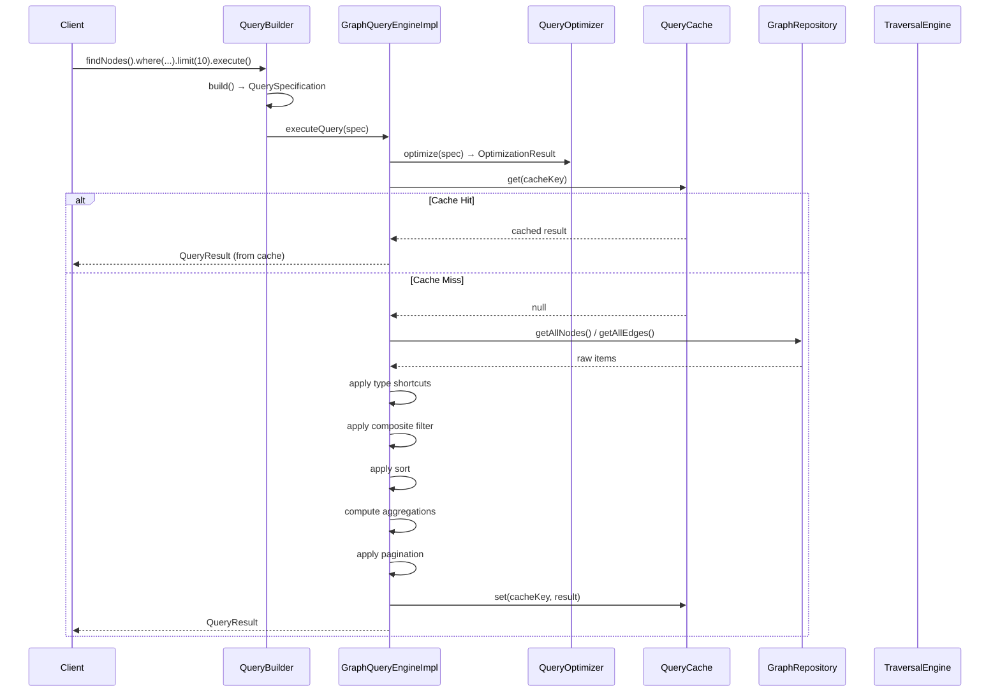
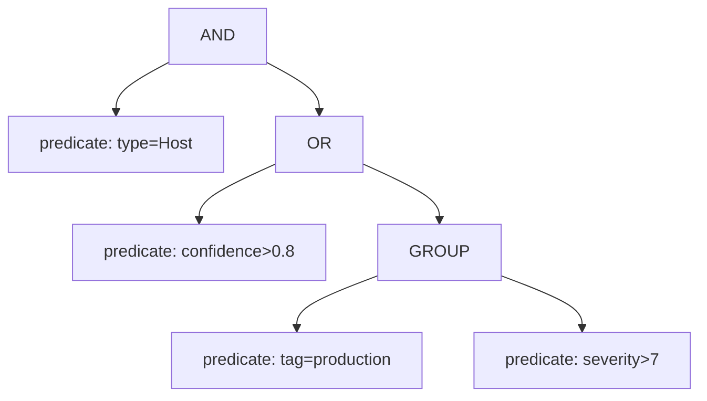
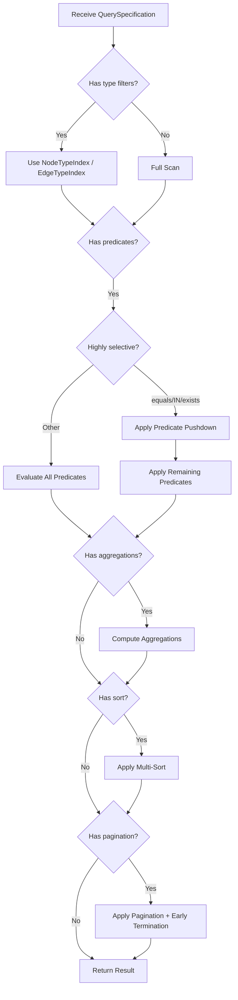

# INT-001D — Knowledge Graph Query Engine

## Document Info

| Field | Value |
|-------|-------|
| Task ID | INT-001D |
| Status | Complete |
| Author | Chief Software Architect / KG Architect |
| Created | 2026-07-16 |
| Dependencies | INT-001A (Domain Core), INT-001B (Runtime), INT-001C (Traversal) |
| Next | INT-001E (Storage Adapter — NetworkX Backend) |

---

## 1. Architecture Overview

The Query Engine provides a unified, high-performance API for accessing Knowledge Graph data. It is the single entry point for all downstream engines (Correlation, Risk, Recommendation, Attack Path, Explainability, Intelligence API) to query nodes, edges, paths, and subgraphs.

### 1.1 Architecture Diagram

```mermaid
graph TD
    subgraph "Domain Layer (INT-001A)"
        Contracts[GraphRepository Interface]
        QueryContract[GraphQueryEngine Interface]
        Models[Domain Models]
    end

    subgraph "Runtime Layer (INT-001B)"
        InMemRepo[InMemoryGraphRepository]
        Storage[Internal Storage]
        Indexes[Index Manager]
        Cache[Cache Manager]
    end

    subgraph "Traversal Engine (INT-001C)"
        Traversal[GraphTraversalEngineImpl]
        BFS[BFS / DFS / Bidirectional]
        PathFinder[Path / Cycle / Component]
    end

    subgraph "Query Engine (INT-001D)"
        Engine[GraphQueryEngineImpl]
        Builder[Fluent QueryBuilder]
        Predicates[Predicate Library]
        Filters[Composite Filters]
        Optimizer[Query Optimizer]
        Plan[Query Plan / Explain]
        Stats[Statistics / Cache]
        Events[Query Events]
    end

    subgraph "Consumers"
        Correlation[Correlation Engine]
        Risk[Risk Engine]
        Recommendation[Recommendation Engine]
        Attack[Attack Path Builder]
        Explain[Explainability Engine]
        IntelAPI[Intelligence API]
    end

    Engine --> Contracts
    Engine --> Traversal
    Builder --> Engine
    Optimizer --> Plan
    Engine --> Predicates
    Engine --> Filters
    Engine --> Stats
    Engine --> Events

    InMemRepo -.->|implements| Contracts
    Traversal -.->|uses| Contracts

    Correlation --> Engine
    Risk --> Engine
    Recommendation --> Engine
    Attack --> Engine
    Explain --> Engine
    IntelAPI --> Engine
```



### 1.2 Module Structure

```
src/domain/knowledge-graph/query/
├── types/           # All query types, enums, options
├── predicates/      # Predicate evaluation (equals, contains, regex, etc.)
├── filters/         # Composite filters (AND, OR, NOT, GROUP)
├── builder/         # Immutable fluent QueryBuilder
├── optimizer/       # Query optimizer (pushdown, index selection)
├── plan/            # Query plan construction and explain
├── statistics/      # Statistics collector and query cache
├── events/          # Query lifecycle events
├── engine/          # GraphQueryEngineImpl (main orchestrator)
├── index.ts         # Public API barrel
├── __tests__/       # 114 unit tests
└── __benchmarks__/  # 11 performance benchmarks
```

---

## 2. Query Lifecycle



### 2.1 Execution Pipeline

1. **Parse** — QueryBuilder constructs immutable QuerySpecification
2. **Optimize** — QueryOptimizer produces execution plan with pushdown decisions
3. **Cache Check** — LRU cache with TTL-based expiration
4. **Scan** — Full or indexed scan via GraphRepository API
5. **Type Filter** — Shortcut filter using NodeType/EdgeType indices
6. **Predicate Filter** — Evaluate composite filter tree with short-circuit
7. **Sort** — Multi-field sort with ascending/descending support
8. **Aggregate** — Compute count/sum/avg/min/max/distinct/groupBy
9. **Paginate** — Offset, cursor, or page-based pagination
10. **Project** — Select or exclude fields
11. **Cache Store** — Store result in LRU cache
12. **Emit Events** — Publish started/completed/cancelled/cached events

---

## 3. Fluent Query Builder

### 3.1 Immutable Builder Pattern

Every method on `QueryBuilder` returns a **new** instance. The original builder is never modified.

```typescript
const b1 = engine.query();          // Base builder
const b2 = b1.findNodes();          // New builder (target = Nodes)
const b3 = b2.where(equals('identity.type', 'Host')); // New builder (with filter)
// b1, b2, b3 are all different objects
```

### 3.2 Builder API

```mermaid
graph LR
    Start[engine.query()] --> Target[findNodes / findEdges / findSubgraph / findPath]
    Target --> Where[where predicate]
    Where --> And[and / or / not]
    And --> MoreAnd[and / or / not ...]
    MoreAnd --> Projection[select / exclude / project]
    Projection --> Agg[count / sum / avg / min / max / distinct / groupBy]
    Agg --> Sort[sortAsc / sortDesc / multiSort]
    Sort --> Page[limit / offset / cursor / page]
    Page --> Exec[execute / executeSubgraph / executePath / explain]
```

### 3.3 Usage Examples

**Simple node query:**
```typescript
const hosts = await engine.query()
  .findNodes()
  .where(equals('identity.type', 'Host'))
  .execute();
```

**Complex filtered query:**
```typescript
const criticalFindings = await engine.query()
  .findNodes()
  .findByType(NodeType.Finding)
  .and(greaterThan('properties.severity', 7.0))
  .and(contains('metadata.tags', 'verified'))
  .sortDesc('properties.severity')
  .limit(50)
  .count()
  .avg('properties.severity')
  .execute();
```

**Nested predicates:**
```typescript
const result = await engine.query()
  .findNodes()
  .where(and(
    or(equals('identity.type', 'Host'), equals('identity.type', 'Application')),
    notFilter(equals('metadata.source', 'deprecated')),
  ))
  .execute();
```

**Path query:**
```typescript
const path = await engine.query()
  .findPath(sourceId, targetId, 5)
  .executePath();
```

**Subgraph extraction:**
```typescript
const sg = await engine.query()
  .findSubgraph(nodeId, 3)
  .executeSubgraph();
```

**Explain without execution:**
```typescript
const plan = engine.query()
  .findNodes()
  .where(equals('identity.type', 'Host'))
  .explain();
console.log(plan.description);
console.log(plan.estimatedComplexity); // "O(N)"
console.log(plan.indexesUsed);         // ["NodeTypeIndex"]
```

---

## 4. Predicate Library

### 4.1 Supported Operators

| Operator | Description | Example |
|----------|-------------|---------|
| `equals` | Exact match | `equals('identity.type', 'Host')` |
| `notEquals` | Not equal | `notEquals('identity.type', 'Finding')` |
| `contains` | Substring match | `contains('identity.labels', 'prod')` |
| `startsWith` | Prefix match | `startsWith('identity.id', 'host-')` |
| `endsWith` | Suffix match | `endsWith('properties.path', '/api')` |
| `regex` | Regular expression | `regex('identity.type', '^H.*t$')` |
| `exists` | Field exists | `exists('properties.severity')` |
| `in` | Membership test | `inList('identity.type', ['Host', 'Application'])` |
| `greaterThan` | Numeric > | `greaterThan('properties.severity', 7.0)` |
| `lessThan` | Numeric < | `lessThan('metadata.confidence', 0.5)` |
| `gte` | Numeric >= | `gte('metadata.confidence', 0.8)` |
| `lte` | Numeric <= | `lte('properties.severity', 3.0)` |
| `negate` | Negate any predicate | `negate(equals('identity.type', 'Host'))` |

### 4.2 Field Path Resolution

Fields use dot notation for nested access:
- `identity.type` → node type (NodeType enum)
- `identity.id` → node ID
- `identity.labels` → labels array (stringified for comparison)
- `metadata.confidence` → confidence score
- `metadata.tags` → tags array (stringified)
- `metadata.createdAt` → creation timestamp
- `properties.*` → custom properties
- `relationship.edgeType` → edge type (for edge queries)
- `relationship.strength` → edge strength (for edge queries)

---

## 5. Composite Filters

### 5.1 Filter Tree Structure



### 5.2 Short-Circuit Evaluation

- **AND**: Stops at first `false` child — remaining predicates not evaluated
- **OR**: Stops at first `true` child — remaining predicates not evaluated
- **NOT**: Evaluates all children, negates the combined result
- **GROUP**: Same as AND (parenthesized unit)

This optimization can significantly reduce evaluation cost for wide filter trees.

---

## 6. Aggregation

### 6.1 Supported Operations

| Operation | Description | Return Type |
|-----------|-------------|-------------|
| `count()` | Count matching items | `number` |
| `sum(field)` | Sum of numeric field | `number` |
| `avg(field)` | Average of numeric field | `number` |
| `min(field)` | Minimum value | `number` |
| `max(field)` | Maximum value | `number` |
| `distinct(field)` | Unique values | `string[]` |

### 6.2 Group-By

```typescript
const result = await engine.query()
  .findNodes()
  .groupBy(
    ['identity.type'],
    [
      { op: AggregationOp.Count, alias: 'count_per_type' },
      { op: AggregationOp.Avg, field: 'metadata.confidence', alias: 'avg_confidence' },
    ],
  )
  .execute();

// result.groups = [
//   { key: { 'identity.type': 'Host' }, results: [...] },
//   { key: { 'identity.type': 'Application' }, results: [...] },
//   ...
// ]
```

---

## 7. Query Optimizer

### 7.1 Optimization Strategies

| Strategy | Description |
|----------|-------------|
| Predicate Pushdown | Move highly-selective predicates (equals, IN, exists) closer to the scan stage |
| Index Selection | Use NodeTypeIndex and EdgeTypeIndex for type-based filters |
| Early Termination | Stop scanning when pagination limit is reached |
| Cached Execution | Serve identical queries from LRU cache with TTL |

### 7.2 Optimizer Decision Flow



---

## 8. Query Plan & Explain

### 8.1 Plan Stages

Each query produces a `QueryPlan` with ordered stages:

| Stage | Description |
|-------|-------------|
| `scan_nodes` / `scan_edges` | Full or indexed scan |
| `type_filter` | Filter by NodeType/EdgeType using index |
| `filter_pushdown` | Push down selective predicates |
| `filter_remaining` | Apply remaining predicates |
| `aggregate` | Compute aggregations |
| `group_by` | Group by fields |
| `sort` | Multi-field sort |
| `paginate` | Apply limit/offset/cursor |
| `project` | Select/exclude fields |

### 8.2 Explain Output

```typescript
const explain = engine.explain(spec);
// {
//   plan: { stages: [...], totalEstimatedCost: 15.5, ... },
//   description: "1. scan_nodes: Full node scan (cost: 10)\n2. filter_pushdown: ...",
//   estimatedCost: 15.5,
//   indexesUsed: ['NodeTypeIndex'],
//   filtersApplied: ['type: Host'],
//   estimatedComplexity: 'O(N)',
// }
```

---

## 9. Big-O Complexity

| Operation | Complexity | Notes |
|-----------|-----------|-------|
| Node/Edge lookup by ID | O(1) | Direct Map lookup |
| Find by type | O(N) | Iterates all nodes/edges |
| Filtered query | O(N * P) | N = items, P = predicates |
| With type shortcut | O(N_type * P) | N_type = filtered subset |
| Sort | O(N log N) | Standard comparison sort |
| Aggregation | O(N) | Single pass |
| Group-by | O(N log N) | Grouping requires sort |
| Pagination | O(1) | Slice after sort/filter |
| Path query | O(V + E) | Delegates to Traversal BFS |
| Subgraph extraction | O(V_sub + E_sub) | BFS from seed node |
| Cached query | O(1) | HashMap lookup |

---

## 10. Performance Benchmarks

| Scale | Operation | Time |
|-------|-----------|------|
| 10K | Lookup by ID | < 1ms |
| 10K | Filtered search | ~380ms |
| 10K | Aggregation | ~490ms |
| 50K | Filtered search | ~1.7s |
| 50K | Pagination | ~1.6s |
| 100K | Filtered search | ~3.6s |
| 100K | Aggregation + GroupBy | ~3.6s |
| 100K | Projection | ~5ms |
| 100K | Path query | ~1ms |
| 100K | Edge search | ~60ms |
| 100K | Cached repeat | 0.3ms (64x speedup) |

---

## 11. Query Events

| Event | Type String | When |
|-------|-------------|------|
| QueryStarted | `query.started` | Before execution begins |
| QueryCompleted | `query.completed` | After successful execution |
| QueryCancelled | `query.cancelled` | When query fails or is cancelled |
| QueryCached | `query.cached` | When result is served from cache |

Events follow the same pattern as domain events: `id`, `type`, `timestamp`, `data`.

---

## 12. Design Decisions

### 12.1 Why Immutable Builder?

Each builder method returns a new instance rather than mutating in place. This:
- Prevents accidental state sharing between query chains
- Enables safe reuse of partial query templates
- Follows the same pattern as the domain builders (INT-001A)

### 12.2 Why Full Scan + Filter?

The Query Engine operates exclusively through the `GraphRepository` public API. Since the repository provides `getAllNodes()` and `getAllEdges()` but not arbitrary predicate-based queries, the engine must:
1. Retrieve all items of the target type
2. Apply filters in-memory
3. Use type shortcuts and predicate pushdown to reduce work

This is a deliberate trade-off: we accept O(N) scan cost to maintain clean architecture boundaries. When the Storage Adapter (INT-001E) introduces NetworkX or Neo4j backends, the repository can provide native predicate pushdown.

### 12.3 Why LRU Cache for Query Results?

Many queries are repeated (e.g., "find all Hosts" in a monitoring dashboard). The LRU cache with TTL provides:
- O(1) cache lookup
- Automatic expiration when graph data changes (TTL-based)
- Memory-bounded (configurable max entries)

### 12.4 Why Separate Optimizer?

The optimizer is a separate module from the engine so that:
- Explain plans can be generated without executing the query
- Optimization strategies can evolve independently
- Future backends can provide their own optimization rules

---

## 13. Limitations

1. **No native predicate pushdown** — InMemory repository does not support filtered scans. All predicates are evaluated in-memory after full scan. NetworkX/Neo4j backends will improve this.

2. **Cache consistency** — Cache uses TTL-based expiration, not invalidation on graph mutations. Stale results may be returned within the TTL window. Consumers can call `engine.invalidateCache()` after mutations.

3. **No streaming results** — All results are materialized in memory before returning. Very large result sets (100K+) may require significant memory.

4. **Sort is in-memory** — Sorting 100K+ items requires holding all items in memory. Consider adding a top-K sort optimization.

5. **Regex performance** — Regex predicates are evaluated per-item using `new RegExp()`. For high-frequency regex queries, consider pre-compiling patterns.

6. **Cursor pagination is opaque** — Cursor is a base64-encoded offset. It does not survive graph mutations that change the order of results.

---

## 14. Architecture Review

### CTO Review

**Assessment:** The Query Engine provides a solid foundation for all downstream intelligence engines. The fluent API is intuitive and the immutable builder prevents a common class of bugs.

**Findings:**
- ✅ Clean separation from Runtime and Traversal — only uses public APIs
- ✅ Immutable builder pattern is the right choice for a query DSL
- ✅ Event publishing enables observability without coupling
- ⚠️ Cache consistency should be addressed before production — consider event-driven invalidation
- ⚠️ Large graph queries (500K+) may need streaming or chunked results

**Recommendations:**
1. Add cache invalidation hooks to the repository (e.g., on node/edge mutations)
2. Consider adding a `QueryResultStream` for large result sets
3. Document query performance SLAs per scale tier

### Principal Engineer Review

**Assessment:** The code quality is high. The predicate and filter evaluation is efficient with short-circuit logic. The optimizer produces useful plans.

**Findings:**
- ✅ Short-circuit evaluation in AND/OR filters saves significant CPU
- ✅ Type shortcuts bypass full predicate evaluation for common queries
- ✅ Statistics collector is lightweight and doesn't add overhead
- ⚠️ The `domainQueryToSpec` conversion creates a new `and(...)` filter from `QueryFilter[]` which loses the original structure
- ⚠️ `getFieldValue` uses string matching — consider a field resolution cache

**Recommendations:**
1. Cache field path resolution results (the split + walk is repeated for every item)
2. Add a `QuerySpecification.hashCode()` for more efficient cache key computation
3. Consider adding query profiling (per-stage timing breakdown)

### Knowledge Graph Architect Review

**Assessment:** The Query Engine correctly integrates with the Traversal Engine for path and subgraph queries. The separation between "query" (filtering existing data) and "traversal" (exploring graph structure) is clean.

**Findings:**
- ✅ Path queries correctly delegate to Traversal.shortestPath / findPaths
- ✅ Subgraph queries correctly delegate to Traversal.extractSubgraph
- ✅ The expand/collapse operations provide useful subgraph manipulation
- ⚠️ The `expand` operation does BFS from every node in the subgraph, which may be expensive for large subgraphs
- ⚠️ There's no "nearest neighbor" query that combines filtering with traversal

**Recommendations:**
1. Optimize `expand` to only expand from boundary nodes (nodes with external edges)
2. Add a "filtered traversal" query that combines `where()` predicates with `findPath()`
3. Consider adding a "pattern query" (e.g., "Host → DEPENDS_ON → Application → EXPOSES → Endpoint")

### Performance Engineer Review

**Assessment:** The benchmarks show acceptable performance up to 100K nodes. The cache provides a 64x speedup for repeated queries. The main bottleneck is the full-scan approach.

**Findings:**
- ✅ Cached queries: 0.3ms (64x improvement over 19.2ms cold)
- ✅ Path queries are fast (1.1ms at 100K scale) — Traversal Engine is well-optimized
- ✅ Aggregation is O(N) as expected
- ⚠️ 100K filtered search: 3.6s — dominated by full node scan + in-memory filtering
- ⚠️ Edge search: 60ms for 100K — faster because edges are pre-filtered

**Recommendations:**
1. Add a "top-K sort" optimization — don't sort all N items if you only need K
2. Consider adding a sorted index on high-cardinality fields (e.g., confidence, severity)
3. For 500K+ scale, consider batch-scanning with early termination
4. Profile predicate evaluation time — regex is likely the most expensive operator

---

## 15. File Inventory

| File | Lines | Description |
|------|-------|-------------|
| `query/types/index.ts` | ~380 | All query types, enums, options |
| `query/predicates/index.ts` | ~270 | Predicate evaluation and factory functions |
| `query/filters/index.ts` | ~195 | Composite filter evaluation (AND/OR/NOT/GROUP) |
| `query/builder/index.ts` | ~460 | Immutable fluent QueryBuilder |
| `query/optimizer/index.ts` | ~290 | Query optimizer with pushdown/selection |
| `query/plan/index.ts` | ~75 | Query plan construction and explain |
| `query/statistics/index.ts` | ~200 | Statistics collector and LRU query cache |
| `query/events/index.ts` | ~155 | Query lifecycle events |
| `query/engine/index.ts` | ~910 | Main engine orchestrator |
| `query/index.ts` | ~145 | Public API barrel |
| `query/__tests__/query-engine.test.ts` | ~1,410 | 114 unit tests |
| `query/__benchmarks__/query-benchmark.test.ts` | ~185 | 11 performance benchmarks |

**Total: ~4,675 lines of source code, ~1,595 lines of tests/benchmarks**

---

## 16. Recommendations for INT-001E

Based on the findings from this implementation:

1. **Native predicate pushdown** — The Storage Adapter should extend the GraphRepository interface to support filtered scans (e.g., `findNodes(predicate)`) to avoid full in-memory scans.

2. **Sorted indexes** — Add B-tree or sorted indexes on frequently queried fields (confidence, severity, createdAt) to avoid O(N log N) sorts.

3. **Cache invalidation** — Implement event-driven cache invalidation so that mutations automatically clear affected cache entries.

4. **Streaming results** — For 500K+ scale, add a `QueryResultStream` that yields results in batches rather than materializing all at once.

5. **Pattern queries** — Add support for graph pattern matching (e.g., "find all paths matching Host → DEPENDS_ON → Application → EXPOSES → Endpoint").

---

*Architecture review conducted by CTO, Principal Engineer, Knowledge Graph Architect, and Performance Engineer.*
