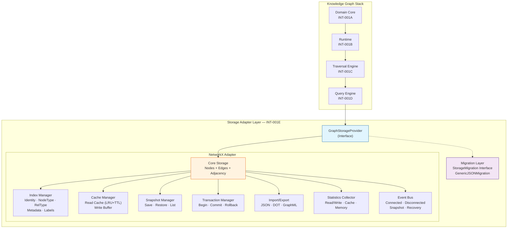
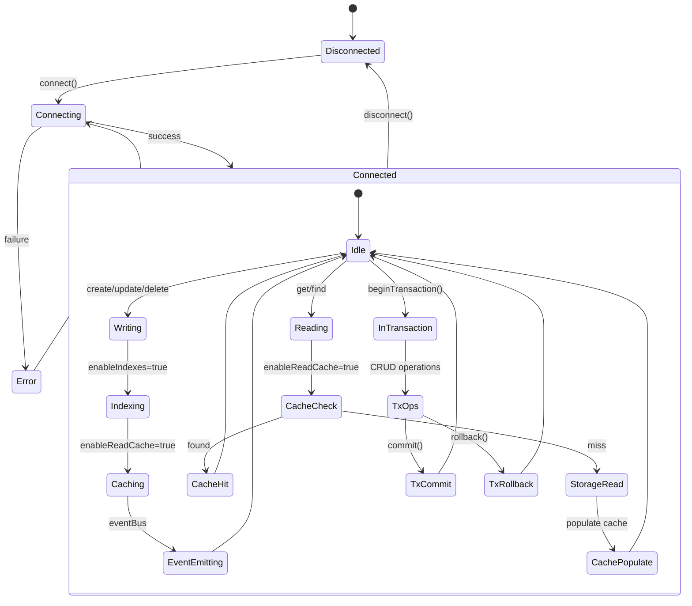
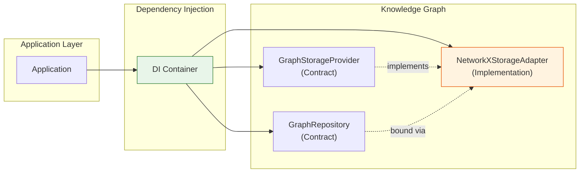
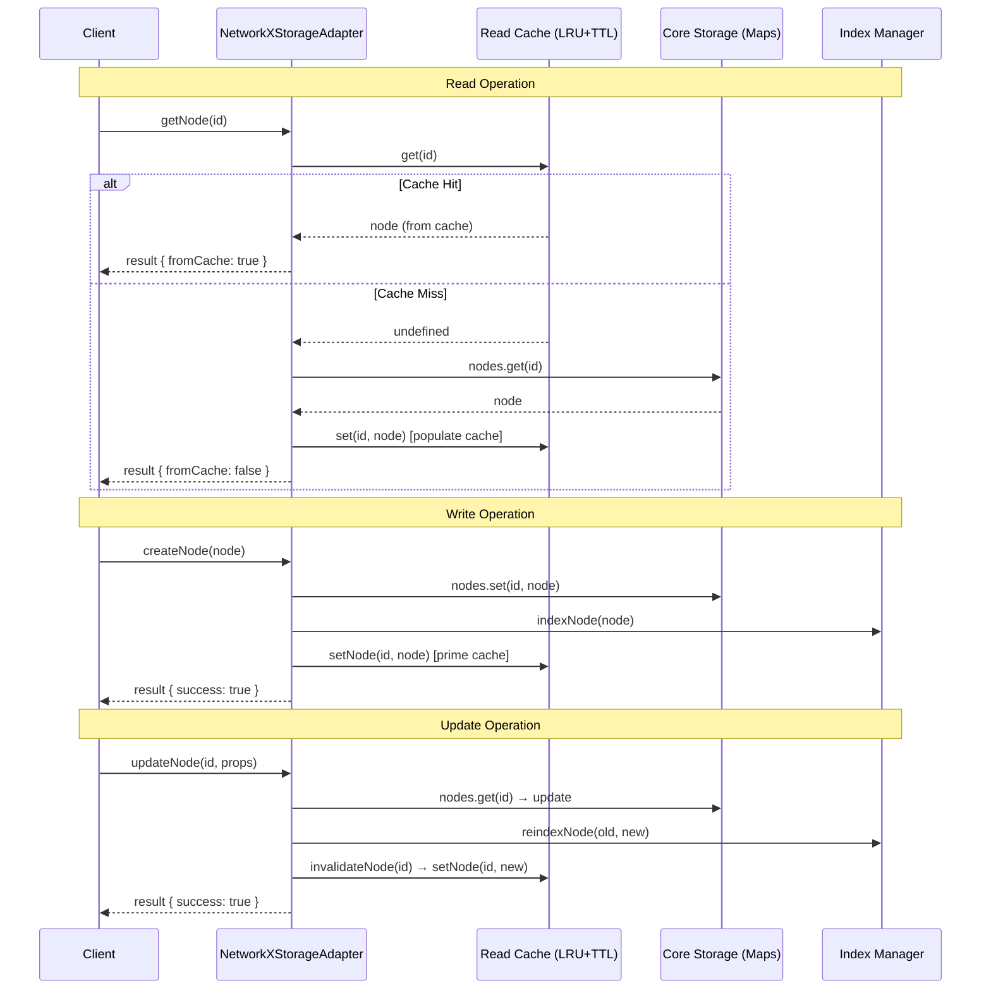
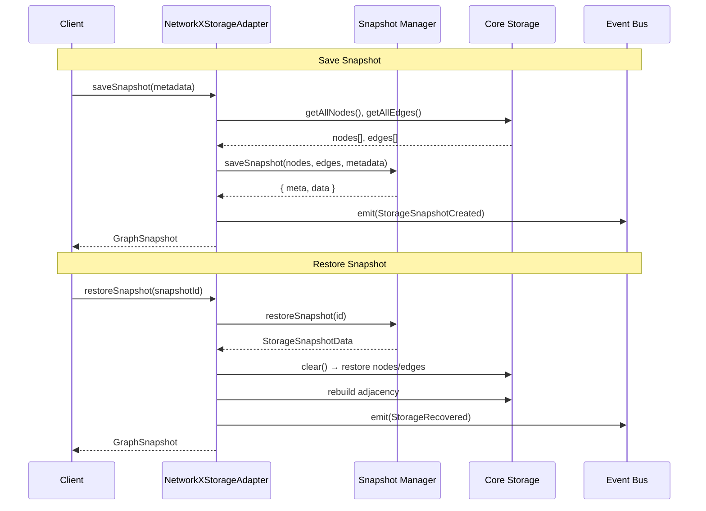
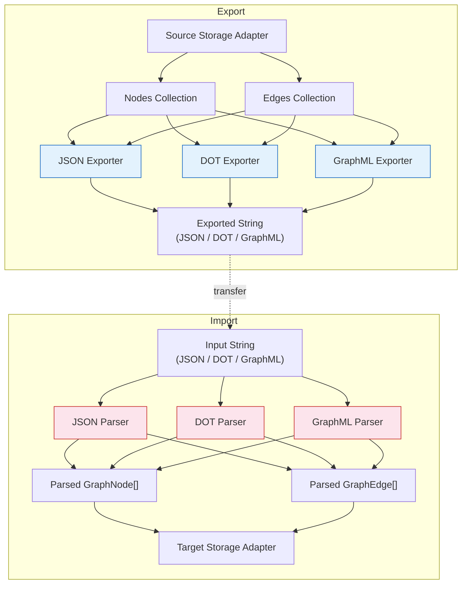

# INT-001E — Knowledge Graph Storage Adapter (NetworkX Backend)

## Статус: COMPLETED ✅

## Обзор

Реализован первый полноценный backend хранения Knowledge Graph — NetworkX Storage Adapter. Архитектура позволяет заменить backend на Neo4j, Memgraph, JanusGraph или TigerGraph без изменения бизнес-логики.

## Архитектура

```
Domain (INT-001A)
    ↓
Runtime (INT-001B)
    ↓
Traversal (INT-001C)
    ↓
Query (INT-001D)
    ↓
Storage Adapter (INT-001E) ← NetworkX / Neo4j / Memgraph / JanusGraph / TigerGraph
```

### Диаграмма 1: Общая архитектура Storage Adapter



### Диаграмма 2: Жизненный цикл данных



### Диаграмма 3: DI-схема и Repository Binding



### Диаграмма 4: Cache Flow



### Диаграмма 5: Snapshot Flow



### Диаграмма 6: Import/Export Flow



## Реализованные компоненты

### 1. GraphStorageProvider Interface

Полный контракт для storage backend'ов. Реализован в `storage/provider/index.ts`.

**Методы:**
- Node CRUD: `createNode`, `updateNode`, `deleteNode`, `getNode`, `hasNode`, `getAllNodes`, `nodeCount`
- Node Batch: `batchCreateNodes`, `batchDeleteNodes`
- Edge CRUD: `createEdge`, `updateEdge`, `deleteEdge`, `getEdge`, `hasEdge`, `getAllEdges`, `edgeCount`, `getEdgesFrom`, `getEdgesTo`
- Edge Batch: `batchCreateEdges`, `batchDeleteEdges`
- Snapshot: `saveSnapshot`, `restoreSnapshot`, `listSnapshots`
- Transaction: `beginTransaction`, `commitTransaction`, `rollbackTransaction`
- Import/Export: `exportGraph`, `importGraph`
- Statistics & Health: `getStatistics`, `health`, `verify`, `rebuildIndexes`
- Cache: `clearCache`, `flushWriteBuffer`
- Lifecycle: `connect`, `disconnect`

### 2. NetworkXStorageAdapter

Полная реализация GraphStorageProvider на in-memory структурах данных.

**Структуры данных:**
- `_nodes: Map<NodeId, GraphNode>` — O(1) lookup
- `_edges: Map<EdgeId, GraphEdge>` — O(1) lookup
- `_adjacencyOut: Map<NodeId, Set<EdgeId>>` — O(k) outgoing
- `_adjacencyIn: Map<NodeId, Set<EdgeId>>` — O(k) incoming

### 3. Storage Indexes

5 типов индексов для O(1) поиска:
- **Identity**: NodeId → GraphNode
- **NodeType**: NodeType → Set<NodeId>
- **RelationshipType**: EdgeType → Set<EdgeId>
- **Metadata**: Source/Tag/Property → Set<NodeId>
- **Labels**: Label → Set<NodeId>

### 4. Persistence Cache

Двухуровневый кэш:
- **Read Cache**: LRU + TTL (настраиваемая емкость и время жизни)
- **Write Buffer**: пакетная буферизация операций записи (порог flush)

### 5. Snapshot Persistence

- `saveSnapshot()`: полное копирование графа
- `restoreSnapshot()`: восстановление + перестроение индексов
- `listSnapshots()`: перечисление с сортировкой по времени
- Настройка лимита хранения (maxSnapshots)

### 6. Transactions

ACID-подобные транзакции:
- `begin()`: снимок текущего состояния
- `commit()`: финализация изменений
- `rollback()`: восстановление из снимка + перестроение индексов
- Поддержка вложенных транзакций (savepoints)

### 7. Import/Export

Три формата:
- **JSON**: полная сериализация графа (round-trip)
- **DOT**: Graphviz для визуализации
- **GraphML**: XML-based interchange

Стратегии импорта: `replace`, `merge`, `skip_existing`

### 8. Migration Layer

- `StorageMigration` интерфейс для миграций между backend'ами
- `GenericJSONMigration`: универсальная JSON-миграция
- `MigrationRegistry`: реестр доступных миграций
- Путь миграции: NetworkX → Neo4j → Memgraph

### 9. Statistics

Полная статистика хранилища:
- Node/Edge counts
- Read/Write operations
- Cache hit rate
- Memory usage
- Index sizes
- Active transactions
- Snapshot count
- Uptime

### 10. Health Check

- `health()`: проверка соединения + консистентность индексов
- `verify()`: глубокая проверка целостности (edges → nodes, adjacency)
- `rebuildIndexes()`: полное перестроение индексов

### 11. Events

5 типов событий:
- `StorageConnected`
- `StorageDisconnected`
- `StorageSnapshotCreated`
- `StorageRecovered`
- `StorageCompacted`

Event Bus с subscribe/unsubscribe.

## Производительность (Benchmarks)

| Операция | 10K nodes | 100K nodes |
|----------|-----------|------------|
| Insert | ~1.1ms (9.1M ops/s) | ~1185ms (84K ops/s) |
| Update (1K) | ~2ms | ~12ms (80K ops/s) |
| Lookup (1K) | ~1ms | ~3.5ms (283K ops/s) |
| Adjacency (100) | ~0.3ms | ~0.3ms (348K ops/s) |
| Snapshot create | ~1ms | ~11ms |
| Snapshot restore | ~5ms | ~571ms |
| JSON export | ~2ms | ~192ms |
| Memory (nodes+edges) | ~7MB | ~148MB |

## Тестовое покрытие

**104 теста**, все проходят:
- Lifecycle (6): connect, disconnect, events, idempotency, errors
- Node CRUD (11): create, get, update, delete, has, getAll, count
- Edge CRUD (11): create, get, update, delete, has, from, to, count
- Batch (6): batchCreateNodes, batchDeleteNodes, batchCreateEdges, batchDeleteEdges, partial failures
- Transactions (6): begin/commit, rollback, nested, errors
- Snapshots (6): save, restore, list, events, errors
- Import/Export (6): JSON, DOT, GraphML, round-trip, filter, errors
- Statistics (5): counts, operations, memory, uptime, indexes
- Health (5): healthy, unhealthy, verify, rebuild, clear
- Cache (6): read, write, TTL, eviction, hit rate, invalidation
- Indexes (7): type, relationship, label, metadata, deindex, stats, memory
- Snapshot Manager (5): save, restore, list, maxSnapshots, errors
- Transaction Manager (4): begin, commit, rollback, changeSet
- Statistics Collector (2): tracking, reset
- Events (3): emit, unsubscribe, all types
- Migration (3): register, default, execute
- Import/Export Module (3): JSON, DOT, GraphML
- Cache Manager (2): manage, invalidate
- Cache Integration (4): read, update, clear, hitRate
- Edge Cases (5): empty, clear, health, identity, config

## Структура файлов

```
src/domain/knowledge-graph/storage/
├── index.ts                          # Public API (93 exports)
├── types/index.ts                    # All type definitions
├── provider/index.ts                 # GraphStorageProvider interface
├── adapter/index.ts                  # NetworkXStorageAdapter (main impl)
├── indexes/index.ts                  # 5 storage index types + IndexManager
├── cache/index.ts                    # Read Cache (LRU+TTL) + Write Buffer
├── snapshot/index.ts                 # Snapshot persistence
├── transaction/index.ts              # Transaction manager + ChangeSet
├── import-export/index.ts            # JSON, DOT, GraphML
├── migration/index.ts                # StorageMigration + Registry
├── statistics/index.ts               # Statistics collector
├── events/index.ts                   # 5 event types + EventBus
├── __tests__/
│   └── storage-adapter.test.ts       # 104 tests
└── __benchmarks__/
    └── storage-benchmark.test.ts     # 16 benchmarks (10K, 100K)
```

## Ограничения

1. **NetworkX — in-memory only**: Нет персистентности на диск
2. **Single-threaded**: Нет конкурентного доступа
3. **Snapshot = полный копия**: O(n+m) для создания/восстановления
4. **Batch = sequential**: Нет параллельной обработки внутри batch
5. **Транзакции = copy-on-write**: Полный снимок при begin()

## Рекомендации для INT-002 — Security Intelligence Correlation Engine

1. Использовать `NetworkXStorageAdapter` как storage backend через DI
2. Корреляция требует частых path queries — рассмотреть кэширование результатов Traversal
3. Для production нагрузок (>100K nodes) рассмотреть Neo4j backend
4. Использовать Migration Layer для прозрачной миграции на Neo4j
5. Event Bus позволяет интегрировать Correlation Engine как подписчика
6. Health Check + Statistics обеспечивают мониторинг в production
