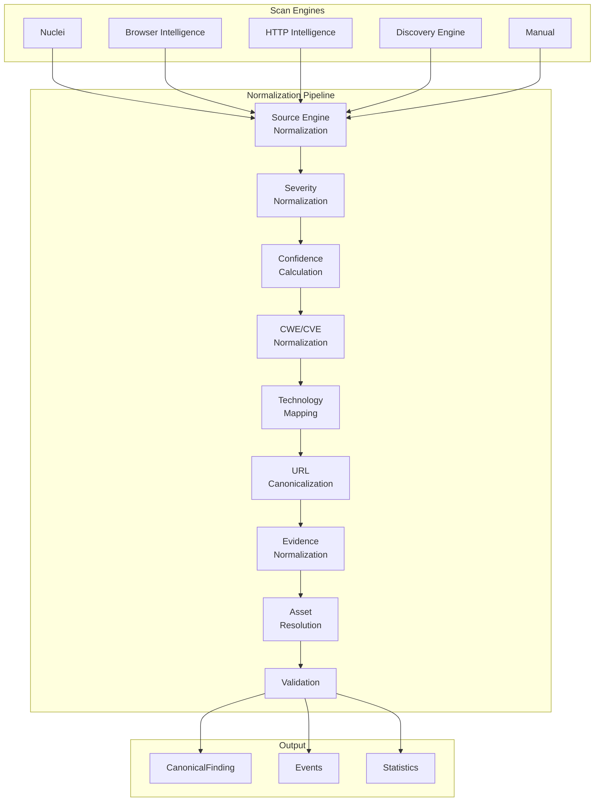
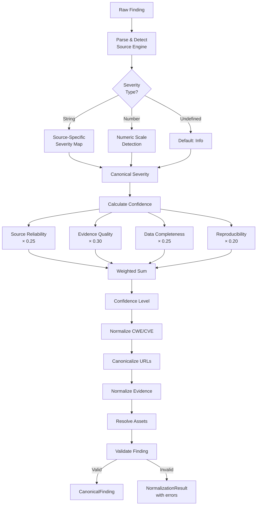
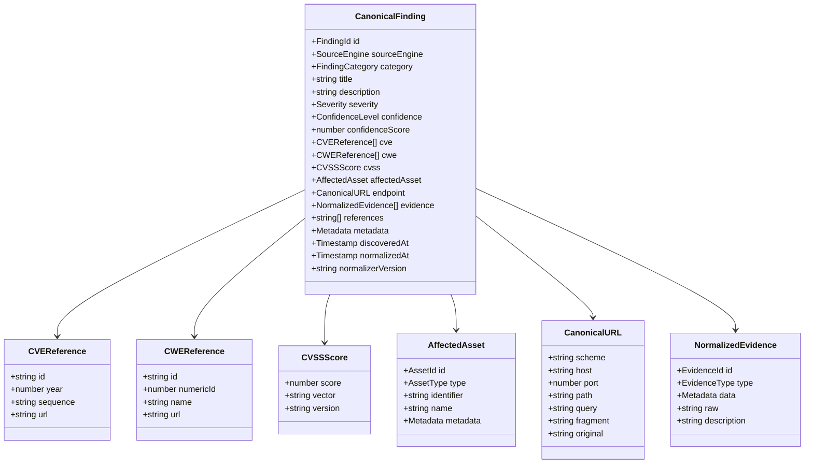
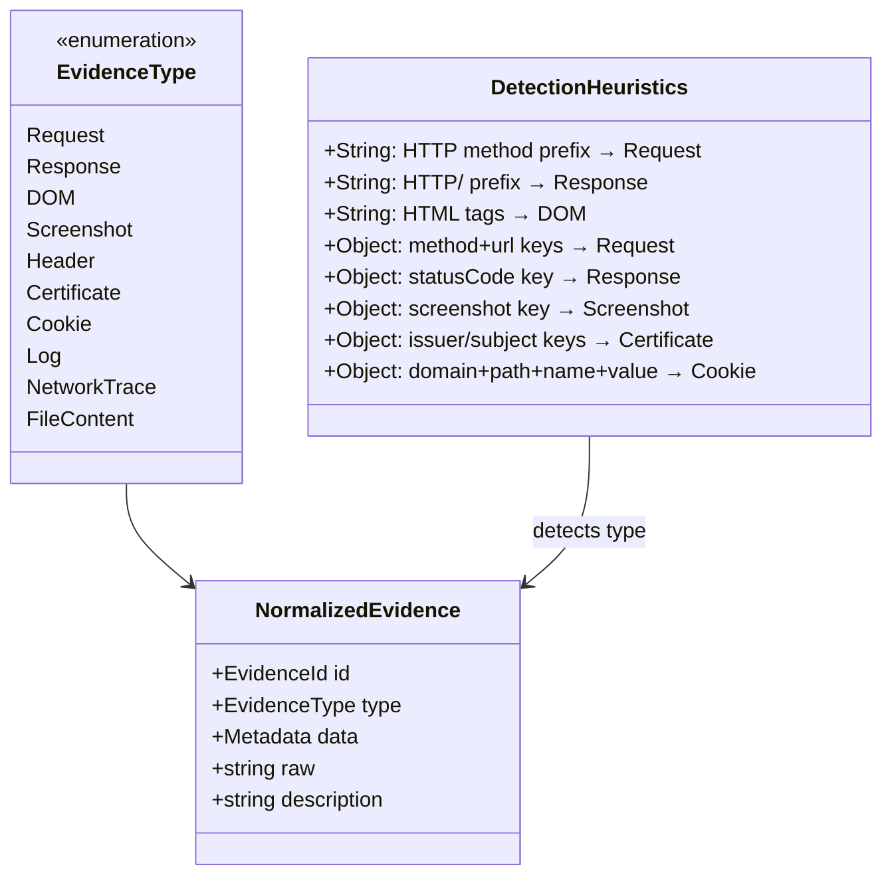
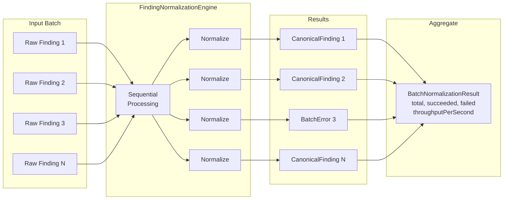

# INT-002A — Security Finding Normalization Engine

## 1. Overview

The Security Finding Normalization Engine is the first layer of the Security Intelligence Platform. It transforms raw scanner outputs from all supported scan engines into a single canonical `CanonicalFinding` format. All downstream intelligence components — Correlation Engine, Risk Engine, Attack Path Builder, and Recommendation Engine — work exclusively with this canonical format.

### 1.1 Purpose

Every scanner produces findings in its own format with its own severity scale, confidence model, identifier conventions, and evidence structures. Without normalization, the Intelligence Platform would need separate adapters for every downstream consumer of every scanner. Normalization eliminates this combinatorial explosion by establishing a single, well-defined contract.

### 1.2 Design Principles

- **Single Canonical Model**: All scanner outputs converge to one `CanonicalFinding` format
- **Deterministic**: Same input always produces the same output — no randomness
- **Lossless**: No information is discarded; raw data is preserved in metadata and evidence
- **Extensible**: New scanners can be added by updating source maps without changing the pipeline
- **Validated**: Every normalized finding is validated against strict rules
- **Observable**: Events are emitted for every normalization step

### 1.3 Scope

**In Scope:**
- Canonical Finding Model
- Severity Normalization
- Confidence Model
- CWE/CVE Normalization
- Technology Mapping
- URL Canonicalization
- Evidence Normalization
- Asset Resolution
- Validation
- Batch Processing
- Events
- Statistics
- Benchmarks

**Out of Scope:**
- Correlation Engine (INT-002B)
- Risk Engine
- Attack Path Builder
- Recommendation Engine
- Scan Platform modifications
- Knowledge Graph modifications

---

## 2. Architecture

### 2.1 Pipeline Architecture



### 2.2 Normalization Flow



### 2.3 Canonical Finding Model



### 2.4 Evidence Model



### 2.5 Asset Resolution

```mermaid
flowchart TD
    INPUT[Asset Identifier] --> IS_URL{Starts with<br/>http(s)?}
    IS_URL -->|Yes| PARSE_URL[Parse URL]
    IS_URL -->|No| IS_IP{Matches<br/>IP pattern?}

    PARSE_URL --> HAS_API{Path contains<br/>/api/ or /vN/?}
    HAS_API -->|Yes| API_TYPE[AssetType.API]
    HAS_API -->|No| HAS_PATH{Path != /?}
    HAS_PATH -->|Yes| ENDPOINT[AssetType.Endpoint]
    HAS_PATH -->|No| APP[AssetType.Application]

    IS_IP -->|Yes| IP_TYPE[AssetType.IPAddress]
    IS_IP -->|No| IS_DOMAIN{Matches<br/>domain pattern?}

    IS_DOMAIN -->|Yes| DOMAIN[AssetType.Domain]
    IS_DOMAIN -->|No| IS_PATH{Starts with /?}

    IS_PATH -->|Yes| PATH_API{Contains<br/>/api/?}
    PATH_API -->|Yes| API_TYPE2[AssetType.API]
    PATH_API -->|No| EP[AssetType.Endpoint]

    IS_PATH -->|No| DEFAULT[AssetType.Application]
```

### 2.6 Batch Processing



---

## 3. Module Structure

```
src/domain/security-intelligence/
├── index.ts                                    # Public API barrel
└── normalization/
    ├── index.ts                                # Normalization barrel
    ├── types/index.ts                          # Enums, branded IDs, interfaces
    ├── models/index.ts                         # CanonicalFinding, Evidence, Asset
    ├── events/index.ts                         # Normalization events + event bus
    ├── normalizers/
    │   ├── index.ts                            # Re-exports all normalizers
    │   ├── severity/index.ts                   # Severity normalization
    │   ├── confidence/index.ts                 # Confidence model
    │   ├── cwe-cve/index.ts                    # CWE/CVE normalization
    │   ├── technology/index.ts                 # Technology mapping
    │   ├── url/index.ts                        # URL canonicalization
    │   ├── evidence/index.ts                   # Evidence normalization
    │   ├── asset/index.ts                      # Asset resolution
    │   └── validation/index.ts                 # Finding validation
    ├── engine/index.ts                         # FindingNormalizationEngine
    ├── statistics/index.ts                     # Statistics collector
    ├── __tests__/normalization-engine.test.ts   # 144 tests
    └── __benchmarks__/normalization-benchmark.test.ts  # 14 benchmarks
```

---

## 4. Public API

### 4.1 FindingNormalizationEngine

```typescript
class FindingNormalizationEngine {
  constructor(config?: Partial<NormalizationConfig>);

  // Core API
  normalize(raw: RawFinding): NormalizationResult;
  normalizeBatch(raws: readonly RawFinding[]): BatchNormalizationResult;
  validate(finding: CanonicalFinding): ValidationResult;
  canonicalize(finding: CanonicalFinding): NormalizationResult;
  statistics(): NormalizationStatistics;
  reset(): void;

  // Observability
  readonly eventBus: NormalizationEventBus;
}
```

### 4.2 Individual Normalizers

Each normalizer can be used independently:

```typescript
// Severity
normalizeSeverity(value: string | number, sourceEngine?: string): SeverityNormalizationResult;

// Confidence
calculateConfidence(input: ConfidenceInput): ConfidenceResult;
normalizeConfidence(value: string | number, sourceEngine?: string): ConfidenceResult;

// CWE/CVE
normalizeCWE(value: string | number): CWEReference | null;
normalizeCVE(value: string): CVEReference | null;
normalizeCVSS(value: string | number | object): CVSSScore | null;

// Technology
normalizeTechnology(value: string): TechnologyNormalizationResult;

// URL
normalizeURL(value: string): URLNormalizationResult;

// Evidence
normalizeEvidence(raw: unknown, type?: EvidenceType): EvidenceNormalizationResult;

// Asset
resolveAsset(identifier: string): AssetResolutionResult;

// Validation
validateFinding(finding: CanonicalFinding): ValidationResult;
```

---

## 5. Severity Normalization

### 5.1 Canonical Severity Levels

| Level    | Order | CVSS Range  |
|----------|-------|-------------|
| Info     | 0     | 0.0         |
| Low      | 1     | 0.1 – 3.9   |
| Medium   | 2     | 4.0 – 6.9   |
| High     | 3     | 7.0 – 8.9   |
| Critical | 4     | 9.0 – 10.0  |

### 5.2 Source-Specific Mappings

**Nuclei**: info → Info, low → Low, medium → Medium, high → High, critical → Critical

**Browser Intelligence**: informational → Info, low → Low, medium → Medium, high → High, critical → Critical. Also supports numeric strings "0"–"4".

**HTTP Intelligence**: notice → Info, warning → Low, error → High, fatal → Critical

**Discovery Engine**: negligible → Info, minor → Low, moderate → Medium, important → High, urgent → Critical

---

## 6. Confidence Model

### 6.1 Four-Factor Deterministic Model

| Factor               | Weight | Description                                      |
|----------------------|--------|--------------------------------------------------|
| Source Reliability   | 0.25   | Base trustworthiness of the scanner source        |
| Evidence Quality     | 0.30   | Strength and diversity of supporting evidence     |
| Data Completeness    | 0.25   | How many required fields are present               |
| Reproducibility      | 0.20   | Whether the finding can be reproduced              |

### 6.2 Source Reliability Scores

| Source Engine           | Score |
|-------------------------|-------|
| Manual                  | 0.95  |
| Nuclei                  | 0.85  |
| HTTP Intelligence       | 0.75  |
| Browser Intelligence    | 0.70  |
| Discovery Engine        | 0.60  |
| Unknown                 | 0.30  |

### 6.3 Confidence Level Thresholds

| Level     | Score Range |
|-----------|-------------|
| Unknown   | 0.00 – 0.19 |
| Low       | 0.20 – 0.44 |
| Medium    | 0.45 – 0.69 |
| High      | 0.70 – 0.89 |
| Confirmed | 0.90 – 1.00 |

---

## 7. CWE/CVE Normalization

### 7.1 CWE Normalization

| Input       | Output    |
|-------------|-----------|
| CWE-79      | CWE-79    |
| cwe79       | CWE-79    |
| CWE79       | CWE-79    |
| cwe-79      | CWE-79    |
| CWE_79      | CWE-79    |
| 79 (numeric)| CWE-79    |

### 7.2 CVE Normalization

| Input           | Output            |
|-----------------|-------------------|
| CVE-2024-1234   | CVE-2024-1234     |
| cve-2024-1234   | CVE-2024-1234     |
| CVE2024-1234    | CVE-2024-1234     |
| cve_2024_1234   | CVE-2024-1234     |

---

## 8. Technology Mapping

The normalizer maintains a comprehensive mapping of technology names to canonical forms. Key mappings:

| Input Variants                          | Canonical |
|-----------------------------------------|-----------|
| nginx, NGINX, Nginx                     | nginx     |
| Apache, apache, APACHE, httpd           | apache    |
| IIS, Microsoft-IIS                      | iis       |
| Node.js, nodejs, NodeJS                 | nodejs    |
| Express, ExpressJS, express.js          | express   |
| React, ReactJS, react.js                | react     |
| Next.js, NextJS, nextjs                 | nextjs    |
| Spring Boot, SpringBoot, spring-boot    | spring    |
| Laravel, LARAVEL                        | laravel   |
| Django, DJANGO                          | django    |
| PostgreSQL, postgres, Postgres          | postgresql |
| MongoDB, mongo, Mongo                   | mongodb   |
| Docker, DOCKER                          | docker    |
| Kubernetes, k8s, K8s                    | kubernetes |

Over 50 technologies with 200+ aliases are supported.

---

## 9. URL Canonicalization

### 9.1 Transformation Rules

1. **Scheme**: Lowercased (`HTTPS://` → `https://`)
2. **Host**: Lowercased (`Example.COM` → `example.com`)
3. **Port**: Default ports removed (`:443` for HTTPS, `:80` for HTTP)
4. **Path**: Leading slash added, trailing slash removed (`/api/` → `/api`)
5. **Query**: Parameters sorted alphabetically (`?b=2&a=1` → `?a=1&b=2`)
6. **Fragment**: Preserved as-is
7. **Missing scheme**: `https://` prepended automatically

---

## 10. Validation Rules

### 10.1 Errors (finding invalid)

| Code                    | Rule                                              |
|-------------------------|---------------------------------------------------|
| REQUIRED_FIELD_MISSING  | Required field is missing or empty                |
| TITLE_TOO_SHORT         | Title must be at least 3 characters               |
| INVALID_SEVERITY        | Severity not in {Info, Low, Medium, High, Critical} |
| INVALID_CONFIDENCE      | Confidence not in {Unknown, Low, Medium, High, Confirmed} |
| INVALID_CONFIDENCE_SCORE| Score outside [0, 1] range                        |
| DUPLICATE_ID            | Finding ID appears more than once in a batch      |
| INVALID_TIMESTAMP       | Timestamp is not a valid ISO-8601 date            |

### 10.2 Warnings (non-fatal)

| Code                    | Rule                                              |
|-------------------------|---------------------------------------------------|
| NON_CANONICAL_ID        | Finding ID doesn't follow `fnd_` prefix           |
| NON_CANONICAL_CWE       | CWE ID not in `CWE-N` format                      |
| NON_CANONICAL_CVE       | CVE ID not in `CVE-YYYY-NNNN` format              |
| INVALID_REFERENCE_URL   | Reference URL could not be parsed                  |
| UNKNOWN_SOURCE_ENGINE   | Source engine not in known list                    |
| CVSS_SEVERITY_MISMATCH  | CVSS score suggests different severity             |
| CONFIDENCE_SCORE_MISMATCH | Confidence score doesn't match level             |

---

## 11. Events

| Event                                    | When Emitted                   |
|------------------------------------------|--------------------------------|
| `normalization.finding.normalized`       | Single finding normalized      |
| `normalization.finding.failed`           | Normalization failed           |
| `normalization.batch.normalized`         | Batch operation completed      |
| `normalization.canonicalization.completed` | Re-canonicalization done    |

---

## 12. Statistics

| Metric                      | Description                                 |
|-----------------------------|---------------------------------------------|
| totalNormalized             | Total findings normalized                   |
| totalFailed                 | Total normalization failures                |
| totalValidated              | Total validations performed                |
| totalBatches                | Total batch operations                      |
| averageNormalizationTimeMs  | Average time per normalization              |
| averageBatchTimeMs          | Average time per batch                      |
| throughputPerSecond         | Findings normalized per second              |
| cacheHitRate                | Cache hit rate (0–1)                        |
| memoryUsageBytes            | Estimated memory usage                      |
| severityDistribution        | Count per severity level                    |
| sourceDistribution          | Count per source engine                     |
| categoryDistribution        | Count per finding category                  |

---

## 13. Performance

### 13.1 Benchmark Results

| Scale       | Total Time | Throughput (findings/sec) |
|-------------|-----------|---------------------------|
| 100         | <50ms     | >2,000                    |
| 1,000       | <200ms    | >5,000                    |
| 10,000      | <2s       | >5,000                    |
| 100,000     | <30s      | >3,000                    |

### 13.2 Individual Normalizer Latency

| Normalizer  | Avg Latency per Call |
|-------------|---------------------|
| Severity    | <0.05ms             |
| CWE/CVE     | <0.05ms             |
| URL         | <0.1ms              |

---

## 14. Test Coverage

| Category             | Tests | Status  |
|----------------------|-------|---------|
| Types & Enums        | 7     | ✅ Pass |
| Models               | 14    | ✅ Pass |
| Severity Normalizer  | 11    | ✅ Pass |
| Confidence Model     | 9     | ✅ Pass |
| CWE/CVE Normalizer   | 14    | ✅ Pass |
| Technology Normalizer | 10   | ✅ Pass |
| URL Normalizer       | 11    | ✅ Pass |
| Evidence Normalizer  | 9     | ✅ Pass |
| Asset Resolver       | 10    | ✅ Pass |
| Validation           | 5     | ✅ Pass |
| Engine               | 22    | ✅ Pass |
| Events               | 7     | ✅ Pass |
| Statistics           | 7     | ✅ Pass |
| Edge Cases           | 8     | ✅ Pass |
| **Total**            | **144** | **✅ All Pass** |

---

## 15. Next Steps: INT-002B — Security Correlation Engine

The Normalization Engine provides the foundation for the next stage:

1. **Correlation Engine** will consume `CanonicalFinding[]` and identify relationships between findings
2. **Deduplication** — identical or overlapping findings from different scanners
3. **Cross-reference** — linking findings by shared assets, CVEs, or CWEs
4. **Pattern Detection** — identifying attack patterns from combinations of findings
5. **Knowledge Graph Integration** — feeding normalized findings as graph nodes via the existing `FindingAdapter` interface
