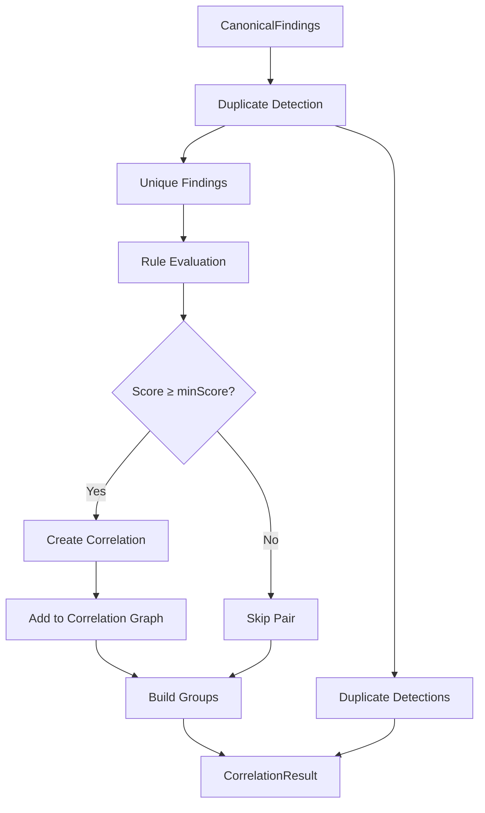
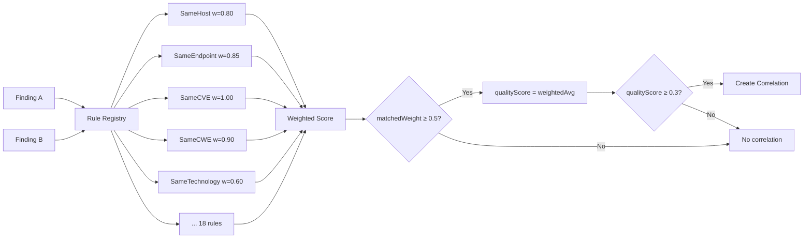
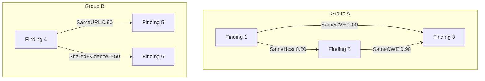
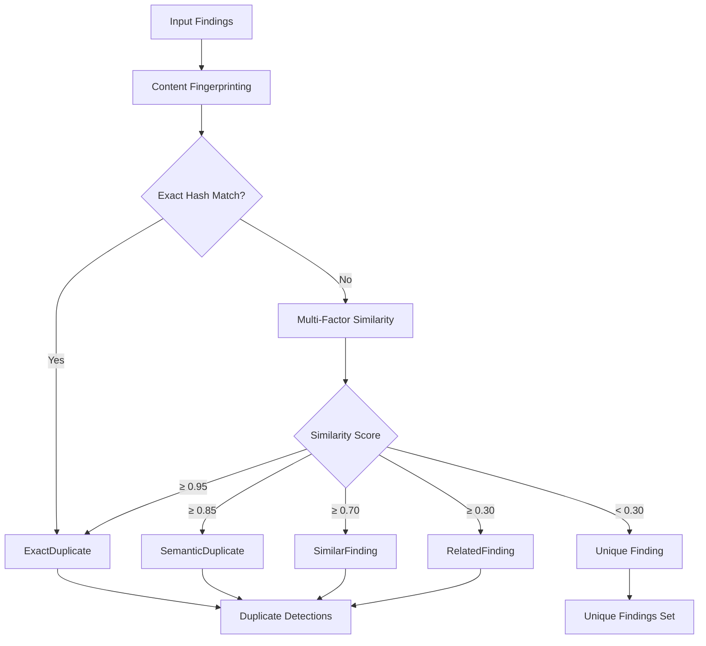
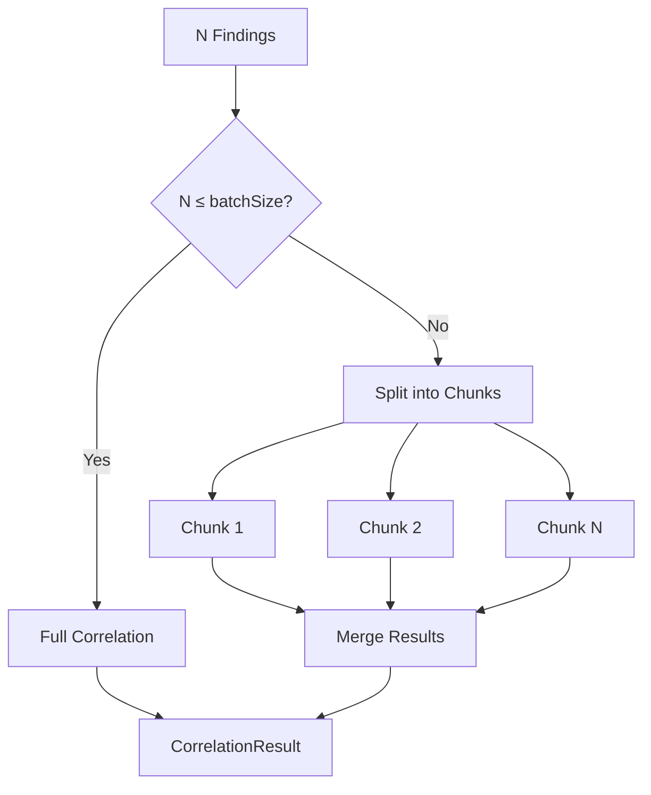
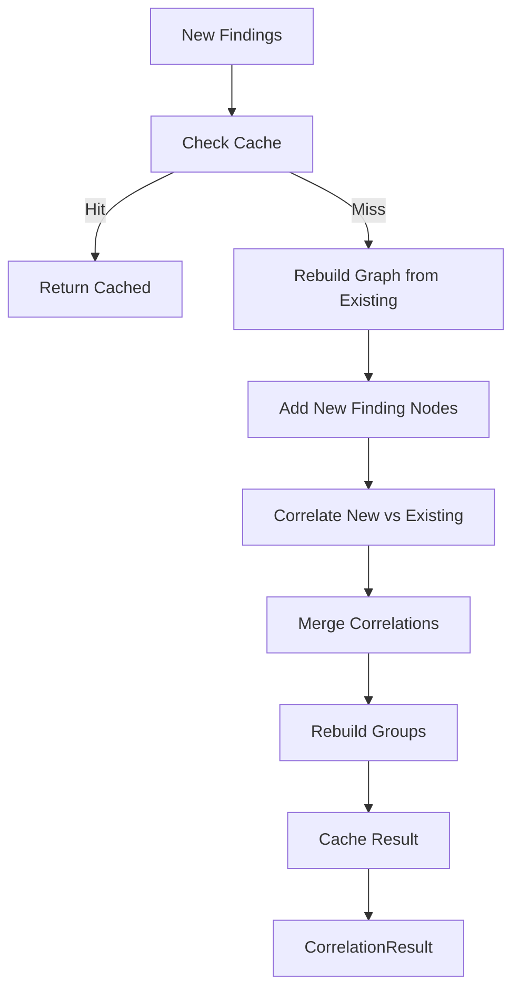
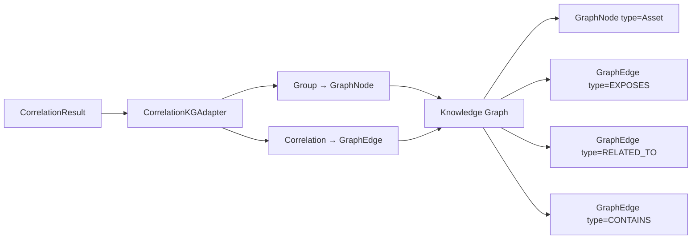

# INT-002B — Security Correlation Engine

## Обзор

Security Correlation Engine — второй слой Security Intelligence Platform. Построен поверх Finding Normalization Engine (INT-002A) и объединяет канонические находки в единую интеллектуальную модель.

**Ключевая цель:** преобразовать набор разрозненных CanonicalFinding в связную корреляционную модель, устраняя дубликаты и выявляя скрытые связи между находками.

## Архитектура

```
┌─────────────────────────────────────────────────────┐
│              Correlation Engine                      │
│                                                     │
│  ┌──────────┐  ┌──────────┐  ┌───────────┐        │
│  │   Rules   │  │  Dedup   │  │   Graph   │        │
│  │  Engine   │  │ Detector │  │  Builder  │        │
│  └────┬─────┘  └────┬─────┘  └─────┬─────┘        │
│       │              │              │                │
│  ┌────┴──────────────┴──────────────┴─────┐        │
│  │          CorrelationEngine              │        │
│  │  correlate() | correlateBatch()        │        │
│  │  incremental() | deduplicate()         │        │
│  │  buildCorrelationGraph()               │        │
│  └────┬───────────────────────────────────┘        │
│       │                                              │
│  ┌────┴─────┐  ┌──────────┐  ┌───────────┐        │
│  │  Cache   │  │  Events  │  │  KG Adapter│        │
│  │  (LRU)   │  │  (5 types)│  │           │        │
│  └──────────┘  └──────────┘  └─────┬─────┘        │
│                                     │                │
└─────────────────────────────────────┼────────────────┘
                                      │
                    ┌─────────────────┴──────────────────┐
                    │       Knowledge Graph Platform      │
                    │   (GraphRepository, QueryEngine)    │
                    └────────────────────────────────────┘
```

## Модели

### Correlation

```typescript
interface Correlation {
  readonly id: CorrelationId;
  readonly sourceFindingId: FindingId;
  readonly targetFindingId: FindingId;
  readonly score: number;           // 0.0–1.0
  readonly reasons: readonly CorrelationReason[];
  readonly evidence: readonly CorrelationEvidence[];
  readonly duplicateType: DuplicateType | null;
  readonly metadata: Metadata;
  readonly createdAt: Timestamp;
}
```

### CorrelationGroup

```typescript
interface CorrelationGroup {
  readonly id: CorrelationGroupId;
  readonly findingIds: readonly FindingId[];
  readonly dominantCategory: FindingCategory;
  readonly dominantSeverity: Severity;
  readonly correlationScore: number;  // 0.0–1.0
  readonly reasons: readonly CorrelationReason[];
  readonly representativeFindingId: FindingId;
  readonly metadata: Metadata;
  readonly createdAt: Timestamp;
}
```

### CorrelationEdge

```typescript
interface CorrelationEdge {
  readonly id: CorrelationEdgeId;
  readonly sourceFindingId: FindingId;
  readonly targetFindingId: FindingId;
  readonly reasons: readonly CorrelationReason[];
  readonly score: number;  // 0.0–1.0
  readonly evidence: readonly CorrelationEvidence[];
  readonly metadata: Metadata;
  readonly createdAt: Timestamp;
}
```

## Mermaid-диаграммы

### 1. Correlation Pipeline



### 2. Rule Engine



### 3. Correlation Graph



### 4. Duplicate Detection



### 5. Batch Flow



### 6. Incremental Flow



### 7. Knowledge Graph Integration



## Корреляционные правила

| Правило | Вес | Описание |
|---------|-----|----------|
| SameCVE | 1.00 | Находки ссылаются на одну и ту же CVE |
| SameURL | 0.90 | Находки разделяют один и тот же URL |
| SameEndpoint | 0.85 | Находки затрагивают один и тот же endpoint |
| SameCWE | 0.90 | Находки ссылаются на один и тот же CWE |
| SameHost | 0.80 | Находки затрагивают один и тот же хост |
| SameIdentity | 0.85 | Находки разделяют одну и ту же identity |
| SharedAuthentication | 0.80 | Находки разделяют контекст аутентификации |
| SameService | 0.75 | Находки затрагивают один и тот же сервис |
| SamePath | 0.70 | Находки разделяют один и тот же URL path |
| SameCertificate | 0.70 | Находки разделяют один и тот же сертификат |
| SharedComponent | 0.70 | Находки разделяют компонент |
| SharedRequest | 0.65 | Находки разделяют один и тот же запрос |
| SharedResponse | 0.65 | Находки разделяют один и тот же ответ |
| SameTechnology | 0.60 | Находки разделяют технологию |
| SharedEvidence | 0.50 | Находки разделяют evidence данные |
| SameHeader | 0.35 | Находки ссылаются на один и тот же header |
| SameCookie | 0.25 | Находки ссылаются на одну и ту же cookie |
| SameSecret | 0.95 | Находки ссылаются на один и тот же секрет |

### Формула скоринга

```
matchedWeightSum = Σ(rule.weight for matched rules)

Если matchedWeightSum < 0.5 → корреляция не создаётся

qualityScore = Σ(rule.weight × rule.score) / matchedWeightSum

Если qualityScore < minCorrelationScore → корреляция не создаётся
```

## Дедупликация

| Тип | Порог | Описание |
|-----|-------|----------|
| ExactDuplicate | ≥ 0.95 | Полный дубликат (одинаковый контент) |
| SemanticDuplicate | ≥ 0.85 | Семантический дубликат (разные слова, та же уязвимость) |
| SimilarFinding | ≥ 0.70 | Похожая находка (значительное пересечение) |
| RelatedFinding | ≥ 0.30 | Связанная находка (слабое пересечение) |

### Факторы сходства

| Фактор | Вес | Описание |
|--------|-----|----------|
| Title similarity | 0.30 | Jaccard similarity на множестве слов |
| CVE overlap | 0.25 | Пересечение множеств CVE |
| CWE overlap | 0.15 | Пересечение множеств CWE |
| Endpoint similarity | 0.15 | Сходство URL |
| Severity match | 0.05 | Совпадение severity |
| Category match | 0.10 | Совпадение категории |

## Публичный API

```typescript
class CorrelationEngine {
  constructor(config?: Partial<CorrelationConfig>);

  // Основные методы
  correlate(findings: readonly CanonicalFinding[]): CorrelationResult;
  correlateBatch(findings: readonly CanonicalFinding[]): CorrelationResult;
  incremental(newFindings: readonly CanonicalFinding[], existingResult: CorrelationResult): CorrelationResult;
  deduplicate(findings: readonly CanonicalFinding[]): DuplicateDetectionResult;
  buildCorrelationGraph(findings: readonly CanonicalFinding[]): CorrelationGraph;

  // Утилиты
  statistics(): CorrelationStatistics;
  reset(): void;

  // Расширения
  readonly ruleRegistry: RuleRegistry;
  readonly kgAdapter: CorrelationKGAdapter;
  readonly eventBus: CorrelationEventBus;
}
```

## События

| Событие | Тип | Данные |
|---------|-----|--------|
| CorrelationStarted | `correlation.started` | findingCount, rulesEnabled, batchSize |
| CorrelationCompleted | `correlation.completed` | totalCorrelations, totalGroups, totalDuplicates, durationMs, throughput |
| CorrelationFailed | `correlation.failed` | findingCount, errors, durationMs |
| DuplicateDetected | `correlation.duplicate.detected` | originalId, duplicateId, type, similarity |
| CorrelationGraphBuilt | `correlation.graph.built` | nodeCount, edgeCount, groupCount, durationMs |

## Cache

- **Тип:** LRU (Least Recently Used)
- **Ёмкость:** настраиваемая (по умолчанию 10,000 записей)
- **TTL:** настраиваемый (по умолчанию 5 минут)
- **Инвалидация:** по ключу, по паттерну, полная очистка
- **Статистика:** hits, misses, hit rate, evictions, expirations

## Knowledge Graph Integration

Адаптер `CorrelationKGAdapter` конвертирует результаты корреляции в форматы Knowledge Graph:

| Correlation Model | KG Model | Edge Type |
|-------------------|----------|-----------|
| CorrelationGroup | GraphNode (Asset) | — |
| Correlation (SameCVE) | GraphEdge | EXPOSES |
| Correlation (SameCWE) | GraphEdge | LEADS_TO |
| Correlation (SameHost) | GraphEdge | HOSTS |
| Correlation (SameEndpoint) | GraphEdge | EXPOSES |
| Correlation (SameTechnology) | GraphEdge | DEPENDS_ON |
| Correlation (other) | GraphEdge | RELATED_TO |
| Group → Finding | GraphEdge | CONTAINS |

## Тестовое покрытие

- **85 тестов** — все pass
- **10 benchmarks** — все pass
- Покрытие: Types, Models, Rules, Deduplication, Graph, Cache, KG Adapter, Engine, Events, Statistics, Edge Cases

## Рекомендации для INT-003 — Security Risk Engine

1. Использовать CorrelationGroup как вход для Risk Engine
2. Вычислять risk score на основе group severity, confidence, и количества корреляций
3. Добавить RiskAssessment модель с risk level, risk factors, и mitigation suggestions
4. Использовать CorrelationGraph для построения Attack Path
5. Реализовать temporal risk assessment (как риск меняется со временем)
6. Добавить risk-based prioritisation для triage
