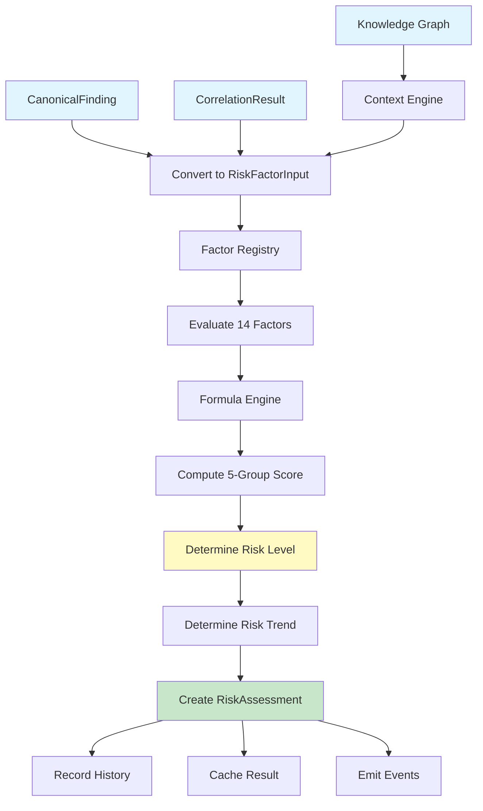
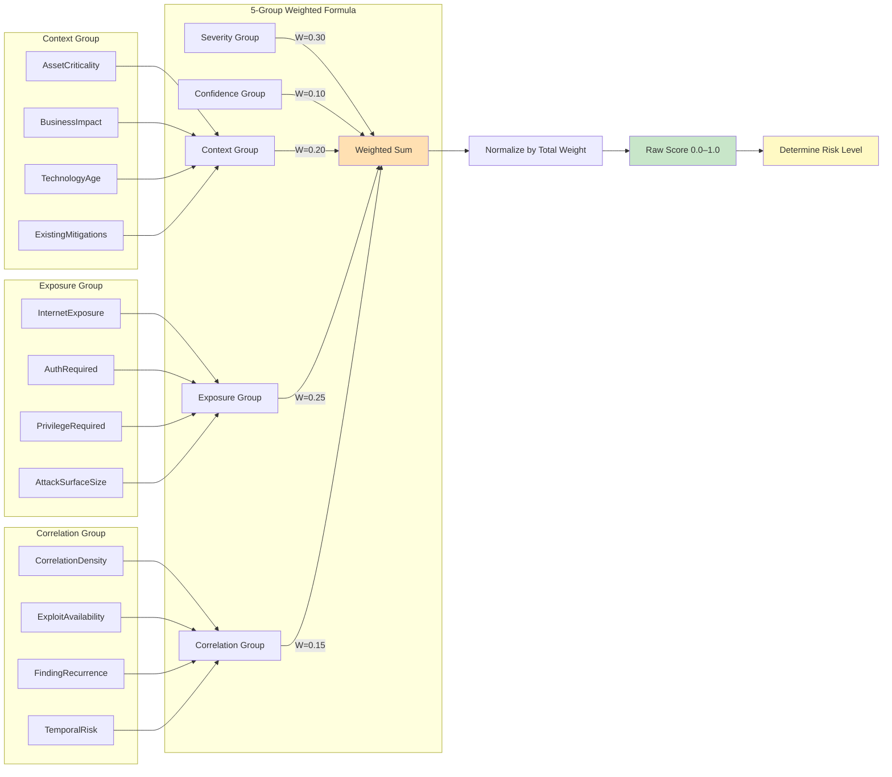
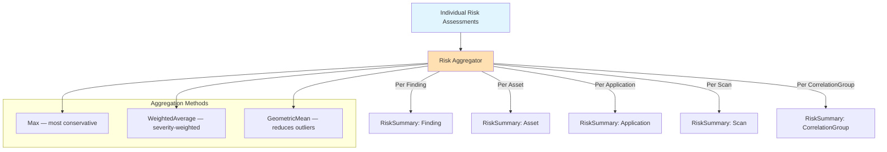
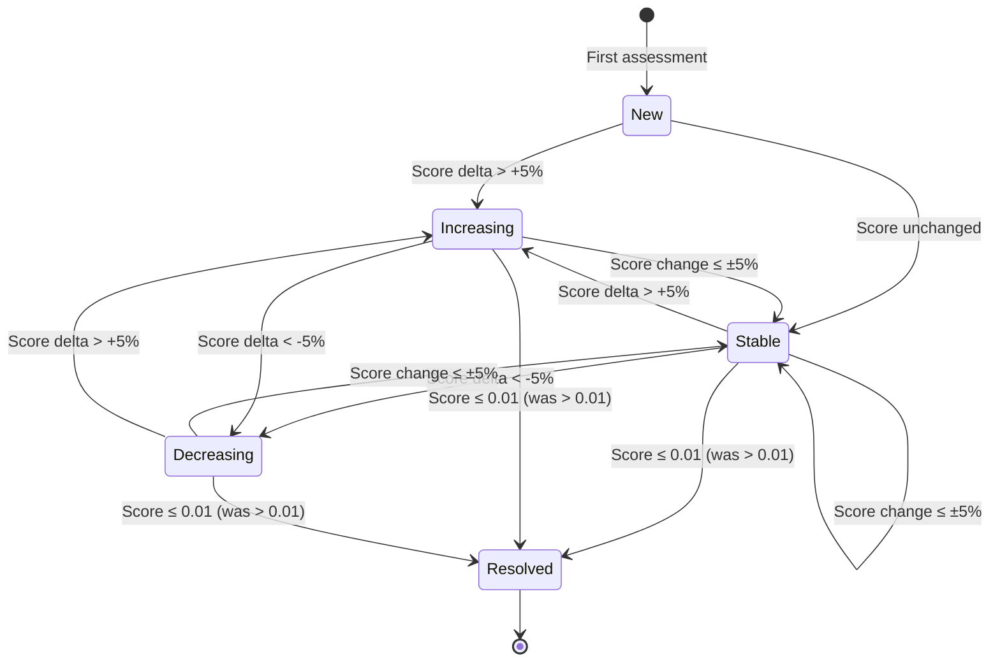
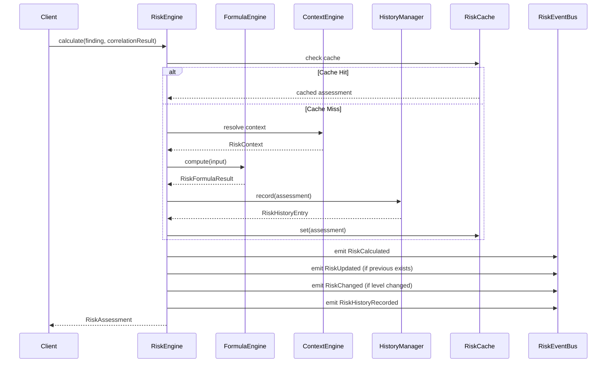
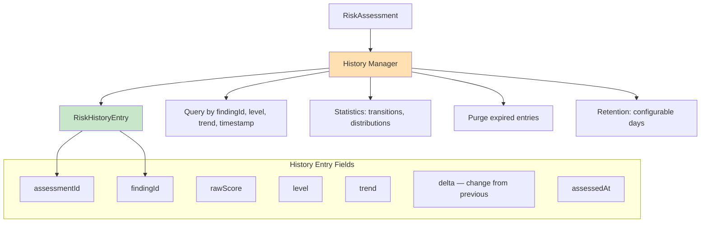

# INT-003 — Security Risk Engine

## Overview

The Security Risk Engine is a deterministic risk assessment component that transforms CorrelationResults, Knowledge Graph context, and Canonical Findings into actionable risk scores. It computes a single Risk score per finding using a configurable 5-group weighted formula, aggregating 14 independent risk factors across severity, confidence, context, exposure, and correlation dimensions.

## Architecture

```
┌──────────────────────────────────────────────────────────────┐
│                    RiskEngine (orchestrator)                  │
│                                                              │
│  ┌──────────┐ ┌──────────┐ ┌──────────┐ ┌──────────────┐   │
│  │  Factor   │ │ Formula  │ │ Context  │ │  Aggregation  │   │
│  │ Registry  │ │  Engine  │ │  Engine  │ │    Engine     │   │
│  │ (14+fac.) │ │ (5-group)│ │ (KG+Heur)│ │ (5 scopes)   │   │
│  └──────────┘ └──────────┘ └──────────┘ └──────────────┘   │
│                                                              │
│  ┌──────────┐ ┌──────────┐ ┌──────────┐ ┌──────────────┐   │
│  │  Events  │ │  History │ │  Cache   │ │  Statistics   │   │
│  │   (4)    │ │ Manager  │ │(LRU+TTL) │ │  Collector    │   │
│  └──────────┘ └──────────┘ └──────────┘ └──────────────┘   │
└──────────────────────────────────────────────────────────────┘
         ▲                ▲                ▲
         │                │                │
  CanonicalFinding  CorrelationResult  Knowledge Graph
```

## Risk Pipeline



## Risk Formula



**Formula:**

```
Risk = (W_sev × Severity + W_conf × Confidence + W_ctx × ContextComposite
      + W_exp × ExposureComposite + W_cor × CorrelationComposite) / W_total
```

Where each composite is the weighted average of its sub-factors.

## Risk Aggregation



## Temporal Risk



## Context Engine

```mermaid
flowchart TD
    FI[RiskFactorInput] --> CE[Context Engine]

    CE --> |"Primary"| KG[Knowledge Graph Source]
    CE --> |"Fallback"| HE[Heuristic Source]

    KG --> |"Node found"| CTX1[Full KG Context]
    KG --> |"Node not found"| HE

    HE --> CTX2[Heuristic Context]

    subgraph "Context Properties"
        P1[internetFacing: boolean]
        P2[internalOnly: boolean]
        P3[isProduction: boolean]
        P4[isDevelopment: boolean]
        P5[isCriticalAsset: boolean]
        P6[authenticationChain: string[]]
        P7[dependencyCount: number]
        P8[dependentAssetCount: number]
    end

    CTX1 --> P1
    CTX2 --> P1

    style CE fill:#ffe0b2
    style KG fill:#e1bee7
    style HE fill:#c8e6c9
```

## Event Flow



## Risk History



## Batch Processing

```mermaid
flowchart LR
    subgraph "Input Sizes"
        I1[100 findings]
        I2[1K findings]
        I3[10K findings]
        I4[100K findings]
    end

    I1 --> B[calculateBatch]
    I2 --> B
    I3 --> B
    I4 --> B

    B --> L[Loop over findings]
    L --> C[calculate each finding]
    C --> CH[Cache check]
    CH --> |"Hit"| SKIP[Return cached]
    CH --> |"Miss"| CALC[Compute risk]
    CALC --> STORE[Cache result]
    STORE --> NEXT[Next finding]
    SKIP --> NEXT

    NEXT --> AGG[Aggregate all results]
    AGG --> OUT[RiskAssessment[]]

    style B fill:#ffe0b2
    style OUT fill:#c8e6c9
```

## Domain Models

| Model | Description | Key Fields |
|-------|-------------|------------|
| `RiskAssessment` | Complete risk assessment for a finding | `id`, `findingId`, `score`, `trend`, `previousScore`, `scope` |
| `RiskScore` | Computed risk score with full provenance | `rawScore`, `level`, `factors[]`, `evidence[]`, `reasons[]` |
| `RiskFactor` | Single factor contribution | `type`, `value`, `weight`, `weightedValue`, `source` |
| `RiskContext` | Knowledge Graph-derived context | `internetFacing`, `isProduction`, `isCriticalAsset`, `authChain` |
| `RiskHistoryEntry` | Historical risk record | `rawScore`, `level`, `trend`, `delta` |
| `RiskSummary` | Aggregated risk summary | `averageScore`, `maxScore`, `levelDistribution`, `topReasons` |

## Risk Levels

| Level | Threshold | Score Range |
|-------|-----------|-------------|
| Informational | 0.00 | 0.00–0.14 |
| Low | 0.15 | 0.15–0.34 |
| Medium | 0.35 | 0.35–0.59 |
| High | 0.60 | 0.60–0.79 |
| Critical | 0.80 | 0.80–1.00 |

## Risk Factors (14 built-in)

| Factor | Group | Default Weight | Description |
|--------|-------|---------------|-------------|
| Severity | Severity | 1.00 | Maps finding severity to 0.0–1.0 |
| Confidence | Confidence | 0.80 | Maps finding confidence to 0.0–1.0 |
| CorrelationDensity | Correlation | 0.70 | Risk increases with correlation count |
| AssetCriticality | Context | 0.90 | Risk increases for critical assets |
| InternetExposure | Exposure | 0.85 | Risk increases for internet-facing |
| AuthenticationRequired | Exposure | 0.60 | Risk increases when no auth required |
| PrivilegeRequired | Exposure | 0.55 | Risk increases with lower privileges |
| ExploitAvailability | Correlation | 0.90 | Risk increases when exploit exists |
| BusinessImpact | Context | 0.85 | Risk increases for business-critical |
| TechnologyAge | Context | 0.40 | Risk increases for outdated tech |
| AttackSurfaceSize | Exposure | 0.50 | Risk increases with more surface |
| ExistingMitigations | Context | 0.65 | Risk decreases with mitigations |
| FindingRecurrence | Correlation | 0.55 | Risk increases for recurring findings |
| TemporalRisk | Correlation | 0.45 | Risk increases for recent disclosures |

## Public API

```typescript
class RiskEngine {
  readonly eventBus: RiskEventBus;

  calculate(finding: CanonicalFinding, correlationResult?: CorrelationResult): RiskAssessment;
  calculateBatch(findings: readonly CanonicalFinding[], correlationResult?: CorrelationResult): readonly RiskAssessment[];
  aggregate(assessments: readonly RiskAssessment[], scope?: AggregationScope, scopeId?: string): RiskSummary;
  aggregateByScope(assessments: readonly RiskAssessment[], scope: AggregationScope): readonly RiskSummary[];
  history(findingId: FindingId): readonly RiskHistoryEntry[];
  statistics(): RiskStatistics;

  get factorRegistry(): FactorRegistry;
  get contextEngine(): ContextEngine;
  get historyManager(): RiskHistoryManager;
  get cacheStatistics(): RiskCacheStatistics;

  reset(): void;
}
```

## Events

| Event | Type | Trigger |
|-------|------|---------|
| `RiskCalculatedEvent` | `risk.calculated` | Risk score computed |
| `RiskUpdatedEvent` | `risk.updated` | Existing score updated |
| `RiskChangedEvent` | `risk.changed` | Risk level changed |
| `RiskHistoryRecordedEvent` | `risk.history.recorded` | History entry recorded |

## Configuration

```typescript
interface RiskEngineConfig {
  readonly engineId: string;                    // Default: 'default'
  readonly formulaConfig: RiskFormulaConfig;    // See formula config
  readonly enableCaching: boolean;              // Default: true
  readonly cacheSize: number;                   // Default: 10,000
  readonly cacheTtlMs: number;                  // Default: 300,000 (5 min)
  readonly batchSize: number;                   // Default: 1,000
  readonly formulaVersion: string;              // Default: '1.0.0'
  readonly historyRetentionDays: number;        // Default: 90
  readonly contextEnabled: boolean;             // Default: true
}
```

## File Structure

```
src/domain/security-intelligence/risk/
├── types/index.ts           — Enums, branded IDs, interfaces
├── models/index.ts          — Factory functions, serialization
├── events/index.ts          — 4 lifecycle events + EventBus
├── factors/index.ts         — 14 built-in factors + FactorRegistry
├── formula/index.ts         — 5-group deterministic formula
├── context/index.ts         — KG + heuristic context resolution
├── aggregation/index.ts     — 5 scopes × 3 methods
├── history/index.ts         — History tracking with queries
├── cache/index.ts           — LRU + TTL cache
├── engine/index.ts          — Main RiskEngine orchestrator
├── statistics/index.ts      — Statistics collector
├── index.ts                 — Public API re-exports
├── __tests__/
│   ├── risk-engine.test.ts  — 84 unit tests
│   ├── risk-coverage.test.ts— 55 coverage tests
│   └── risk-smoke.test.ts   — 10 smoke tests
└── __benchmarks__/
    └── risk-benchmark.test.ts — 12 benchmark tests
```

## Test Results

| Metric | Value |
|--------|-------|
| Total Tests | 161 |
| Unit Tests | 84 |
| Coverage Tests | 55 |
| Smoke Tests | 10 |
| Benchmark Tests | 12 |
| Pass Rate | 100% |

## Benchmark Results

| Benchmark | Threshold | Result |
|-----------|-----------|--------|
| Single finding latency | < 5ms | ✅ Pass |
| Formula evaluation latency | < 2ms | ✅ Pass |
| Throughput (single) | > 500/sec | ✅ Pass |
| Formula throughput | > 1000/sec | ✅ Pass |
| 100 findings batch | < 1s | ✅ Pass |
| 1K findings batch | < 10s | ✅ Pass |
| 10K findings batch | < 60s | ✅ Pass |
| 10K findings memory | < 50MB | ✅ Pass |
| Cache ops/sec | > 10,000 | ✅ Pass |
| 1K aggregation | < 100ms | ✅ Pass |
| All aggregation methods | < 100ms each | ✅ Pass |
| 1K history records | < 50ms | ✅ Pass |

## Dependencies

- **INT-002A Normalization Engine** — provides `CanonicalFinding`, `Severity`, `ConfidenceLevel`, branded IDs
- **INT-002B Correlation Engine** — provides `CorrelationResult`, `CorrelationGroup`, `Correlation`
- **Knowledge Graph** — provides context via public API (optional, with heuristic fallback)

## Constraints

- No modifications to Scan Platform, Pipeline, Knowledge Graph, or Correlation Engine
- No Attack Path Builder implementation
- No Recommendation Engine implementation
