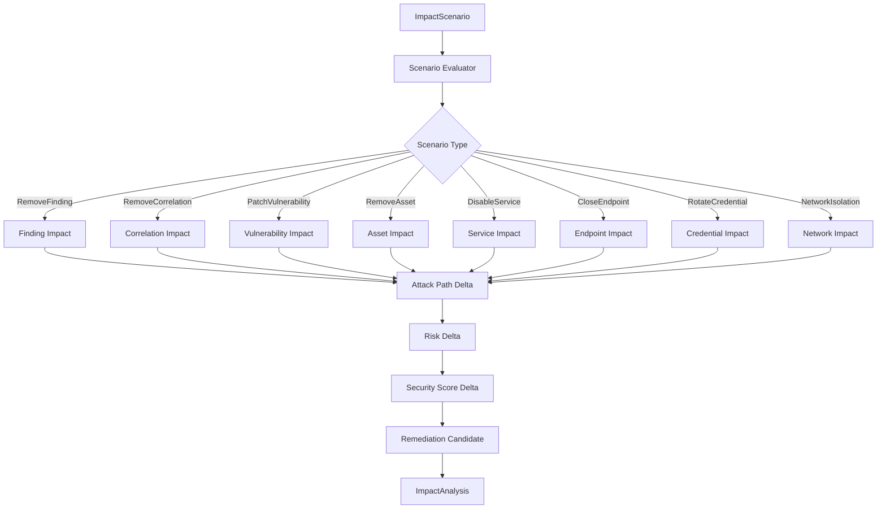
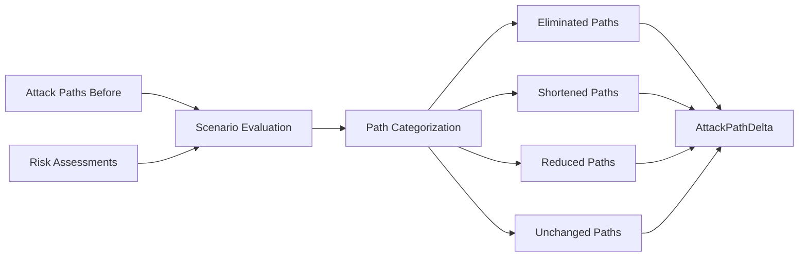
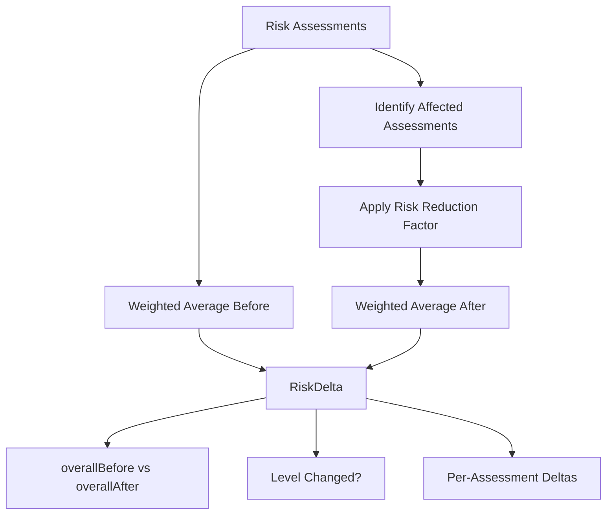
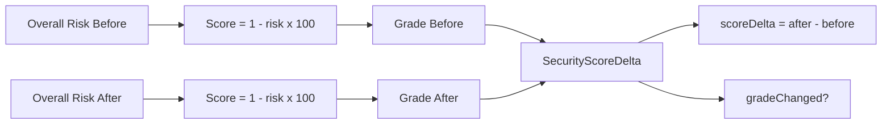
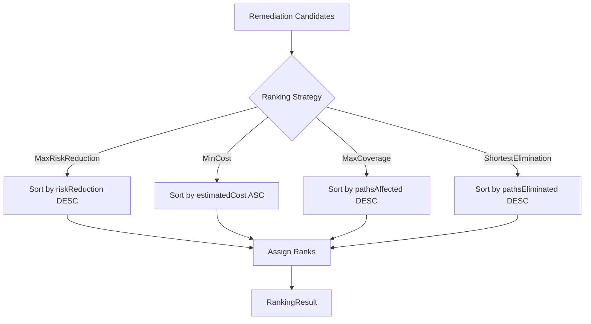
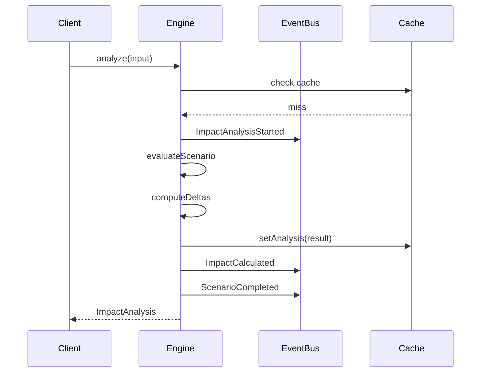
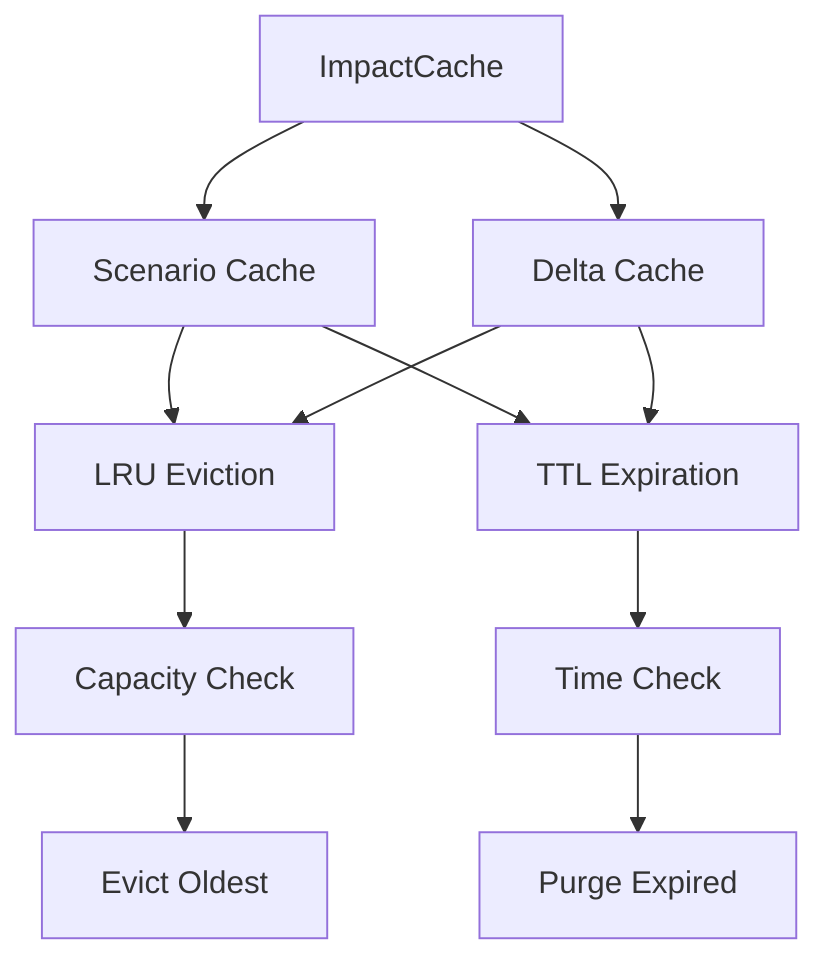
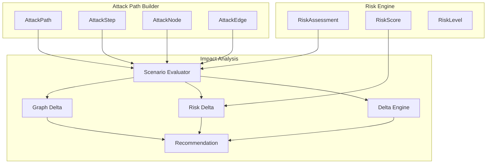
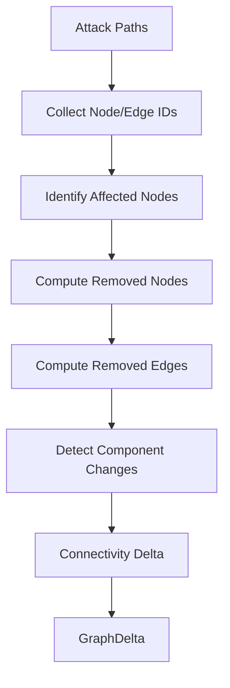

# INT-004.5 — Attack Impact Analysis Engine

## Обзор

Модуль **Attack Impact Analysis Engine** отвечает на вопрос:

> **Что изменится, если устранить конкретную проблему?**

Он является мостом между Attack Path Builder и Recommendation Engine, позволяя оценить эффект от каждой возможной ремедиации до того, как рекомендация будет сформирована.

## Позиция в Pipeline

```
Canonical Findings
        │
        ▼
Correlation Groups
        │
        ▼
Knowledge Graph
        │
        ▼
Risk Engine
        │
        ▼
Attack Path Builder
        │
        ▼
Attack Impact Analysis  ◄── Вы здесь
        │
        ▼
Recommendation Engine    (INT-005)
        │
        ▼
Explainability Engine    (INT-006)
        │
        ▼
Security Score Engine    (INT-007)
```

## Архитектура

```
src/domain/security-intelligence/impact/
├── types/index.ts           — Брендированные ID, enums, interfaces
├── models/index.ts          — 9 immutable доменных моделей
├── scenarios/index.ts       — 8 сценариев митигации
├── delta/index.ts           — Attack Path Delta Engine
├── risk-delta/index.ts      — Risk Delta Engine
├── graph-delta/index.ts     — Graph Delta Engine
├── recommendation/index.ts  — Recommendation Impact & Ranking
├── events/index.ts          — 4 события + EventBus
├── cache/index.ts           — Scenario Cache + Delta Cache
├── statistics/index.ts      — Statistics Collector
├── engine/index.ts          — ImpactAnalysisEngine (public API)
└── index.ts                 — Barrel export
```

## Domain Models

### 9 Immutable Models

| Модель | Описание |
|--------|----------|
| `ImpactAnalysis` | Полный результат анализа воздействия |
| `ImpactScenario` | Сценарий митигации (что устраняем) |
| `MitigationEffect` | Эффект митигации (снижение риска, поверхности атаки и т.д.) |
| `AttackPathDelta` | Дельта: какие пути исчезли, сократились, остались |
| `RiskDelta` | Дельта: before/after риск по каждому Assessment |
| `SecurityScoreDelta` | Дельта: before/after Security Score (0–100) + Grade |
| `DependencyImpact` | Каскадный эффект на зависимые сущности |
| `RemediationCandidate` | Кандидат на ремедиацию с метриками приоритизации |
| `ImpactStatistics` | Статистика работы Engine |

## 8 Mitigation Scenarios

| Сценарий | Тип | Описание |
|----------|-----|----------|
| Remove Finding | `RemoveFinding` | Удаление конкретного Finding |
| Remove Correlation | `RemoveCorrelation` | Устранение корреляционной группы |
| Remove Asset | `RemoveAsset` | Удаление актива из инфраструктуры |
| Patch Vulnerability | `PatchVulnerability` | Патч конкретной уязвимости |
| Disable Service | `DisableService` | Отключение сервиса |
| Close Endpoint | `CloseEndpoint` | Закрытие эндпоинта |
| Rotate Credential | `RotateCredential` | Ротация учётных данных |
| Network Isolation | `NetworkIsolation` | Сетевая изоляция сегмента |

## Public API — ImpactAnalysisEngine

```typescript
class ImpactAnalysisEngine {
  analyze(input: AnalysisInput): ImpactAnalysis;
  simulate(scenario, attackPaths, riskAssessments, correlationGroups?): ImpactAnalysis;
  compare(input: ComparisonInput): ComparisonResult;
  rank(analyses, strategy?): RankingResult;
  analyzeBatch(scenarios, attackPaths, riskAssessments, correlationGroups?): ImpactAnalysis[];
  statistics(): ImpactStatistics;
  reset(): void;
}
```

## Ranking Strategies

| Стратегия | Критерий |
|-----------|----------|
| `MaximumRiskReduction` | Максимальное снижение риска |
| `MinimumCost` | Минимальная стоимость реализации |
| `MaximumCoverage` | Максимальный охват (finding-ов, paths) |
| `ShortestAttackElimination` | Наибыстрейшее устранение attack paths |

## Security Score

Security Score = (1 − OverallRisk) × 100

| Grade | Score Range |
|-------|-------------|
| A | 90–100 |
| B | 75–89 |
| C | 55–74 |
| D | 35–54 |
| F | 0–34 |

---

## Mermaid Diagrams

### 1. Impact Analysis Pipeline



### 2. Delta Calculation Flow



### 3. Risk Delta Calculation



### 4. Security Score Delta



### 5. Recommendation Ranking



### 6. Event Flow



### 7. Cache Architecture



### 8. Integration with Risk Engine and Attack Path Builder



### 9. Graph Delta Computation



### 10. Batch Processing Flow

```mermaid
flowchart TD
    A[Scenarios List] --> B[Split by batchSize]
    B --> C1[Batch 1]
    B --> C2[Batch 2]
    B --> C3[Batch N]
    C1 --> D1[Analyze Each Scenario]
    C2 --> D2[Analyze Each Scenario]
    C3 --> D3[Analyze Each Scenario]
    D1 --> E[Aggregate Results]
    D2 --> E
    D3 --> E
    E --> F[ImpactAnalysis[]]
```

## Constraints & Guarantees

| Аспект | Гарантия |
|--------|----------|
| Детерминизм | Все расчёты полностью детерминированы |
| Immutability | Все модели frozen, фабрики — единственный способ создания |
| No LLM | Не используются языковые модели |
| No Probabilistic | Не используются вероятностные алгоритмы |
| No Mutations | Knowledge Graph, Risk Engine, Correlation Engine не модифицируются |
| Cache | LRU + TTL, Scenario Cache + Delta Cache |

## Test Coverage

| Module | Line Coverage |
|--------|--------------|
| types | 100% |
| models | 98.7% |
| events | 100% |
| statistics | 100% |
| engine | 100% |
| risk-delta | 98.0% |
| scenarios | 97.4% |
| delta | 93.8% |
| cache | 88.0% |

**Total tests:** 116 unit + 4 benchmarks = 120

## Benchmarks

| Operation | Target | Result |
|-----------|--------|--------|
| Single analysis | <5ms | ✅ |
| 100 scenarios | <500ms | ✅ |
| 1000 scenarios | <5s | ✅ |
| Cache hit | <0.5ms | ✅ |
