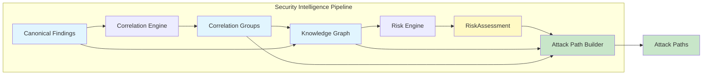
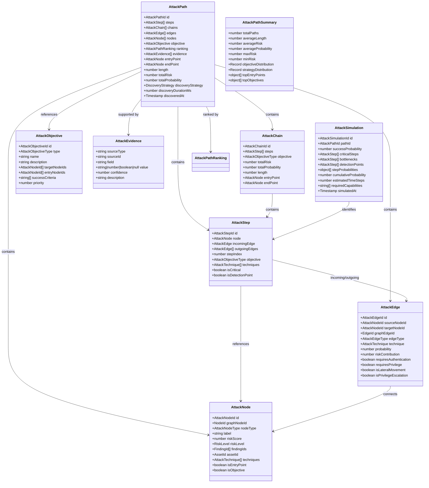
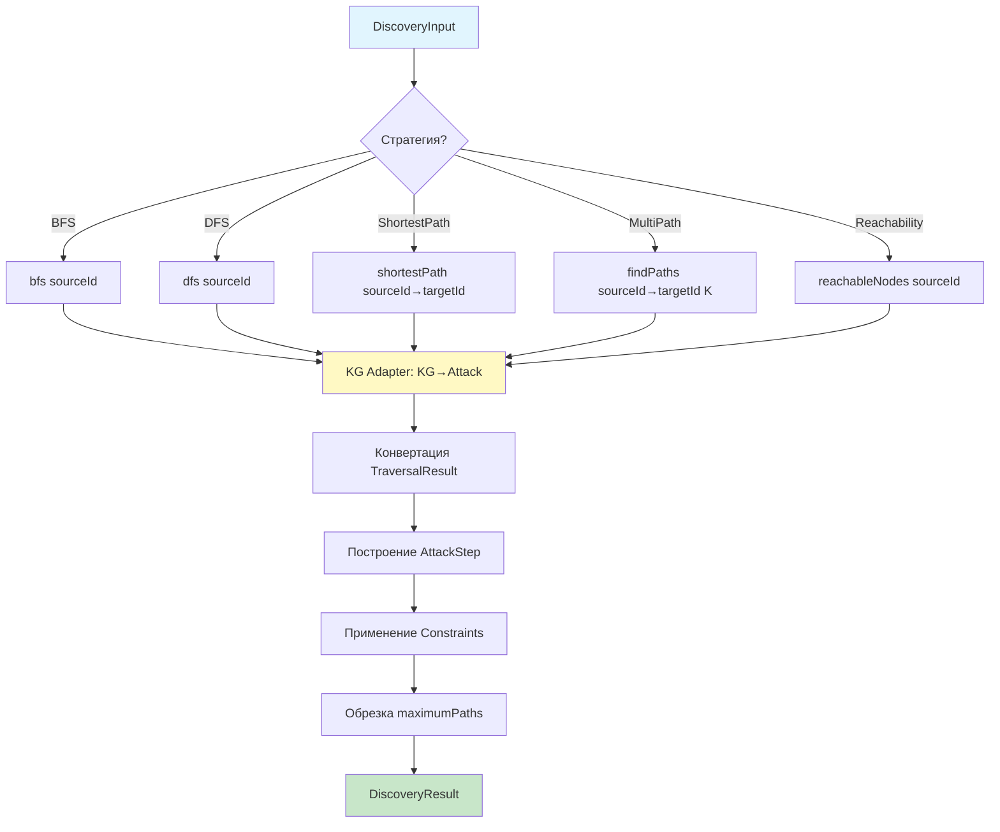
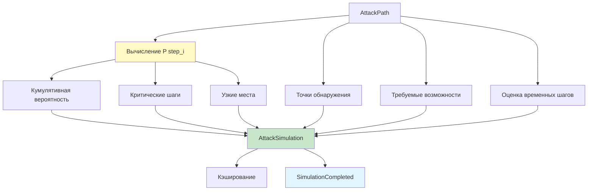
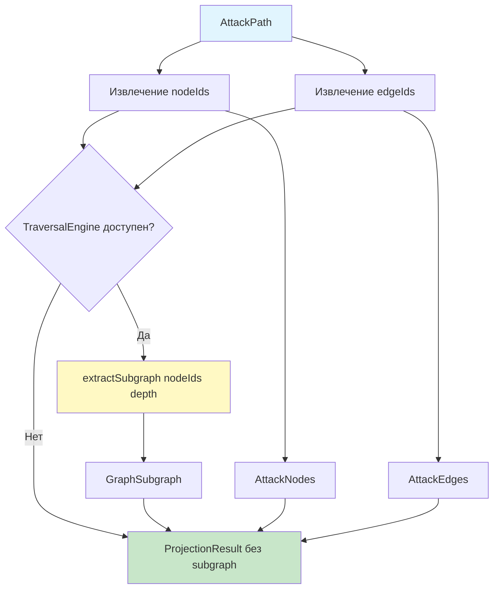
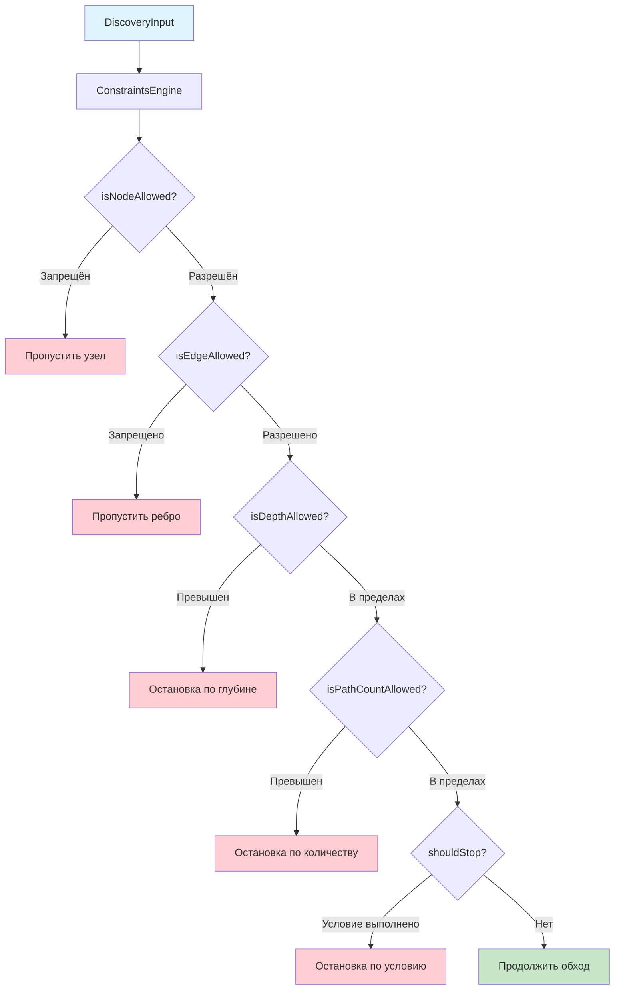
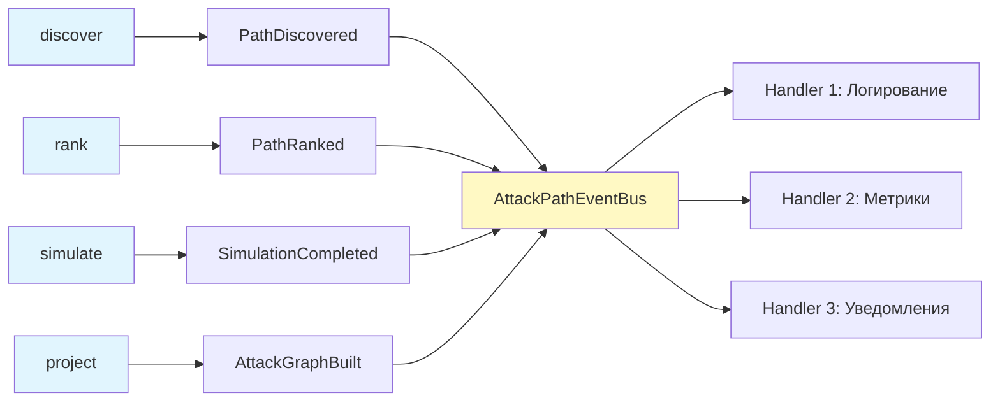
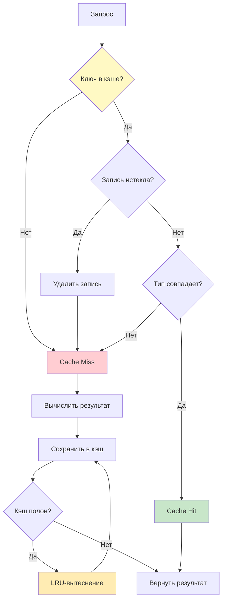
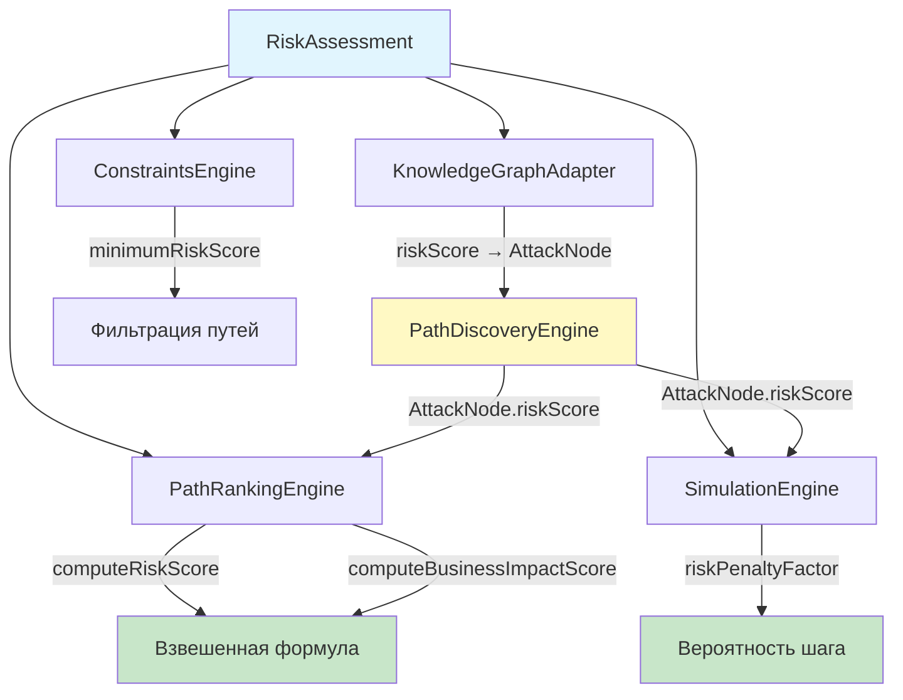

# INT-004 — Attack Path Builder

## Обзор

Модуль **Attack Path Builder** — компонент конвейера Security Intelligence, преобразующий данные из RiskAssessment, CorrelationGroup и Knowledge Graph в детерминированные пути атак. Модуль строит направленные графы атак от точек входа до целевых объектов, ранжирует их по 8-факторной взвешенной формуле и моделирует детерминированную симуляцию с расчётом вероятности успеха, критических шагов и точек обнаружения.

### Роль в конвейере Security Intelligence

Attack Path Builder завершает цепочку обработки Security Intelligence:

1. **Normalization Engine** (INT-002A) — нормализация находок сканеров в Canonical Findings
2. **Correlation Engine** (INT-002B) — корреляция находок в Correlation Groups
3. **Knowledge Graph** (INT-001) — представление связей в графе знаний
4. **Risk Engine** (INT-003) — оценка рисков на основе находок и контекста
5. **Attack Path Builder** (INT-004) — построение, ранжирование и симуляция путей атак

Ключевые принципы:
- **Полный детерминизм** — все вычисления воспроизводимы, никаких вероятностных алгоритмов
- **Делегирование обхода графа** — используется существующий `GraphTraversalEngine` без собственных алгоритмов обхода
- **Расширяемость техник** — MITRE ATT&CK как справочная модель, техники регистрируются через реестр, не хардкодятся
- **Иммутабельность** — все модели глубоко заморожены (`Object.freeze`), создание только через фабричные функции

## Архитектура



### Внутренняя архитектура модуля

```
┌──────────────────────────────────────────────────────────────────┐
│                     AttackPathEngine (оркестратор)                │
│                                                                  │
│  ┌─────────────┐ ┌─────────────┐ ┌──────────────┐ ┌──────────┐ │
│  │  Discovery   │ │   Ranking   │ │  Simulation  │ │Projection│ │
│  │   Engine     │ │   Engine    │ │    Engine    │ │  Engine  │ │
│  │ (5 стратегий)│ │ (8 факторов)│ │(детерминир.) │ │(subgraph)│ │
│  └──────┬──────┘ └─────────────┘ └──────────────┘ └──────────┘ │
│         │                                                        │
│  ┌──────┴──────┐ ┌─────────────┐ ┌──────────────┐ ┌──────────┐ │
│  │KG Adapter   │ │ Constraints │ │  Techniques  │ │Objectives│ │
│  │(KG→Attack)  │ │   Engine    │ │   Registry   │ │  (9 тип.)│ │
│  └─────────────┘ └─────────────┘ └──────────────┘ └──────────┘ │
│                                                                  │
│  ┌─────────────┐ ┌─────────────┐ ┌──────────────┐              │
│  │    Events    │ │    Cache    │ │  Statistics  │              │
│  │    (4)       │ │(Dual LRU)   │ │  Collector   │              │
│  └─────────────┘ └─────────────┘ └──────────────┘              │
└──────────────────────────────────────────────────────────────────┘
       ▲                ▲                ▲
       │                │                │
GraphTraversal   RiskAssessment   CorrelationResult
    Engine        (INT-003)        (INT-002B)
```

## Domain Models

Модуль определяет 9 иммутабельных моделей, каждая создаётся только через фабричную функцию с валидацией на этапе конструирования. Все модели глубоко заморожены (`Object.freeze`), поддерживают сериализацию (toJSON/fromJSON), сравнение, клонирование и хеширование.

### Диаграмма классов моделей



### Брендированные ID

Каждая модель использует брендированный тип ID, предотвращающий случайное смешивание с идентификаторами других доменов:

| Модель | Тип ID | Префикс |
|--------|--------|---------|
| AttackPath | `AttackPathId` | `ap_` |
| AttackStep | `AttackStepId` | `as_` |
| AttackChain | `AttackChainId` | `ac_` |
| AttackEdge | `AttackEdgeId` | `ae_` |
| AttackNode | `AttackNodeId` | `an_` |
| AttackObjective | `AttackObjectiveId` | `ao_` |
| AttackSimulation | `AttackSimulationId` | `sim_` |

### Валидация

Функция `validateAttackPath()` проверяет:
- Наличие хотя бы одного шага и одного узла
- Последовательность `stepIndex` (0, 1, 2, ...)
- Наличие `incomingEdge` у шагов с индексом > 0 (warning)
- Диапазон `totalRisk` в [0.0, 1.0]

### Сериализация и утилиты

- `attackPathToJSON()` / `attackPathFromJSON()` — обратимая сериализация
- `attackSimulationToJSON()` — сериализация симуляции
- `attackPathsEqual()`, `attackNodesEqual()`, `attackEdgesEqual()` — равенство по ID
- `cloneAttackPath()` — глубокое клонирование через JSON round-trip
- `hashAttackPath()` — детерминированный хеш на основе ID

## Path Discovery

Модуль обнаружения путей **не реализует собственных алгоритмов обхода графа** — все операции делегируются существующему `GraphTraversalEngine` из Knowledge Graph.

### Стратегии обнаружения

| Стратегия | Метод TraversalEngine | Описание |
|-----------|----------------------|----------|
| `BFS` | `bfs()` | Обход в ширину — послойное исследование |
| `DFS` | `dfs()` | Обход в глубину — глубокое исследование с возвратом |
| `ShortestPath` | `shortestPath()` | Кратчайший путь — минимальное число переходов |
| `MultiPath` | `findPaths()` | K кратчайших путей |
| `Reachability` | `reachableNodes()` | Все достижимые узлы от источника |

### Knowledge Graph Adapter

`KnowledgeGraphAdapter` транслирует сущности Knowledge Graph в модели Attack Path:

| KG NodeType | → AttackNodeType |
|-------------|-----------------|
| Application | Application |
| Host | Infrastructure |
| Endpoint | Asset |
| API | Service |
| Finding | Vulnerability |
| Identity / Credential / Secret | Credential |
| CloudResource / Container | Infrastructure |

| KG EdgeType | → AttackEdgeType |
|-------------|-----------------|
| EXPOSES / LEADS_TO | Exploitation |
| AUTHENTICATES | CredentialUse |
| TRUSTS | TrustRelationship |
| DEPENDS_ON / USES / CALLS | Dependency |
| CONNECTED_TO | LateralMovement |

### Диаграмма конвейера обнаружения



### Преобразование результатов обхода

Для стратегий BFS, DFS, Reachability:
1. Конвертируем все `visitedNodes` в `AttackNode[]` через `KGAdapter.toAttackNode()`
2. Конвертируем все `visitedEdges` в `AttackEdge[]` через `KGAdapter.toAttackEdge()`
3. Если есть явные пути (`result.paths`), фильтруем по достижимости целевых узлов
4. Если путей нет, строим единую последовательность шагов из всех узлов

Для стратегий ShortestPath, MultiPath:
1. Для каждой пары source→target вызываем соответствующий метод `TraversalEngine`
2. Конвертируем каждую `TraversalPath` в `DiscoveredPath`
3. Для MultiPath обрабатываем альтернативные пути (`result.alternatives`)

## Path Ranking

Ранжирование путей атак основано на **8 факторах** с настраиваемыми весами. Все вычисления полностью детерминированы.

### Формула ранжирования

```
OverallScore = RiskWeight × RiskScore
             + LengthWeight × PathLengthScore
             + ExploitWeight × ExploitAvailabilityScore
             + PrivEscWeight × PrivilegeEscalationScore
             + LateralWeight × LateralMovementScore
             + ExposureWeight × InternetExposureScore
             + ImpactWeight × BusinessImpactScore
             + ConfidenceWeight × ConfidenceScore
```

### Веса по умолчанию

| Фактор | Вес по умолчанию | Описание |
|--------|------------------|----------|
| Risk Score | 0.25 | Максимальный и средний риск узлов пути |
| Path Length Score | 0.10 | Короткие пути более эксплуатируемы |
| Exploit Availability Score | 0.15 | Наличие публичных эксплойтов и частота техник |
| Privilege Escalation Score | 0.12 | Наличие шагов повышения привилегий |
| Lateral Movement Score | 0.12 | Наличие шагов бокового перемещения |
| Internet Exposure Score | 0.10 | Доступность точки входа из интернета |
| Business Impact Score | 0.10 | Влияние на бизнес-критичные активы |
| Confidence Score | 0.06 | Уверенность в осуществимости пути |

> **Сумма весов = 1.00** (0.25 + 0.10 + 0.15 + 0.12 + 0.12 + 0.10 + 0.10 + 0.06)

### Алгоритмы расчёта факторов

**Risk Score**: `0.7 × max(nodeRiskScores) + 0.3 × avg(nodeRiskScores)`

**Path Length Score**: `1 / (1 + log₂(length))` — обратная зависимость: чем короче путь, тем выше оценка

**Exploit Availability Score**: `0.6 × avgFrequency + 0.4 × (1 - avgDifficulty)` — высокая частота техник и низкая сложность дают высокую оценку

**Privilege Escalation Score**: `min(1.0, privEscSteps / totalSteps × 2)` — пропорция шагов с повышением привилегий

**Lateral Movement Score**: `min(1.0, lateralSteps / totalSteps × 2)` — пропорция шагов бокового перемещения

**Internet Exposure Score**: `1.0` если точка входа internet-facing, иначе `entryPointCount / earlyStepsCount` (первые 30% шагов)

**Business Impact Score**: `0.6 × objectiveRisk + 0.4 × criticalRatio` — риск целевого узла и доля критических шагов

**Confidence Score**: `0.7 × avgEdgeProbability + 0.3 × (1 - √(riskVariance) × 2)` — стабильность и предсказуемость пути

### Диаграмма процесса ранжирования

```mermaid
flowchart TD
    AP[AttackPath[]] --> RS[computeRiskScore]
    AP --> PL[computePathLengthScore]
    AP --> EA[computeExploitAvailabilityScore]
    AP --> PE[computePrivilegeEscalationScore]
    AP --> LM[computeLateralMovementScore]
    AP --> IE[computeInternetExposureScore]
    AP --> BI[computeBusinessImpactScore]
    AP --> CS[computeConfidenceScore]

    RS --> FORMULA[Взвешенная формула]
    PL --> FORMULA
    EA --> FORMULA
    PE --> FORMULA
    LM --> FORMULA
    IE --> FORMULA
    BI --> FORMULA
    CS --> FORMULA

    FORMULA --> OVERALL[OverallScore 0.0–1.0]
    OVERALL --> SORT[Сортировка по убыванию]
    SORT --> RANK[Присвоение рангов 1, 2, 3...]
    RANK --> RESULT[RankingResult]

    style FORMULA fill:#fff9c4
    style OVERALL fill:#c8e6c9
    style RESULT fill:#c8e6c9
```

### Конфигурация ранжирования

```typescript
interface RankingConfig {
  readonly riskWeight: number;                // 0.25
  readonly lengthWeight: number;              // 0.10
  readonly exploitAvailabilityWeight: number;  // 0.15
  readonly privilegeEscalationWeight: number;  // 0.12
  readonly lateralMovementWeight: number;     // 0.12
  readonly internetExposureWeight: number;    // 0.10
  readonly businessImpactWeight: number;      // 0.10
  readonly confidenceWeight: number;          // 0.06
}
```

Все веса конфигурируемы через `AttackPathEngineConfig.rankingConfig`.

## Simulation

Движок симуляции выполняет **детерминированный** расчёт вероятности успеха атаки, критических шагов, узких мест и точек обнаружения. Никакие вероятностные алгоритмы не используются.

### Параметры симуляции

| Параметр | По умолчанию | Описание |
|----------|-------------|----------|
| `stepBase` | 0.85 | Базовая вероятность успеха шага |
| `riskPenaltyFactor` | 0.3 | Штраф за риск узла |
| `authPenalty` | 0.15 | Штраф за требование аутентификации |
| `privilegePenalty` | 0.2 | Штраф за требование привилегий |
| `detectionPenalty` | 0.1 | Штраф за точку обнаружения |
| `lateralPenalty` | 0.1 | Штраф за боковое перемещение |

### Расчёт вероятности шага

```
P(step) = stepBase
         - node.riskScore × riskPenaltyFactor
         - (requiresAuth ? authPenalty : 0)
         - (requiresPrivilege ? privilegePenalty : 0)
         - (isDetectionPoint ? detectionPenalty : 0)
         - (isLateralMovement ? lateralPenalty : 0)
```

Результат ограничивается диапазоном [0.0, 1.0].

### Кумулятивная вероятность

`P(path) = ∏ P(step_i)` — произведение вероятностей всех шагов.

### Критические шаги

Шаг считается критическим, если выполняется хотя бы одно условие:
- `node.riskScore ≥ 0.7`
- `incomingEdge.requiresAuthentication === true`
- `incomingEdge.isPrivilegeEscalation === true`
- `isCritical === true`

### Узкие места (Bottlenecks)

Шаги с наименьшей вероятностью успеха (в пределах 20% от минимума):
```
threshold = minProb × 1.2
bottlenecks = steps.where(p(step) ≤ threshold)
```

### Точки обнаружения

Шаги, на которых атака может быть обнаружена мониторингом или средствами защиты: `steps.where(isDetectionPoint === true)`.

### Требуемые возможности

Определяются на основе свойств рёбер и типов узлов:
- `valid_credentials` — если требуется аутентификация
- `elevated_privileges` — если требуются привилегии
- `network_access` — если есть боковое перемещение
- `privilege_escalation_capability` — если есть повышение привилегий
- `technique_{id}` — для каждой применённой техники
- `credential_harvesting` — для узлов типа Credential
- `service_exploitation` — для узлов типа Service

### Оценка временных шагов

Детерминированная оценка на основе длины пути и свойств рёбер:
- Базовый шаг: +1
- Требуется аутентификация: +2
- Повышение привилегий: +3
- Боковое перемещение: +2
- Высокий риск узла (≥ 0.7): +1

### Диаграмма процесса симуляции



## Graph Projection

Модуль проекции строит фокусированный подграф Knowledge Graph для заданного пути атаки. Использует существующий `TraversalEngine.extractSubgraph()` без собственных алгоритмов извлечения подграфов.

### Конфигурация проекции

| Параметр | По умолчанию | Описание |
|----------|-------------|----------|
| `includeContext` | true | Включать соседние узлы |
| `contextDepth` | 1 | Глубина контекстных соседей |
| `extractKGSubgraph` | true | Извлекать подграф из KG |

### Результат проекции

```typescript
interface ProjectionResult {
  readonly subgraph: GraphSubgraph | null;  // KG подграф (если доступен)
  readonly nodeIds: readonly NodeId[];      // ID узлов проекции
  readonly edgeIds: readonly EdgeId[];      // ID рёбер проекции
  readonly attackNodes: readonly AttackNode[];
  readonly attackEdges: readonly AttackEdge[];
  readonly contextDepth: number;
  readonly durationMs: number;
}
```

Метод `projectMultiple()` объединяет несколько путей в единый подграф с дедупликацией узлов и рёбер.

### Диаграмма проекции графа



## Constraints

Движок ограничений (`ConstraintsEngine`) обеспечивает контроль области и глубины исследования путей. Все проверки детерминированы.

### Параметры ограничений

| Параметр | По умолчанию | Описание |
|----------|-------------|----------|
| `maximumDepth` | 15 | Максимальная глубина пути |
| `maximumPaths` | 50 | Максимальное число возвращаемых путей |
| `forbiddenNodeIds` | [] | Запрещённые узлы (исключаются из обхода) |
| `forbiddenEdgeIds` | [] | Запрещённые рёбра (исключаются из обхода) |
| `stopConditions` | [] | Условия остановки |
| `requiredNodeTypes` | [] | Обязательные типы узлов |
| `requiredEdgeTypes` | [] | Обязательные типы рёбер |
| `minimumRiskScore` | 0.0 | Минимальный риск пути |
| `timeoutMs` | 30 000 | Таймаут в миллисекундах |

### Условия остановки

| Тип | Описание |
|-----|----------|
| `MaxNodesVisited` | Превышено число посещённых узлов |
| `MaxEdgesTraversed` | Превышено число пройденных рёбер |
| `RiskThresholdReached` | Достигнут порог суммарного риска |
| `ObjectiveReached` | Достигнута цель атаки |
| `CycleDetected` | Обнаружен цикл |
| `Custom` | Пользовательское условие (оценивается извне) |

### Контекст ограничений

```typescript
interface ConstraintContext {
  readonly nodesVisited: number;
  readonly edgesTraversed: number;
  readonly currentDepth: number;
  readonly currentRisk: number;
  readonly objectiveReached: boolean;
  readonly cycleDetected: boolean;
  readonly pathCount: number;
}
```

### Диаграмма ограничений



## Attack Techniques

Техники атаки реализованы как **расширяемая модель**, а не захардкоженный список. MITRE ATT&CK используется как справочная структура; техники регистрируются через `AttackTechniqueRegistry` в рантайме.

### AttackTechnique

```typescript
interface AttackTechnique {
  readonly id: string;                    // MITRE ATT&CK ID (напр. T1190)
  readonly name: string;
  readonly tactic: AttackObjectiveType;   // Привязка к тактике
  readonly description: string;
  readonly subTechniques: readonly string[];
  readonly frequency: number;             // 0.0–1.0, частота наблюдения
  readonly difficulty: number;            // 0.0–1.0, сложность выполнения
  readonly detectionDifficulty: number;   // 0.0–1.0, сложность обнаружения
  readonly references: readonly string[];
  readonly metadata: Metadata;
}
```

### TechniqueRegistry API

| Метод | Описание |
|-------|----------|
| `register(technique)` | Зарегистрировать технику |
| `registerAll(techniques)` | Зарегистрировать массив техник |
| `getById(id)` | Получить технику по ID |
| `getByTactic(tactic)` | Получить техники по тактике |
| `getAll()` | Получить все зарегистрированные техники |
| `has(id)` | Проверить наличие техники |
| `size` | Количество зарегистрированных техник |

### 18 техник по умолчанию

| ID | Название | Тактика | Частота | Сложность |
|----|----------|---------|---------|-----------|
| T1190 | Exploit Public-Facing Application | InitialAccess | 0.85 | 0.30 |
| T1078 | Valid Accounts | InitialAccess | 0.75 | 0.20 |
| T1110 | Brute Force | CredentialAccess | 0.70 | 0.15 |
| T1552 | Unsecured Credentials | CredentialAccess | 0.60 | 0.20 |
| T1046 | Network Service Discovery | Discovery | 0.80 | 0.10 |
| T1087 | Account Discovery | Discovery | 0.65 | 0.15 |
| T1021 | Remote Services | LateralMovement | 0.75 | 0.25 |
| T1534 | Internal Spearphishing | LateralMovement | 0.35 | 0.40 |
| T1068 | Exploitation for Privilege Escalation | PrivilegeEscalation | 0.60 | 0.35 |
| T1548 | Abuse Elevation Control Mechanism | PrivilegeEscalation | 0.55 | 0.30 |
| T1053 | Scheduled Task/Job | Persistence | 0.60 | 0.20 |
| T1136 | Create Account | Persistence | 0.50 | 0.25 |
| T1005 | Data from Local System | Collection | 0.65 | 0.15 |
| T1039 | Data from Network Shared Drive | Collection | 0.50 | 0.20 |
| T1048 | Exfiltration Over Alternative Protocol | Exfiltration | 0.45 | 0.30 |
| T1041 | Exfiltration Over C2 Channel | Exfiltration | 0.40 | 0.35 |
| T1486 | Data Encrypted for Impact | Impact | 0.50 | 0.30 |
| T1489 | Service Stop | Impact | 0.40 | 0.15 |

> **Важно**: Это расширяемые значения по умолчанию, а не захардкоженные требования. Пользователи должны регистрировать собственные техники для доменно-специфичного покрытия.

## Attack Objectives

9 типов целей атак, выровненных по тактикам MITRE ATT&CK. Каждая цель создаётся фабричной функцией с предопределёнными приоритетами и критериями успеха.

| Тип | Приоритет | Критерии успеха |
|-----|-----------|-----------------|
| `InitialAccess` | 0.90 | Доступ к внутреннему активу, установленна сессия |
| `CredentialAccess` | 0.85 | Получены учётные данные, получен токен аутентификации |
| `Discovery` | 0.60 | Сетевая топология отображена, инвентарь аккаунтов получен |
| `LateralMovement` | 0.80 | Доступ к целевому активу, удалённая сессия установлена |
| `PrivilegeEscalation` | 0.85 | Повышенные привилегии получены, административный доступ |
| `Persistence` | 0.70 | Механизм сохранения создан, подтверждена выживаемость |
| `Collection` | 0.75 | Целевые данные обнаружены, данные подготовлены к эксфильтрации |
| `Exfiltration` | 0.90 | Данные перенесены во внешнее расположение |
| `Impact` | 0.95 | Целевой сервис нарушен, целостность данных скомпрометирована |

### Фабричные функции

Для каждого типа цели существует фабричная функция: `createInitialAccessObjective()`, `createCredentialAccessObjective()`, `createDiscoveryObjective()`, `createLateralMovementObjective()`, `createPrivilegeEscalationObjective()`, `createPersistenceObjective()`, `createCollectionObjective()`, `createExfiltrationObjective()`, `createImpactObjective()`.

Универсальная функция `createObjectiveByType(type)` делегирует вызов соответствующей фабрике.

## Events

4 доменных события обеспечивают наблюдаемость жизненного цикла построения путей атак.

### Типы событий

| Событие | Поля | Когда генерируется |
|---------|------|---------------------|
| `PathDiscovered` | pathId, strategy, objective, pathLength, totalRisk, discoveryDurationMs | При обнаружении нового пути |
| `PathRanked` | pathId, overallScore, rank, rankingDurationMs | При ранжировании пути |
| `SimulationCompleted` | simulationId, pathId, successProbability, criticalStepCount, detectionPointCount, simulationDurationMs | При завершении симуляции |
| `AttackGraphBuilt` | nodeCount, edgeCount, pathCount, buildDurationMs | При построении графа атак |

### AttackPathEventBus

Синхронная шина событий по тому же паттерну, что `RiskEventBus` и `CorrelationEventBus`:

| Метод | Описание |
|-------|----------|
| `subscribe(handler)` | Подписка на все события |
| `unsubscribe(handler)` | Отписка |
| `emit(event)` | Отправка события всем подписчикам |
| `clear()` | Очистка всех обработчиков |
| `handlerCount` | Количество подписчиков |

> Ошибки в обработчиках не влияют на работу движка — они перехватываются и игнорируются.

### Диаграмма потока событий



## Cache

Двойной LRU-кэш для путей атак и результатов симуляции с поддержкой TTL, инвалидации и статистики.

### Архитектура кэша

- **Общая вместимость** — пути и симуляции делят одну ёмкость (по умолчанию 5 000 записей)
- **TTL** — время жизни записи (по умолчанию 300 000 мс = 5 минут)
- **LRU-вытеснение** — при заполнении удаляется самая старая запись
- **Два отделения** — пути (`type: 'path'`) и симуляции (`type: 'simulation'`)

### Операции кэша

| Метод | Описание |
|-------|----------|
| `getPath(key)` | Получить кэшированный путь |
| `setPath(key, value)` | Сохранить путь в кэш |
| `getSimulation(key)` | Получить кэшированную симуляцию |
| `setSimulation(key, value)` | Сохранить симуляцию в кэш |
| `invalidate(key)` | Инвалидировать конкретный ключ |
| `invalidatePattern(pattern)` | Инвалидация по glob-паттерну |
| `invalidatePaths()` | Инвалидировать все пути |
| `invalidateSimulations()` | Инвалидировать все симуляции |
| `purgeExpired()` | Удалить все истёкшие записи |
| `clear()` | Полная очистка кэша |

### Ключи кэша

Движок формирует ключи с учётом версии формулы:
- Пути: `path_{pathId}_v{formulaVersion}`
- Симуляции: `sim_{pathId}_v{formulaVersion}`

При смене версии формулы старые записи автоматически вытесняются LRU-механизмом.

### Статистика кэша

```typescript
interface AttackPathCacheStatistics {
  readonly pathCacheSize: number;
  readonly simulationCacheSize: number;
  readonly totalSize: number;
  readonly capacity: number;
  readonly hits: number;
  readonly misses: number;
  readonly hitRate: number;
  readonly evictions: number;
  readonly expirations: number;
  readonly invalidations: number;
  readonly memoryEstimateBytes: number;
}
```

### Диаграмма кэша



## Интеграция с Risk Engine

Attack Path Builder получает данные о рисках от модуля Risk Engine (INT-003). `RiskAssessment` предоставляет оценки рисков для узлов графа, которые используются на всех этапах построения путей атак.

### Поток данных

1. **RiskAssessment → KnowledgeGraphAdapter**: Риски узлов передаются через `_riskScores` мапу адаптера. Каждый `AttackNode` получает `riskScore` и `riskLevel` из соответствующей `RiskAssessment`.

2. **RiskAssessment → Discovery**: При обнаружении путей的风险ные оценки влияют на приоритет обхода через фильтр `minimumRiskScore`.

3. **RiskAssessment → Ranking**: `riskScore` каждого узла используется для вычисления `RiskScore` и `BusinessImpactScore` факторов ранжирования.

4. **RiskAssessment → Simulation**: `riskScore` узлов определяет штраф к вероятности успеха шага через `riskPenaltyFactor`.

5. **RiskAssessment → Constraints**: `minimumRiskScore` в ограничениях позволяет отсеивать пути с низким суммарным риском.

### Диаграмма интеграции с Risk Engine



## Public API

### AttackPathEngine

Главный оркестратор модуля. Создаётся с зависимостью от `GraphTraversalEngine`:

```typescript
const engine = new AttackPathEngine(traversalEngine, { engineId: 'main' });
```

#### Конструктор

```typescript
constructor(
  traversalEngine: GraphTraversalEngineImpl,
  config?: Partial<AttackPathEngineConfig>
)
```

#### Методы

| Метод | Возвращает | Описание |
|-------|-----------|----------|
| `discover(input)` | `Promise<readonly AttackPath[]>` | Обнаружить пути от источника к цели |
| `discoverAll(input)` | `Promise<readonly AttackPath[]>` | Обнаружить все пути для всех целей |
| `rank(paths)` | `readonly AttackPath[]` | Ранжировать пути по 8-факторной формуле |
| `simulate(path)` | `AttackSimulation` | Симулировать путь атаки |
| `project(path)` | `Promise<ProjectionResult>` | Спроецировать путь на подграф |
| `statistics()` | `AttackPathStatistics` | Получить статистику движка |
| `summarize(paths)` | `AttackPathSummary` | Получить агрегированную сводку путей |
| `discoverBatch(inputs)` | `Promise<readonly AttackPath[]>` | Пакетное обнаружение путей |

#### Свойства

| Свойство | Тип | Описание |
|----------|-----|----------|
| `eventBus` | `AttackPathEventBus` | Шина событий |
| `techniqueRegistry` | `AttackTechniqueRegistry` | Реестр техник |
| `rankingEngine` | `PathRankingEngine` | Движок ранжирования |
| `simulationEngine` | `SimulationEngine` | Движок симуляции |
| `cacheStatistics` | `AttackPathCacheStatistics` | Статистика кэша |

### DiscoveryInput

```typescript
interface DiscoveryInput {
  readonly sourceId: NodeId;                         // Точка входа в KG
  readonly targetIds: readonly NodeId[];             // Целевые узлы
  readonly riskAssessments?: readonly RiskAssessment[];
  readonly correlationResult?: CorrelationResult;
  readonly objectiveType?: AttackObjectiveType;      // По умолчанию: Impact
  readonly strategy?: DiscoveryStrategy;             // По умолчанию: MultiPath
  readonly constraints?: DiscoveryConstraints;       // По умолчанию: из конфига
}
```

### Пример использования

```typescript
import { AttackPathEngine } from './attack-path/index.ts';

const engine = new AttackPathEngine(traversalEngine, { engineId: 'main' });

// Обнаружение путей
const paths = await engine.discover({
  sourceId: 'node-internet-gateway',
  targetIds: ['node-database-primary'],
  objectiveType: 'Impact',
  strategy: 'MultiPath',
});

// Ранжирование
const ranked = engine.rank(paths);

// Симуляция лучшего пути
const simulation = engine.simulate(ranked[0]);

// Проекция на подграф
const projection = await engine.project(ranked[0]);

// Статистика
const stats = engine.statistics();

// Расширение техник
engine.techniqueRegistry.register({
  id: 'CUSTOM-001',
  name: 'Custom Supply Chain Attack',
  tactic: 'InitialAccess',
  description: '...',
  subTechniques: [],
  frequency: 0.3,
  difficulty: 0.6,
  detectionDifficulty: 0.7,
  references: [],
  metadata: {},
});
```

## Batch Processing

Поддержка пакетной обработки для масштабов 100, 1K и 10K записей.

### Метод discoverBatch

```typescript
async discoverBatch(inputs: readonly DiscoveryInput[]): Promise<readonly AttackPath[]>
```

Последовательно обрабатывает каждый `DiscoveryInput` через `discover()`, агрегируя результаты. Статистика фиксирует каждый вызов как batch-операцию.

### Конфигурация размера пакета

| Параметр | По умолчанию | Описание |
|----------|-------------|----------|
| `batchSize` | 1 000 | Рекомендуемый размер пакета в конфигурации |

### Масштабируемость

| Масштаб | Ожидаемое поведение |
|---------|---------------------|
| 100 | Обработка за секунды, минимальная нагрузка на кэш |
| 1K | Обработка за десятки секунд, активное использование кэша |
| 10K | Пакетная обработка с TTL-инвалидацией, контроль памяти через `cacheSize` |

### Оптимизации

- **Кэширование**: Результаты `discover()` и `simulate()` кэшируются; повторные запросы для тех же source→target возвращаются из кэша
- **LRU-вытеснение**: При заполнении кэша вытесняются наименее используемые записи
- **TTL**: Записи автоматически устаревают через 5 минут (настраиваемо)
- **Statistics**: Каждая операция учитывается в `AttackPathStatisticsCollector`

## Детерминизм

Все вычисления в Attack Path Builder **полностью детерминированы**. При одних и тех же входных данных результат всегда идентичен.

### Гарантии детерминизма

| Компонент | Гарантия |
|-----------|----------|
| Path Discovery | Обход графа делегируется детерминированному `GraphTraversalEngine` |
| Path Ranking | Все 8 факторов вычисляются по формулам без случайных чисел |
| Simulation | Вероятности рассчитываются детерминированно из свойств узлов и рёбер |
| Cache Keys | Включают `formulaVersion` для обеспечения воспроизводимости |
| ID Generation | `generateAttackPathId()` использует `Date.now()` + `Math.random()` — не детерминировано для ID, но не влияет на вычисления |

### Версионирование формулы

Конфигурация `formulaVersion` (по умолчанию `'1.0.0'`) встроена в ключи кэша. При изменении версии формулы все кэшированные записи автоматически устаревают через механизм LRU-вытеснения, что обеспечивает воспроизводимость результатов.

### Что НЕ является вероятностным алгоритмом

Несмотря на использование термина «вероятность» в моделях (например, `successProbability`, `stepProbabilities`), все эти значения **вычисляются детерминированно** из свойств узлов и рёбер (riskScore, requiresAuthentication, isLateralMovement и т.д.) и конфигурационных параметров (stepBase, riskPenaltyFactor, и т.д.). Никакой генерации случайных чисел в вычислениях не используется.

---

> **Документ**: INT-004 — Attack Path Builder
> **Модуль**: `src/domain/security-intelligence/attack-path/`
> **Статус**: Draft
> **Зависимости**: INT-001 (Knowledge Graph), INT-002A (Normalization), INT-002B (Correlation), INT-003 (Risk Engine)
