# INT-005 — Recommendation Engine

## Overview

The Recommendation Engine is a deterministic engine in `src/domain/security-intelligence/recommendation/` that transforms analysis results into a ranked remediation plan. It answers the question:

> **What should we fix first, and in what order?**

Given findings, risk assessments, attack paths, and impact analyses from upstream engines, the Recommendation Engine applies 14 pluggable rules, ranks the resulting recommendations by 8 weighted factors, resolves conflicts, and produces an ordered remediation plan using one of 5 planning strategies.

### Position in the Pipeline

```
Canonical Findings
        │
        ▼
Correlation Groups
        │
        ▼
Knowledge Graph
        │
        ▼
Risk Engine  (INT-003)
        │
        ▼
Attack Path Builder  (INT-004)
        │
        ▼
Impact Analysis  (INT-004.5)
        │
        ▼
Recommendation Engine  ◄── You are here
        │
        ▼
Explainability Engine  (INT-006)
        │
        ▼
Security Score Engine  (INT-007)
```

### Key Principles

- **Full determinism** — all calculations are reproducible; no probabilistic algorithms
- **Immutable models** — all 8 domain models are deeply frozen (`Object.freeze`), created only via factory functions
- **Pluggable rules** — 14 built-in rules registered through a Rule Registry; extensible without modifying engine code
- **Delegation over re-computation** — uses Impact Analysis results for cost/benefit estimation instead of re-computing effects
- **Structured explainability** — every recommendation carries machine-readable `ExplainabilityData` for the downstream Explainability Engine (INT-006)

---

## Architecture

```
┌──────────────────────────────────────────────────────────────────────┐
│                   RecommendationEngine (orchestrator)                │
│                                                                      │
│  ┌──────────┐ ┌──────────┐ ┌──────────┐ ┌──────────┐ ┌──────────┐ │
│  │  Sources  │ │  Rules   │ │ Ranking  │ │ Planner  │ │ Conflicts│ │
│  │  (5 src)  │ │ Registry │ │(8-factor)│ │(5 strat.)│ │(4 types) │ │
│  └──────────┘ └──────────┘ └──────────┘ └──────────┘ └──────────┘ │
│                                                                      │
│  ┌──────────┐ ┌──────────┐ ┌──────────┐ ┌──────────┐ ┌──────────┐ │
│  │  Batch   │ │  Events  │ │  Cache   │ │  Stats   │ │ Explain- │ │
│  │ (5 entry)│ │   (5)    │ │(Dual LRU)│ │Collector │ │ ability  │ │
│  └──────────┘ └──────────┘ └──────────┘ └──────────┘ └──────────┘ │
└──────────────────────────────────────────────────────────────────────┘
       ▲              ▲              ▲              ▲
       │              │              │              │
CanonicalFinding  RiskAssessment  AttackPath   ImpactAnalysis
  (INT-002A)       (INT-003)     (INT-004)    (INT-004.5)
```

### Module Structure

```
src/domain/security-intelligence/recommendation/
├── types/index.ts           — Branded IDs, enums, interfaces
├── models/index.ts          — 8 immutable domain models + factory functions
├── rules/index.ts           — 14 built-in rules + Rule Registry
├── sources/index.ts         — Source adapters (5 sources)
├── ranking/index.ts         — 8-factor weighted ranking
├── planner/index.ts         — 5 planning strategies
├── conflicts/index.ts       — 4 conflict types + resolution
├── batch/index.ts           — Batch generation (5 entry points)
├── events/index.ts          — 5 events + EventBus
├── cache/index.ts           — Dual LRU Cache (Recommendation + Planning)
├── statistics/index.ts      — Statistics Collector
├── engine/index.ts          — RecommendationEngine (public API)
├── __tests__/               — 123 unit tests
├── __benchmarks__/          — 5 benchmarks
└── index.ts                 — Barrel export
```

---

## 1. Recommendation Pipeline

The main pipeline transforms raw analysis results into a ranked remediation plan through six stages: source ingestion, rule evaluation, model creation, ranking, conflict resolution, and plan building.

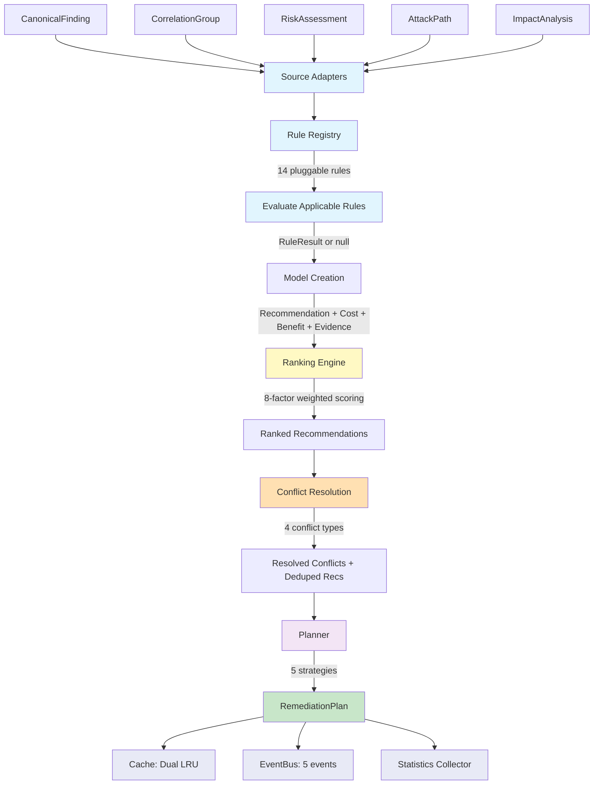

---

## 2. Rule Registry

The Rule Registry is the extensibility mechanism of the Recommendation Engine. Rules are not hardcoded — they are registered at engine construction time and can be extended by consumers.

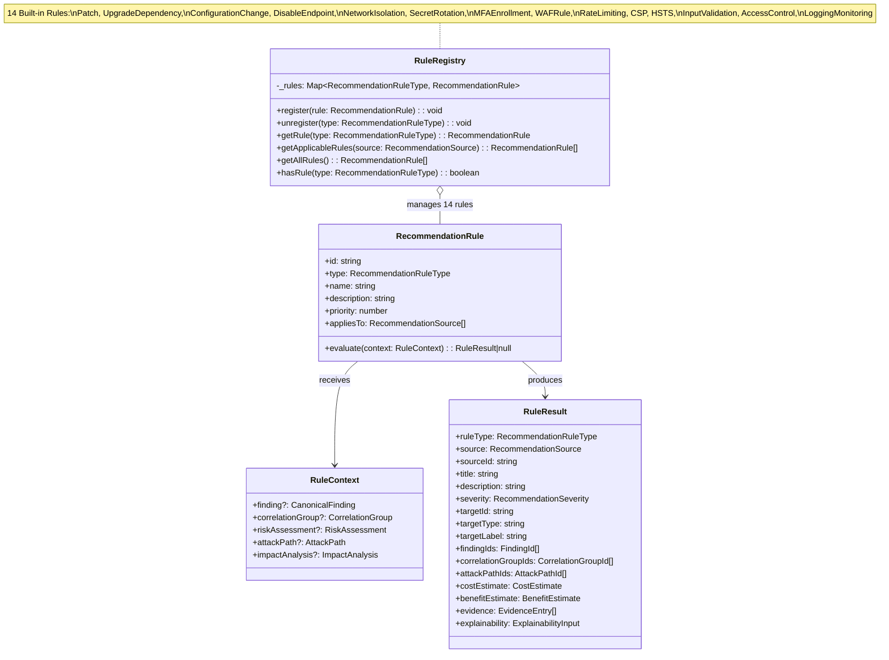

### 14 Built-in Rules

| # | Rule Type | Priority | Applies To | Description |
|---|-----------|----------|------------|-------------|
| 1 | `Patch` | 0.95 | Finding, RiskAssessment, ImpactAnalysis | Apply security patches for known CVEs |
| 2 | `UpgradeDependency` | 0.90 | Finding, ImpactAnalysis | Upgrade vulnerable dependencies to fixed versions |
| 3 | `ConfigurationChange` | 0.85 | Finding, RiskAssessment | Change insecure configuration settings |
| 4 | `DisableEndpoint` | 0.80 | Finding, AttackPath | Disable exposed or unused endpoints |
| 5 | `NetworkIsolation` | 0.85 | AttackPath, RiskAssessment | Isolate compromised assets from the network |
| 6 | `SecretRotation` | 0.90 | Finding, RiskAssessment | Rotate leaked or compromised secrets |
| 7 | `MFAEnrollment` | 0.75 | Finding, RiskAssessment | Enforce multi-factor authentication |
| 8 | `WAFRule` | 0.70 | Finding, AttackPath | Add Web Application Firewall rules |
| 9 | `RateLimiting` | 0.65 | Finding, AttackPath | Implement rate limiting on exposed endpoints |
| 10 | `CSP` | 0.60 | Finding | Deploy Content Security Policy headers |
| 11 | `HSTS` | 0.55 | Finding | Enable HTTP Strict Transport Security |
| 12 | `InputValidation` | 0.80 | Finding, RiskAssessment | Add input validation for injection-prone fields |
| 13 | `AccessControl` | 0.75 | Finding, RiskAssessment, AttackPath | Restrict access to sensitive resources |
| 14 | `LoggingMonitoring` | 0.50 | Finding, RiskAssessment, AttackPath | Add logging and monitoring for detection |

---

## 3. Ranking Engine (8-Factor Weighted)

Each recommendation is scored using a deterministic 8-factor weighted formula. The overall score determines the priority rank.

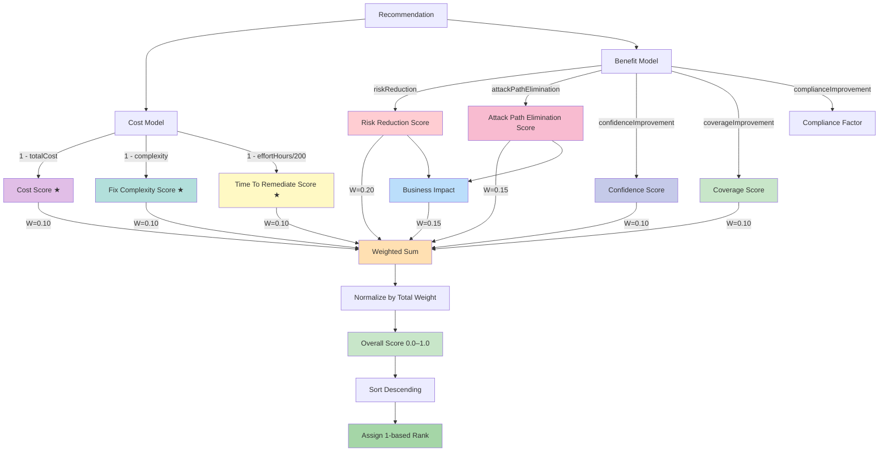

**Formula:**

```
Overall = (W_rr × RiskReduction + W_ape × AttackPathElimination + W_cost × (1 - Cost)
         + W_conf × Confidence + W_bi × BusinessImpact + W_fix × (1 - Complexity)
         + W_cov × Coverage + W_ttr × (1 - Effort/200)) / W_total
```

Where:
- **Business Impact** = `0.6 × riskReduction + 0.4 × attackPathElimination`
- Scores marked with ★ are **inverted** (lower cost/complexity/effort → higher score)
- Default weights: `0.20, 0.15, 0.10, 0.10, 0.15, 0.10, 0.10, 0.10` (sum = 1.0)
- All factor scores are in range `[0.0, 1.0]`

---

## 4. Planning Strategies

The Planner builds a `RemediationPlan` from ranked recommendations using one of 5 strategies. Each strategy optimizes for a different objective.

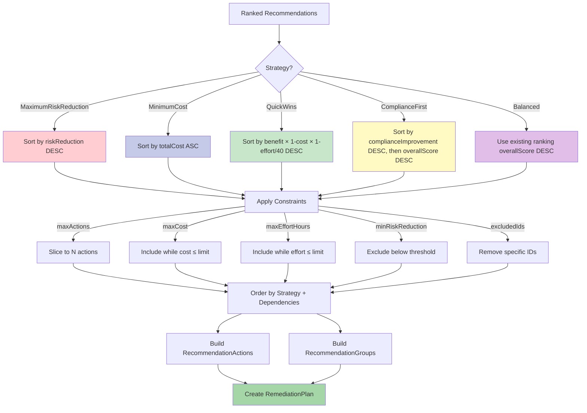

### Strategy Comparison

| Strategy | Primary Optimizer | Use Case | Sorting Criterion |
|----------|-------------------|----------|-------------------|
| `MaximumRiskReduction` | Maximize risk reduction | Critical incidents | `benefit.riskReduction DESC` |
| `MinimumCost` | Minimize cost | Budget-constrained environments | `cost.totalCost ASC` |
| `QuickWins` | High benefit, low effort | Fast remediation sprints | `benefit × (1-cost) × (1-effort/40) DESC` |
| `ComplianceFirst` | Compliance improvement | Audit preparation | `benefit.complianceImprovement DESC` |
| `Balanced` | Weighted composite score | Default / general use | `ranking.overallScore DESC` |

### Prerequisite Ordering

Regardless of strategy, the planner enforces prerequisite ordering between rule types:

```
Patch → ConfigurationChange
Patch → InputValidation
Patch → UpgradeDependency
SecretRotation → AccessControl
```

This ensures that foundational fixes are applied before dependent configurations.

---

## 5. Conflict Resolution

When multiple recommendations target the same asset or finding, conflicts arise. The Conflict Resolution module detects 4 types of conflicts and resolves them deterministically.

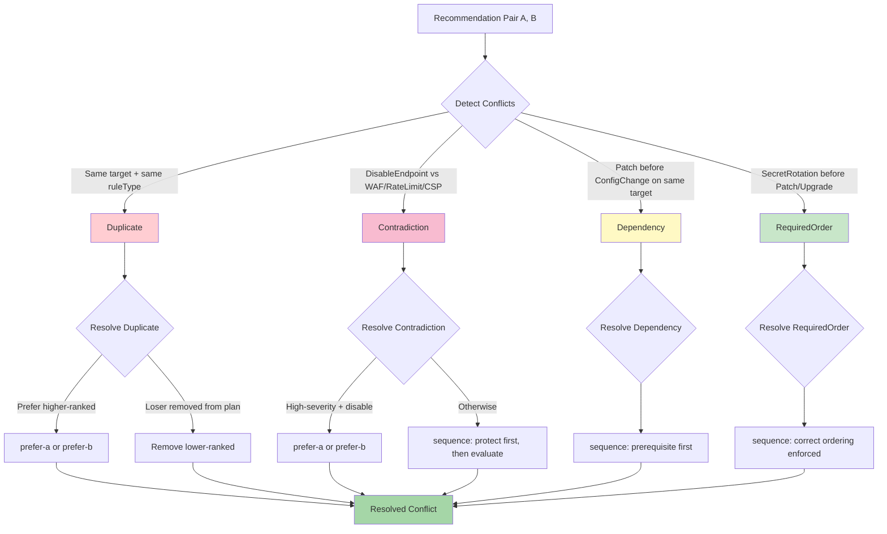

### Resolution Strategies

| Conflict Type | Resolution Strategy | Winner Determination |
|---------------|---------------------|---------------------|
| Duplicate | `prefer-a` or `prefer-b` | Higher `ranking.overallScore` wins; loser removed |
| Contradiction | `prefer-a/b` or `sequence` | High-severity disable/isolate wins; otherwise sequence both |
| Dependency | `sequence` | Prerequisite (Patch, NetworkIsolation, SecretRotation) goes first |
| RequiredOrder | `sequence` | SecretRotation before Patch/UpgradeDependency |

---

## 6. Batch Flow

The batch module supports 5 entry points for generating recommendations at different granularities: from a single finding up to multiple full scans.

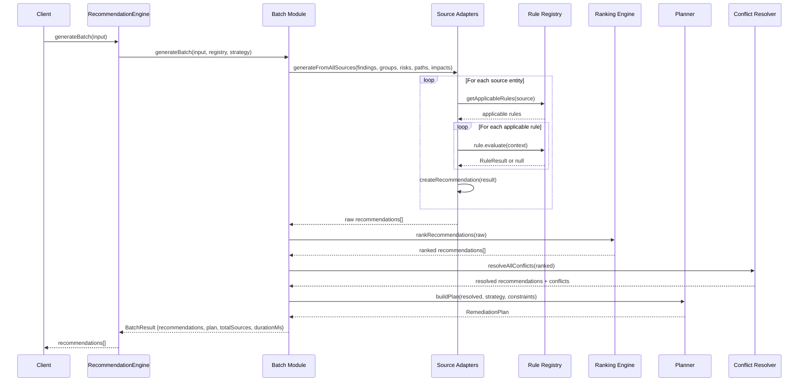

### 5 Batch Entry Points

| Entry Point | Method | Input Scope |
|-------------|--------|-------------|
| Single Finding | `generateFromSingleFinding()` | 1 CanonicalFinding |
| Single Risk | `generateFromSingleRisk()` | 1 RiskAssessment |
| Single Impact | `generateFromSingleImpact()` | 1 ImpactAnalysis |
| Full Scan | `generateBatch({findings, risks, paths, impacts})` | All results from one scan |
| Multiple Scans | `generateBatch()` with merged inputs | Combined results from N scans |

---

## 7. Cache Architecture

The engine uses a dual LRU cache to avoid re-computing recommendations and plans for the same inputs. Both caches share a single capacity and TTL.

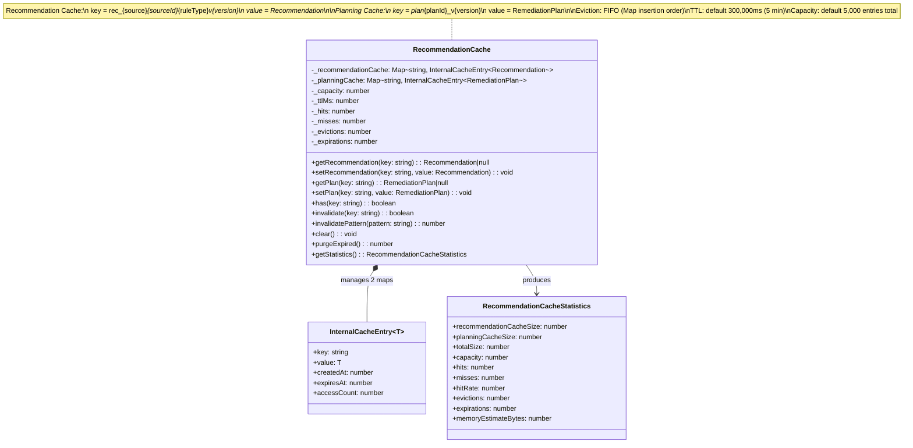

### Cache Key Format

| Cache | Key Pattern | Example |
|-------|-------------|---------|
| Recommendation | `rec_{source}_{sourceId}_{ruleType}_v{version}` | `rec_CanonicalFinding_f-001_Patch_v1.0.0` |
| Planning | `plan_{planId}_v{version}` | `plan_m5a7k2_Balanced_v1.0.0` |

### Cache Behavior

- **Eviction**: FIFO via `Map` insertion order — oldest entry is evicted when capacity is reached
- **TTL**: Entries expire after `cacheTtlMs` (default: 300,000ms / 5 minutes); expired entries are lazily removed on access or via `purgeExpired()`
- **Pattern invalidation**: `invalidatePattern(regex)` removes all entries matching a regex from both caches
- **Statistics**: `getStatistics()` returns hit rate, eviction count, memory estimate (~2KB per entry)

---

## 8. Integration with Impact Analysis

The Recommendation Engine delegates effect estimation to Impact Analysis (INT-004.5) rather than re-computing. When an `ImpactAnalysis` is available, it provides the most accurate cost/benefit estimates.

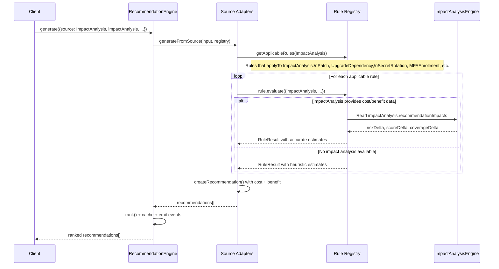

### Impact Analysis Data Flow

The `ImpactAnalysis` provides the following data to the Recommendation Engine:

| Impact Analysis Output | Recommendation Input | Usage |
|------------------------|---------------------|-------|
| `riskDelta` | `benefit.riskReduction` | Direct mapping — expected risk reduction |
| `attackPathDelta` | `benefit.attackPathElimination` | Fraction of attack paths eliminated |
| `scoreDelta` | `explainability.expectedScoreDelta` | Expected security score improvement |
| `coverageDelta` | `benefit.coverageImprovement` | Improvement in finding coverage |
| `confidenceDelta` | `benefit.confidenceImprovement` | Improvement in confidence |

When Impact Analysis is **not** available, rules fall back to heuristic estimates based on severity, rule type, and source characteristics.

---

## 9. Explainability Hooks

Every `Recommendation` carries a `ExplainabilityData` structure designed for the downstream Explainability Engine (INT-006). This data is **structured, not textual** — no generated explanations, only machine-readable fields.

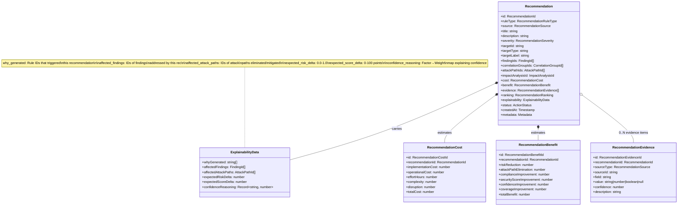

### Explainability Fields

| Field | Type | Description |
|-------|------|-------------|
| `whyGenerated` | `string[]` | Rule IDs that triggered this recommendation (e.g., `["rule-patch", "rule-network-isolation"]`) |
| `affectedFindings` | `FindingId[]` | IDs of findings addressed by this recommendation |
| `affectedAttackPaths` | `AttackPathId[]` | IDs of attack paths eliminated or mitigated |
| `expectedRiskDelta` | `number` (0.0–1.0) | Expected risk reduction from implementing this recommendation |
| `expectedScoreDelta` | `number` (0–100) | Expected security score improvement in points |
| `confidenceReasoning` | `Record<string, number>` | Factor → weight map explaining why the confidence level is what it is (e.g., `{"sourceConfidence": 0.8, "impactAnalysisAvailable": 0.9}`) |

---

## 10. Event Flow

The engine emits 5 domain events through a typed `RecommendationEventBus`. Events are emitted synchronously after each major operation.

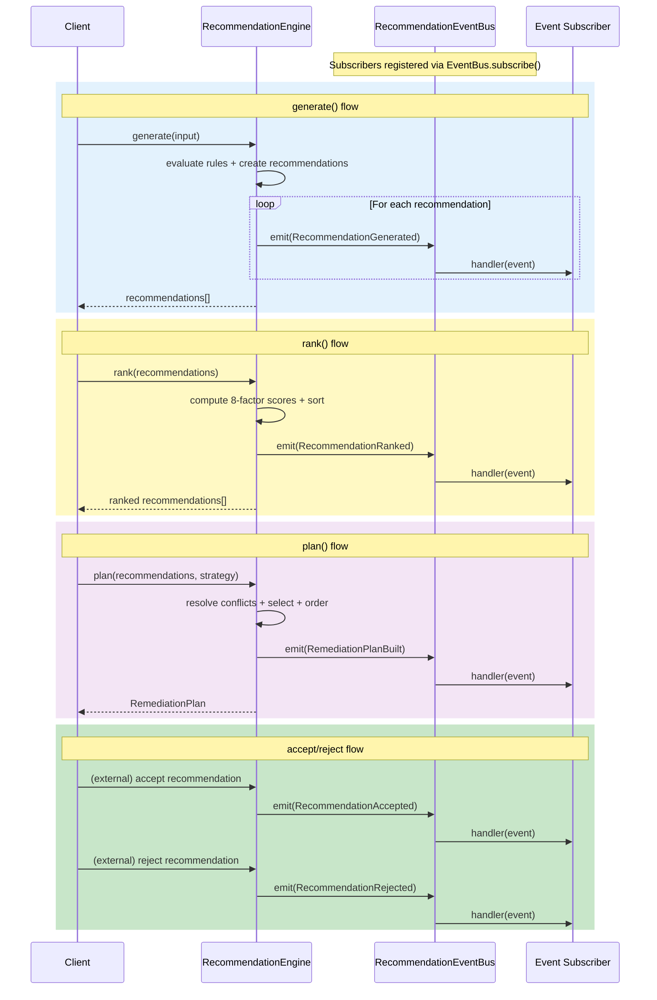

### Event Types

| Event | Trigger | Payload |
|-------|---------|---------|
| `recommendation.generated` | After `generate()` creates each recommendation | `engineId, recommendationId, ruleType, source, severity` |
| `recommendation.ranked` | After `rank()` completes | `engineId, recommendationIds[], strategy, durationMs` |
| `recommendation.accepted` | When a recommendation is accepted | `engineId, recommendationId, planId` |
| `recommendation.rejected` | When a recommendation is rejected | `engineId, recommendationId, reason` |
| `remediation.plan.built` | After `plan()` builds a plan | `engineId, planId, strategy, actionCount, totalRiskReduction, durationMs` |

### EventBus Contract

- **Synchronous dispatch** — events are emitted inline; handlers run before the method returns
- **Error isolation** — handler exceptions are swallowed; a failing subscriber never breaks the engine
- **Subscribe/unsubscribe** — `subscribe()` returns an unsubscribe function
- **Clear** — `eventBus.clear()` removes all handlers (used in `engine.reset()`)

---

## 11. Recommendation Source Flow

Recommendations can originate from 5 different upstream sources. Each source provides different context, and different rules apply to each.

```mermaid
flowchart TD
    subgraph "Upstream Sources"
        F1[CanonicalFinding<br/>from Normalization Engine]
        F2[CorrelationGroup<br/>from Correlation Engine]
        F3[RiskAssessment<br/>from Risk Engine]
        F4[AttackPath<br/>from Attack Path Builder]
        F5[ImpactAnalysis<br/>from Impact Analysis Engine]
    end

    F1 --> |"Vulnerability, Misconfig,<br/>Secret findings"| R1[Rules: Patch, UpgradeDependency,<br/>ConfigurationChange, SecretRotation,<br/>InputValidation, CSP, HSTS]
    F2 --> |"Correlated finding groups"| R2[Rules: NetworkIsolation,<br/>DisableEndpoint, AccessControl]
    F3 --> |"Risk scores + context"| R3[Rules: Patch, ConfigurationChange,<br/>MFAEnrollment, LoggingMonitoring]
    F4 --> |"Attack graph paths"| R4[Rules: NetworkIsolation,<br/>DisableEndpoint, WAFRule,<br/>RateLimiting, AccessControl]
    F5 --> |"Cost/benefit deltas"| R5[Rules: Patch, UpgradeDependency,<br/>SecretRotation, MFAEnrollment]

    R1 --> REC[Recommendation]
    R2 --> REC
    R3 --> REC
    R4 --> REC
    R5 --> REC

    REC --> |"With ExplainabilityData"| EXP[why_generated: rule IDs<br/>affected_findings: FindingId[]<br/>affected_attack_paths: AttackPathId[]<br/>expected_risk_delta: number<br/>expected_score_delta: number<br/>confidence_reasoning: factor→weight]

    style F1 fill:#e1f5fe
    style F2 fill:#e1f5fe
    style F3 fill:#fff9c4
    style F4 fill:#ffe0b2
    style F5 fill:#f3e5f5
    style REC fill:#c8e6c9
    style EXP fill:#e8eaf6
```

### Source → Rule Applicability Matrix

| Rule | CanonicalFinding | CorrelationGroup | RiskAssessment | AttackPath | ImpactAnalysis |
|------|:-:|:-:|:-:|:-:|:-:|
| Patch | ✓ | | ✓ | | ✓ |
| UpgradeDependency | ✓ | | | | ✓ |
| ConfigurationChange | ✓ | | ✓ | | |
| DisableEndpoint | ✓ | ✓ | | ✓ | |
| NetworkIsolation | | ✓ | ✓ | ✓ | |
| SecretRotation | ✓ | | ✓ | | ✓ |
| MFAEnrollment | | | ✓ | | ✓ |
| WAFRule | ✓ | | | ✓ | |
| RateLimiting | ✓ | | | ✓ | |
| CSP | ✓ | | | | |
| HSTS | ✓ | | | | |
| InputValidation | ✓ | | ✓ | | |
| AccessControl | | ✓ | ✓ | ✓ | |
| LoggingMonitoring | ✓ | | ✓ | ✓ | |

---

## 12. Domain Model Relationships

The Recommendation Engine defines 8 immutable domain models, each created only through validated factory functions and deeply frozen on construction.

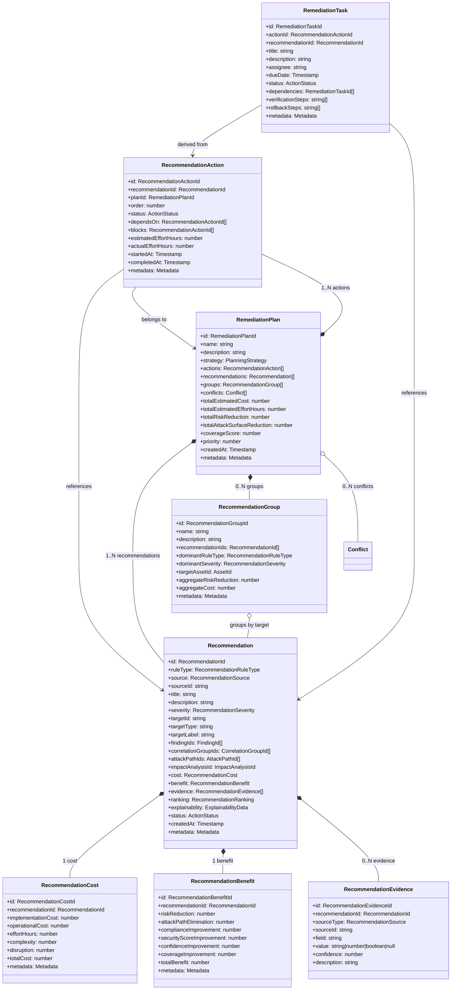

### Model Lifecycle

```
RuleResult
    │
    ▼ (factory: createRecommendation)
Recommendation
    │
    ├── createRecommendationCost() ──► RecommendationCost
    ├── createRecommendationBenefit() ──► RecommendationBenefit
    └── createRecommendationEvidence() ──► RecommendationEvidence[]

Ranked Recommendations
    │
    ▼ (planner: buildPlan)
RemediationPlan
    │
    ├── createRecommendationAction() ──► RecommendationAction[]
    └── createRecommendationGroup() ──► RecommendationGroup[]
```

---

## Public API

The `RecommendationEngine` class exposes 5 public methods plus property accessors:

### `generate(input: GenerateInput): readonly Recommendation[]`

Generates recommendations from a single source. Evaluates all applicable rules against the provided context, creates `Recommendation` models with cost/benefit/evidence, caches results, and emits `RecommendationGenerated` events.

```typescript
const recommendations = engine.generate({
  source: RecommendationSource.CanonicalFinding,
  sourceId: 'finding-001',
  finding: canonicalFinding,
});
```

### `generateBatch(input: GenerateBatchInput): readonly Recommendation[]`

Generates recommendations from multiple sources in batch. Iterates all source arrays, generates from each, ranks the combined set, and optionally builds a plan. Emits `RecommendationGenerated` events for each result.

```typescript
const batchResult = engine.generateBatch({
  findings: [finding1, finding2],
  riskAssessments: [risk1],
  attackPaths: [path1, path2],
  impactAnalyses: [impact1],
});
```

### `rank(recommendations: readonly Recommendation[]): readonly Recommendation[]`

Ranks recommendations using the 8-factor weighted formula. Computes per-factor scores, calculates the weighted overall score, sorts descending, and assigns 1-based ranks. Emits `RecommendationRanked` event.

```typescript
const ranked = engine.rank(recommendations);
// ranked[0] has ranking.rank === 1 (highest priority)
```

### `plan(recommendations, strategy?, constraints?): RemediationPlan`

Builds a remediation plan from ranked recommendations. Resolves conflicts, applies the planning strategy, enforces prerequisites, creates actions and groups, and applies constraints. Caches the plan and emits `RemediationPlanBuilt` event.

```typescript
const plan = engine.plan(ranked, PlanningStrategy.QuickWins, {
  maxActions: 10,
  maxCost: 0.7,
  minRiskReduction: 0.3,
});
```

### `comparePlans(planA: RemediationPlan, planB: RemediationPlan): PlanComparison`

Deterministically compares two remediation plans. Scores each plan across 4 dimensions (risk reduction ×3, cost ×2, coverage ×2, effort ×1) and declares a winner or tie.

```typescript
const comparison = engine.comparePlans(planA, planB);
// comparison.winner: 'plan-a' | 'plan-b' | 'tie'
```

### Property Accessors

| Property | Type | Description |
|----------|------|-------------|
| `ruleRegistry` | `RuleRegistry` | Access the rule registry for extending rules |
| `eventBus` | `RecommendationEventBus` | Subscribe to engine events |
| `cacheStatistics` | `RecommendationCacheStatistics` | Current cache hit rate, evictions, sizes |
| `config` | `RecommendationEngineConfig` | Read-only engine configuration |

### Utility Methods

| Method | Description |
|--------|-------------|
| `statistics()` | Get aggregated engine statistics |
| `reset()` | Clear all state (cache, events, statistics) |

---

## Enums

### RecommendationRuleType (14 values)

```
Patch | UpgradeDependency | ConfigurationChange | DisableEndpoint |
NetworkIsolation | SecretRotation | MFAEnrollment | WAFRule |
RateLimiting | CSP | HSTS | InputValidation | AccessControl |
LoggingMonitoring
```

### RecommendationSource (5 values)

```
CanonicalFinding | CorrelationGroup | RiskAssessment | AttackPath | ImpactAnalysis
```

### PlanningStrategy (5 values)

```
MaximumRiskReduction | MinimumCost | QuickWins | ComplianceFirst | Balanced
```

### ConflictType (4 values)

```
Contradiction | Duplicate | Dependency | RequiredOrder
```

### ActionStatus (6 values)

```
Pending | Accepted | Rejected | InProgress | Completed | Skipped
```

### RecommendationSeverity (5 values)

```
Critical | High | Medium | Low | Informational
```

---

## Configuration

```typescript
interface RecommendationEngineConfig {
  engineId: string;                     // Default: 'default'
  enableCaching: boolean;               // Default: true
  cacheSize: number;                    // Default: 5,000
  cacheTtlMs: number;                   // Default: 300,000 (5 min)
  batchSize: number;                    // Default: 1,000
  formulaVersion: string;               // Default: '1.0.0'
  defaultStrategy: PlanningStrategy;    // Default: Balanced
  riskReductionWeight: number;          // Default: 0.20
  attackPathEliminationWeight: number;  // Default: 0.15
  costWeight: number;                   // Default: 0.10
  confidenceWeight: number;             // Default: 0.10
  businessImpactWeight: number;         // Default: 0.15
  fixComplexityWeight: number;          // Default: 0.10
  coverageWeight: number;               // Default: 0.10
  timeToRemediateWeight: number;        // Default: 0.10
}
```

**Weight constraints:** All weights must be ≥ 0. Sum is not required to be 1.0 — the formula normalizes by total weight. Inverted factors (cost, fix complexity, time to remediate) are automatically inverted in the ranking formula.

---

## Plan Constraints

```typescript
interface PlanConstraints {
  maxActions?: number;                      // Maximum number of actions in the plan
  maxCost?: number;                         // Maximum total cost (0.0–1.0, normalized)
  maxEffortHours?: number;                  // Maximum total effort in person-hours
  minRiskReduction?: number;                // Minimum risk reduction per recommendation (0.0–1.0)
  requiredActionIds?: RecommendationActionId[];  // Actions that must be included
  excludedRecommendationIds?: RecommendationId[]; // Recommendations to exclude
}
```

Constraints are applied after strategy-based selection. `maxCost` and `maxEffortHours` use a greedy knapsack approach — recommendations are included in strategy order while cumulative cost/effort remains within bounds.

---

## Test Coverage

| Category | Count | Status |
|----------|-------|--------|
| Unit tests | 123 | ✅ All passing |
| Benchmarks | 5 | ✅ All passing |

### Test Categories

- **Model factories** — validation, immutability, serialization, cloning, hashing
- **Rule evaluation** — each of 14 rules produces correct results for matching/non-matching inputs
- **Ranking** — 8-factor scoring, sort stability, tie-breaking, edge cases (empty, single item)
- **Planning** — 5 strategies produce correctly ordered plans with constraint enforcement
- **Conflict resolution** — 4 conflict types detected and resolved deterministically
- **Batch processing** — all 5 entry points produce correct recommendations
- **Cache** — LRU eviction, TTL expiration, pattern invalidation, statistics
- **Events** — all 5 events emitted with correct payloads, handler isolation
- **Engine integration** — end-to-end generate → rank → plan → comparePlans flow

### Benchmarks

1. `generate()` — single source recommendation generation
2. `generateBatch()` — batch generation with 1000+ sources
3. `rank()` — ranking 500+ recommendations
4. `plan()` — plan building with conflict resolution
5. `comparePlans()` — plan comparison

---

## Design Decisions

### 1. Why a Rule Registry instead of hardcoded rules?

The Rule Registry pattern allows consumers to add domain-specific rules (e.g., cloud-specific, compliance-specific) without modifying engine code. Rules are registered at construction time and can be introspected via `getApplicableRules()`.

### 2. Why 8 ranking factors instead of fewer?

Eight factors provide granular control over prioritization. Each factor addresses a distinct dimension:
- **Risk Reduction** — how much risk goes down
- **Attack Path Elimination** — how many attack paths are cut
- **Cost** — how expensive is implementation (inverted)
- **Confidence** — how certain are we about the recommendation
- **Business Impact** — what is the organizational impact
- **Fix Complexity** — how hard is the fix (inverted)
- **Coverage** — how many findings does this address
- **Time To Remediate** — how long until it's done (inverted)

The default weights (0.20, 0.15, 0.10, 0.10, 0.15, 0.10, 0.10, 0.10) emphasize risk reduction and business impact, but can be tuned per deployment.

### 3. Why dual LRU cache instead of a single cache?

Recommendations and plans have different access patterns:
- **Recommendations** are generated per source and read frequently during planning
- **Plans** are built less frequently but read many times (compare, accept/reject)

Separate maps allow independent eviction and pattern-based invalidation (e.g., invalidate all plans without affecting recommendation cache).

### 4. Why structured explainability instead of text explanations?

The `ExplainabilityData` structure is machine-readable, enabling the downstream Explainability Engine (INT-006) to compose contextual explanations in any language, format, or detail level. Text generation is deliberately excluded from this engine to maintain determinism and separation of concerns.

### 5. Why FIFO eviction instead of true LRU?

`Map` preserves insertion order in JavaScript, making FIFO eviction O(1). True LRU would require a doubly-linked list or similar structure, adding complexity for marginal benefit in a cache with 5-minute TTL where access patterns are relatively uniform.

---

## Cross-References

| Module | Reference | Relationship |
|--------|-----------|-------------|
| Normalization Engine | INT-002A | Source: `CanonicalFinding` |
| Correlation Engine | INT-002B | Source: `CorrelationGroup` |
| Risk Engine | INT-003 | Source: `RiskAssessment` |
| Attack Path Builder | INT-004 | Source: `AttackPath` |
| Impact Analysis | INT-004.5 | Source: `ImpactAnalysis` |
| Explainability Engine | INT-006 | Consumer: `ExplainabilityData` |
| Security Score Engine | INT-007 | Consumer: `expectedScoreDelta` |
