# Security Intelligence Platform — Architecture Document

> **Version:** 1.1.0 | **Last Updated:** 2025-03-04 | **Status:** Production

## Table of Contents

- [Overview](#overview)
- [Layered Architecture](#layered-architecture)
- [Domain Model](#domain-model)
- [Pipeline Orchestration](#pipeline-orchestration)
- [Data Flow](#data-flow)
- [API Architecture](#api-architecture)
- [CLI Architecture](#cli-architecture)
- [Persistence Architecture](#persistence-architecture)
- [Infrastructure Architecture](#infrastructure-architecture)
- [AI Layer Architecture](#ai-layer-architecture)
- [Enterprise Integrations](#enterprise-integrations)
- [Cloud Architecture](#cloud-architecture)
- [Plugin System](#plugin-system)
- [Security Architecture](#security-architecture)
- [Deployment Architecture](#deployment-architecture)

---

## Overview

The Security Intelligence Platform is a TypeScript security analysis engine that transforms raw vulnerability scan findings into actionable security intelligence through a 9-stage analysis pipeline. The system ingests findings from any scanner, normalizes them into a canonical model, and then progressively enriches them with correlations, knowledge graphs, risk assessments, attack paths, impact analysis, recommendations, and explainability metadata.

### Key Characteristics

| Aspect | Detail |
|--------|--------|
| **Language** | TypeScript (strict mode) |
| **Runtime** | Node.js 20+ / Bun |
| **HTTP Server** | Fastify |
| **CLI Framework** | Commander.js |
| **Validation** | Zod schemas |
| **Architecture Style** | Layered / Pipeline |
| **Deployment** | Docker / Kubernetes / Helm |
| **SDKs** | TypeScript, Python, Go |

### Design Principles

1. **Pipeline-First** — All analysis flows through a deterministic 9-stage pipeline with full observability
2. **Domain Isolation** — Core analysis engines have zero infrastructure dependencies
3. **Provider Pattern** — All external integrations (persistence, auth, messaging, LLMs) are behind provider interfaces
4. **Event-Driven** — Every pipeline stage emits typed events for monitoring, audit, and extension
5. **Incremental Enrichment** — Each stage builds upon prior outputs without backtracking
6. **Explainability by Default** — Every risk score, recommendation, and attack path carries a full derivation chain

---

## Layered Architecture

The platform follows a strict 4-layer architecture where dependencies flow inward. The Domain layer has zero knowledge of infrastructure; the Orchestrator composes domain engines; the API/Persistence layer exposes capabilities externally; and the Infrastructure layer provides all cross-cutting concerns.

```mermaid
graph TB
    subgraph "Layer 4 — Infrastructure"
        EB[Event Bus]
        BR[Message Brokers]
        DP[Distributed Pipeline]
        SG[Saga Engine]
        SC[Scheduler]
        CL[Cluster Coordinator]
        MT[Multi-Tenancy]
        ST[Streaming Engine]
        AL[AI Layer]
        EN[Enterprise Integrations]
        TI[Threat Intel]
        DE[Detection Engine]
        AS[Attack Simulator]
        DL[Data Lake]
        AN[Analytics]
        CC[Cloud Connectors]
        PL[Platform 2.0]
        AU[Auth / RBAC]
        OB[Observability]
        CF[Config Engine]
        PK[Plugin Engine]
        JN[Job Engine]
        AD[Audit Engine]
        SE[Security Hardening]
    end

    subgraph "Layer 3 — API / Persistence"
        API[Fastify API Server]
        CLI[CLI — Commander]
        PE[PersistenceEngine]
        DTO[DTO Mappers]
        VS[Zod Validation]
        MW[Middleware Stack]
    end

    subgraph "Layer 2 — Orchestrator"
        SIE[SecurityIntelligenceEngine]
        PB[Pipeline Builder]
    end

    subgraph "Layer 1 — Domain"
        NE[Normalization Engine]
        CE[Correlation Engine]
        KGB[Knowledge Graph Builder]
        RE[Risk Engine]
        APB[Attack Path Builder]
        IE[Impact Engine]
        RCE[Recommendation Engine]
        EE[Explainability Engine]
    end

    API --> SIE
    CLI --> SIE
    PE --> SIE
    SIE --> NE
    SIE --> CE
    SIE --> KGB
    SIE --> RE
    SIE --> APB
    SIE --> IE
    SIE --> RCE
    SIE --> EE
    EB --> API
    AL --> API
    EN --> API
    AU --> MW
    MT --> API
```

### Layer Responsibilities

| Layer | Components | Responsibility |
|-------|-----------|----------------|
| **Domain** | 8 engines + type definitions | Pure business logic, zero I/O, zero side effects |
| **Orchestrator** | SecurityIntelligenceEngine, Builder | Composes engines into the 9-stage pipeline, manages lifecycle |
| **API/Persistence** | Fastify routes, DTOs, Zod, PersistenceEngine | External interface, request/response mapping, data storage |
| **Infrastructure** | 20+ modules (INT-011..020) | Cross-cutting: messaging, auth, cloud, AI, enterprise, observability |

---

## Domain Model

The domain layer contains 8 specialized engines, each responsible for a single analysis concern. All engines operate on the canonical `SecurityFinding` type and produce strongly-typed outputs.

```mermaid
classDiagram
    class SecurityFinding {
        +string id
        +string source
        +string sourceId
        +string name
        +string description
        +Severity severity
        +FindingCategory category
        +Confidence confidence
        +string host
        +number port
        +string protocol
        +string path
        +Record evidence
        +Record metadata
        +Date timestamp
        +Date normalizedAt
        +string fingerprint
        +string[] tags
        +string cvssVector
        +number cvssScore
        +string[] cwe
        +string[] cve
        +string[] references
    }

    class NormalizationEngine {
        +normalize(raw: RawFinding[]) NormalizationResult
    }

    class CorrelationEngine {
        +correlate(findings: SecurityFinding[]) CorrelationResult
    }

    class KnowledgeGraphBuilder {
        +buildFromFindings(findings: SecurityFinding[]) KnowledgeGraph
        +addCorrelations(correlations, findingMap) void
        +addGroups(groups) void
        +getStatistics() KGStatistics
    }

    class RiskEngine {
        +assess(finding: SecurityFinding) RiskAssessment
        +assessAll(findings: SecurityFinding[]) RiskAssessment[]
        +summarize(assessments) RiskSummary
        +setCorrelationGroups(groups) void
    }

    class AttackPathBuilder {
        +discoverPaths(findings, risks, graph) AttackGraph
    }

    class ImpactEngine {
        +assessAll(findings, risks) ImpactAssessment[]
    }

    class RecommendationEngine {
        +generate(findings, risks) Recommendation[]
        +createPlan(recommendations) RemediationPlan
    }

    class ExplainabilityEngine {
        +explainFinding(finding, risk) Explanation
        +createTrace(stages) AnalysisTrace
    }

    NormalizationEngine --> SecurityFinding : produces
    CorrelationEngine --> SecurityFinding : consumes
    KnowledgeGraphBuilder --> SecurityFinding : consumes
    RiskEngine --> SecurityFinding : consumes
    RiskEngine --> CorrelationGroup : uses
    AttackPathBuilder --> SecurityFinding : consumes
    AttackPathBuilder --> RiskAssessment : consumes
    AttackPathBuilder --> KnowledgeGraph : traverses
    ImpactEngine --> SecurityFinding : consumes
    ImpactEngine --> RiskAssessment : consumes
    RecommendationEngine --> SecurityFinding : consumes
    RecommendationEngine --> RiskAssessment : consumes
    ExplainabilityEngine --> SecurityFinding : consumes
    ExplainabilityEngine --> RiskAssessment : consumes
```

### Core Domain Types

| Type | Source | Purpose |
|------|--------|---------|
| `RawFinding` | Normalization | Raw scanner output before normalization |
| `SecurityFinding` | Normalization | Canonical finding model — the domain lingua franca |
| `Correlation` / `CorrelationGroup` | Correlation | Links between related findings |
| `KGNode` / `KGEdge` / `KnowledgeGraph` | Knowledge Graph | Entity-relationship graph of the security landscape |
| `RiskAssessment` / `RiskFactor` | Risk | Quantified risk with 5 contributing factors |
| `AttackPath` / `AttackGraph` | Attack Path | Multi-step attack chains through the graph |
| `ImpactAssessment` | Impact | Business impact across 6 dimensions |
| `Recommendation` / `RemediationPlan` | Recommendation | Prioritized remediation actions |
| `Explanation` / `AnalysisTrace` | Explainability | Full derivation chain for every conclusion |

---

## Pipeline Orchestration

The `SecurityIntelligenceEngine` orchestrates all 8 domain engines in a fixed 9-stage pipeline. Each stage receives the outputs of all prior stages. The pipeline is cancellable via `AbortSignal`, observable via event handlers, and tracks per-stage timing and status.

```mermaid
sequenceDiagram
    participant Client
    participant SIE as SecurityIntelligenceEngine
    participant NE as NormalizationEngine
    participant CE as CorrelationEngine
    participant KGB as KnowledgeGraphBuilder
    participant RE as RiskEngine
    participant APB as AttackPathBuilder
    participant IE as ImpactEngine
    participant RCE as RecommendationEngine
    participant EE as ExplainabilityEngine

    Client->>SIE: analyze(input, options)
    SIE->>SIE: emit pipeline:started

    rect rgb(30, 40, 60)
        Note over SIE: Stage 1 — Normalize
        SIE->>NE: normalize(rawFindings)
        NE-->>SIE: findings: SecurityFinding[]
        SIE->>SIE: emit stage:completed (normalize)
    end

    rect rgb(35, 45, 65)
        Note over SIE: Stage 2 — Correlate
        SIE->>CE: correlate(findings)
        CE-->>SIE: correlations + groups
        SIE->>RE: setCorrelationGroups(groups)
        SIE->>SIE: emit stage:completed (correlate)
    end

    rect rgb(40, 50, 70)
        Note over SIE: Stage 3 — Knowledge Graph
        SIE->>KGB: buildFromFindings(findings)
        SIE->>KGB: addCorrelations(correlations, findingMap)
        SIE->>KGB: addGroups(groups)
        KGB-->>SIE: graph + statistics
        SIE->>SIE: emit stage:completed (knowledge-graph)
    end

    rect rgb(45, 55, 75)
        Note over SIE: Stage 4 — Risk Assessment
        SIE->>RE: assessAll(findings)
        RE-->>SIE: risks: RiskAssessment[]
        SIE->>RE: summarize(risks)
        RE-->>SIE: riskSummary
        SIE->>SIE: emit stage:completed (risk)
    end

    rect rgb(50, 60, 80)
        Note over SIE: Stage 5 — Attack Path
        SIE->>APB: discoverPaths(findings, risks, graph)
        APB-->>SIE: attackGraph
        SIE->>SIE: emit stage:completed (attack-path)
    end

    rect rgb(55, 65, 85)
        Note over SIE: Stage 6 — Impact
        SIE->>IE: assessAll(findings, risks)
        IE-->>SIE: impacts: ImpactAssessment[]
        SIE->>SIE: emit stage:completed (impact)
    end

    rect rgb(60, 70, 90)
        Note over SIE: Stage 7 — Recommendation
        SIE->>RCE: generate(findings, risks)
        RCE-->>SIE: recommendations
        SIE->>RCE: createPlan(recommendations)
        RCE-->>SIE: remediationPlan
        SIE->>SIE: emit stage:completed (recommendation)
    end

    rect rgb(65, 75, 95)
        Note over SIE: Stage 8 — Explain
        loop For each finding
            SIE->>EE: explainFinding(finding, risk)
            EE-->>SIE: explanation
        end
        SIE->>SIE: emit stage:completed (explain)
    end

    rect rgb(70, 80, 100)
        Note over SIE: Stage 9 — Report
        SIE->>SIE: Assemble SecurityIntelligenceReport
        SIE->>EE: createTrace(stages)
        SIE->>SIE: emit pipeline:completed
    end

    SIE-->>Client: SecurityIntelligenceReport
```

### Pipeline Stage Summary

| # | Stage | Engine | Input | Output | Skippable |
|---|-------|--------|-------|--------|-----------|
| 1 | `normalize` | NormalizationEngine | `RawFinding[]` | `SecurityFinding[]` | No |
| 2 | `correlate` | CorrelationEngine | `SecurityFinding[]` | `Correlation[]` + `CorrelationGroup[]` | No |
| 3 | `knowledge-graph` | KnowledgeGraphBuilder | findings + correlations | `KnowledgeGraph` | No |
| 4 | `risk` | RiskEngine | findings + groups | `RiskAssessment[]` + `RiskSummary` | No |
| 5 | `attack-path` | AttackPathBuilder | findings + risks + graph | `AttackGraph[]` | Yes (`includeAttackPaths`) |
| 6 | `impact` | ImpactEngine | findings + risks | `ImpactAssessment[]` | Yes (`includeImpact`) |
| 7 | `recommendation` | RecommendationEngine | findings + risks | `Recommendation[]` + `RemediationPlan` | No |
| 8 | `explain` | ExplainabilityEngine | findings + risks | `Explanation[]` | Yes (`explain`) |
| 9 | `report` | SecurityIntelligenceEngine | all prior outputs | `SecurityIntelligenceReport` | No |

### Pipeline Event Types

| Event | Payload |
|-------|---------|
| `pipeline:started` | `{ totalStages }` |
| `stage:started` | `{ stage }` |
| `stage:completed` | `{ stage, durationMs, count? }` |
| `stage:failed` | `{ stage, error }` |
| `pipeline:completed` | `{ reportId, durationMs }` |
| `pipeline:failed` | `{ error }` |
| `pipeline:cancelled` | — |

---

## Data Flow

The following diagram traces the complete data flow from raw scanner findings through all 9 pipeline stages to the final `SecurityIntelligenceReport`. Each arrow represents a data dependency — the type annotation shows what flows between stages.

```mermaid
flowchart LR
    subgraph Input
        RF[RawFinding[]]
    end

    subgraph "Stage 1: Normalize"
        N1[NormalizationEngine]
    end

    subgraph "Stage 2: Correlate"
        C1[CorrelationEngine]
    end

    subgraph "Stage 3: Knowledge Graph"
        K1[KnowledgeGraphBuilder]
    end

    subgraph "Stage 4: Risk"
        R1[RiskEngine]
    end

    subgraph "Stage 5: Attack Path"
        A1[AttackPathBuilder]
    end

    subgraph "Stage 6: Impact"
        I1[ImpactEngine]
    end

    subgraph "Stage 7: Recommendation"
        RC1[RecommendationEngine]
    end

    subgraph "Stage 8: Explain"
        E1[ExplainabilityEngine]
    end

    subgraph "Stage 9: Report"
        RP1[Report Assembler]
    end

    RF -->|"RawFinding[]"| N1
    N1 -->|"SecurityFinding[]"| C1
    C1 -->|"Correlation[] + Groups"| K1
    N1 -->|"SecurityFinding[]"| K1
    N1 -->|"SecurityFinding[]"| R1
    C1 -->|"CorrelationGroup[]"| R1
    N1 -->|"SecurityFinding[]"| A1
    R1 -->|"RiskAssessment[]"| A1
    K1 -->|"KnowledgeGraph"| A1
    N1 -->|"SecurityFinding[]"| I1
    R1 -->|"RiskAssessment[]"| I1
    N1 -->|"SecurityFinding[]"| RC1
    R1 -->|"RiskAssessment[]"| RC1
    N1 -->|"SecurityFinding[]"| E1
    R1 -->|"RiskAssessment[]"| E1

    N1 -->|"NormalizationStatistics"| RP1
    C1 -->|"CorrelationStatistics"| RP1
    K1 -->|"KGStatistics"| RP1
    R1 -->|"RiskSummary"| RP1
    A1 -->|"AttackGraphStatistics"| RP1
    I1 -->|"ImpactAssessment[]"| RP1
    RC1 -->|"RemediationPlan"| RP1
    E1 -->|"AnalysisTrace"| RP1

    RP1 -->|"SecurityIntelligenceReport"| OUT[Output]
```

### Data Enrichment Progression

Each stage adds a layer of intelligence:

| Stage | Adds | Key Metric |
|-------|------|------------|
| Normalize | Canonical model, fingerprint, CVSS, tags | `findings.length` |
| Correlate | Links between findings, groups | `correlations.length`, `groups.length` |
| Knowledge Graph | Entity relationships, graph topology | `totalNodes`, `totalEdges`, `density` |
| Risk | Quantified risk scores (0-100) | `byLevel`, `averageScore` |
| Attack Path | Multi-step attack chains | `totalPaths`, `criticalPaths` |
| Impact | Business impact across 6 dimensions | `dimensions`, `estimatedCost` |
| Recommendation | Prioritized remediation actions | `actions.length`, `estimatedRiskReduction` |
| Explain | Derivation chains for every conclusion | `steps.length`, `confidence` |
| Report | Complete assembled report | `metrics.totalDurationMs` |

---

## Knowledge Graph Model

The Knowledge Graph models the security landscape as a property graph with 18 node types and 14 edge types. The graph is built from findings, enriched with correlations, and traversed by the Attack Path Builder to discover multi-step attack chains.

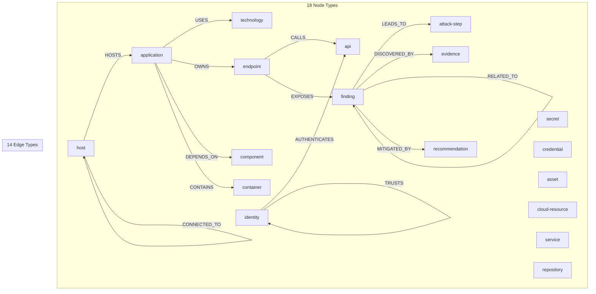

### Node Types (18)

| Node Type | Represents | Example |
|-----------|-----------|---------|
| `application` | Software application | "web-frontend", "payment-service" |
| `host` | Compute host | "prod-web-01.internal" |
| `endpoint` | API/network endpoint | "/api/v1/users" |
| `api` | API interface | "REST API", "GraphQL API" |
| `technology` | Technology stack | "Node.js 20", "PostgreSQL 15" |
| `finding` | Security finding | "SQL Injection in /api/users" |
| `evidence` | Finding evidence | "HTTP response with data leak" |
| `identity` | User/service identity | "service-account-prod" |
| `secret` | Exposed secret | "AWS Access Key AKIA..." |
| `credential` | Credential asset | "database-password" |
| `attack-step` | Attack technique step | "Privilege escalation via SUID" |
| `recommendation` | Remediation action | "Apply patch CVE-2024-1234" |
| `asset` | Business asset | "Customer PII Database" |
| `cloud-resource` | Cloud infrastructure | "aws:s3:production-data" |
| `service` | Microservice | "auth-service" |
| `container` | Container image | "nginx:1.24-alpine" |
| `repository` | Source repository | "github.com/org/api" |
| `component` | Software component | "lodash@4.17.21" |

### Edge Types (14)

| Edge | Semantics | Traversal Used By |
|------|-----------|-------------------|
| `USES` | App uses technology | Attack Path, Impact |
| `OWNS` | Identity owns resource | Attack Path |
| `CALLS` | Endpoint calls API | Attack Path, Correlation |
| `DEPENDS_ON` | Component dependency | Attack Path, Impact |
| `HOSTS` | Host runs application | Attack Path |
| `CONNECTED_TO` | Network connectivity | Attack Path, Lateral Movement |
| `LEADS_TO` | Finding enables attack step | Attack Path |
| `DISCOVERED_BY` | Evidence for finding | Explainability |
| `EXPOSES` | Endpoint exposes finding | Risk, Attack Path |
| `AUTHENTICATES` | Identity authenticates to | Attack Path |
| `TRUSTS` | Trust relationship | Attack Path, Lateral Movement |
| `CONTAINS` | Container/app composition | Impact |
| `RELATED_TO` | Generic relationship | Correlation |
| `MITIGATED_BY` | Finding mitigated by rec | Recommendation |

### Graph Statistics

The `KGStatistics` object captures:
- `totalNodes`, `totalEdges` — graph size
- `nodesByType`, `edgesByType` — distribution
- `connectedComponents` — isolated sub-graphs
- `density` — edge-to-node ratio (sparsity measure)

---

## Risk Engine

The Risk Engine quantifies finding severity on a 0-100 scale using a weighted multi-factor formula with a correlation multiplier. When findings are correlated (part of a `CorrelationGroup`), the risk score is amplified.

### Risk Formula

```
rawScore = Σ(weight_i × factorValue_i)     for i ∈ {severity, confidence, exposure, impact, exploitability}

finalScore = min(round(rawScore × 100), 100)

if finding ∈ CorrelationGroup:
    finalScore = min(round(rawScore × correlationMultiplier × 100), 100)
```

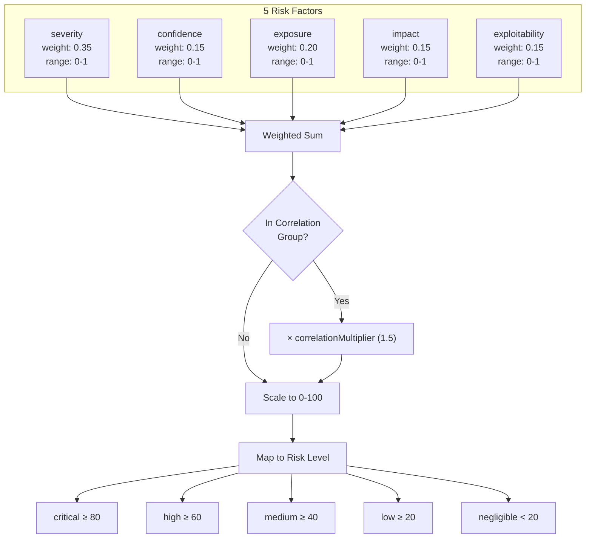

### Factor Calculation Details

| Factor | Weight | Default | Calculation Logic |
|--------|--------|---------|-------------------|
| **Severity** | 0.35 | — | Maps: critical=1.0, high=0.8, medium=0.5, low=0.3, info=0.1, none=0 |
| **Confidence** | 0.15 | — | Maps: high=0.9, medium=0.6, low=0.3 |
| **Exposure** | 0.20 | 0.5 | +0.2 if protocol=http, +0.1 if /api path, +0.2 if category=exposure, -0.1 if https |
| **Impact** | 0.15 | 0.4 | +0.3 if category=secret, +0.2 if category=vulnerability, +0.2 if severity ∈ {critical,high} |
| **Exploitability** | 0.15 | 0.3 | +0.3 if CVE exists, +0.3 if CVSS≥7, +0.2 if category=misconfiguration |
| **Correlation Multiplier** | — | 1.5 | Applied when finding belongs to a CorrelationGroup |

### Default RiskParameters

```typescript
{
  severityWeight: 0.35,
  confidenceWeight: 0.15,
  exposureWeight: 0.20,
  impactWeight: 0.15,
  exploitabilityWeight: 0.15,
  correlationMultiplier: 1.5,
}
```

---

## Attack Path Discovery

The Attack Path Builder traverses the Knowledge Graph to discover multi-step attack chains from entry points to high-value targets. It uses findings, risk assessments, and the graph structure to identify paths that an attacker could realistically exploit.

```mermaid
graph TD
    subgraph "Input"
        FDG[SecurityFinding[]]
        RSK[RiskAssessment[]]
        KG[KnowledgeGraph]
    end

    subgraph "Graph Traversal"
        EP[Identify Entry Points<br/>nodes with EXPOSES edges]
        BFS[Graph BFS/DFS<br/>follow LEADS_TO, CONNECTED_TO,<br/>AUTHENTICATES, TRUSTS]
        PF[Path Filtering<br/>max depth, min risk threshold]
        SC[Path Scoring<br/>Σ step risk × exploitability]
        AG[Assemble AttackGraph<br/>nodes + edges + paths]
    end

    subgraph "Output"
        AP[AttackPath[]<br/>id, name, steps[], totalRiskScore,<br/>exploitability, impact, entryPoint, target]
        AKG[AttackGraph<br/>nodes, edges, statistics]
    end

    FDG --> EP
    RSK --> EP
    KG --> BFS
    EP --> BFS
    BFS --> PF
    PF --> SC
    SC --> AG
    AG --> AP
    AG --> AKG
```

### Attack Graph Node Types

| Type | Meaning | Example |
|------|---------|---------|
| `entry` | External attack entry point | Exposed API endpoint, open port |
| `pivot` | Intermediate compromise step | Lateral movement, privilege escalation |
| `target` | High-value asset | Database with PII, admin account |

### Attack Graph Statistics

| Metric | Description |
|--------|-------------|
| `totalPaths` | Number of attack paths discovered |
| `avgPathLength` | Average number of steps per path |
| `maxRiskScore` | Highest risk score across all paths |
| `entryPoints` | Number of distinct entry points |
| `criticalPaths` | Paths with totalRiskScore ≥ 80 |

---

## API Architecture

The API layer is built on Fastify with a modular route registration system, Zod request validation, DTO mappers, and a pluggable authentication middleware. The server is constructed via a builder pattern.

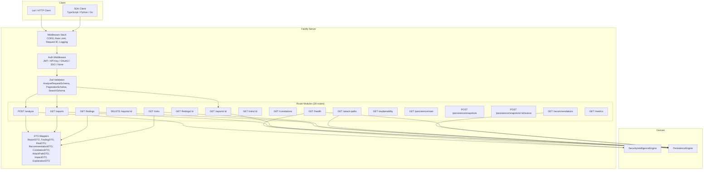

### API Builder Pattern

```typescript
const server = new SecurityIntelligenceApiBuilder()
  .withEngine(engine)
  .withPersistence(persistence)
  .withAuth(new JwtAuthProvider(jwtConfig))
  .withPort(8080)
  .withHost('0.0.0.0')
  .withCors(true)
  .build();
```

### DTO Inventory (12 DTOs)

| DTO | Fields | Route |
|-----|--------|-------|
| `AnalyzeRequestDTO` | findings[], options | POST /analyze |
| `AnalyzeResponseDTO` | runId, status, statusUrl | POST /analyze response |
| `ReportDTO` | id, runId, findingsCount, riskSummary, metrics | GET /reports |
| `FindingDTO` | id, source, severity, category, confidence, host, cve, cwe | GET /findings |
| `RiskDTO` | id, findingId, level, score, confidence, description | GET /risks |
| `RecommendationDTO` | id, title, priority, status, actionsCount, riskReduction | GET /recommendations |
| `CorrelationDTO` | id, findingA, findingB, type, strength, score | GET /correlations |
| `AttackPathDTO` | id, name, stepsCount, totalRiskScore, exploitability | GET /attack-paths |
| `ImpactDTO` | id, findingId, level, score, dimensions, affectedAssets | GET /impact |
| `ExplanationDTO` | id, type, targetId, summary, stepsCount, confidence | GET /explainability |
| `HealthDTO` | status, version, uptime, components | GET /health |
| `ErrorResponseDTO` | error, message, statusCode, requestId | All error responses |

### Zod Validation Schemas

| Schema | Validates |
|--------|-----------|
| `SeveritySchema` | Enum: critical, high, medium, low, info, none |
| `FindingCategorySchema` | Enum: vulnerability, misconfiguration, exposure, secret, outdated, policy-violation, anomaly |
| `RawFindingSchema` | Complete raw finding structure |
| `AnalyzeRequestSchema` | Array of findings (min 1) + optional analysis options |
| `PaginationSchema` | limit (1-1000, default 100), offset (≥0, default 0) |
| `SearchSchema` | q (min 1 char), limit, offset |

---

## CLI Architecture

The CLI is built on Commander.js with 10 command groups, 6 output formats, a progress renderer, and a remote API client mode. It can operate in local mode (using the in-process engine) or remote mode (using the REST API client).

```mermaid
graph TB
    subgraph "Entry Point"
        MAIN[main()] --> CM[ConfigManager]
        MAIN --> SIB[SecurityIntelligenceBuilder]
        MAIN --> PIB[PersistenceBuilder]
    end

    subgraph "Commander Program"
        PROG[si — CLI Program]

        subgraph "10 Command Groups"
            CMD1[analyze — Run full analysis]
            CMD2[reports — List/view/delete reports]
            CMD3[findings — Search/query findings]
            CMD4[risk — Risk assessment queries]
            CMD5[attack — Attack path analysis]
            CMD6[recommendation — View recommendations]
            CMD7[explain — Explainability queries]
            CMD8[persistence — Snapshot/restore]
            CMD9[config — Configuration management]
            CMD10[server — Start API server]
        end
    end

    subgraph "Output Layer"
        FMT[Formatter<br/>table, json, yaml, csv, jsonl, markdown]
        PRG[Progress Renderer]
    end

    subgraph "Execution Modes"
        LOCAL[Local Mode<br/>In-process engine]
        REMOTE[Remote Mode<br/>--remote flag<br/>APICLIENT]
    end

    CM --> PROG
    SIB --> LOCAL
    PIB --> LOCAL
    PROG --> CMD1
    PROG --> CMD2
    PROG --> CMD10
    CMD1 --> FMT
    CMD1 --> PRG
    CMD1 --> LOCAL
    CMD1 --> REMOTE
    REMOTE --> APICLIENT[ApiClient]
    APICLIENT -->|HTTP| API[REST API Server]
```

### Output Formats

| Format | Use Case | Example Command |
|--------|----------|-----------------|
| `table` | Interactive terminal (default) | `si analyze -f findings.json --format table` |
| `json` | Programmatic consumption | `si analyze -f findings.json --format json` |
| `yaml` | Configuration/PK workflow | `si risk list --format yaml` |
| `csv` | Spreadsheet import | `si findings list --format csv` |
| `jsonl` | Stream processing / log ingestion | `si analyze -f findings.json --format jsonl` |
| `markdown` | Documentation embedding | `si report show ID --format markdown` |

---

## Persistence Architecture

The Persistence layer uses a provider pattern with a facade `PersistenceEngine` over 8 specialized repositories. The default provider is `JsonPersistenceProvider` (file-based JSON storage), with pluggable backends for SQLite, PostgreSQL, Neo4j, and Redis.

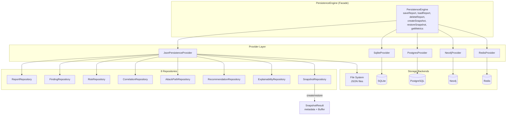

### Persistence Builder

```typescript
const persistence = new PersistenceBuilder()
  .withDataDir('./data')
  .withBackend('json')
  .build();
await persistence.initialize();
```

### Snapshot System

| Operation | Description |
|-----------|-------------|
| `createSnapshot(reportId, description)` | Serializes report to Buffer, stores with metadata |
| `restoreSnapshot(snapshotId)` | Deserializes and returns the full report |

### Snapshot Metadata

| Field | Type | Description |
|-------|------|-------------|
| `id` | string | Snapshot UUID |
| `reportId` | string | Original report reference |
| `createdAt` | Date | Creation timestamp |
| `size` | number | Buffer size in bytes |
| `format` | SerializationFormat | json, jsonl, gzip, msgpack |
| `description` | string | Human-readable description |

### Persistence Metrics

| Metric | Description |
|--------|-------------|
| `totalSaves` / `totalLoads` / `totalDeletes` | Operation counts |
| `avgSaveDurationMs` / `avgLoadDurationMs` | Latency tracking |
| `cacheHits` / `cacheMisses` | Cache efficiency |

---

## Infrastructure Architecture

The Infrastructure layer contains 20+ modules providing cross-cutting capabilities. Each module follows the same pattern: strongly-typed interfaces, provider implementations, and engine facades.

### Event Bus Architecture

The Event Bus provides a publish/subscribe event backbone with replay capability, dead letter handling, correlation/causation tracking, and multi-tenant awareness.

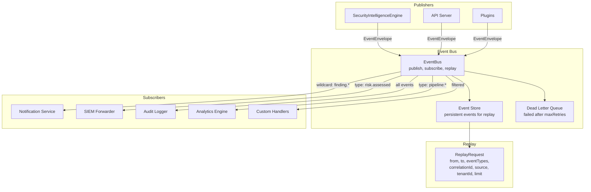

### Event Envelope

Every event is wrapped in a versioned envelope with full observability:

| Field | Purpose |
|-------|---------|
| `eventId` | Unique identifier |
| `eventType` | Dot-notation type (e.g., `finding.normalized`) |
| `version` | Schema version for backward compatibility |
| `timestamp` | Creation time |
| `source` | Producing service |
| `correlationId` | Links all events in a business operation |
| `causationId` | Links to the event that caused this one |
| `metadata.tenantId` | Multi-tenant isolation |
| `metadata.traceId` / `spanId` | Distributed tracing |
| `metadata.priority` | low, normal, high, critical |
| `metadata.persistent` | Whether to store for replay |
| `metadata.retryCount` | Current retry attempt |

### Distributed Pipeline

The Distributed Pipeline extends the in-process pipeline to a multi-service architecture with circuit breaker, saga orchestration, and health monitoring.

```mermaid
graph TB
    subgraph "Distributed Pipeline Engine"
        DPE[DistributedPipelineEngine<br/>execute, getStatus, cancel]
        CB[Circuit Breaker<br/>failureThreshold, resetTimeout,<br/>halfOpenRequests]
        ORC[Saga Orchestrator<br/>compensating transactions]
    end

    subgraph "Pipeline Services"
        S1[NormalizationService<br/>stage: normalize]
        S2[CorrelationService<br/>stage: correlate]
        S3[KnowledgeGraphService<br/>stage: knowledge-graph]
        S4[RiskService<br/>stage: risk]
        S5[AttackPathService<br/>stage: attack-path]
        S6[ImpactService<br/>stage: impact]
        S7[RecommendationService<br/>stage: recommendation]
        S8[ExplainService<br/>stage: explain]
    end

    DPE --> CB
    CB --> S1
    CB --> S2
    CB --> S3
    CB --> S4
    CB --> S5
    CB --> S6
    CB --> S7
    CB --> S8

    S1 -->|"error"| ORC
    ORC -->|"compensate"| S1
    ORC -->|"compensate"| S2

    subgraph "Pipeline Context"
        PC[PipelineContext<br/>pipelineId, correlationId,<br/>tenantId, traceId,<br/>previousStages[]]
    end

    PC --> S1
    PC --> S2
    PC --> S8
```

### Saga Engine

The Saga Engine provides compensating transaction support for distributed operations:

| Concept | Type | Description |
|---------|------|-------------|
| `SagaStep` | Interface | `execute()` + `compensate()` methods |
| `SagaStatus` | Enum | pending → running → completed/compensating/compensated/failed |
| `SagaContext` | Object | sagaId, correlationId, tenantId, metadata |
| `SagaRetryPolicy` | Config | maxRetries, backoffMs, backoffStrategy (fixed/exponential) |

### Infrastructure Module Inventory

| Module | ID | Key Abstraction |
|--------|----|-----------------|
| Event Bus | INT-011A | `EventEnvelope`, `EventSubscription`, `ReplayRequest` |
| Message Brokers | INT-011B | `EventBusProvider` (Kafka, NATS, RabbitMQ, Redis Streams) |
| Distributed Pipeline | INT-011C | `PipelineService`, `CircuitBreakerConfig` |
| Saga | INT-011D | `SagaStep`, `SagaDefinition`, `SagaResult` |
| Scheduler | INT-011E | `ScheduleEntry`, `ScheduledTask`, cron/interval/one-time |
| Cluster | INT-011F | `ClusterNode`, `LeaderElectionConfig`, `DistributedLock` |
| Multi-Tenancy | INT-011G | `Tenant`, `TenantQuotas`, `TenantRole`, `TenantPermission` |
| Streaming | INT-011H | `StreamPipeline`, `StreamSource`, `StreamSink` |
| AI Layer | INT-012 | `LlmProvider`, 5 sub-engines |
| Enterprise | INT-013 | SSO, SIEM, Ticketing, CMDB, Notification, Secrets |
| Threat Intel | INT-014 | `ThreatIntelFeed`, `StixObject`, 12 feed types |
| Detection | INT-015 | `DetectionRule`, Sigma, YARA, Correlation DSL |
| Attack Sim | INT-016 | `AttackSimulation`, `AttackScenario`, `DetectionGap` |
| Data Lake | INT-017 | `DataLakeStore`, Parquet/DuckDB/Iceberg/ClickHouse |
| Analytics | INT-018 | `Dashboard`, `ExecutiveReport`, `KpiDefinition`, `ComplianceReport` |
| Cloud | INT-019 | `CloudConnector`, AWS/Azure/GCP + Kubernetes |
| Platform 2.0 | INT-020 | Platform Engine |
| Auth | — | `AuthProvider`, JWT/OAuth2/APIKey, RBAC |
| Observability | — | Logger, Metrics, Tracer |
| Config | — | ConfigEngine, Validator, Migrations, Defaults, Secrets |
| Plugins | — | `SiPlugin`, 8 extension points |
| Jobs | — | `JobEngine` |
| Audit | — | `AuditEngine` |
| Security | — | Hardening module |

---

## AI Layer Architecture

The AI Layer provides LLM-powered intelligence capabilities through a router that abstracts 6 provider types and 5 specialized sub-engines. Each sub-engine focuses on a specific security intelligence task.

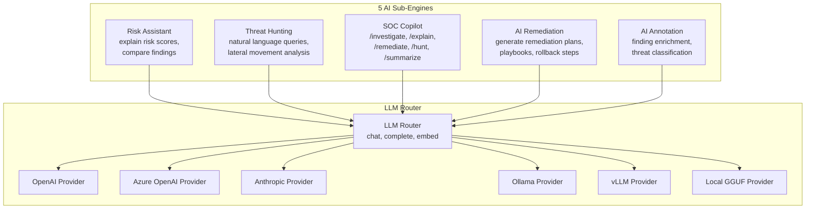

### LLM Provider Matrix

| Provider | Type | Key Config | Capabilities |
|----------|------|------------|--------------|
| **OpenAI** | `openai` | apiKey, baseUrl, organization, defaultModel | Chat, Complete, Embed, Tools, JSON |
| **Azure OpenAI** | `azure` | endpoint, apiKey, deploymentName, apiVersion | Chat, Complete, Embed |
| **Anthropic** | `anthropic` | apiKey, defaultModel, baseUrl | Chat, Complete, Tools |
| **Ollama** | `ollama` | baseUrl, defaultModel | Chat, Complete, Embed |
| **vLLM** | `vllm` | baseUrl, defaultModel, trustRemoteCode | Chat, Complete |
| **Local GGUF** | `local-gguf` | modelPath, contextSize, gpuLayers, threads | Complete |

### AI Sub-Engine Details

#### Risk Assistant

| Capability | Input | Output |
|------------|-------|--------|
| `explainRisk` | findingId, riskScore, factors | RiskExplanation with reasoning chain, evidence, confidence |
| `compareRisks` | Multiple findings with risk scores | RiskComparison with rankings and reasoning |

#### Threat Hunting

| Capability | Input | Output |
|------------|-------|--------|
| `hunt` | Natural language query, scope | ThreatHuntingResult with graph paths, related findings, actions |
| `lateralMovement` | Source/target assets | LateralMovementResult with paths, techniques, containment recs |

#### SOC Copilot

| Command | Description |
|---------|-------------|
| `/investigate` | Deep-dive into a finding |
| `/explain` | Explain risk or attack path |
| `/remediate` | Generate remediation steps |
| `/summarize` | Summarize report or findings |
| `/hunt` | Proactive threat hunting |
| `/status` | Platform status overview |
| `/help` | Available commands |

#### AI Remediation

| Output | Description |
|--------|-------------|
| `AiRemediationPlan` | Phased remediation with steps, verification, estimated time |
| `RemediationPlaybook` | Ordered steps with pre/post conditions |
| `RollbackPlan` | Rollback steps with trigger conditions |

---

## Enterprise Integrations

The Enterprise module provides 6 integration categories, each with a provider-based architecture supporting multiple backend systems.

```mermaid
graph TB
    subgraph "Security Intelligence Platform"
        CORE[Core Engine]
    end

    subgraph "SSO / Identity"
        SAML[SAML 2.0]
        OIDC[OIDC / OAuth2]
        LDAP[LDAP]
        AD[Active Directory]
    end

    subgraph "SIEM"
        SPL[Splunk]
        QRC[QRadar]
        SNT[Microsoft Sentinel]
        ELS[Elastic SIEM]
        CHR[Google Chronicle]
    end

    subgraph "Ticketing"
        JRA[Jira]
        SNW[ServiceNow]
        GHB[GitHub Issues]
        GLB[GitLab Issues]
        AZD[Azure DevOps]
    end

    subgraph "Notification"
        SLK[Slack]
        TMS[Microsoft Teams]
        DSC[Discord]
        TGR[Telegram]
        EML[Email]
        PDY[PagerDuty]
        OPG[Opsgenie]
        WHK[Webhook]
    end

    subgraph "CMDB"
        SNW2[ServiceNow]
        NBX[NetBox]
        BKS[Backstage]
    end

    subgraph "Secrets"
        VLT[HashiCorp Vault]
        ASW[AWS Secrets Manager]
        AKV[Azure Key Vault]
        GSM[GCP Secret Manager]
    end

    CORE --> SAML
    CORE --> OIDC
    CORE --> LDAP
    CORE --> AD
    CORE --> SPL
    CORE --> QRC
    CORE --> JRA
    CORE --> SNW
    CORE --> SLK
    CORE --> TMS
    CORE --> SNW2
    CORE --> NBX
    CORE --> VLT
    CORE --> ASW
```

### SSO Provider Interface

All SSO providers implement the same interface:

```typescript
interface SsoProvider {
  authenticate(credentials: SsoCredentials): Promise<SsoResult>;
  validateToken(token: string): Promise<SsoTokenValidation>;
  refreshToken(token: string): Promise<SsoResult>;
  getUserInfo(token: string): Promise<SsoUserInfo>;
  logout(token: string): Promise<void>;
  health(): Promise<{ available: boolean; latencyMs: number }>;
}
```

### SIEM Integration Flow

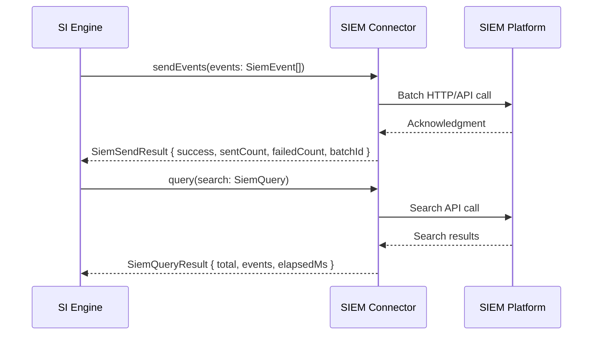

### Ticketing Integration

| System | Operations | Finding Mapping |
|--------|-----------|-----------------|
| Jira | create, update, get, comment, list | Finding → Security Finding issue type |
| ServiceNow | create, update, get, comment, list | Finding → Security Incident |
| GitHub | create, update, get, comment, list | Finding → Issue with security label |
| GitLab | create, update, get, comment, list | Finding → Issue with security label |
| Azure DevOps | create, update, get, comment, list | Finding → Work Item |

### Notification Rules Engine

Notifications are rule-driven:

| Condition Operator | Field Types | Example |
|--------------------|-------------|---------|
| `eq`, `neq` | string, enum | `severity eq critical` |
| `gt`, `lt` | number | `riskScore gt 80` |
| `contains` | string | `host contains prod-` |
| `in` | array | `category in [vulnerability, secret]` |

---

## Cloud Architecture

The Cloud module provides multi-cloud resource discovery, security scanning, and Kubernetes cluster awareness across AWS, Azure, and GCP.

```mermaid
graph TB
    subgraph "Cloud Engine"
        CE[CloudEngine<br/>discover, scan, query]
    end

    subgraph "AWS"
        AWS[AWS Connector<br/>EC2, S3, IAM, Lambda,<br/>EKS, RDS, VPC, CloudFront]
    end

    subgraph "Azure"
        AZ[Azure Connector<br/>VM, Storage, AD, Functions,<br/>AKS, SQL, VNet, CDN]
    end

    subgraph "GCP"
        GCP[GCP Connector<br/>GCE, GCS, IAM, Cloud Functions,<br/>GKE, Cloud SQL, VPC, Cloud CDN]
    end

    subgraph "Kubernetes"
        K8S[K8s Cluster Module<br/>Nodes, Namespaces, Pods,<br/>Services, Ingress, NetworkPolicies]
    end

    CE --> AWS
    CE --> AZ
    CE --> GCP

    AWS --> K8S
    AZ --> K8S
    GCP --> K8S

    subgraph "Resource Model"
        CR[CloudResource<br/>id, provider, type, name,<br/>region, account, tags,<br/>securityFindings[], relationships[]]
    end

    AWS --> CR
    AZ --> CR
    GCP --> CR
    K8S --> CR
```

### Cloud Resource Types (18)

| Category | Types |
|----------|-------|
| Compute | `compute`, `container`, `serverless`, `serverless-function` |
| Storage | `storage` |
| Network | `network`, `cdn`, `dns`, `load-balancer`, `security-group` |
| Database | `database` |
| Identity | `identity`, `iam-role`, `iam-policy` |
| Security | `key-vault`, `certificate` |
| Container | `kubernetes`, `container` |
| Other | `queue`, `log` |

### Cloud Connector Interface

```typescript
interface CloudConnector {
  discover(options?: CloudDiscoverOptions): Promise<CloudInventory>;
  getResource(resourceId: string): Promise<CloudResource | null>;
  listResources(type?: CloudResourceType, region?: string): Promise<CloudResource[]>;
  scanSecurity(resourceIds?: string[]): Promise<CloudSecurityFinding[]>;
  health(): Promise<{ available: boolean; regions?: string[] }>;
}
```

### Kubernetes Model

| Resource | Fields |
|----------|--------|
| `K8sNode` | name, status, roles, version, labels |
| `K8sPod` | name, namespace, containers[], labels, status |
| `K8sService` | name, namespace, type, clusterIp, ports[] |
| `K8sIngress` | name, namespace, hosts[], tls, backend |
| `K8sNetworkPolicy` | name, namespace, podSelector, ingress[], egress[] |

---

## Plugin System

The Plugin System provides 8 extension points where external code can augment the platform's behavior. Plugins follow a lifecycle of discovery → initialization → registration → execution → destruction.

```mermaid
graph TB
    subgraph "Plugin Engine"
        PLE[PluginEngine<br/>load, unload, list, enable, disable]
        PR[Plugin Registry<br/>Map of PluginEntry]
    end

    subgraph "Plugin Lifecycle"
        DISC[Discovery<br/>scan plugin directories]
        INIT[Initialize<br/>plugin.initialize(context)]
        REG[Register Extensions<br/>context.registerXxx()]
        EXEC[Execution<br/>extension methods called]
        DEST[Destroy<br/>plugin.destroy()]
    end

    subgraph "8 Extension Points"
        EP1[correlation-rule<br/>Custom correlation logic]
        EP2[risk-factor<br/>Additional risk factors]
        EP3[recommendation-rule<br/>Custom recommendations]
        EP4[cli-command<br/>New CLI commands]
        EP5[rest-endpoint<br/>New API endpoints]
        EP6[persistence-provider<br/>New storage backends]
        EP7[analysis-stage<br/>Pipeline stage plugins]
        EP8[output-formatter<br/>Custom output formats]
    end

    DISC --> INIT --> REG --> EXEC --> DEST
    INIT --> PR

    REG --> EP1
    REG --> EP2
    REG --> EP3
    REG --> EP4
    REG --> EP5
    REG --> EP6
    REG --> EP7
    REG --> EP8

    subgraph "Plugin Context API"
        CTX[PluginContext<br/>logger, config,<br/>registerCorrelationRule(),<br/>registerRiskFactor(),<br/>registerRecommendationRule(),<br/>registerCliCommand(),<br/>registerRestEndpoint(),<br/>registerPersistenceProvider(),<br/>registerAnalysisStage(),<br/>registerOutputFormatter()]
    end

    INIT --> CTX
```

### Plugin Manifest

Every plugin declares its capabilities via a manifest:

```typescript
interface PluginManifest {
  name: string;
  version: string;
  description: string;
  author: string;
  entryPoint: string;
  extensions: PluginExtensionPoint[];
}
```

### Extension Point Details

| Extension Point | Interface | Hook |
|----------------|-----------|------|
| `correlation-rule` | `CorrelationRuleExtension` | Adds `condition()` and `scoreCalculator()` to CorrelationEngine |
| `risk-factor` | `RiskFactorExtension` | Adds `calculate()` to RiskEngine with custom weight |
| `recommendation-rule` | `RecommendationRuleExtension` | Adds `appliesTo()` and `generate()` to RecommendationEngine |
| `cli-command` | `CliCommandExtension` | Registers new Commander sub-commands with arguments/options |
| `rest-endpoint` | `RestEndpointExtension` | Registers new Fastify routes with method/path/handler |
| `persistence-provider` | `PersistenceProviderExtension` | Adds new storage backend (initialize/shutdown) |
| `analysis-stage` | `AnalysisStageExtension` | Inserts pipeline stages with `process()` at a given order |
| `output-formatter` | `OutputFormatterExtension` | Adds `formatFindings()`, `formatRisks()`, `formatReport()` |

---

## Security Architecture

Security is enforced at every layer through authentication, authorization (RBAC), input validation, secrets management, and infrastructure hardening.

### Authentication Providers

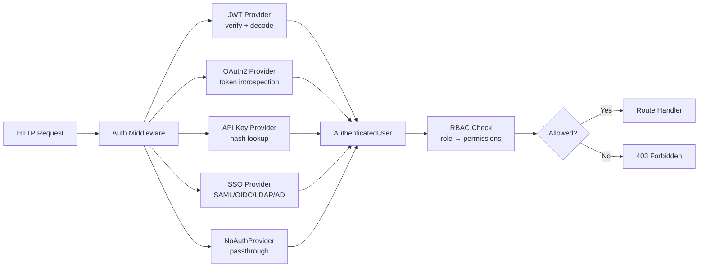

### RBAC Permission Model

| Role | Permissions |
|------|------------|
| **viewer** | report.read, finding.read, risk.read, attack.read, recommendation.read, explanation.read |
| **operator** | viewer + report.write, snapshot.create, snapshot.restore |
| **security-analyst** | operator + finding.delete, recommendation.write |
| **administrator** | security-analyst + config.read, config.write, admin.users, admin.roles, admin.system |

### Security Hardening

The `security/hardening` module enforces:

- **Non-root container execution** — Dockerfile creates `si-user` (UID 1001)
- **Input validation** — All API inputs validated through Zod schemas before processing
- **Secrets management** — Never log secrets; all credentials stored via SecretsProvider (Vault, AWS SM, Azure KV, GCP SM)
- **TLS enforcement** — HTTPS for all external communication
- **Rate limiting** — Configurable per-route rate limiting via Fastify middleware
- **CORS** — Configurable CORS policy (default: enabled)
- **Request tracing** — Every request gets a unique `x-request-id` for audit trail

### Multi-Tenancy Isolation

| Isolation Mode | Description | Use Case |
|---------------|-------------|----------|
| `schema` | Shared database, separate schemas | Cost-effective multi-tenancy |
| `database` | Separate database per tenant | Strong isolation |
| `row` | Shared tables with tenant_id column | Simple deployment, tenant filtering |

---

## Deployment Architecture

The platform supports containerized deployment via Docker with Kubernetes orchestration through Helm charts.

### Container Architecture

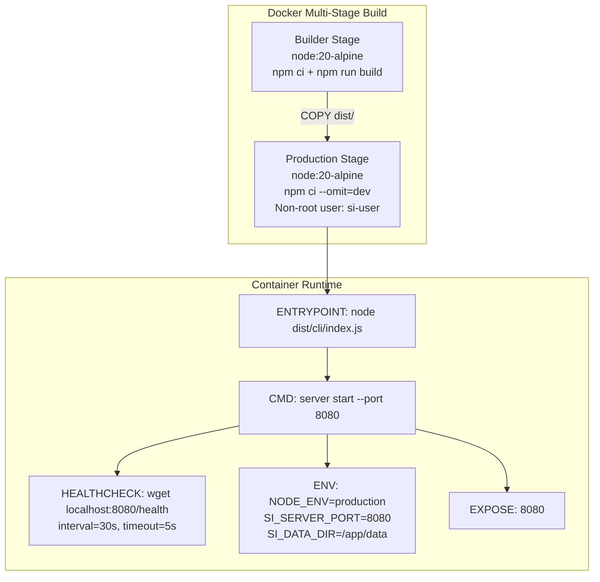

### Kubernetes Deployment

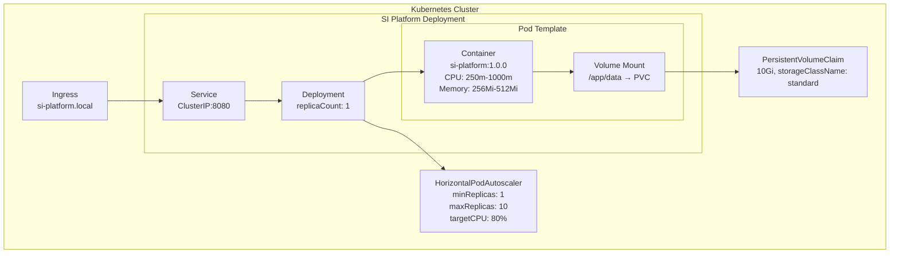

### Helm Values Configuration

| Key | Default | Description |
|-----|---------|-------------|
| `replicaCount` | 1 | Number of pod replicas |
| `image.repository` | si-platform | Container image repository |
| `image.tag` | 1.0.0 | Container image tag |
| `service.type` | ClusterIP | Kubernetes service type |
| `service.port` | 8080 | Service port |
| `ingress.enabled` | false | Enable ingress controller |
| `resources.limits.cpu` | 1000m | CPU limit |
| `resources.limits.memory` | 512Mi | Memory limit |
| `resources.requests.cpu` | 250m | CPU request |
| `resources.requests.memory` | 256Mi | Memory request |
| `autoscaling.enabled` | false | Enable HPA |
| `autoscaling.maxReplicas` | 10 | Maximum pod replicas |
| `autoscaling.targetCPUUtilizationPercentage` | 80 | CPU threshold for scaling |
| `persistence.enabled` | true | Enable persistent storage |
| `persistence.size` | 10Gi | PVC size |
| `config.persistence.backend` | json | Storage backend type |
| `config.auth.enabled` | false | Enable authentication |
| `config.observability.logging.level` | info | Log level |

### systemd Deployment

For non-Kubernetes environments, a systemd unit file is provided:

```
si-platform.service
├── ExecStart=/usr/local/bin/si server start --port 8080
├── WorkingDirectory=/opt/si-platform
├── User=si-user
├── Restart=on-failure
└── Environment=NODE_ENV=production SI_DATA_DIR=/var/lib/si-platform
```

---

## Appendix: Module Dependency Map

```mermaid
graph LR
    subgraph "SDK Layer"
        TS_SDK[TypeScript SDK]
        PY_SDK[Python SDK]
        GO_SDK[Go SDK]
    end

    subgraph "Interface Layer"
        CLI[CLI]
        API[REST API]
    end

    subgraph "Orchestration"
        ORC[Orchestrator]
    end

    subgraph "Domain"
        NORM[Normalize]
        CORR[Correlate]
        KG[Knowledge Graph]
        RISK[Risk]
        ATK[Attack Path]
        IMPC[Impact]
        REC[Recommend]
        EXPL[Explain]
    end

    subgraph "Persistence"
        PERS[Persistence Engine]
        REPOS[8 Repositories]
    end

    subgraph "Infrastructure"
        AUTH[Auth/RBAC]
        EB[Event Bus]
        BROK[Brokers]
        DP[Dist. Pipeline]
        SAGA[Saga]
        SCHED[Scheduler]
        CLUST[Cluster]
        MT[Multi-Tenancy]
        STRM[Streaming]
        AI[AI Layer]
        ENT[Enterprise]
        TI[Threat Intel]
        DET[Detection]
        ASIM[Attack Sim]
        DLAK[Data Lake]
        ANAL[Analytics]
        CLD[Cloud]
        PLAT[Platform 2.0]
        CFG[Config]
        PLUG[Plugins]
        OBS[Observability]
        AUDT[Audit]
        SEC[Security]
        JOBS[Jobs]
    end

    TS_SDK --> API
    PY_SDK --> API
    GO_SDK --> API
    CLI --> ORC
    CLI --> PERS
    API --> ORC
    API --> PERS
    API --> AUTH
    ORC --> NORM
    ORC --> CORR
    ORC --> KG
    ORC --> RISK
    ORC --> ATK
    ORC --> IMPC
    ORC --> REC
    ORC --> EXPL
    PERS --> REPOS
    API --> EB
    API --> MT
    API --> PLUG
    API --> OBS
    EB --> BROK
    DP --> SAGA
    DP --> CLUST
    DP --> EB
    CLD --> TI
    DET --> TI
    ASIM --> DET
    ENT --> AUTH
    ANAL --> DLAK
    CFG --> SEC
    JOBS --> SCHED
```

---

*This document reflects the actual codebase architecture as of the current release. All type definitions, interfaces, and module structures are derived from the TypeScript source code in `src/`.*
