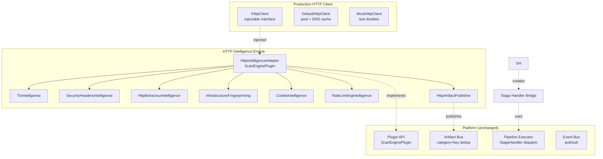
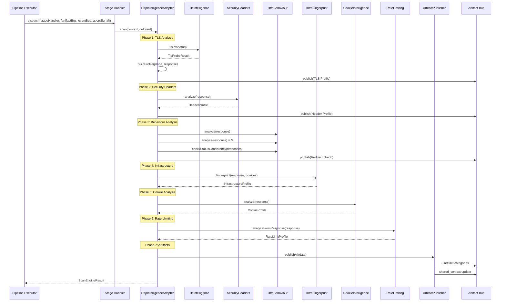

# HTTP Intelligence Architecture — Diagrams

## Component Diagram



## Sequence Diagram — Full Scan Flow



## Artifact Flow Diagram

```mermaid
graph LR
    subgraph "HTTP Intelligence Engine"
        A[ScanEngine] -->|scan()| B[TLS Intel]
        A -->|scan()| C[Headers Intel]
        A -->|scan()| D[Behaviour Intel]
        A -->|scan()| E[Infra FP]
        A -->|scan()| F[Cookie Intel]
        A -->|scan()| G[Rate Limit]
        B -->|publish| H1[TLS Profile]
        C -->|publish| H2[Header Profile]
        D -->|publish| H3[Redirect Graph]
        E -->|publish| H4[Infra Profile]
        F -->|publish| H5[Cookie Profile]
        G -->|publish| H6[Rate Limit]
        A -->|publish| H7[HTTP Profile]
        A -->|publish| H8[Shared Context]
    end

    subgraph "Artifact Bus (existing)"
        AB1[category: tls]
        AB2[category: headers]
        AB3[category: redirects]
        AB4[category: technology]
        AB5[category: cookies]
        AB6[category: metadata]
    end

    H1 --> AB1
    H2 --> AB2
    H3 --> AB3
    H4 --> AB4
    H5 --> AB5
    H6 --> AB6
    H7 --> AB4
    H8 --> AB6
```