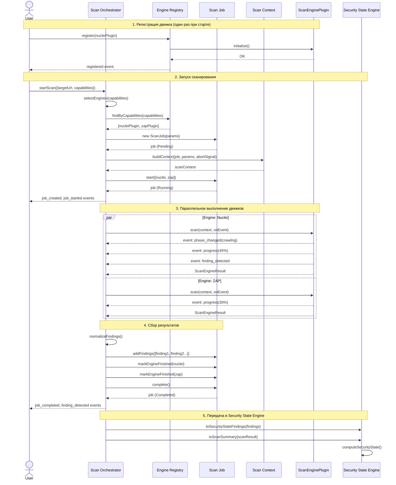

# TASK-201 — Scan Platform Foundation

## Артефакты реализации

**Дата:** 2026-07-15
**Статус:** ✅ Completed — 78/78 tests passing
**Ветка:** main (workspace v1.0.0+)

---

## 1. Обновлённая архитектурная схема

```mermaid
graph TB
    subgraph "Внешние клиенты"
        WEB["Web UI"]
        TG["Telegram Bot"]
        API_C["REST API"]
        CLI["CLI"]
    end

    subgraph "Scan Platform (TASK-201)"
        direction TB
        ORCH["Scan Orchestrator<br/>scan-orchestrator.ts"]
        REG["Engine Registry<br/>engine-registry.ts"]
        JOB["Scan Job<br/>scan-job.ts"]
        CTX["Scan Context<br/>scan-context.ts"]
        PLUG["Plugin API<br/>scan-engine-plugin.ts"]
    end

    subgraph "Domain Models (TASK-201)"
        direction TB
        FIND["Finding / Evidence"]
        TGT["ScanTarget"]
        RES["ScanResult"]
        PROF["ScanProfile"]
        EINFO["ScanEngineInfo"]
        EVT["Domain Events"]
        ERR["Error Classes"]
    end

    subgraph "Существующие движки (без изменений)"
        SSE["Security State Engine<br/>165 tests"]
        EE["Explainability Engine<br/>83 tests"]
    end

    subgraph "Будущие Scan Engines (TASK-202+)"
        direction TB
        NUC["Nuclei Plugin"]
        ZAP_P["ZAP Plugin"]
        KAT["Katana Plugin"]
        PW["Playwright Plugin"]
        CUST["Custom Scanner"]
    end

    %% Клиенты → Orchestrator
    WEB -->|POST /api/v1/scans| ORCH
    TG --> ORCH
    API_C --> ORCH
    CLI --> ORCH

    %% Orchestrator → внутренние компоненты
    ORCH -->|создаёт| JOB
    ORCH -->|строит| CTX
    ORCH -->|ищет движки| REG
    ORCH -->|вызывает .scan()| PLUG

    %% Registry → Plugin API
    REG -->|register()| PLUG
    REG -->|health()| PLUG

    %% Plugin API → движки
    PLUG -.->|implements| NUC
    PLUG -.->|implements| ZAP_P
    PLUG -.->|implements| KAT
    PLUG -.->|implements| PW
    PLUG -.->|implements| CUST

    %% Orchestrator → Domain Models
    ORCH -->|производит| FIND
    ORCH -->|потребляет| TGT
    ORCH -->|агрегирует| RES
    ORCH -->|использует| PROF

    %% Адаптеры SSE/EE
    FIND -->|"toSecurityStateFinding()"| SSE
    RES -->|"toScanSummary()"| SSE
    SSE -->|"computeSecurityState()"| EE

    %% Стили
    classDef platform fill:#EFF6FF,stroke:#3B82F6,stroke-width:2px
    classDef existing fill:#F0FDF4,stroke:#10B981,stroke-width:2px
    classDef future fill:#FEF3C7,stroke:#D97706,stroke-width:2px,stroke-dasharray:5 5
    classDef client fill:#F5F3FF,stroke:#8B5CF6,stroke-width:1px

    class ORCH,REG,JOB,CTX,PLUG platform
    class SSE,EE existing
    class NUC,ZAP_P,KAT,PW,CUST future
    class WEB,TG,API_C,CLI client
```

---

## 2. Диаграмма взаимодействия компонентов (Sequence Diagram)



---

## 3. Описание Plugin API

### 3.1 Контракт `ScanEnginePlugin`

Это **единственный интерфейс**, который разработчик движка должен реализовать.

```typescript
interface ScanEnginePlugin {
  // ─── Идентификация (статические метаданные) ───
  readonly id: string;           // "nuclei-v3"
  readonly name: string;         // "Nuclei v3"
  readonly version: string;      // "3.1.7"
  readonly description: string;
  readonly capabilities: readonly ScanCapability[];

  // ─── Жизненный цикл ───
  initialize(): Promise<void>;
  shutdown(): Promise<void>;

  // ─── Здоровье ───
  health(): Promise<HealthCheckResult>;

  // ─── Сканирование ───
  scan(context: ScanContext, onEvent: EngineEventCallback): Promise<ScanEngineResult>;

  // ─── Отмена ───
  cancel(jobId: string): Promise<void>;
}
```

### 3.2 Обязательства движка (контракт)

| Правило | Описание |
|---------|----------|
| **Не бросать исключения из `scan()`** | Вернуть `{ success: false, errorMessage }` вместо throw |
| **Уважать `abortSignal`** | Периодически проверять `context.abortSignal.aborted` |
| **Уважать `rateLimit`** | Не превышать `requestsPerSecond`, соблюдать `delayMs` |
| **Уважать `constraints`** | Остановиться при достижении `maxFindings`, `maxDurationSeconds` |
| **Эмитировать события** | Вызывать `onEvent()` для progress, phase changes, findings |
| **Потокобезопасность** | Допускать параллельные вызовы `scan()` с разными контекстами |

### 3.3 Возвратные типы

**`ScanEngineResult`** — то, что движок возвращает после завершения:
```typescript
interface ScanEngineResult {
  readonly success: boolean;
  readonly findings: readonly ScanEngineFinding[];
  readonly requestsCount: number;
  readonly durationMs: number;
  readonly errorMessage?: string;
  readonly errorCode?: string;
  readonly retryable?: boolean;
  readonly metadata?: Record<string, unknown>;
}
```

**`ScanEngineFinding`** — упрощённый формат находки. Orchestrator обогащает его до полного `Finding`:
```typescript
interface ScanEngineFinding {
  readonly title: string;
  readonly description: string;
  readonly severity: string;     // "critical" | "high" | "medium" | "low" | "info"
  readonly cweId?: string;       // "CWE-79"
  readonly location: {
    readonly url?: string;
    readonly method?: string;
    readonly parameter?: string;
  };
  readonly evidence: readonly { type: string; content: string }[];
  readonly remediation?: string;
  readonly confidence?: number;  // 0.0–1.0
}
```

### 3.4 События движка (стриминг в реальном времени)

```typescript
type ScanEngineEventType =
  | 'phase_changed'    // Смена фазы (crawling → testing)
  | 'progress'         // Обновление прогресса (0–100)
  | 'url_discovered'   // Найден URL при краулинге
  | 'finding_detected' // Обнаружена уязвимость
  | 'request_made'     // Выполнен HTTP-запрос
  | 'error'            // Некритическая ошибка
  | 'warning'          // Предупреждение
  | 'info';            // Информационное сообщение
```

### 3.5 Как интегрировать новый движок (TASK-202)

```typescript
import type { ScanEnginePlugin } from '@/domain/scan-platform';

class NucleiPlugin implements ScanEnginePlugin {
  readonly id = 'nuclei-v3';
  readonly name = 'Nuclei v3';
  readonly version = '3.1.7';
  readonly description = 'Template-based vulnerability scanner';
  readonly capabilities = [
    ScanCapability.VulnerabilityDetection,
    ScanCapability.ApiScanning,
    ScanCapability.DnsAnalysis,
  ];

  async initialize() {
    // Загрузить шаблоны, проверить бинарник
  }

  async health() {
    // Проверить доступность nuclei binary
    return { engineId: this.id, status: 'healthy', ... };
  }

  async scan(context, onEvent) {
    // Запустить nuclei с параметрами из context
    // Парсить JSON-вывод
    // Вызывать onEvent() для прогресса
    // Вернуть ScanEngineResult
  }

  async cancel(jobId) {
    // Убить процесс
  }

  async shutdown() {
    // Освободить ресурсы
  }
}

// Регистрация:
await registry.register(new NucleiPlugin());
```

---

## 4. Перечень созданных модулей

| # | Модуль | Файл | Назначение | LOC |
|---|--------|------|------------|-----|
| 1 | **Types** | `types/index.ts` | Enum-ы и типы-алиасы: Severity, ScanJobStatus, ScanCapability, FindingStatus, ScanTriggerType, EngineHealthStatus | 115 |
| 2 | **Domain Events** | `events/scan-events.ts` | 10 типов событий жизненного цикла сканирования | 130 |
| 3 | **Events Index** | `events/index.ts` | Barrel export | 15 |
| 4 | **Errors** | `errors/scan-errors.ts` | 10 классов ошибок с машинно-читаемыми кодами | 120 |
| 5 | **Errors Index** | `errors/index.ts` | Barrel export | 12 |
| 6 | **Finding** | `models/finding.ts` | Finding, Evidence, FindingLocation + SSE adapter (`toSecurityStateFinding`) | 155 |
| 7 | **ScanTarget** | `models/scan-target.ts` | ScanTarget, AuthenticationConfig, ScopeConfig, RateLimitConfig | 130 |
| 8 | **ScanResult** | `models/scan-result.ts` | ScanResult, EngineScanResult, SeverityBreakdown + SSE adapter (`toScanSummary`) | 120 |
| 9 | **ScanEngineInfo** | `models/scan-engine-info.ts` | ScanEngineInfo, HealthCheckResult | 55 |
| 10 | **ScanProfile** | `models/scan-profile.ts` | ScanProfile + 3 встроенных профиля (Quick, Full, API) | 100 |
| 11 | **Models Index** | `models/index.ts` | Barrel export всех моделей | 40 |
| 12 | **Scan Context** | `scan-context/scan-context.ts` | ScanContext (immutable) + ScanContextBuilder + ScanConstraints | 155 |
| 13 | **Scan Context Index** | `scan-context/index.ts` | Barrel export | 5 |
| 14 | **Plugin API** | `plugin-api/scan-engine-plugin.ts` | `ScanEnginePlugin` интерфейс, `ScanEngineResult`, `ScanEngineFinding`, `ScanEngineEvent` | 200 |
| 15 | **Plugin API Index** | `plugin-api/index.ts` | Barrel export | 7 |
| 16 | **Engine Registry** | `registry/engine-registry.ts` | `EngineRegistry` — регистрация, поиск по возможностям, health check, enable/disable | 230 |
| 17 | **Registry Index** | `registry/index.ts` | Barrel export | 5 |
| 18 | **Scan Job** | `scan-job/scan-job.ts` | `ScanJob` — конечный автомат (Pending→Running→Completed/Failed/Cancelled), прогресс, наблюдатели | 280 |
| 19 | **Scan Job Index** | `scan-job/index.ts` | Barrel export | 5 |
| 20 | **Scan Orchestrator** | `orchestrator/scan-orchestrator.ts` | `ScanOrchestrator` — маршрутизация, жизненный цикл, нормализация findings, ошибка | 350 |
| 21 | **Orchestrator Index** | `orchestrator/index.ts` | Barrel export | 5 |
| 22 | **Public API** | `index.ts` | Единая точка входа — barrel export всего модуля | 100 |
| 23 | **Registry Tests** | `__tests__/engine-registry.test.ts` | 25 тестов | 210 |
| 24 | **Scan Job Tests** | `__tests__/scan-job.test.ts` | 23 теста | 220 |
| 25 | **Orchestrator Tests** | `__tests__/orchestrator.test.ts` | 11 тестов | 200 |
| 26 | **Models Tests** | `__tests__/models-and-types.test.ts` | 19 тестов | 170 |

**Итого: 26 файлов, ~3,460 LOC (code), ~800 LOC (tests), 78 тестов, 100% pass rate**

---

## 5. Перечень публичных интерфейсов

### 5.1 Классы (runtime)

| Интерфейс | Модуль | Описание |
|-----------|--------|----------|
| `ScanOrchestrator` | `orchestrator/` | Центральный координатор. `start()`, `stop()`, `startScan()`, `cancelScan()`, `getJob()`, `getJobSnapshot()`, `getActiveJobs()`, `onEvent()` |
| `EngineRegistry` | `registry/` | Реестр движков. `register()`, `unregister()`, `getPlugin()`, `getInfo()`, `findByCapabilities()`, `enable()`, `disable()`, `healthCheck()`, `healthCheckAll()` |
| `ScanJob` | `scan-job/` | Модель задания. `start()`, `complete()`, `fail()`, `cancel()`, `addFindings()`, `updateEngineProgress()`, `markEngineFinished()`, `toSnapshot()`, `onStateChange()` |
| `ScanContextBuilder` | `scan-context/` | Builder. `withId()`, `withTarget()`, `withAuthentication()`, `withHeaders()`, `withScope()`, `withConstraints()`, `withProfile()`, `build()` |

### 5.2 Интерфейсы (contracts)

| Интерфейс | Модуль | Для кого |
|-----------|--------|----------|
| `ScanEnginePlugin` | `plugin-api/` | Разработчики движков (TASK-202+) |
| `ScanContext` | `scan-context/` | Разработчики движков (входные данные) |
| `ScanEngineResult` | `plugin-api/` | Разработчики движков (выходные данные) |
| `ScanEngineFinding` | `plugin-api/` | Разработчики движков (формат находки) |
| `ScanEngineEvent` | `plugin-api/` | Разработчики движков (события) |
| `EngineEventCallback` | `plugin-api/` | Разработчики движков (callback) |
| `HealthCheckResult` | `plugin-api/` | Разработчики движков (health check) |

### 5.3 Доменные модели (data)

| Модель | Для |
|--------|-----|
| `Finding`, `Evidence`, `FindingLocation` | Уязвимости (кросс-скановая дедупликация) |
| `ScanTarget` | Цель сканирования |
| `ScanResult`, `EngineScanResult`, `SeverityBreakdown` | Результат сканирования |
| `ScanProfile` | Профиль конфигурации сканирования |
| `ScanEngineInfo` | Метаданные движка |

### 5.4 Адаптеры Security State Engine

| Функция | Вход → Выход |
|---------|--------------|
| `toSecurityStateFinding(finding)` | `Finding` → `SecurityStateFinding` (SSE-совместимый) |
| `toSecurityStateFindings(findings[])` | `Finding[]` → `SecurityStateFinding[]` |
| `toScanSummary(result)` | `ScanResult` → `ScanSummaryForSSE` |

---

## 6. Список решений, принятых во время реализации

### ARCH-201-01: Plugin API — минимальная поверхность (5 методов)

**Решение:** Движок реализует ровно 5 методов: `initialize`, `shutdown`, `health`, `scan`, `cancel`.

**Альтернативы:** (A) Расширенный интерфейс с `validateTarget`, `estimateDuration`, `getTemplates`; (B) Два интерфейса — Core + Optional.

**Обоснование:** 5 методов — это минимальный набор, необходимый для полноценного управления жизненным циклом. Дополнительные методы можно добавить в будущих версиях без breaking changes (optional methods). Каждый дополнительный метод увеличивает стоимость интеграции нового движка, что противоречит цели "подключение любых движков без изменения ядра".

---

### ARCH-201-02: ScanEngineResult вместо прямого Finding

**Решение:** Движки возвращают упрощённый `ScanEngineFinding`, а Orchestrator обогащает его до полного доменного `Finding`.

**Обоснование:** Разные движки (Nuclei, ZAP, Playwright) производят данные в разных форматах. Нормализация в одном месте (Orchestrator) обеспечивает:
- Единое качество данных независимо от движка
- Присвоение глобальных ID и хешей для дедупликации
- Добавление targetId, scanJobId, detectedBy, timestamps
- Движкам не нужно знать о доменной модели платформы

---

### ARCH-201-03: ScanJob — mutable класс с immutable snapshots

**Решение:** `ScanJob` — mutable (внутреннее состояние меняется в процессе), но предоставляет `toSnapshot()` для immutable view.

**Обоснование:** Scan Job активно обновляется в процессе сканирования (progress, findings, engine status). Мutable класс упрощает обновления. Snapshot pattern обеспечивает безопасную передачу состояния во внешние компоненты (SSE, API responses) без риска мутации.

---

### ARCH-201-04: Observer pattern вместо EventEmitter

**Решение:** Использовать `onStateChange(callback): () => void` (вручную) вместо Node.js EventEmitter.

**Обоснование:** (1) Zero dependencies — модуль полностью framework-agnostic. (2) Типобезопасность — callback receives typed `ScanJob`, not generic `EventEmitter` args. (3) Легче тестировать — не нужно мокать EventEmitter. (4) Совместимость с browser environment (Telegram Mini App).

---

### ARCH-201-05: Capability-based routing, не hardcoded engine selection

**Решение:** `EngineRegistry.findByCapabilities([...])` — динамический поиск движков по декларируемым возможностям.

**Обоснование:** Позволяет добавлять новые движки (TASK-202+) без изменения кода маршрутизации. Если в будущем добавится движок с `ApiScanning` + `VulnerabilityDetection`, он автоматически будет участвовать в маршрутизации для соответствующих запросов.

---

### ARCH-201-06: SSE compatibility через адаптеры, не через наследование

**Решение:** Отдельные функции-адаптеры `toSecurityStateFinding()` и `toScanSummary()`, а не общие интерфейсы или наследование.

**Обоснование:** Security State Engine — стабильный модуль (165 тестов, 100% coverage). Изменение его интерфейсов недопустимо. Адаптеры создают единственную точку связи, которую легко тестировать и при необходимости менять. Если SSE изменит интерфейс — меняется только адаптер, а не весь Scan Platform.

---

### ARCH-201-07: ScanContext — immutable frozen object

**Решение:** `ScanContext` полностью readonly и `Object.freeze()`.

**Обоснование:** Контекст передаётся в движки, которые могут выполняться параллельно. Immutability гарантирует, что ни один движок не сможет случайно изменить контекст для другого. Это также упрощает логирование и отладку — контекст можно безопасно сериализовать в любом моменте.

---

### ARCH-201-08: Cooperative cancellation через AbortController

**Решение:** Использовать стандартный Web API `AbortSignal` для отмены, а не кастомный механизм.

**Обоснование:** (1) Стандартный API — работает в Node.js и browser. (2) Движки должны сами проверять `signal.aborted`, что позволяет корректно завершать работу (закрывать соединения, освобождать порты). (3) Telegram Mini App совместимость — AbortController доступен в всех современных средах.

---

### ARCH-201-09: Структурированные ошибки с машинно-читаемыми кодами

**Решение:** Все ошибки наследуют `ScanPlatformError` с полем `code` (например, `ENGINE_NOT_FOUND`, `SCAN_JOB_TERMINAL`).

**Обоснование:** Позволяет API-слою маппить ошибки в HTTP статусы (`ENGINE_NOT_FOUND` → 404, `ENGINE_ALREADY_REGISTERED` → 409) и i18n-сообщения. Также упрощает мониторинг — можно аггрегировать ошибки по коду, а не по тексту.

---

### ARCH-201-10: ScanProfile с встроенными профилями

**Решение:** Встроить 3 профиля (Quick Scan, Full Scan, API Scan) как immutable конфигурации.

**Обоснование:** Пользователям не нужно настраивать параметры с нуля. Built-in профили покрывают 90% use cases. Пользовательские профили (сохраняемые в БД) могут быть добавлены позже без изменения модуля.

---

## 7. Совместимость с существующими компонентами

### 7.1 Security State Engine — ✅ Без изменений

**Точка интеграции:** `toSecurityStateFinding()` и `toScanSummary()`

SSE получает:
- `SecurityStateFinding[]` — через `toSecurityStateFindings(findings)`
- `ScanSummaryForSSE` — через `toScanSummary(scanResult)`

Оба адаптера обеспечивают полное поле-совпадение с интерфейсом `Finding` из SSE:
```
id, targetId, title, severity, cweId, status,
firstSeenAt, lastSeenAt, lastResolvedAt,
resolutionCount, confidence, hash, location, evidence
```

### 7.2 Explainability Engine — ✅ Без изменений

EE потребляет `SecurityState` (результат SSE) и `SecurityStateSnapshot[]`. Поскольку SSE не меняется, EE также не требует изменений. Цепочка:

```
Scan Platform → [toSecurityStateFindings] → SSE → SecurityState → EE
```

### 7.3 Platform API Architecture — ✅ Совместимо

События Scan Platform следуют контракту `DomainEvent<T>` из `PLATFORM_API_ARCHITECTURE.md`:
```
{ id, type, version, timestamp, correlationId, jobId, metadata }
```

---

## 8. Проверка качества

| Критерий | Результат |
|----------|-----------|
| Циклические зависимости | ✅ Отсутствуют —单向ный graph: types ← models ← plugin-api ← scan-context ← registry ← orchestrator |
| Расширяемость | ✅ Новый движок = 1 класс, реализующий `ScanEnginePlugin` |
| SSE совместимость | ✅ Адаптеры `toSecurityStateFinding()` и `toScanSummary()` |
| EE совместимость | ✅ Косвенная (через SSE, который не меняется) |
| Читаемость API | ✅ 5 методов в Plugin API, fluent builder для ScanContext |
| Тесты | ✅ 78/78 passing (Registry: 25, Job: 23, Orchestrator: 11, Models: 19) |
| Zero dependencies | ✅ Чистый TypeScript, только vitest для тестов |
| SOLID | ✅ SRP (одна ответственность), OCP (плагины без модификации ядра), LSP (любой plugin можно использовать), ISP (5 методов), DIP (orchestrator зависит от интерфейса, не от реализаций) |

---

## 9. Структура директорий

```
src/domain/scan-platform/
├── index.ts                          # Public API (barrel export)
├── types/
│   └── index.ts                      # Enum-ы, типы-алиасы
├── events/
│   ├── scan-events.ts                # 10 типов доменных событий
│   └── index.ts
├── errors/
│   ├── scan-errors.ts                # 10 классов ошибок
│   └── index.ts
├── models/
│   ├── finding.ts                    # Finding, Evidence, SSE adapter
│   ├── scan-target.ts                # ScanTarget, Auth, Scope, RateLimit
│   ├── scan-result.ts                # ScanResult, SeverityBreakdown, SSE adapter
│   ├── scan-engine-info.ts           # ScanEngineInfo, HealthCheckResult
│   ├── scan-profile.ts               # ScanProfile, BuiltinProfiles
│   └── index.ts
├── scan-context/
│   ├── scan-context.ts               # ScanContext, ScanContextBuilder
│   └── index.ts
├── plugin-api/
│   ├── scan-engine-plugin.ts         # ScanEnginePlugin (КОНТРАКТ)
│   └── index.ts
├── registry/
│   ├── engine-registry.ts            # EngineRegistry
│   └── index.ts
├── scan-job/
│   ├── scan-job.ts                   # ScanJob (state machine)
│   └── index.ts
├── orchestrator/
│   ├── scan-orchestrator.ts          # ScanOrchestrator
│   └── index.ts
└── __tests__/
    ├── engine-registry.test.ts       # 25 tests
    ├── scan-job.test.ts              # 23 tests
    ├── orchestrator.test.ts          # 11 tests
    └── models-and-types.test.ts      # 19 tests
```

---

## 10. Готовность к TASK-202

Платформа полностью готова к интеграции первых Scan Engine. TASK-202 требует:

1. Создать класс `NucleiPlugin implements ScanEnginePlugin` (≈150 LOC)
2. Создать класс `ZapPlugin implements ScanEnginePlugin` (≈150 LOC)
3. Зарегистрировать их: `registry.register(new NucleiPlugin())`
4. Вызвать `orchestrator.startScan(...)` — всё заработает

**Ни одна строка кода TASK-201 не потребует изменений.**