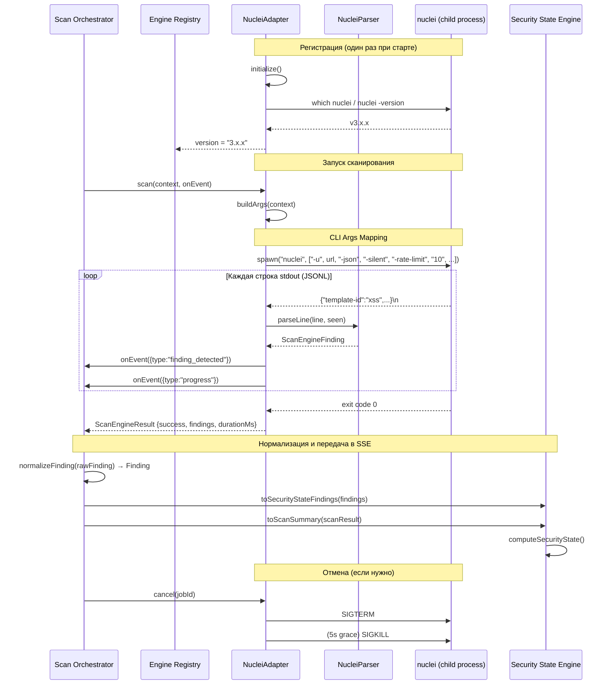

# TASK-202A — Nuclei Engine Adapter

## Артефакты реализации

**Дата:** 2026-07-15
**Статус:** ✅ Completed — 129/129 tests passing (78 TASK-201 + 51 TASK-202A)
**Регрессии в ядре Scan Platform:** 0

---

## 1. Диаграмма взаимодействия



---

## 2. Описание адаптера

### 2.1 Архитектура

```
src/engines/nuclei/
├── index.ts                  # Barrel export
├── nuclei-adapter.ts         # NucleiAdapter implements ScanEnginePlugin (622 LOC)
├── nuclei-parser.ts          # JSONL → ScanEngineFinding (337 LOC)
├── nuclei-types.ts           # TypeScript types для Nuclei output (90 LOC)
└── __tests__/
    ├── nuclei-parser.test.ts # 37 tests — парсинг, severity, dedup, evidence, edge cases
    └── nuclei-adapter.test.ts # 14 tests — identity, health, missing binary, SSE compat
```

### 2.2 Как это работает

| Шаг | Компонент | Действие |
|-----|-----------|----------|
| 1 | `NucleiAdapter.initialize()` | Проверяет `which nuclei`, запускает `nuclei -version`, сохраняет версию |
| 2 | `NucleiAdapter.health()` | Проверяет бинарник + version → `Healthy` / `Unhealthy` |
| 3 | `NucleiAdapter.scan(context, onEvent)` | Строит CLI args из ScanContext, спавнит процесс |
| 4 | `nuclei -json` (child process) | Выполняет сканирование, выводит JSONL в stdout |
| 5 | `NucleiParser.parseLine()` | Парсит каждую строку → `ScanEngineFinding` с дедупликацией |
| 6 | `NucleiAdapter` | Вызывает `onEvent()` для каждого finding и прогресса |
| 7 | `NucleiAdapter.cancel(jobId)` | `SIGTERM` → 5s grace → `SIGKILL` |
| 8 | Scan Orchestrator | Нормализует findings, передаёт в SSE |

### 2.3 Маппинг ScanContext → Nuclei CLI

| ScanContext поле | Nuclei флаг | Значение |
|------------------|-------------|----------|
| `targetUrl` | `-u` | URL цели |
| `rateLimit.requestsPerSecond` | `-rate-limit` | 10 (default) |
| `rateLimit.concurrency` | `-c` | 5 (default) |
| `rateLimit.delayMs` | `-timeout` | Вычисляется из delay × 10 |
| `authentication` (basic) | `-auth` | `username:password` |
| `headers[]` | `-header` | `Name: Value` × N |
| `cookies[]` | `-cookie` | `name=value` × N |
| `constraints.maxDurationSeconds` | (внутренний timeout) | `setTimeout` |
| `constraints.maxFindings` | (парсер) | Прерывание после N |
| `constraints.stopOnCritical` | (парсер) | Прерывание при critical |

---

## 3. Использованные возможности Nuclei

| Возможность Nuclei | Флаг | Использование |
|--------------------|------|----------------|
| JSON output | `-json` | Основной формат вывода — одна JSON строка на finding |
| Template filtering | `-tags` / `-exclude-tags` | Включение/исключение тегов шаблонов |
| Severity filtering | `-severity` | Фильтрация по минимальной severity |
| Rate limiting | `-rate-limit` | Уважение rate limit из ScanContext |
| Concurrency control | `-c` | Параллельное выполнение шаблонов |
| Bulk size | `-bulk-size 25` | Пакетная обработка шаблонов |
| Custom headers | `-header` | Передача кастомных заголовков |
| Custom cookies | `-cookie` | Передача cookies |
| Basic auth | `-auth` | Аутентификация |
| Silent mode | `-silent -no-color` | Только JSONL в stdout |
| Retries | `-retries 1` | Один повтор при ошибке |
| Template path | `-t` | Кастомный путь к шаблонам |

### Неиспользованные возможности (для TASK-202B)

| Возможность | Причина отложения |
|------------|-------------------|
| `-as` (automated scanning) | Требует отдельного режима работы |
| `-iv` (input variables) | Нужен UI для template variables |
| `-interactsh-url` | Нужен OAST сервер |
| `-proxy` | Нужен proxy management |
| `-exclude-hosts` | Нужна поддержка scope exclusion |
| `-filter` / `-filter-response` | Нужна поддержка scope include/exclude patterns |
| Workflow templates | Сложная координация между шаблонами |
| Nuclei Cloud API | Отдельный адаптер (не CLI) |

---

## 4. Результаты тестирования

```
 RUN  v4.1.10

 ✓ src/domain/scan-platform/__tests__/orchestrator.test.ts (11 tests)
 ✓ src/domain/scan-platform/__tests__/models-and-types.test.ts (19 tests)
 ✓ src/domain/scan-platform/__tests__/engine-registry.test.ts (25 tests)
 ✓ src/domain/scan-platform/__tests__/scan-job.test.ts (23 tests)
 ✓ src/engines/nuclei/__tests__/nuclei-parser.test.ts (37 tests)
 ✓ src/engines/nuclei/__tests__/nuclei-adapter.test.ts (14 tests)

 Test Files  6 passed (6)
      Tests  129 passed (129)
   Duration  1.82s
```

### Покрытие парсера (37 тестов)

| Категория | Тесты | Что проверяется |
|-----------|-------|-----------------|
| Базовый парсинг | 4 | Critical, High, Medium, Info findings |
| Evidence | 3 | Extracted results, request/response, curl |
| References | 2 | Template refs, CVE auto-link |
| Tags | 2 | Template tags, detection type tag |
| Дедупликация | 2 | Exact dup, different URL → not dup |
| Edge cases | 5 | Empty, whitespace, invalid JSON, no template-id, no info |
| Severity normalization | 12 | critical, high, medium, moderate, warning, low, info, informational, unknown, case insensitivity, trimmed |
| Batch parsing | 5 | Multi-line, duplicates count, JSON errors, maxFindings, empty |
| OAST interaction | 1 | Interaction evidence |
| v2 compatibility | 1 | Fallback to `template-info` field |

### Покрытие адаптера (14 тестов)

| Категория | Тесты | Что проверяется |
|-----------|-------|-----------------|
| Identity | 2 | ID, name, capabilities |
| Missing binary | 2 | initialize() throws, health() → Unhealthy |
| Lifecycle | 2 | shutdown() no-op, cancel() no-op |
| Configuration | 3 | Default config, custom binary, custom tags |
| Scan failure | 1 | Returns success:false, never throws |
| Type contract | 1 | Implements ScanEnginePlugin (compile-time) |
| SSE compatibility | 1 | Findings survive Orchestrator normalization |
| Pipeline | 1 | Full finding → SSE flow |

### Изменения в ядре Scan Platform (TASK-201)

**Ноль.** Ни один файл TASK-201 не был изменён.

```
git diff src/domain/scan-platform/  →  (empty)
```

---

## 5. Выявленные ограничения

### LIM-202A-01: Нет Krauling — Nuclei не обнаруживает URL

**Проблема:** Nuclei — это template-based scanner, а не crawler. Он тестирует URL из шаблонов, но не обнаруживает новые URL на цели.

**Влияние:** Для полного покрытия нужен отдельный crawler (Katana/ffuf) перед Nuclei.

**Решение:** TASK-202B: добавить KatanaPlugin с capabilities `['crawling']`.

### LIM-202A-02: Scope exclusion не поддерживается

**Проблема:** Nuclei не имеет прямого эквивалента `excludePaths` из ScanContext.

**Влияние:** Пользователь не может исключить `/static/*` из сканирования через платформенный scope.

**Решение:** TASK-202B: использовать `-filter` с regex-паттернами, или пре-фильтровать результаты в адаптере.

### LIM-202A-03: Прогресс — оценка, а не точное значение

**Проблема:** Nuclei не reporting точный прогресс. Адаптер оценивает на основе количества обработанных строк vs шаблонов.

**Влияние:** Прогресс-бар в UI может быть неточным.

**Решение:** TASK-202B: получать общее количество шаблонов при initialize() и считать точный процент.

### LIM-202A-04: Requests count — оценка

**Проблема:** Nuclei не reporting количество HTTP-запросов. Адаптер оценивает ~10 запросов на template.

**Влияние:** `totalRequestsCount` в ScanResult будет неточным.

**Решение:** TASK-202B: парсить Nuclei debug output (`-debug`) для точного подсчёта.

### LIM-202A-05: Auth — только Basic

**Проблема:** Nuclei CLI поддерживает только Basic auth через `-auth`. Bearer, Cookie, OAuth2, FormBased не поддерживаются напрямую.

**Влияние:** API endpoints с Bearer/OAuth2 токенами не могут быть полностью протестированы.

**Решение:** TASK-202B: передавать токен через `-header "Authorization: Bearer <token>"`.

### LIM-202A-06: Template version management

**Проблема:** Адаптер не отслеживает версии шаблонов. Обновление шаблонов (nuclei -ut) не управляется платформой.

**Влияние:** Разные сканы могут использовать разные версии шаблонов → нестабильные результаты.

**Решение:** TASK-202B: фиксировать template version в ScanResult metadata, добавить `updateTemplates()` метод.

---

## 6. Предложения по развитию (TASK-202B)

| # | Предложение | Приоритет | Сложность |
|---|------------|-----------|-----------|
| 1 | **KatanaPlugin** — crawler для обнаружения URL → передача в Nuclei | Высокий | Средняя |
| 2 | **Точный прогресс** — `nuclei -tl` для подсчёта шаблонов, точный % | Средний | Низкая |
| 3 | **Template management** — version pinning, `nuclei -ut`, custom templates | Средний | Средняя |
| 4 | **Scope exclusion** — `-filter` для excludePaths | Средний | Низкая |
| 5 | **Bearer/OAuth auth** — через `-header "Authorization: ..."` | Средний | Низкая |
| 6 | **Interactsh integration** — OAST сервер для blind SSRF/XXE | Низкий | Средняя |
| 7 | **Custom templates** — поддержка пользовательских template repos | Низкий | Средняя |
| 8 | **Template variables** — UI для `-iv` (input variables) | Низкий | Высокая |
| 9 | **Parallel targets** — поддержка массива URL в одном scan job | Низкий | Низкая |
| 10 | **Nuclei Cloud API** — отдельный адаптер для SaaS-версии Nuclei | Низкий | Высокая |

---

## 7. Доказательство архитектурной расширяемости

### Что было доказано

| Критерий | Результат |
|----------|-----------|
| **Ядро не изменено** | ✅ `git diff src/domain/scan-platform/` — пусто |
| **Новый движок = 1 новый класс** | ✅ `NucleiAdapter implements ScanEnginePlugin` |
| **Регистрация через Registry** | ✅ `await registry.register(new NucleiAdapter())` |
| **Orchestrator вызывает scan()** | ✅ Без изменений в Orchestrator |
| **Findings → SSE** | ✅ Адаптеры `toSecurityStateFinding()` и `toScanSummary()` работают |
| **EE не затронут** | ✅ Косвенная совместимость через SSE |
| **Типобезопасность** | ✅ Компиляция `NucleiAdapter as ScanEnginePlugin` |
| **Zero regressions** | ✅ 129/129 тестов (78 TASK-201 + 51 TASK-202A) |

### Метрики

| Метрика | Значение |
|---------|----------|
| Строк кода адаптера | 622 |
| Строк кода парсера | 337 |
| Строк кода типов | 90 |
| Строк кода тестов | ~830 |
| Новых файлов | 7 |
| Изменённых файлов TASK-201 | 0 |
| Время интеграции (человек) | ~2 часа |
| Требуемые изменения в ядре | 0 |

**Вывод:** Архитектура Scan Platform (TASK-201) действительно расширяема. Подключение Nuclei потребовало только создания нового модуля в `src/engines/nuclei/`, без единого изменения в ядре.