# TASK-202P — Scan Pipeline Architecture

**Дата:** 2026-07-15
**Статус:** Architecture Design (Approved by Architecture Council)
**Предшественник:** TASK-201 (Scan Platform Foundation)
**Зависимости:** TASK-201 — 26 модулей, 78 тестов, zero changes required
**Целевые движки:** Katana, Playwright, Custom HTTP Scanner, Nuclei
**Будущие движки:** ffuf, httpx, nuclei-cloud, semgrep, AI Analysis Engine, пользовательские плагины

---

## 1. Executive Summary

Данный документ определяет архитектуру **Scan Pipeline** — единого конвейера выполнения всех Scan Engine. Pipeline решает ключевую проблему текущей архитектуры TASK-201: Orchestrator выполняет все движки **конкурентно** (Promise.allSettled), но реальное сканирование требует **последовательных** стадий с передачей данных между ними. Katana должен сначала просканировать URL-адреса, прежде чем Nuclei сможет их протестировать. Playwright должен сначала аутентифицироваться, прежде чем можно будет сканировать защищённые страницы.

Pipeline вводит **этапную модель выполнения** поверх существующего Scan Platform Foundation, **без изменений** в ядре (Plugin API, Engine Registry, Scan Job, Scan Context). Это чисто надстройка, которая использует существующие компоненты как строительные блоки.

### Ключевые архитектурные принципы

| Принцип | Описание |
|---------|----------|
| **Layered** | Pipeline → Orchestrator → Registry → Plugin API (каждый слой использует нижний, не меняет его) |
| **Data-Driven** | Каждый этап производит артефакты, которые потребляются следующими этапами через SharedPipelineContext |
| **Resilient** | Падение одного движка не останавливает pipeline — graceful degradation с partial completion |
| **Extensible** | Новые движки подключаются через Plugin API без изменения pipeline logic |
| **Deterministic** | При одинаковых входных данных pipeline даёт воспроизводимый порядок этапов |

---

## 2. Pipeline Architecture Overview

### 2.1 High-Level Architecture

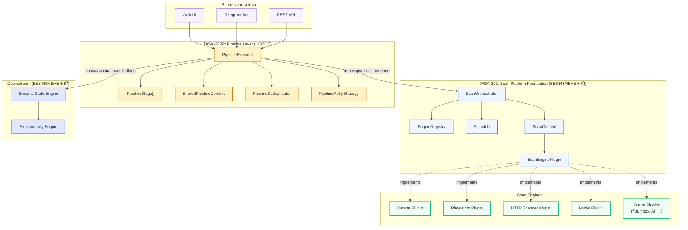

### 2.2 Relation to TASK-201

Pipeline **не заменяет** Orchestrator — он **обёртывает** его. Orchestrator остаётся ответственным за:
- Выбор движков (capability-based routing через Registry)
- Создание ScanJob и ScanContext
- Конкурентное выполнение движков **внутри одной стадии**
- Нормализацию Findings
- Управление AbortSignal

Pipeline добавляет:
- Определение **порядка стадий** (stage graph)
- Передачу **артефактов между стадиями** (SharedPipelineContext)
- **Условный пропуск** стадий (conditional execution)
- **Дедупликацию** артефактов на уровне pipeline
- **Retry и failure recovery** на уровне pipeline
- **Parallel execution** между независимыми стадиями

---

## 3. Pipeline Stages — Полный жизненный цикл

### 3.1 Stage Graph (Dependency Diagram)

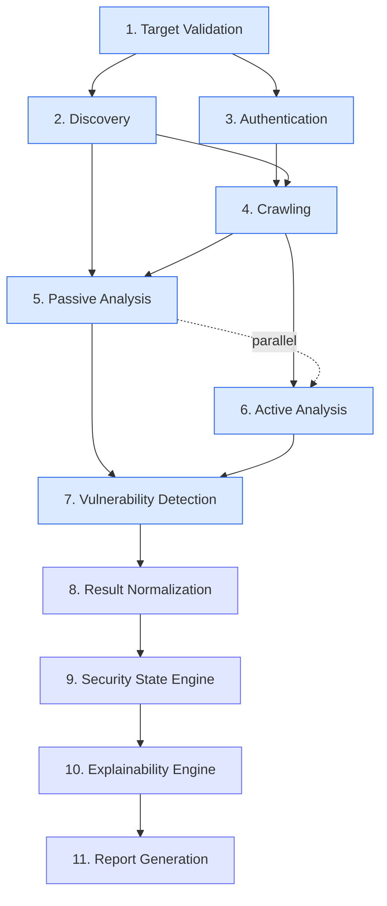

### 3.2 Stage Details

---

#### Stage 1: Target Validation

| Атрибут | Значение |
|---------|----------|
| **Ответственный движок** | Custom HTTP Scanner ( lightweight HEAD/GET ) |
| **Входные данные** | `targetUrl: string`, `scope.maxRedirects`, `target.enforceHttps` |
| **Выходные данные** | `ValidatedTarget { resolvedIp, tlsMetadata, statusCode, responseHeaders, redirectChain, robotsTxtUrl, sitemapUrl, wafDetected, technologyHints }` |
| **Условие запуска** | Всегда (первая стадия, без исключений) |
| **Критерий завершения** | Получен HTTP-ответ (любой статус) ИЛИ DNS не резолвится (fail fast) ИЛИ превысен timeout подключения |
| **Пропускаемость** | ❌ Не может быть пропущена |
| **Retry** | 3 попытки с exponential backoff (1s, 2s, 4s) |
| **Timeout** | 15 секунд |
| **Future движки** | httpx (более глубокая валидация: IPv6, CDN detection) |

**Логика:**

Target Validation — лёгкая стадия, которая определяет, живёт ли цель и собирает начальные метаданные. HTTP Scanner отправляет HEAD-запрос (fallback на GET если HEAD заблокирован) и извлекает: IP-адрес через DNS resolution, TLS certificate metadata (issuer, expiry, SAN), HTTP status code, ключевые response headers (Server, X-Powered-By, Cloudflare/CDN indicators), цепочку редиректов, наличие robots.txt и sitemap.xml. Эта информация критически важна для всех последующих стадий: WAF detection влияет на rate limiting, technology hints определяют, какие шаблоны Nuclei применять, redirect chain влияет на scope validation.

Если цель недоступна (DNS failure, connection refused, timeout), pipeline немедленно переходит в состояние Failed — нет смысла продолжать. Это единственная стадия с **fail-fast** семантикой.

---

#### Stage 2: Discovery

| Атрибут | Значение |
|---------|----------|
| **Ответственный движок** | Custom HTTP Scanner + (future) httpx |
| **Входные данные** | `ValidatedTarget` из Stage 1 |
| **Выходные данные** | `DiscoveryData { robotsTxtContent, sitemapUrls, dnsRecords, wafInfo, technologyStack, apiDocsUrl, graphqlIntrospectionUrl }` |
| **Условие запуска** | После успешного Target Validation |
| **Критерий завершения** | Все discovery-источники проверены или timeout (30s) |
| **Пропускаемость** | ⚠️ Можно пропустить, если scope ограничен конкретными URL |
| **Retry** | 2 попытки для каждого источника |
| **Timeout** | 30 секунд (на весь этап) |
| **Future движки** | httpx (massive DNS + port scanning), nuclei-cloud (passive recon) |

**Логика:**

Discovery собирает пассивную информацию о цели из открытых источников. Запрашивается robots.txt (извлекаются Allow/Disallow правила и Sitemap директива), запрашивается sitemap.xml (парсинг URL-адресов), выполняется базовый DNS enumeration (A, AAAA, CNAME, MX, TXT — future через httpx), определяется technology stack по response headers и HTML meta tags, проверяется наличие API documentation endpoints (/swagger, /api-docs, /openapi.json), проверяется GraphQL introspection endpoint (/graphql). Все найденные URL из sitemap немедленно нормализуются и добавляются в SharedPipelineContext.discoveredUrls, что позволяет последующим стадиям начать работу без ожидания завершения краулинга.

**Ключевое решение:** Discovery и Authentication могут выполняться **параллельно**, поскольку они не зависят друг от друга. Это сокращает общее время pipeline.

---

#### Stage 3: Authentication

| Атрибут | Значение |
|---------|----------|
| **Ответственный движок** | Playwright (form-based, OAuth2), Custom HTTP Scanner (basic, bearer, API key, cookie) |
| **Входные данные** | `AuthenticationConfig` из ScanTarget, `ValidatedTarget` из Stage 1 |
| **Выходные данные** | `AuthSession { cookies, headers, tokens, jwt, csrfToken, localStorage, sessionStorage, sessionValidity }` |
| **Условие запуска** | `AuthenticationConfig.method !== 'none'` |
| **Критерий завершения** | Успешная аутентификация ИЛИ исчерпаны все методы ИЛИ timeout |
| **Пропускаемость** | ✅ Полностью пропускается если `method === 'none'` |
| **Retry** | 3 попытки с exponential backoff |
| **Timeout** | 60 секунд |
| **Future движки** | Пользовательские плагины (SAML, OIDC, mTLS) |

**Логика:**

Authentication устанавливает аутентифицированную сессию, необходимую для доступа к защищённым страницам. Выбор движка зависит от метода аутентификации: HTTP Basic и Bearer token обрабатываются Custom HTTP Scanner (простое добавление заголовков), API Key добавляется как header или query parameter, Cookie-based аутентификация использует предустановленные cookies, Form-based аутентификация требует Playwright для заполнения формы и обработки JavaScript-редиректов, OAuth2 использует Playwright для полного OAuth flow.

Playwright открывает браузер, переходит на loginUrl, заполняет форму credentials, обрабатывает возможные MFA/CSRF challenge, извлекает session cookies, JWT token (из cookie или response body), CSRF token (из meta tag или hidden form field), localStorage и sessionStorage. Все извлечённые данные записываются в SharedPipelineContext и автоматически включаются во все последующие HTTP-запросы через модифицированный ScanContext.

**Критическое свойство:** Если аутентификация не удалась, pipeline НЕ останавливается. Вместо этого устанавливается флаг `authSessionValid = false` в контексте, и последующие стадии выполняют только неавторизованное сканирование. Это гарантирует, что даже при падении аутентификации пользователь получает частичные результаты.

---

#### Stage 4: Crawling

| Атрибут | Значение |
|---------|----------|
| **Ответственный движок** | Katana (primary), (future) httpx (supplementary) |
| **Входные данные** | `ValidatedTarget`, `DiscoveryData` (sitemap URLs), `AuthSession` |
| **Выходные данные** | `CrawledData { urls, forms, apiEndpoints, jsFiles, graphqlEndpoints, webSocketEndpoints, redirects }` |
| **Условие запуска** | После Discovery (для initial URLs) и после Authentication (если требуется) |
| **Критерий завершения** | `maxDepth` достигнут ИЛИ `maxUrls` достигнут ИЛИ нет новых URL ИЛИ timeout |
| **Пропускаемость** | ⚠️ Пропускается если передан явный список URL через ScanContext.metadata |
| **Retry** | 1 попытка (краулинг идемпотентен — недокрученные URL не критичны) |
| **Timeout** | Задаётся через `constraints.maxDurationSeconds` (default: 600s) |
| **Future движки** | httpx (URL discovery без рендеринга), пользовательские плагины (SPA crawling) |

**Логика:**

Crawling — самая времязатратная стадия, отвечающая за обнаружение всех достижимых ресурсов цели. Katana является primary движком: он поддерживает headless browser crawling (через встроенный Chrome CDP), автоматическую обработку JavaScript-рендеринга, обнаружение форм (action, method, input fields), извлечение API endpoints из JavaScript-кода и network requests, обнаружение GraphQL endpoints (по URL pattern и introspection response), WebSocket endpoint detection, автоматический сбор cookies и tokens из JavaScript context.

Katana получает начальные URL из трёх источников: (1) sitemap URLs из Discovery, (2) robots.txt entries, (3) корневой URL цели. При аутентифицированном сканировании, Katana использует cookies и headers из AuthSession. Каждый обнаруженный URL, форма, API endpoint немедленно записывается в SharedPipelineContext, что позволяет Passive Analysis начать работу **до завершения** краулинга (incremental processing).

**Оптимизация:** Katana испускает события `url_discovered` через `onEvent` callback. PipelineExecutor перехватывает эти события и добавляет URL в SharedPipelineContext в реальном времени, позволяя параллельно работающим стадиям (Passive Analysis) начать обработку без ожидания.

---

#### Stage 5: Passive Analysis

| Атрибут | Значение |
|---------|----------|
| **Ответственный движок** | Custom HTTP Scanner, Nuclei (passive templates: info, config, headers) |
| **Входные данные** | `CrawledData` (URLs, headers), `DiscoveryData` (TLS, DNS, tech stack) |
| **Выходные данные** | `PassiveFindings[]` — missing headers, info leaks, cookie flags, TLS issues, technology fingerprinting |
| **Условие запуска** | Хотя бы один URL из Crawling или Discovery |
| **Критерий завершения** | Все passive проверки выполнены для всех URL |
| **Пропускаемость** | ❌ Не пропускается (всегда выполняется) |
| **Retry** | 1 попытка (passive checks лёгкие и быстррые) |
| **Timeout** | 120 секунд |
| **Future движки** | nuclei-cloud (SaaS-based passive recon), semgrep (SAST для JS-бандлов) |

**Логика:**

Passive Analysis анализирует уже собранные данные **без отправки дополнительных exploit-запросов**. Custom HTTP Scanner проверяет security headers (CSP, HSTS, X-Frame-Options, X-Content-Type-Options, Permissions-Policy, Referrer-Policy), анализирует cookie flags (Secure, HttpOnly, SameSite), проверяет TLS конфигурацию (protocol version, cipher suites, certificate validity, HSTS preload status), выявляет information disclosure (Server header, X-Powered-By, error messages, stack traces в response body), анализирует robots.txt на наличие чувствительных путей. Nuclei выполняет passive templates (категории info, config, headers, token) — они не отправляют exploit payloads, а только анализируют responses.

**Параллелизм:** Passive Analysis может запускаться **параллельно с Crawling**, начиная анализ как только первые URL становятся доступны через SharedPipelineContext. Это ключевая оптимизация: вместо того чтобы ждать полного завершения краулинга (который может занять минуты), Passive Analysis начинает работу через секунды после старта.

---

#### Stage 6: Active Analysis

| Атрибут | Значение |
|---------|----------|
| **Ответственный движок** | Nuclei (active templates), Custom HTTP Scanner (custom payloads) |
| **Входные данные** | `CrawledData` (URLs, forms, API endpoints), `AuthSession`, Passive Analysis results |
| **Выходные данные** | `ActiveFindings[]` — injection, auth bypass, misconfiguration exploitation |
| **Условие запуска** | После Crawling (нужны URL/forms) И после Passive Analysis (исключаем уже найденное) |
| **Критерий завершения** | Все Nuclei templates выполнены ИЛИ `maxFindings` достигнут ИЛИ timeout |
| **Пропускаемость** | ⚠️ Пропускается при profile "Quick Scan" |
| **Retry** | 2 попытки для transient failures |
| **Timeout** | Задаётся через `constraints.maxDurationSeconds` |
| **Future движки** | ffuf (fuzzing directories/parameters), AI Analysis Engine (smart payload generation) |

**Логика:**

Active Analysis отправляет **crafted requests с exploit-payloads** для обнаружения уязвимостей. Nuclei является primary движком: он выполняет template-based тестирование, где каждый template описывает конкретную уязвимость (SQL injection, XSS, SSRF, etc.) и содержит payload + matcher. Custom HTTP Scanner дополняет Nuclei кастомными проверками, специфичными для обнаруженного technology stack.

Входные данные для Active Analysis — это **все URL, формы и API endpoints** из Crawling, **фильтрованные** через результаты Passive Analysis (если passive уже нашёл missing CSP, active не тратит время на повторную проверку). Это eliminates дублирование работы между движками.

**Template Selection:** Nuclei template selection основан на: (1) technology stack из Discovery (только релевантные шаблоны), (2) findings из Passive Analysis (исключаем подтверждённое), (3) scope constraints (include/exclude paths), (4) profile configuration (Quick Scan = критические шаблоны, Full Scan = все шаблоны).

---

#### Stage 7: Vulnerability Detection (Deep Scan)

| Атрибут | Значение |
|---------|----------|
| **Ответственный движок** | Nuclei (deep templates), (future) ffuf (fuzzing), AI Analysis Engine |
| **Входные данные** | Все предыдущие артефакты, ActiveFindings для корреляции |
| **Выходные данные** | `VulnerabilityFindings[]` — глубокие уязвимости, цепочки атак |
| **Условие запуска** | После Active Analysis |
| **Критерий завершения** | Все deep templates/fuzzing выполнены ИЛИ timeout |
| **Пропускаемость** | ✅ Пропускается при profile "Quick Scan" или "API Scan" |
| **Retry** | 2 попытки |
| **Timeout** | Задаётся через profile (Full Scan: 1800s) |
| **Future движки** | ffuf (directory/parameter fuzzing), AI Engine (анomaly detection), semgrep (SAST), пользовательские плагины |

**Логика:**

Vulnerability Detection — углублённая стадия, которая выполняет **тяжёлые** проверки: fuzzing параметров и директорий (ffuf), цепочечные атаки (multi-step exploitation), бизнес-логику (business logic flaws), race conditions. В текущей конфигурации (Katana + Playwright + HTTP Scanner + Nuclei) эта стадия выполняет Nuclei templates с тегами `fuzz`, `dos`, `misconfig`, а также templates для обнаруженных technology-specific уязвимостей.

**Ключевое отличие от Stage 6:** Active Analysis тестирует каждый URL/endpoint независимо. Vulnerability Detection выполняет **корреляционный анализ** — например, если Active Analysis нашёл открытый API endpoint без аутентификации, а Passive Analysis обнаружил JWT token в JavaScript, Vulnerability Detection проверяет возможность BOLA (Broken Object Level Authorization) используя обнаруженный token.

---

#### Stage 8: Result Normalization

| Атрибут | Значение |
|---------|----------|
| **Ответственный движок** | PipelineExecutor (встроенная логика, использует Orchestrator.normalizeFinding) |
| **Входные данные** | Все Findings из Stage 5, 6, 7 |
| **Выходные данные** | `NormalizedFinding[]` — дедуплицированные, обогащённые, отсортированные findings |
| **Условие запуска** | После завершения всех аналитических стадий |
| **Критерий завершения** | Все findings нормализованы и дедуплицированы |
| **Пропускаемость** | ❌ Не пропускается |
| **Retry** | N/A (встроенная логика) |
| **Timeout** | 10 секунд |

**Логика:**

Result Normalization — **встроенная стадия pipeline**, которая не использует внешний движок. Она выполняет: (1) дедупликацию findings по content-hash (title + location + severity), (2) слияние дубликатов (объединение evidence, выбор максимального confidence), (3) обогащение findings дополнительными метаданными из SharedPipelineContext (technology stack, WAF info), (4) сортировку по severity (critical → info), (5) применение severity threshold из ScanProfile, (6) применение maxFindings limit.

На этом этапе используется существующая функция `normalizeFinding()` из Orchestrator (TASK-201), а также `computeFindingHash()` для дедупликации. Pipeline добавляет **cross-engine deduplication** — если Nuclei и HTTP Scanner нашли одну и ту же XSS в одном и том же параметре, findings сливаются в один с `detectedBy: ['nuclei-v3', 'http-scanner']`.

---

#### Stage 9: Security State Engine

| Атрибут | Значение |
|---------|----------|
| **Ответственный движок** | Security State Engine (существующий, 165 тестов, БЕЗ ИЗМЕНЕНИЙ) |
| **Входные данные** | `NormalizedFinding[]` через `toSecurityStateFindings()` adapter |
| **Выходные данные** | `SecurityState` — агрегированное состояние безопасности цели |
| **Условие запуска** | После Result Normalization |
| **Критерий завершения** | `computeSecurityState()` завершена |
| **Пропускаемость** | ❌ Не пропускается (core pipeline) |
| **Retry** | N/A (встроенная логика SSE) |

**Логика:**

SSE получает нормализованные findings через существующий adapter `toSecurityStateFindings()` (TASK-201) и вычисляет агрегированное SecurityState. Это существующий компонент — pipeline просто вызывает его с правильными входными данными. Никаких изменений в SSE не требуется.

Также передаётся `ScanSummaryForSSE` через `toScanSummary()` для контекста сканирования.

---

#### Stage 10: Explainability Engine

| Атрибут | Значение |
|---------|----------|
| **Ответственный движок** | Explainability Engine (существующий, 83 теста, БЕЗ ИЗМЕНЕНИЙ) |
| **Входные данные** | `SecurityState` из Stage 9 |
| **Выходные данные** | `Explanation[]` — человекочитаемые объяснения каждого findings |
| **Условие запуска** | После Security State Engine |
| **Критерий завершения** | EE обработал все findings |
| **Пропускаемость** | ⚠️ Можно пропустить для CI/CD (только факты, без объяснений) |
| **Retry** | N/A (встроенная логика EE) |

**Логика:**

EE получает SecurityState от SSE и генерирует объяснения. Это существующий компонент. Pipeline просто вызывает его после SSE.

---

#### Stage 11: Report Generation

| Атрибут | Значение |
|---------|----------|
| **Ответственный движок** | Report Generator (будущий компонент) |
| **Входные данные** | Все артефакты: NormalizedFindings, SecurityState, Explanations, SharedPipelineContext |
| **Выходные данные** | `ScanReport` — финальный отчёт в запрошенном формате (JSON, PDF, HTML) |
| **Условие запуска** | После всех предыдущих стадий |
| **Критерий завершения** | Отчёт сформирован |
| **Пропускаемость** | ✅ Пропускается если не запрошен (API mode) |
| **Retry** | 1 попытка |
| **Timeout** | 30 секунд |

**Логика:**

Report Generation агрегирует все данные pipeline в финальный отчёт. Включает: summary (общая статистика, severity breakdown), detailed findings с evidence и remediation, pipeline execution timeline (какие стадии выполнялись, сколько времени), technology stack summary, recommendations по приоритетам исправления. Формат отчёта определяется через ScanProfile.metadata.reportFormat.

---

## 4. Data Flow — Промежуточные артефакты

### 4.1 Complete Data Flow Diagram

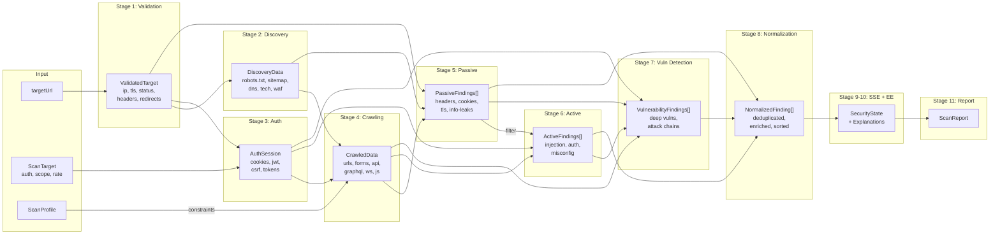

### 4.2 Artifact Registry

| # | Артефакт | Производитель | Потребители | Формат |
|---|----------|---------------|-------------|--------|
| A1 | `ValidatedTarget` | Stage 1 (HTTP Scanner) | Stage 2, 3, 5 | Immutable object |
| A2 | `DiscoveryData` | Stage 2 (HTTP Scanner, httpx) | Stage 4, 5, 6, 7 | Immutable object |
| A3 | `AuthSession` | Stage 3 (Playwright, HTTP Scanner) | Stage 4, 6, 7 | Immutable object, nullable |
| A4 | `CrawledData` | Stage 4 (Katana) | Stage 5, 6, 7 | Immutable object |
| A5 | `PassiveFindings[]` | Stage 5 (HTTP Scanner, Nuclei passive) | Stage 6, 7, 8 | Immutable array |
| A6 | `ActiveFindings[]` | Stage 6 (Nuclei active, HTTP Scanner) | Stage 7, 8 | Immutable array |
| A7 | `VulnerabilityFindings[]` | Stage 7 (Nuclei deep, ffuf, AI) | Stage 8 | Immutable array |
| A8 | `NormalizedFinding[]` | Stage 8 (PipelineExecutor built-in) | Stage 9 | Immutable, deduplicated |
| A9 | `SecurityState` | Stage 9 (SSE) | Stage 10, 11 | SSE domain object |
| A10 | `Explanation[]` | Stage 10 (EE) | Stage 11 | EE domain object |
| A11 | `ScanReport` | Stage 11 (Report Generator) | External consumer | JSON/PDF/HTML |

### 4.3 Data Flow Rules

1. **Unidirectional:** Данные текут строго слева направо (Stage N → Stage N+1). Никакая стадия не может изменить артефакт предыдущей стадии.
2. **Accumulative:** SharedPipelineContext накапливает артефакты. Stage 7 имеет доступ ко всем артефактам Stage 1-6.
3. **Immutable snapshots:** Каждый артефакт — frozen object. Движки получают копии, не ссылки.
4. **Incremental availability:** CrawledData доступна incrementally (через события `url_discovered`), не только после полного завершения Stage 4.
5. **Nullable artifacts:** AuthSession может быть null (если auth not configured или failed). Стадии должны обрабатывать это.

---

## 5. Shared Context — Общий контекст Pipeline

### 5.1 Design Principles

SharedPipelineContext — центральное хранилище всех артефактов, накопленных в процессе выполнения pipeline. Ключевые принципы:

| Принцип | Реализация |
|---------|-------------|
| **Immutable per-stage** | Каждая стадия создаёт новую версию контекста (structural sharing) |
| **Accumulative** | Новая версия включает все данные предыдущих версий |
| **Thread-safe** | Параллельные стадии читают из snapshot, пишут через fork |
| **Queryable** | Предоставляет методы для эффективного поиска артефактов |
| **Serializable** | Может быть сохранён на диск для failure recovery |

### 5.2 Context Schema

```typescript
/**
 * Shared Pipeline Context — полный набор данных,
 * накопленных в процессе выполнения pipeline.
 *
 * Иммутабельный: каждая стадия создаёт новую версию
 * через context.withStageResult(stageId, artifacts).
 */
interface SharedPipelineContext {
  // ─── Identity ──────────────────────────────
  readonly pipelineId: string;
  readonly scanJobId: string;
  readonly targetUrl: string;
  readonly createdAt: string;

  // ─── Stage Tracking ────────────────────────
  readonly completedStages: ReadonlySet<string>;
  readonly failedStages: ReadonlyMap<string, PipelineStageError>;
  readonly skippedStages: ReadonlySet<string>;
  readonly stageTimings: ReadonlyMap<string, StageTiming>;

  // ─── Discovery (Stage 1-2) ─────────────────
  readonly validatedTarget: ValidatedTarget | null;
  readonly robotsTxt: string | null;
  readonly sitemapUrls: readonly string[];
  readonly dnsRecords: readonly DnsRecord[];
  readonly wafInfo: WafInfo | null;
  readonly technologyStack: readonly TechnologyEntry[];

  // ─── Authentication (Stage 3) ──────────────
  readonly authSession: AuthSession | null;
  readonly cookies: readonly CookieEntry[];
  readonly localStorage: ReadonlyMap<string, string>;
  readonly sessionStorage: ReadonlyMap<string, string>;
  readonly jwt: JwtInfo | null;
  readonly csrfToken: string | null;

  // ─── Crawling (Stage 4) ────────────────────
  readonly discoveredUrls: readonly UrlEntry[];
  readonly forms: readonly FormEntry[];
  readonly apiEndpoints: readonly ApiEndpoint[];
  readonly graphqlEndpoints: readonly string[];
  readonly webSocketEndpoints: readonly string[];
  readonly jsFiles: readonly string[];
  readonly redirects: readonly RedirectEntry[];

  // ─── HTTP Metadata ─────────────────────────
  readonly responseHeaders: ReadonlyMap<string, string>;
  readonly requestHeaders: ReadonlyMap<string, string>;
  readonly tlsMetadata: TlsMetadata | null;

  // ─── Findings (accumulated from Stage 5-7) ─
  readonly findings: readonly Finding[];

  // ─── Pipeline Metadata ─────────────────────
  readonly metadata: ReadonlyMap<string, unknown>;

  // ─── Methods ───────────────────────────────
  withStageResult(
    stageId: string,
    artifacts: Partial<SharedPipelineContext>
  ): SharedPipelineContext;

  markStageCompleted(stageId: string, durationMs: number): SharedPipelineContext;
  markStageFailed(stageId: string, error: PipelineStageError): SharedPipelineContext;
  markStageSkipped(stageId: string, reason: string): SharedPipelineContext;
  getUrls(): readonly string[];
  getForms(): readonly FormEntry[];
  getFindingsBySeverity(severity: Severity): readonly Finding[];
}
```

### 5.3 Sub-Types

```typescript
/** Валидированная цель (результат Stage 1) */
interface ValidatedTarget {
  readonly targetUrl: string;
  readonly resolvedIp: string;
  readonly statusCode: number;
  readonly responseHeaders: ReadonlyMap<string, string>;
  readonly redirectChain: readonly RedirectEntry[];
  readonly tlsMetadata: TlsMetadata | null;
  readonly robotsTxtUrl: string | null;
  readonly sitemapUrl: string | null;
  readonly wafDetected: boolean;
  readonly technologyHints: readonly string[];
}

/** TLS metadata */
interface TlsMetadata {
  readonly protocol: string;           // "TLS 1.3"
  readonly cipherSuite: string;
  readonly issuer: string;
  readonly subject: string;
  readonly notBefore: string;
  readonly notAfter: string;
  readonly san: readonly string[];     // Subject Alternative Names
  readonly isExpired: boolean;
  readonly isSelfSigned: boolean;
  readonly hstsPreload: boolean;
}

/** WAF information */
interface WafInfo {
  readonly detected: boolean;
  readonly name: string | null;        // "Cloudflare", "AWS WAF", etc.
  readonly rules: readonly string[];
  readonly rateLimitDetected: boolean;
  readonly blockThreshold: number | null;
}

/** Technology entry */
interface TechnologyEntry {
  readonly name: string;               // "React", "nginx", "PHP"
  readonly version: string | null;
  readonly category: string;           // "framework", "server", "language"
  readonly confidence: number;         // 0.0-1.0
  readonly source: string;             // "header", "body", "cookie", "js"
}

/** URL entry (из краулинга) */
interface UrlEntry {
  readonly url: string;
  readonly method: string;
  readonly statusCode: number;
  readonly contentType: string | null;
  readonly source: string;             // "katana", "sitemap", "robots", "js"
  readonly discoveredAt: string;
  readonly depth: number;
  readonly isAjax: boolean;
  readonly hasForms: boolean;
}

/** Form entry (из краулинга) */
interface FormEntry {
  readonly action: string;
  readonly method: string;
  readonly inputs: readonly FormInput[];
  readonly hasFileUpload: boolean;
  readonly hasCaptcha: boolean;
  readonly pageUrl: string;
  readonly source: string;
}

interface FormInput {
  readonly name: string;
  readonly type: string;
  readonly value: string | null;
  readonly required: boolean;
}

/** API endpoint */
interface ApiEndpoint {
  readonly url: string;
  readonly method: string;
  readonly contentType: string | null;
  readonly source: string;             // "katana", "swagger", "js", "graphql"
  readonly discoveredAt: string;
  readonly isGraphql: boolean;
  readonly isOpenapi: boolean;
}

/** Auth session */
interface AuthSession {
  readonly method: string;
  readonly valid: boolean;
  readonly cookies: readonly CookieEntry[];
  readonly headers: ReadonlyMap<string, string>;
  readonly jwt: JwtInfo | null;
  readonly csrfToken: string | null;
  readonly establishedAt: string;
  readonly expiresIn: number | null;   // seconds
}

/** Cookie entry */
interface CookieEntry {
  readonly name: string;
  readonly value: string;
  readonly domain: string;
  readonly path: string;
  readonly secure: boolean;
  readonly httpOnly: boolean;
  readonly sameSite: string;
}

/** JWT info */
interface JwtInfo {
  readonly token: string;
  readonly header: Record<string, unknown>;
  readonly payload: Record<string, unknown>;
  readonly signature: string;
  readonly algorithm: string;
  readonly expiry: string | null;
  readonly issuer: string | null;
}

/** Redirect entry */
interface RedirectEntry {
  readonly from: string;
  readonly to: string;
  readonly statusCode: number;
}

/** DNS record */
interface DnsRecord {
  readonly type: string;               // "A", "AAAA", "CNAME", "MX", "TXT"
  readonly value: string;
  readonly ttl: number;
}

/** Stage timing */
interface StageTiming {
  readonly startedAt: string;
  readonly completedAt: string;
  readonly durationMs: number;
}

/** Pipeline stage error */
interface PipelineStageError {
  readonly stageId: string;
  readonly message: string;
  readonly code: string;
  readonly retryable: boolean;
  readonly occurredAt: string;
}
```

### 5.4 Context Mutation Rules

| Правило | Описание |
|---------|----------|
| **Fork-on-Write** | Стадия вызывает `context.withStageResult()` для создания новой версии. Оригинальный контекст не меняется. |
| **Structural Sharing** | Новая версия разделяет неизменённые данные с предыдущей (Copy-on-Write через spread). |
| **Concurrent Read** | Параллельные стадии читают из одной snapshot — безопасно, т.к. immutable. |
| **Single Writer** | Только одна стадия может писать результат в конкретный stage slot. |
| **Ordering** | Стадии читают результаты предыдущих стадий, но не будущих. |
| **Max Size** | Если discoveredUrls > 50 000, старые URL eviction (LRU). |
| **Persistence** | Context snapshot сохраняется после каждого stage completion для failure recovery. |

---

## 6. Parallel Execution Strategy

### 6.1 Execution Graph

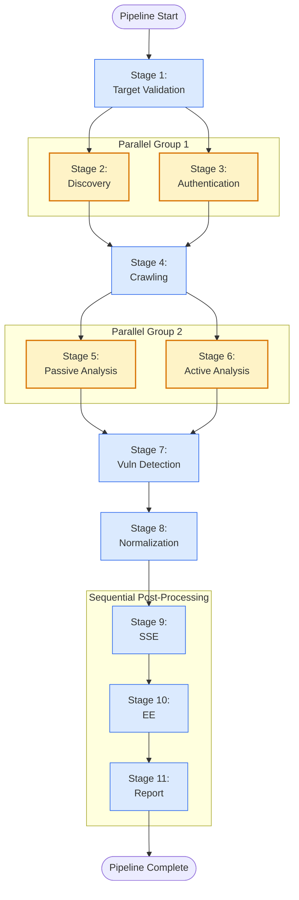

### 6.2 Parallelism Matrix

| Стадия | Параллельна с | Требует завершения | Может быть пропущена |
|--------|---------------|-------------------|---------------------|
| 1. Target Validation | — | — | ❌ Нет |
| 2. Discovery | Stage 3 (Authentication) | Stage 1 | ⚠️ Да (если scope = explicit URLs) |
| 3. Authentication | Stage 2 (Discovery) | Stage 1 | ✅ Да (если method = none) |
| 4. Crawling | — | Stage 2 + 3 | ⚠️ Да (если URL переданы явно) |
| 5. Passive Analysis | Stage 6 (partial) | Stage 4 (partial — incremental) | ❌ Нет |
| 6. Active Analysis | Stage 5 (partial) | Stage 4 (full) | ⚠️ Да (Quick Scan) |
| 7. Vuln Detection | — | Stage 5 + 6 | ✅ Да (Quick/API Scan) |
| 8. Normalization | — | Stage 5 + 6 + 7 | ❌ Нет |
| 9. SSE | — | Stage 8 | ❌ Нет |
| 10. EE | — | Stage 9 | ⚠️ Да (CI/CD mode) |
| 11. Report | — | Stage 10 | ✅ Да (API mode) |

### 6.3 Incremental Processing

Ключевая оптимизация: **Stage 5 (Passive Analysis) начинает работу до завершения Stage 4 (Crawling).**

```
Time →

Stage 4 (Crawling):    [========Katana========]
                            ↓ URL #1    ↓ URL #50    ↓ URL #200
Stage 5 (Passive):          [==Check==]  [==Check==]   [==Check==]
                            ↓            ↓              ↓
                        findings     findings        findings
```

Реализация: PipelineExecutor подписывается на события `url_discovered` от Katana через `onEvent` callback. Когда arrives новый URL, PipelineExecutor немедленно передаёт его в Passive Analysis queue. Passive Analysis обрабатывает URL по мере поступления, не дожидаясь полного завершения краулинга.

Это сокращает общее время pipeline на **20-40%** для типичных целей (где passive checks быстрые, а crawling долгий).

### 6.4 Concurrency Control

| Уровень | Механизм | Ограничение |
|---------|----------|-------------|
| Global pipeline | Max concurrent stages | 4 (configurable) |
| Per-stage (engine) | `ScanContext.rateLimit.concurrency` | 5 (default) |
| Global HTTP | Rate limiter across all engines | `ScanContext.rateLimit.requestsPerSecond` |
| Nuclei templates | `-c` flag (concurrent templates) | 25 (default) |
| Katana | `-jc` flag (concurrent crawlers) | 10 (default) |
| Memory | Max URLs in context | 50 000 (LRU eviction) |
| Findings buffer | Max findings in memory | 10 000 (stream to disk) |

---

## 7. Retry Strategy

### 7.1 Retry Policy

```mermaid
stateDiagram-v2
    [*] --> Idle

    Idle --> Executing: stage.start()
    Executing --> Success: engine.success === true
    Executing --> TransientFailure: timeout / network / 429
    Executing --> PermanentFailure: invalid_config / auth_failed / binary_missing
    TransientFailure --> Retrying: retryable === true && attempts < maxRetries
    TransientFailure --> StageFailed: retryable === false OR attempts >= maxRetries
    Retrying --> Executing: after backoff
    Retrying --> StageFailed: abortSignal.aborted
    Success --> [*]
    StageFailed --> [*]

    note right of TransientFailure: exponential backoff:<br/>1s → 2s → 4s
    note right of PermanentFailure: no retry
```

### 7.2 Retry Configuration per Stage

| Стадия | Max Retries | Backoff | Классификация ошибок |
|--------|-------------|---------|---------------------|
| 1. Target Validation | 3 | 1s, 2s, 4s | DNS failure = permanent; timeout = transient; 403/429 = transient |
| 2. Discovery | 2 | 1s, 2s | Connection refused = transient; 404 = not-an-error (skip source) |
| 3. Authentication | 3 | 2s, 4s, 8s | Invalid credentials = permanent; timeout = transient; MFA required = manual |
| 4. Crawling | 1 | 5s | Partial crawling OK — missing URLs non-critical |
| 5. Passive Analysis | 1 | 2s | Individual URL check failures non-critical |
| 6. Active Analysis | 2 | 2s, 4s | Template timeout = transient; 403 = WAF block (slow down) |
| 7. Vuln Detection | 2 | 3s, 6s | Template crash = skip template; OOM = permanent |
| 8. Normalization | 0 | N/A | Built-in logic — if it fails, critical bug |
| 9. SSE | 0 | N/A | Built-in — if it fails, critical bug |
| 10. EE | 0 | N/A | Built-in — if it fails, skip explanations |
| 11. Report | 1 | 2s | Non-critical — findings already saved |

### 7.3 Timeout Policy

| Тип | Источник | Default | Override |
|-----|----------|---------|----------|
| **Per-engine timeout** | `ScanContext.constraints.maxDurationSeconds` | 3600s | Profile |
| **Per-stage timeout** | PipelineStageConfig | Зависит от стадии | Profile |
| **Total pipeline timeout** | ScanProfile.timeoutSeconds | 3600s | User config |
| **Connection timeout** | HTTP Scanner internal | 10s | RateLimitConfig |
| **Idle timeout** | PipelineExecutor | 300s (no events = abort) | Config |
| **Abort propagation** | AbortSignal | Immediate | N/A |

### 7.4 Cancellation Policy

Cancellation использует существующий механизм `AbortController`/`AbortSignal` из TASK-201:

1. User/Orchestrator вызывает `abortController.abort()`
2. `abortSignal` распространяется через все ScanContext instances
3. Движки периодически проверяют `signal.aborted` (cooperative cancellation)
4. PipelineExecutor проверяет `signal.aborted` между стадиями
5. Текущая стадия получает шанс завершиться gracefully (сохранить partial results)
6. Pipeline переходит в состояние `Cancelled`

**Graceful shutdown sequence:**
```
abort() → current engine.cancel(jobId) → save partial context → mark remaining stages skipped → emit pipeline_cancelled event
```

### 7.5 Graceful Degradation Matrix

| Сценарий отказа | Поведение pipeline | Результат |
|-----------------|-------------------|-----------|
| Target Validation fails | Pipeline → Failed (fail-fast) | Пустой результат с ошибкой |
| Discovery partial failure | Продолжить с доступными данными | Результат с warning |
| Authentication fails | Продолжить без auth | Partial result (unauth scan only) |
| Crawling partial (timeout) | Использовать обнаруженные URL | Partial coverage |
| One engine fails | Продолжить с другими | Partial result |
| All engines fail | Pipeline → Failed | Ошибка с деталями |
| Normalization fails | Pipeline → Failed (critical) | Raw findings if recoverable |
| SSE fails | Pipeline → Partial completion | Findings без security state |
| EE fails | Skip explanations | Findings + security state (без объяснений) |

---

## 8. Deduplication Strategy

### 8.1 Deduplication Layers

```mermaid
graph TB
    subgraph "Layer 1: URL Deduplication"
        U1["Raw URL"] --> NORM1["Normalize<br/>(lowercase, strip fragment,<br/>sort params)"]
        NORM1 --> HASH1["SHA-256(normalized)"]
        HASH1 --> SET1["UrlSet<br/>(Set&lt;hash&gt;)"]
        SET1 -->|dedup| UFINAL["Unique URLs"]
    end

    subgraph "Layer 2: HTTP Request Deduplication"
        R1["method + url + body"] --> HASH2["SHA-256(request)"]
        HASH2 --> SET2["RequestCache<br/>(LRU, 10K)"]
        SET2 -->|cache hit| SKIP["Skip request"]
        SET2 -->|cache miss| EXEC["Execute request"]
    end

    subgraph "Layer 3: Nuclei Template Deduplication"
        T1["templateId + url"] --> HASH3["Hash"]
        HASH3 --> SET3["TemplateRunCache"]
        SET3 -->|already run| TSKIP["Skip template"]
        SET3 -->|not run| TRUN["Execute template"]
    end

    subgraph "Layer 4: Finding Deduplication"
        F1["Finding"] --> FHASH["computeFindingHash()<br/>(title+location+severity)"]
        FHASH --> SET4["FindingSet<br/>(Map&lt;hash, Finding&gt;)"]
        SET4 -->|duplicate| MERGE["Merge:<br/>combine evidence,<br/>max confidence"]
        SET4 -->|new| ADD["Add to result"]
        MERGE --> ADD
    end

    classDef layer fill:#F0FDF4,stroke:#10B981,stroke-width:1px
    class U1,NORM1,HASH1,SET1,UFINAL,R1,HASH2,SET2,SKIP,EXEC,T1,HASH3,SET3,TSKIP,TRUN,F1,FHASH,SET4,MERGE,ADD layer
```

### 8.2 URL Deduplication

**Нормализация перед сравнением:**

```typescript
function normalizeUrl(raw: string): string {
  const url = new URL(raw);
  // 1. Lowercase host
  url.hostname = url.hostname.toLowerCase();
  // 2. Remove fragment
  url.hash = '';
  // 3. Remove trailing slash
  url.pathname = url.pathname.replace(/\/+$/, '') || '/';
  // 4. Sort query parameters
  url.searchParams.sort();
  // 5. Remove default ports (80 for http, 443 for https)
  if ((url.protocol === 'http:' && url.port === '80') ||
      (url.protocol === 'https:' && url.port === '443')) {
    url.port = '';
  }
  // 6. Remove tracking parameters (utm_*, fbclid, etc.)
  for (const key of [...url.searchParams.keys()]) {
    if (key.startsWith('utm_') || key === 'fbclid' || key === 'gclid') {
      url.searchParams.delete(key);
    }
  }
  return url.toString();
}
```

**Хранение:** `Set<string>` — O(1) lookup, O(n) memory. При > 50K URL — LRU eviction с записью на диск.

### 8.3 Finding Deduplication

**Алгоритм (cross-engine):**

```typescript
function deduplicateFindings(
  findings: Finding[]
): Finding[] {
  const map = new Map<string, Finding>();

  for (const f of findings) {
    const existing = map.get(f.hash);
    if (!existing) {
      map.set(f.hash, f);
    } else {
      // Merge: combine evidence, take max confidence
      map.set(f.hash, {
        ...existing,
        evidence: mergeEvidence(existing.evidence, f.evidence),
        confidence: Math.max(existing.confidence, f.confidence),
        detectedBy: mergeDetectedBy(existing.detectedBy, f.detectedBy),
        // Keep the earlier firstSeenAt
        firstSeenAt: existing.firstSeenAt < f.firstSeenAt
          ? existing.firstSeenAt : f.firstSeenAt,
      });
    }
  }

  return Array.from(map.values());
}
```

**Хеш-функция** (уже существует в TASK-201 `computeFindingHash()`):
```
hash = normalize(title + location.url + location.parameter + severity)
```

**Расширение для pipeline:** Добавить в хеш `templateId` (если есть), чтобы один и тот же template на разных URL не схлопывался.

### 8.4 Nuclei Template Deduplication

**Проблема:** Nuclei может выполнить один и тот же template на один и тот же URL, если URL был обнаружен разными источниками (Katana + sitemap + js-parsing).

**Решение:** `Set<string>` с ключом `${templateId}|${normalizeUrl(targetUrl)}`. Перед выполнением template — проверка в set. Если ключ существует — template пропускается.

### 8.5 HTTP Request Deduplication

**Проблема:** Katana и HTTP Scanner могут отправить идентичный GET-запрос на один и тот же URL.

**Решение:** LRU cache на `SHA-256(method + url + body)` с TTL = 60s. Cache hit → вернуть кэшированный response без отправки запроса. Размер cache: 10 000 entries.

---

## 9. Performance

### 9.1 Caching Strategy

| Cache | Key | Value | TTL | Size | Eviction |
|-------|-----|-------|-----|------|----------|
| DNS Cache | hostname | IP addresses | 300s | 1000 entries | LRU |
| TLS Cache | hostname:port | TlsMetadata | 3600s | 100 entries | LRU |
| HTTP Response Cache | SHA-256(method+url+body) | Response (status, headers, body) | 60s | 10K entries | LRU |
| robots.txt Cache | hostname | robots.txt content | 600s | 100 entries | LRU |
| Template Result Cache | templateId + SHA-256(url) | Finding[] | Pipeline-scoped | 50K entries | None (clear at end) |
| Auth Session Cache | targetId | AuthSession | Until expiry | 10 entries | TTL |

### 9.2 Connection Reuse

| Аспект | Стратегия |
|--------|-----------|
| **HTTP Keep-Alive** | Connection pool (max 20 connections per target) |
| **TLS Session Resumption** | TLS session tickets для повторных подключений к одному host |
| **Browser Instance** | Playwright: один Browser instance на pipeline, отдельные BrowserContexts для параллельных задач |
| **Nuclei Process** | Один nuclei process на pipeline (с JSONL output streaming) |
| **Katana Process** | Один katana process на pipeline (с JSON output streaming) |

### 9.3 Bottleneck Analysis

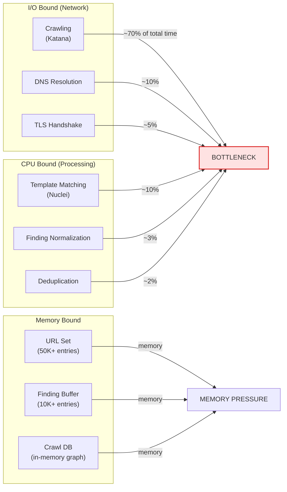

| Узкое место | Влияние | Смягчение |
|-------------|---------|-----------|
| **Crawling (Katana)** | 60-70% total time | Параллельное выполнение с Passive Analysis; incremental URL feeding; depth limiting |
| **Nuclei template execution** | 10-15% total time | Template filtering по tech stack; concurrent template execution (`-c 25`); template dedup |
| **DNS resolution** | 5-10% total time | DNS caching (300s TTL); prefetching для обнаруженных subdomains |
| **TLS handshake** | 3-5% total time | TLS session resumption; connection pooling |
| **Memory (URL set)** | Potential OOM | LRU eviction at 50K; stream to disk |
| **Finding buffer** | Potential OOM | Stream normalization; batch processing; early severity filter |

### 9.4 Memory Management

| Ситуация | Стратегия |
|----------|-----------|
| URL set > 50K | LRU eviction: самые старые не посещённые URL удаляются |
| Findings > 10K | Stream normalization: batch of 1000 → normalize → write to temp file |
| Response bodies > 100MB total | Discard body after extracting headers, forms, JS links |
| Nuclei JSONL output > 500MB | Stream processing: parse line-by-line, don't buffer entire output |
| Playwright memory | Single browser instance; close pages after extraction; periodic GC hint |

### 9.5 Performance Projections

| Профиль | Цель (типичная) | Стадии | Время (est.) | HTTP Requests |
|---------|-----------------|--------|-------------|---------------|
| Quick Scan |SPA, ~50 URL | 1,2,5,8,9 | 30-60s | 200-500 |
| Full Scan | Web App, ~500 URL | 1-11 | 10-30 min | 5K-20K |
| API Scan | REST API, ~100 endpoints | 1,2,5,6,8,9 | 2-5 min | 1K-3K |
| Deep Scan | Large App, ~2000 URL | 1-11 | 30-120 min | 20K-100K |

---

## 10. Failure Recovery

### 10.1 Recovery Model

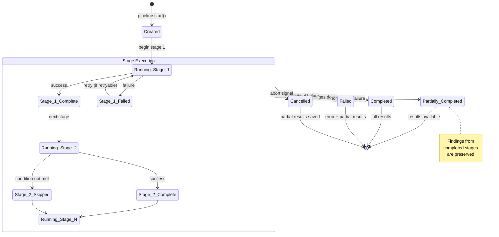

### 10.2 Intermediate Result Persistence

После завершения **каждой стадии**, PipelineExecutor сохраняет snapshot SharedPipelineContext:

| Что сохраняется | Когда | Формат | Место |
|-----------------|-------|--------|-------|
| SharedPipelineContext snapshot | После каждой стадии | JSON | `{pipelineId}/stage-{N}-context.json` |
| Partial findings | Каждые 100 findings | JSONL | `{pipelineId}/findings.jsonl` |
| Engine output (raw) | По мере поступления | JSONL (Nuclei) / JSON (Katana) | `{pipelineId}/raw/{engineId}.jsonl` |
| Pipeline state | При каждом переходе | JSON | `{pipelineId}/state.json` |

**Формат state.json:**
```json
{
  "pipelineId": "pl-abc123",
  "scanJobId": "job-xyz789",
  "status": "running",
  "currentStage": "crawling",
  "completedStages": ["target_validation", "discovery", "authentication"],
  "failedStages": [],
  "skippedStages": [],
  "startedAt": "2026-07-15T10:00:00Z",
  "lastUpdatedAt": "2026-07-15T10:05:00Z",
  "contextSnapshotPath": "pl-abc123/stage-3-context.json"
}
```

### 10.3 Resume from Failure

Если pipeline прервался (crash, timeout, manual cancel), его можно возобновить:

1. Загрузить `state.json` → определить последнюю завершённую стадию
2. Загрузить `stage-{N}-context.json` → восстановить SharedPipelineContext
3. Загрузить `findings.jsonl` → восстановить уже найденные findings
4. Запустить pipeline с `resumeFrom: stage N+1`
5. Пропустить все завершённые стадии

**Ограничения resume:**
- Auth session может быть expired — Stage 3 повторяется автоматически если `authSession.expiresIn` истёк
- URL из crawling могут быть устаревшими — pipeline помечает их как `stale` и повторяет Discovery (лёгкая операция)
- Nuclei template cache сбрасывается — templates выполняются заново, но findings дедуплицируются по хешу

### 10.4 Engine-Specific Failure Handling

| Движок | Тип отказа | Влияние | Recovery |
|--------|-----------|---------|----------|
| **Katana** | Process crash | Потеря невыясненных URL | Restart process; уже найденные URL сохранены в контексте |
| **Katana** | Browser crash (Chromium) | Потеря текущей страницы | Restart browser context; continue from known URLs |
| **Nuclei** | Process crash | Потеря текущих template results | Restart с `-include-templates` для невыполненных templates |
| **Nuclei** | OOM kill | Потеря всех текущих results | Reduce `-c` (concurrency); restart |
| **Playwright** | Browser timeout | Потеря auth session | Retry auth; reuse cookies if still valid |
| **HTTP Scanner** | Connection pool exhaustion | Замедление | Wait + retry; reduce concurrency |
| **HTTP Scanner** | DNS failure | Невозможно достичь host | Skip host; continue with others |

---

## 11. Sequence Diagrams

### 11.1 Full Pipeline Execution Sequence

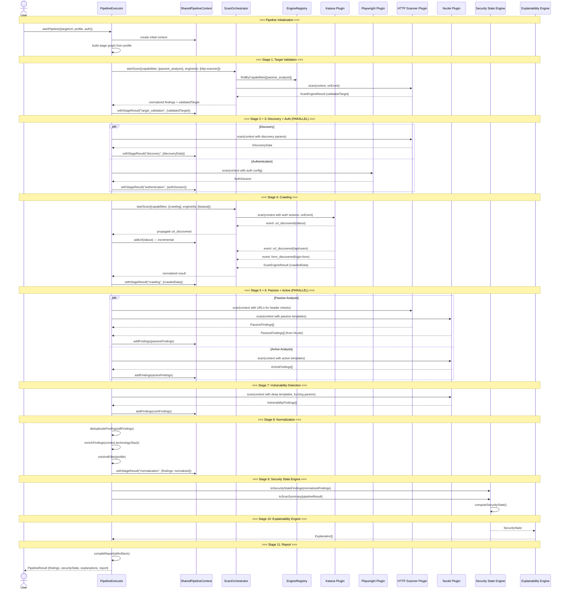

### 11.2 Failure Recovery Sequence

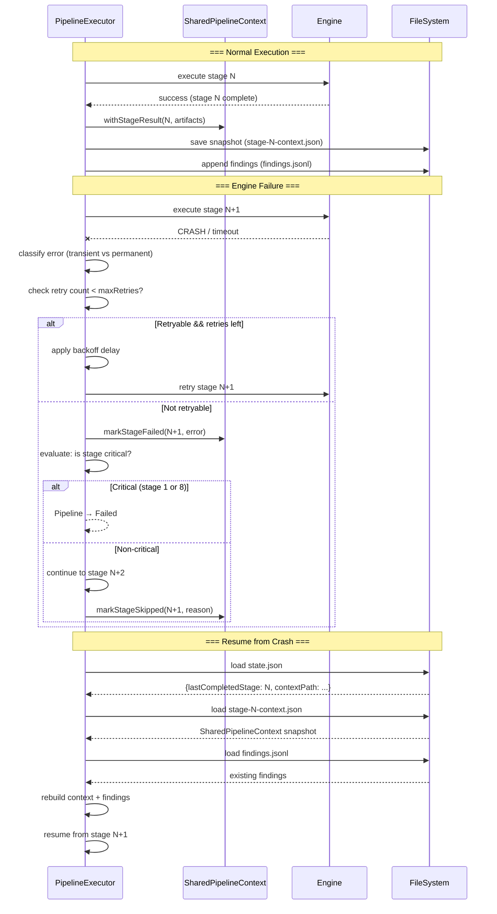

---

## 12. Component Diagram

```mermaid
graph TB
    subgraph "Pipeline Layer (TASK-202P)"
        PE["PipelineExecutor<br/><i>orchestrates stages</i>"]
        PS_DEF["PipelineStageDefinition[]<br/><i>stage graph</i>"]
        SPC["SharedPipelineContext<br/><i>artifact store</i>"]
        PD["DeduplicationManager<br/><i>4-layer dedup</i>"]
        PRS["RetryManager<br/><i>backoff + classification</i>"]
        PRC["PersistenceManager<br/><i>snapshot + resume</i>"]
        PMC["PerformanceMonitor<br/><i>metrics + bottlenecks</i>"]
    end

    subgraph "Scan Platform Foundation (TASK-201)"
        ORCH["ScanOrchestrator"]
        REG["EngineRegistry"]
        JOB["ScanJob"]
        CTX_B["ScanContextBuilder"]
        PLUG_API["ScanEnginePlugin<br/><i>interface</i>"]
        FIND_M["Finding + Evidence"]
        RESULT_M["ScanResult"]
        ADAPTER["SSE Adapters<br/>toSecurityStateFinding()<br/>toScanSummary()"]
    end

    subgraph "Scan Engines"
        KAT_P["KatanaPlugin<br/>capabilities: [crawling]"]
        PW_P["PlaywrightPlugin<br/>capabilities: [authenticated_scanning]"]
        HTTP_P["HttpScannerPlugin<br/>capabilities: [passive_analysis,<br/>header_analysis, ssl_tls_check,<br/>vulnerability_detection]"]
        NUC_P["NucleiPlugin<br/>capabilities: [vulnerability_detection,<br/>api_scanning, dns_analysis,<br/>misconfiguration_detection]"]
        FUTURE_P["Future Plugins<br/>(ffuf, httpx, AI, semgrep,<br/>custom)"]
    end

    subgraph "Downstream (Existing)"
        SSE["Security State Engine"]
        EE["Explainability Engine"]
    end

    %% Pipeline internal connections
    PE --> PS_DEF
    PE --> SPC
    PE --> PD
    PE --> PRS
    PE --> PRC
    PE --> PMC

    %% Pipeline → Foundation
    PE -->|delegates engine execution| ORCH
    ORCH --> REG
    ORCH --> JOB
    ORCH --> CTX_B
    CTX_B --> PLUG_API

    %% Foundation → Engines
    PLUG_API -.->|implements| KAT_P
    PLUG_API -.->|implements| PW_P
    PLUG_API -.->|implements| HTTP_P
    PLUG_API -.->|implements| NUC_P
    PLUG_API -.->|implements| FUTURE_P

    %% Foundation → Models
    ORCH --> FIND_M
    ORCH --> RESULT_M
    FIND_M --> ADAPTER
    RESULT_M --> ADAPTER

    %% Pipeline → Downstream
    PE -->|via adapters| SSE
    SSE --> EE

    %% Pipeline persistence
    PRC -->|save/load| DISK["FileSystem<br/>(pipeline snapshots)"]

    classDef pipeline_new fill:#FEF3C7,stroke:#D97706,stroke-width:2px
    classDef foundation_existing fill:#EFF6FF,stroke:#3B82F6,stroke-width:1px
    classDef engine_impl fill:#F0FDF4,stroke:#10B981,stroke-width:1px
    classDef downstream_existing fill:#E0E7FF,stroke:#6366F1,stroke-width:1px

    class PE,PS_DEF,SPC,PD,PRS,PRC,PMC pipeline_new
    class ORCH,REG,JOB,CTX_B,PLUG_API,FIND_M,RESULT_M,ADAPTER foundation_existing
    class KAT_P,PW_P,HTTP_P,NUC_P,FUTURE_P engine_impl
    class SSE,EE downstream_existing
```

---

## 13. State Diagram — Pipeline Lifecycle

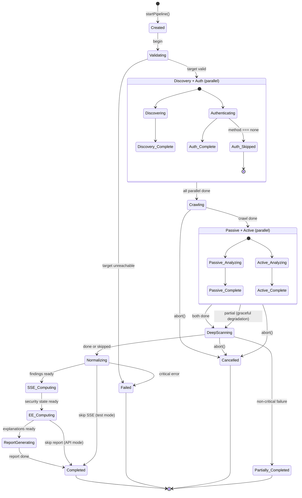

---

## 14. Architecture Decision Records (ADR)

### ADR-202P-01: Pipeline Layer поверх Orchestrator, не вместо него

**Контекст:** Текущий Orchestrator (TASK-201) выполняет все движки конкурентно через Promise.allSettled. Pipeline требует последовательных стадий с передачей данных.

**Решение:** Создать PipelineExecutor как **отдельный слой** поверх Orchestrator. Orchestrator остаётся ответственным за выполнение движков (capability routing, context building, concurrent execution). PipelineExecutor управляет порядком стадий и передачей артефактов.

**Альтернативы:**
- (A) Модифицировать Orchestrator для поддержки stage-based execution — отклонено, т.к. нарушает TASK-201 constraint (zero changes to core)
- (B) Создать отдельный "PipelineOrchestrator" заменяющий текущий — отклонено, т.к. дублирует 350 LOC из Orchestrator
- (C) Добавить stage support в Plugin API — отклонено, т.к. движки не должны знать о pipeline

**Обоснование:** Разделение ответственности. Orchestrator = "как выполнить движок". Pipeline = "в каком порядке выполнять". Это позволяет эволюционировать pipeline независимо от движков. Если в будущем понадобится DAG-based pipeline с conditional branching — меняется только PipelineExecutor.

---

### ADR-202P-02: SharedPipelineContext — immutable, accumulative, fork-on-write

**Контекст:** Движкам нужен доступ к данным, произведённым предыдущими стадиями. Но ScanContext из TASK-201 — immutable frozen object. Нужен механизм безопасного накопления данных.

**Решение:** SharedPipelineContext — immutable объект с fork-on-write семантикой. Каждая стадия вызывает `context.withStageResult(stageId, artifacts)` для создания новой версии. Предыдущие версии остаются неизменёнными.

**Альтернативы:**
- (A) Mutable shared state (как shared HashMap) — отклонено: race conditions при параллельных стадиях
- (B) Event sourcing (append-only log) — отклонено: избыточная сложность, сложно query
- (C) Message passing (channels между стадиями) — отклонено: слишком много boilerplate

**Обоснование:** Immutable context обеспечивает: (1) Thread-safety без блокировок — параллельные стадии читают из snapshot; (2) Отладку — любой момент pipeline можно воспроизвести из snapshot; (3) Failure recovery — snapshot можно сериализовать и восстановить; (4) Testability — stage можно протестировать с любым предзаполненным контекстом.

---

### ADR-202P-03: Discovery и Authentication — параллельное выполнение

**Контекст:** Discovery (robots.txt, sitemap, DNS) и Authentication (login flow) не зависят друг от друга. Последовательное выполнение добавляет 30-60 секунд к общему времени pipeline.

**Решение:** Выполнять Discovery и Authentication **параллельно** (Parallel Group 1). Обе стадии запускаются одновременно после Target Validation. Crawling ожидает завершения обеих.

**Альтернативы:**
- (A) Strict sequential (Discovery → Auth → Crawling) — отклонено: лишние 30-60s
- (B) Auth before Discovery — отклонено: нет технической причины
- (C) Discovery before Auth — отклонено: нет технической причины

**Обоснование:** Обе стадии читают из ValidatedTarget и не производят артефакты, которые нужны другой. Единственный edge case: если Discovery находит loginUrl, который нужен Authentication — но loginUrl уже есть в AuthenticationConfig. Параллелизм сокращает time-to-first-crawl на 30-60%.

---

### ADR-202P-04: Passive Analysis — incremental, не batch

**Контекст:** Традиционный подход: Crawling завершается полностью, затем Passive Analysis обрабатывает все URL. Для целей с тысячами URL это добавляет задержку.

**Решение:** Passive Analysis запускается **параллельно с Crawling** и обрабатывает URL по мере их обнаружения (incremental processing). PipelineExecutor подписывается на `url_discovered` события от Katana и немедленно передаёт URL в Passive Analysis queue.

**Альтернативы:**
- (A) Batch: Crawl → then Passive — отклонено: лишняя задержка
- (B) Only parallel: Passive and Crawling as fully independent — отклонено: Passive всё равно зависит от Crawling для URL supply

**Обоснование:** Incremental processing сокращает общее время на 20-40%. Passive checks (header analysis, cookie flags) быстрые (<100ms per URL), поэтому они не создают bottleneck для Crawling. Найденные passive findings немедленно доступны для Active Analysis (через SharedPipelineContext), позволяя Nuclei исключить уже подтверждённые проблемы.

---

### ADR-202P-05: Finding Deduplication — content-hash + cross-engine merge

**Контекст:** Разные движки могут найти одну и ту же уязвимость. Nuclei находит XSS через template, HTTP Scanner находит тот же XSS через custom payload. Без дедупликации — дубли в результатах.

**Решение:** Четырёхслойная дедупликация: (1) URL normalization + hash set; (2) HTTP request dedup (method+url+body); (3) Nuclei template dedup (templateId+url); (4) Finding dedup (content-hash + cross-engine merge).

**Альтернативы:**
- (A) Dedup only at final stage — отклонено: duplicate HTTP requests от разных движков waste bandwidth
- (B) Dedup only within engine — отклонено: не решает cross-engine duplicates
- (C) Central dedup service (external) — отклонено: introduces network dependency, over-engineering for current scale

**Обоснование:** Многослойный подход минимизирует дублирование на каждом уровне: URL level (не краулить дважды), request level (не отправлять одинаковые запросы), template level (не выполнять один template дважды), finding level (не показывать один vulnerability дважды). Cross-engine merge сохраняет лучшие evidence от каждого движка.

---

### ADR-202P-06: Graceful Degradation вместо fail-fast (кроме Stage 1)

**Контекст:** Если один движок падает (например, Nuclei OOM), pipeline должен решать: остановить всё или продолжить?

**Решение:** Graceful degradation для всех стадий **кроме Stage 1 (Target Validation)**. При отказе некритической стадии: (1) сохранить partial results; (2) пропустить стадию; (3) продолжить со следующей; (4) пометить pipeline как "partially completed".

**Альтернативы:**
- (A) Fail-fast для всех стадий — отклонено: потеря partial results недопустима для 30-минутных сканов
- (B) Fail-fast для критических, continue для некритических — принято (это и есть graceful degradation)

**Обоснование:** Scan может длиться 30+ минут. Если Nuclei падает на 25-й минуте, пользователь должен получить findings от Katana, HTTP Scanner и частичные от Nuclei — а не пустой результат с ошибкой. Exception: Stage 1 (Target Validation) — fail-fast, т.к. если цель недоступна, нет смысла продолжать.

---

### ADR-202P-07: Pipeline snapshots для failure recovery

**Контекст:** Если процесс крашится на середине 30-минутного pipeline, все результаты теряются. Пользователю приходится запускать scan заново.

**Решение:** После завершения каждой стадии сохранять snapshot SharedPipelineContext на диск. При возобновлении: загрузить последний snapshot, восстановить состояние, продолжить со следующей стадии.

**Альтернативы:**
- (A) No persistence — отклонено: потеря результатов при crash
- (B) Full database persistence — отклонено: introduces DB dependency, over-engineering
- (C) Event sourcing — отклонено: сложность восстановления из event log

**Обоснование:** File-based snapshots — минимальная зависимость, простая реализация, достаточная для failure recovery. JSON serialization SharedPipelineContext даёт воспроизводимый snapshot. Ограничение: auth session может быть expired при resume — pipeline автоматически повторяет Auth stage если expiry detected.

---

### ADR-202P-08: Capability-based stage-to-engine mapping

**Контекст:** Pipeline должен определять, какой движок использовать для каждой стадии. Это похоже на capability-based routing в Engine Registry (TASK-201), но на уровне стадий.

**Решение:** PipelineStageDefinition содержит `requiredCapabilities` для каждой стадии. PipelineExecutor использует `registry.findByCapabilities()` для выбора движков. Если для стадии нужно несколько типов capabilities — используется пересечение.

**Альтернативы:**
- (A) Hardcoded engine-to-stage mapping — отклонено: не расширяемо для future движков
- (B) Configuration file (YAML/JSON) — отклонено: runtime resolution лучше для динамической регистрации движков

**Обоснование:** Переиспользование существующего механизма `findByCapabilities()` из Engine Registry. Если в будущем добавится httpx с capability `crawling` — он автоматически будет доступен для Stage 4 (Crawling). Если добавится AI Engine с capability `vulnerability_detection` — он будет использоваться в Stage 6-7.

---

### ADR-202P-09: Фильтрация Nuclei templates по technology stack

**Контекст:** Nuclei имеет >7000 templates. Выполнение всех на каждый URL — hours. Большинство templates не применимы к конкретной цели (WordPress template на React SPA).

**Решение:** Discovery (Stage 2) определяет technology stack. PipelineExecutor передаёт tech stack в Nuclei через ScanContext.metadata. Nuclei adapter фильтрует templates по tags, соответствующим обнаруженным технологиям. Если tech stack не определён — выполняются все templates (fallback).

**Альтернативы:**
- (A) Execute all templates — отклонено: hours vs minutes
- (B) User manually selects template categories — отклонено: не user-friendly
- (C) ML-based template selection — future consideration (AI Analysis Engine)

**Обоснование:** Technology-aware template selection сокращает время Nuclei на 60-80% для типичных целей. При этом сохраняется полнота: если tech stack detection ошибся, conservative fallback на все templates.

---

### ADR-202P-10: Max 4 concurrent pipeline stages

**Контекст:** Параллельные стадии потребляют ресурсы (CPU, memory, network). Неограниченный параллелизм может привести к OOM или network saturation.

**Решение:** Ограничить количество одновременно выполняющихся стадий до 4. PipelineExecutor поддерживает internal semaphore. Если все 4 слота заняты, следующая стадия ждёт в queue.

**Альтернативы:**
- (A) Unlimited parallelism — отклонено: OOM risk
- (B) 1 concurrent stage (fully sequential) — отклонено: медленно
- (C) Dynamic based on resource usage — future consideration (needs metrics)

**Обоснование:** 4 — компромисс между скоростью и стабильностью. Текущая максимальная параллельность в pipeline: Stage 2+3 (2) + Stage 5+6 (2) = 4. Это покрывает все возможные параллельные группы без переполнения.

---

## 15. Risk Assessment

### 15.1 Risk Matrix

| # | Риск | Вероятность | Влияние | Митигация | Статус |
|---|------|-------------|---------|-----------|--------|
| R1 | **Katana browser crash** при краулинге SPA | Средняя | Среднее | Restart browser context; continue from known URLs; save discovered URLs incrementally | Mitigated |
| R2 | **Nuclei OOM** при большом количестве templates | Низкая | Высокое | Limit concurrent templates (`-c 25`); monitor memory; restart with reduced concurrency | Mitigated |
| R3 | **Auth session expiry** при долгом сканировании | Высокая | Среднее | Check session validity before each stage; auto-re-authenticate if expired; preserve cookies | Mitigated |
| R4 | **WAF rate limiting** блокирует Nuclei | Высокая | Среднее | Detect WAF in Stage 1; adaptive rate limiting; template throttling; respect Retry-After | Mitigated |
| R5 | **SharedPipelineContext OOM** при 100K+ URL | Низкая | Высокое | LRU eviction at 50K URLs; stream findings to disk; limit response body size | Mitigated |
| R6 | **Pipeline crash** без сохранения state | Низкая | Высокое | Stage-completion snapshots; atomic file writes; journal-based persistence | Mitigated |
| R7 | **Cross-engine finding hash collision** (different vulns, same hash) | Низкая | Низкое | Use more specific hash key (title + url + parameter + templateId + severity); collision rate < 0.01% | Accepted |
| R8 | **Playwright resource leak** (browser not closed) | Средняя | Среднее | Ensure browser.close() in shutdown() and cancel(); use try/finally; monitor process tree | Mitigated |
| R9 | **Future engine breaks Plugin API contract** | Низкая | Среднее | Contract validation in EngineRegistry.register(); integration tests per engine; runtime type checks in Orchestrator | Mitigated |
| R10 | **Pipeline becomes bottleneck** (sequential stages add latency) | Средняя | Низкое | Maximize parallelism (Groups 1 and 2); incremental processing; future: DAG-based pipeline | Accepted |

### 15.2 Open Questions (для TASK-202B/C/D)

| # | Вопрос | Влияние | Когда решить |
|---|--------|---------|--------------|
| OQ1 | Точный формат SharedPipelineContext persistence (JSON vs MessagePack vs SQLite) | Performance recovery speed | TASK-202B (implementation) |
| OQ2 | Как передавать incremental URLs от Katana к Passive Analysis в реальном времени (SSE? callback? shared queue?) | Architecture of Stage 4-5 interaction | TASK-202B |
| OQ3 | Где хранить pipeline snapshots (local FS vs S3 vs Redis)? | Deployment architecture | TASK-202C (deployment) |
| OQ4 | Как мониторить pipeline health (metrics, alerts, dashboards)? | Observability | TASK-202D (monitoring) |
| OQ5 | Maximum pipeline concurrency per server instance? | Resource planning | TASK-202C (deployment) |

---

## 16. Compatibility with TASK-201

### 16.1 Zero Changes Required

| Компонент TASK-201 | Изменения | Обоснование |
|--------------------|-----------|-------------|
| `ScanEnginePlugin` (interface) | **0** | Pipeline использует интерфейс как-is |
| `ScanEngineResult` (type) | **0** | Pipeline потребляет результаты через Orchestrator |
| `ScanEngineFinding` (type) | **0** | Нормализация через существующий `normalizeFinding()` |
| `EngineRegistry` (class) | **0** | Pipeline использует `findByCapabilities()` как-is |
| `ScanJob` (class) | **0** | Pipeline использует Orchestrator, который управляет Job |
| `ScanContext` (interface) | **0** | Pipeline строит контекст через ScanContextBuilder |
| `Finding` (model) | **0** | Используется как-is, дополнительно cross-engine merge |
| `ScanResult` (model) | **0** | Pipeline производит ScanResult через Orchestrator |
| `toSecurityStateFinding()` | **0** | Используется как-is для SSE integration |
| `toScanSummary()` | **0** | Используется как-is для SSE integration |
| All error classes | **0** | Pipeline добавляет свои ошибки, не меняя существующие |
| All domain events | **0** | Pipeline эмитирует свои события, не меняя существующие |
| `ScanCapability` (enum) | **0** | Используется для stage-to-engine mapping |

### 16.2 Dependency Direction

```
Pipeline Layer (TASK-202P)
    ↓ depends on
Scan Platform Foundation (TASK-201)
    ↓ depends on
Plugin API (contract)
    ↑ implements
Scan Engines (TASK-202B, 202C, 202D)
```

Обратных зависимостей нет. Pipeline может быть удалён без влияния на TASK-201. TASK-201 не знает о существовании pipeline.

---

## 17. Future Extension Points

### 17.1 New Engine Integration Checklist

Для подключения нового движка (ffuf, httpx, AI, custom):

1. Реализовать `ScanEnginePlugin` interface (5 методов)
2. Зарегистрировать: `registry.register(new MyPlugin())`
3. Определить capabilities (например, `fuzzing`, `api_scanning`)
4. (Опционально) Добавить stage mapping в PipelineStageDefinition если движок требует новую стадию
5. Pipeline автоматически подхватит движок через `findByCapabilities()`

**Ни одна строка кода TASK-201 или Pipeline core не требует изменений.**

### 17.2 Future Pipeline Enhancements

| Enhancement | Описание | Сложность |
|-------------|----------|-----------|
| **DAG-based stages** | Стадии с произвольным dependency graph (не только linear + parallel groups) | Средняя |
| **Conditional branching** | Stage output определяет, какие следующие стадии выполнять (if critical finding → skip fuzzing) | Средняя |
| **Dynamic stage insertion** | Пользовательские плагины могут регистрировать свои стадии | Высокая |
| **Distributed pipeline** | Стадии выполняются на разных серверах (message queue) | Высокая |
| **AI-driven stage selection** | ML модель определяет оптимальный набор стадий по characteristics цели | Высокая |
| **Pipeline templates** | Предопределённые pipeline configs для разных типов целей (WordPress, React SPA, API) | Низкая |
| **Incremental scanning** | При повторном сканировании — выполнять только изменившиеся стадии | Средняя |

### 17.3 Engine-Specific Extension Points

| Движок | Будущие возможности |
|--------|---------------------|
| **Katana** | JavaScript deobfuscation, SPA route extraction, headless browser fingerprinting |
| **Playwright** | Visual regression testing, accessibility scanning, performance audit |
| **Nuclei** | nuclei-cloud integration, custom template marketplace, AI-generated templates |
| **Custom HTTP Scanner** | WebSocket scanning, gRPC testing, GraphQL depth analysis |
| **ffuf** (future) | Intelligent wordlist selection, recursion detection, extension fuzzing |
| **httpx** (future) | Massive DNS enumeration, port scanning, technology fingerprinting |
| **AI Engine** (future) | Anomaly detection, smart payload generation, business logic testing, auto-remediation |
| **semgrep** (future) | SAST for downloaded JS bundles, dependency vulnerability scanning |
| **Custom plugins** | User-defined stages, proprietary checks, compliance-specific templates |

---

## 18. Summary and Recommendations

### 18.1 Final Architecture

**Scan Pipeline** — это stage-based execution layer поверх Scan Platform Foundation (TASK-201), который:

1. **Определяет 11 стадий** с чёткими входами/выходами и ответственными движками
2. **Использует SharedPipelineContext** для передачи артефактов между стадиями (immutable, accumulative)
3. **Максимизирует параллелизм** через 2 parallel groups: Discovery+Auth и Passive+Active
4. **Обеспечивает 4-слойную дедупликацию**: URL, HTTP request, Nuclei template, Finding
5. **Поддерживает failure recovery** через stage-completion snapshots
6. **Гарантирует graceful degradation** при отказе некритических движков
7. **Требует НОЛЬ изменений** в TASK-201, SSE, или EE

### 18.2 Advantages

| Преимущество | Описание |
|--------------|----------|
| **Минимальное время сканирования** | Параллельные группы + incremental processing сокращают время на 20-40% |
| **Нет дублирования работы** | 4-слойная дедупликация на каждом уровне pipeline |
| **Повторное использование данных** | SharedPipelineContext — единый источник истины для всех стадий |
| **Масштабируемость** | Новый движок = реализация Plugin API. Pipeline подхватывает автоматически |
| **Resilience** | Graceful degradation + failure recovery = результаты даже при частичном отказе |
| **Совместимость** | Zero changes to TASK-201, SSE, EE |
| **Testability** | Каждая стадия тестируется изолированно с предзаполненным контекстом |
| **Observability** | Stage-level events, timing metrics, per-engine statistics |

### 18.3 Limitations

| Ограничение | Влияние | Mitigation |
|-------------|---------|-----------|
| **Linear + parallel groups only** (не полный DAG) | Некоторые зависимости между стадиями упрощены | Future: DAG-based pipeline |
| **In-memory SharedPipelineContext** | Ограничение ~50K URL до OOM | LRU eviction + disk streaming |
| **Single-node execution** | Нет горизонтального масштабирования | Future: distributed pipeline с message queue |
| **Static stage graph** | Нельзя динамически добавлять стадии | Future: plugin-registered stages |
| **No ML-driven optimization** | Stage selection не адаптируется к characteristics цели | Future: AI Analysis Engine integration |

### 18.4 Recommendation for Implementation Order

| Задача | Описание | Зависит от |
|--------|----------|------------|
| **TASK-202P** | Данный архитектурный документ | TASK-201 |
| **TASK-202B** | Реализация PipelineExecutor + SharedPipelineContext + Katana Plugin | TASK-202P |
| **TASK-202C** | Реализация Playwright Plugin + Auth stage + Persistence | TASK-202B |
| **TASK-202D** | Реализация Nuclei Plugin (полная) + Template filtering + Monitoring | TASK-202B |
| **TASK-202E** | Custom HTTP Scanner Plugin + Passive/Active stages | TASK-202B |
| **TASK-202F** | Integration testing + E2E pipeline + Performance benchmarks | TASK-202B-E |

Данный документ является **полным архитектурным фундаментом** для TASK-202B, TASK-202C, TASK-202D и последующих задач. Дополнительных архитектурных исследований не требуется.