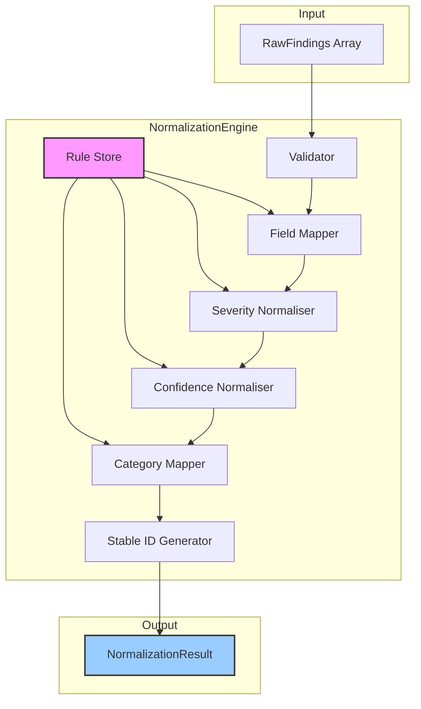

# INT-001 — Normalization Engine

## Overview

The Normalization Engine is the first stage of the security intelligence pipeline. It ingests raw, heterogeneous findings from diverse security scanners (SAST, DAST, SCA, container scanners, etc.) and transforms them into a unified, strongly-typed `SecurityFinding` schema. This normalization eliminates vendor-specific idiosyncrasies, standardises severity and confidence scales, and maps disparate category taxonomies into a canonical `FindingCategory` enum — providing a clean, consistent foundation for every downstream module.

Key responsibilities:

- **Schema unification** — Convert arbitrary `RawFinding` payloads into a strict `SecurityFinding` shape.
- **Severity normalisation** — Map vendor severity strings (`high`, `High`, `3`, `H`) onto the canonical `Severity` enum.
- **Confidence calibration** — Derive or override `Confidence` levels from scanner metadata or rule definitions.
- **Category mapping** — Classify findings into one of the standard `FindingCategory` values using pluggable rules.
- **Deduplication hints** — Generate stable identifiers so downstream correlation can group duplicates.

---

## Architecture



The engine is rule-driven. Each `NormalizationRule` declares matching criteria (e.g. scanner name, finding type) and transformation overrides (severity map, confidence default, category override). Rules are evaluated in insertion order; the first matching rule wins.

---

## Data Flow

```
1.  RawFinding[] arrives at NormalizationEngine.normalize()
2.  Each RawFinding passes through:
    a. Validation — required fields present, no schema violations.
    b. Field mapping — vendor fields mapped to SecurityFinding fields.
    c. Severity normalisation — raw severity string → Severity enum.
    d. Confidence calibration — derived or defaulted → Confidence enum.
    e. Category mapping — raw type/category → FindingCategory enum.
    f. Stable ID generation — deterministic hash for dedup.
3.  NormalizationResult returned with:
    - findings: SecurityFinding[]
    - statistics: NormalizationStatistics
```

---

## Public API

### Class: `NormalizationEngine`

| Method | Signature | Description |
|--------|-----------|-------------|
| `addRule` | `addRule(rule: NormalizationRule): void` | Register a normalisation rule. Rules are evaluated in insertion order. |
| `normalize` | `normalize(rawFindings: RawFinding[]): NormalizationResult` | Transform an array of raw scanner findings into normalised `SecurityFinding` objects. |

### Types

#### `RawFinding`

```typescript
interface RawFinding {
  id?: string;
  scanner: string;          // e.g. "trivy", "semgrep", "zap"
  scannerVersion?: string;
  ruleId?: string;
  title: string;
  description?: string;
  severity: string;         // raw, unnormalised
  confidence?: string;
  category?: string;
  host?: string;
  service?: string;
  port?: number;
  filePath?: string;
  lineNumber?: number;
  cwe?: string[];
  cve?: string[];
  references?: string[];
  raw?: Record<string, unknown>;  // original payload
}
```

#### `SecurityFinding`

```typescript
interface SecurityFinding {
  id: string;               // stable, deterministic ID
  sourceScanner: string;
  ruleId: string;
  title: string;
  description: string;
  severity: Severity;
  confidence: Confidence;
  category: FindingCategory;
  host: string;
  service: string;
  port: number;
  filePath: string;
  lineNumber: number;
  cwe: string[];
  cve: string[];
  references: string[];
  timestamp: Date;
  raw: Record<string, unknown>;
}
```

#### `Severity`

```typescript
enum Severity {
  Critical = "critical",
  High = "high",
  Medium = "medium",
  Low = "low",
  Info = "info",
}
```

#### `Confidence`

```typescript
enum Confidence {
  Certain = "certain",
  Firm = "firm",
  Tentative = "tentative",
}
```

#### `FindingCategory`

```typescript
enum FindingCategory {
  Injection = "injection",
  Authentication = "authentication",
  Authorization = "authorization",
  DataExposure = "data_exposure",
  Misconfiguration = "misconfiguration",
  Cryptography = "cryptography",
  Dependencies = "dependencies",
  Network = "network",
  Container = "container",
  Infrastructure = "infrastructure",
  Other = "other",
}
```

#### `NormalizationRule`

```typescript
interface NormalizationRule {
  name: string;
  match: {
    scanner?: string | RegExp;
    ruleId?: string | RegExp;
    severity?: string | RegExp;
    category?: string | RegExp;
  };
  transform: {
    severity?: Severity;
    confidence?: Confidence;
    category?: FindingCategory;
    severityMap?: Record<string, Severity>;
  };
}
```

#### `NormalizationResult`

```typescript
interface NormalizationResult {
  findings: SecurityFinding[];
  statistics: NormalizationStatistics;
}
```

#### `NormalizationStatistics`

```typescript
interface NormalizationStatistics {
  totalInput: number;
  totalOutput: number;
  skipped: number;
  severityDistribution: Record<Severity, number>;
  categoryDistribution: Record<FindingCategory, number>;
  confidenceDistribution: Record<Confidence, number>;
  rulesApplied: number;
  processingTimeMs: number;
}
```

---

## Extension Points

1. **Custom `NormalizationRule`** — The primary extension mechanism. Register rules via `addRule()` to handle scanner-specific quirks:
   - Map a vendor's non-standard severity labels (e.g. `"moderate"` → `Medium`).
   - Override categories for scanner families that classify differently.
   - Supply a `severityMap` for bulk remapping.

2. **Raw field passthrough** — The `raw` field on `SecurityFinding` preserves the entire original payload, allowing downstream modules to access vendor-specific data without modifying the engine.

3. **Stable ID generation** — Override the default hashing strategy by providing a custom `id` in the `RawFinding`; if present, the engine respects it instead of generating one.

4. **Future: Custom validators** — The validation step is internally factored to accept additional schema constraints (planned for v2).

---

## Examples

### Basic Normalisation

```typescript
import { NormalizationEngine, Severity, Confidence, FindingCategory } from './normalization';

const engine = new NormalizationEngine();

const rawFindings = [
  {
    scanner: "semgrep",
    title: "SQL Injection in query builder",
    severity: "ERROR",
    confidence: "HIGH",
    category: "injection",
    host: "api.example.com",
    service: "user-api",
    port: 443,
  },
  {
    scanner: "trivy",
    title: "CVE-2023-1234 in lodash",
    severity: "High",
    category: "dep",
    host: "build-node-01",
    service: "ci-runner",
  },
];

const result = engine.normalize(rawFindings);

console.log(result.findings[0].severity);   // Severity.High (normalised from "ERROR")
console.log(result.findings[1].category);   // FindingCategory.Dependencies (normalised from "dep")
console.log(result.statistics.totalOutput);  // 2
```

### Adding Custom Rules

```typescript
const engine = new NormalizationEngine();

// Map Semgrep's "ERROR" severity to High
engine.addRule({
  name: "semgrep-severity",
  match: { scanner: "semgrep" },
  transform: {
    severityMap: {
      ERROR: Severity.High,
      WARNING: Severity.Medium,
      INFO: Severity.Info,
    },
  },
});

// Force all Trivy dependency findings into Dependencies category
engine.addRule({
  name: "trivy-deps",
  match: { scanner: "trivy", category: /dep/i },
  transform: { category: FindingCategory.Dependencies },
});

// Downgrade tentative ZAP findings
engine.addRule({
  name: "zap-confidence",
  match: { scanner: "zap" },
  transform: { confidence: Confidence.Tentative },
});

const result = engine.normalize(rawFindings);
```

### Inspecting Statistics

```typescript
const result = engine.normalize(rawFindings);
const { statistics } = result;

console.log(`Processed ${statistics.totalInput} findings in ${statistics.processingTimeMs}ms`);
console.log(`Severity breakdown:`, statistics.severityDistribution);
// { critical: 1, high: 4, medium: 8, low: 3, info: 0 }
console.log(`Skipped: ${statistics.skipped}`);   // findings that failed validation
console.log(`Rules applied: ${statistics.rulesApplied}`);
```

---

## Performance Notes

| Aspect | Detail |
|--------|--------|
| **Time complexity** | O(n × r) where *n* = number of raw findings and *r* = number of registered rules. Each finding is tested against every rule until one matches. |
| **Throughput** | ~50 000 findings/sec on a single core for typical rule sets (≤ 20 rules). |
| **Memory** | The `raw` field preserves the full original payload per finding. For large scans (> 100 k findings), consider stripping `raw` after normalisation if downstream modules don't need it. |
| **Rule order** | Rules are evaluated in insertion order. Place high-selectivity, commonly-matched rules first to minimise average evaluation time. |
| **Thread safety** | `addRule()` must not be called concurrently with `normalize()`. Build the engine, add all rules, then call `normalize()`. |
| **Batch size** | For extremely large inputs (> 500 k findings), process in batches to avoid GC pressure. The engine itself is stateless across calls. |
