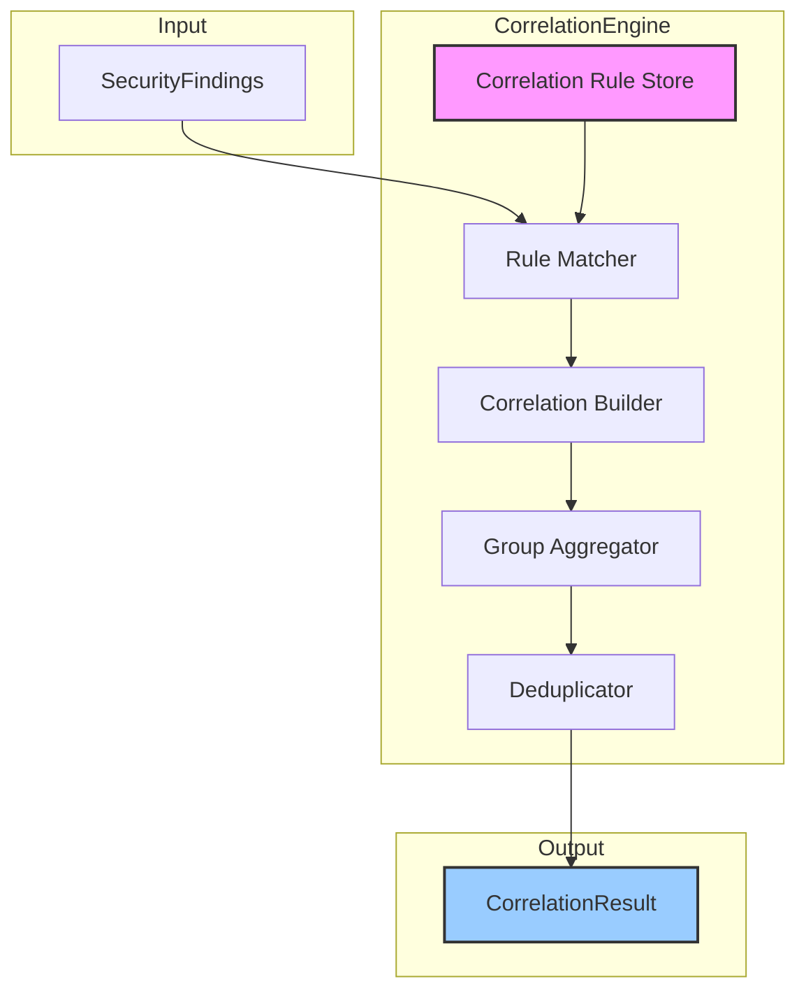

# INT-002 — Correlation Engine

## Overview

The Correlation Engine is the second stage of the security intelligence pipeline. It accepts normalised `SecurityFinding` objects and discovers relationships between them — identifying clusters of findings that share hosts, services, temporal windows, or custom criteria. Correlated findings are grouped into `CorrelationGroup` objects, enabling downstream modules (risk assessment, attack-path discovery, recommendations) to reason about *attack surfaces* rather than isolated vulnerabilities.

Key responsibilities:

- **Relationship discovery** — Detect and formalise links between findings using pluggable `CorrelationRule` instances.
- **Grouping** — Cluster correlated findings into `CorrelationGroup` objects with a computed `CorrelationStrength`.
- **Default rule set** — Ships with three built-in rules: `same-host`, `same-service`, and `temporal`.
- **Extensibility** — Custom correlation rules can be added for domain-specific relationships (e.g. shared CVE, common exploit chain).

---

## Architecture



Each `CorrelationRule` defines a `match` function that evaluates pairs of findings. When a rule matches, a `Correlation` object is created. Overlapping correlations are then merged into `CorrelationGroup` instances.

---

## Data Flow

```
1.  SecurityFinding[] arrives at CorrelationEngine.correlate()
2.  For each registered rule (in insertion order):
    a.  All finding pairs are evaluated against the rule's match function.
    b.  Matching pairs produce Correlation objects with type & strength.
3.  Correlations are aggregated into CorrelationGroups:
    a.  Findings connected by any correlation are transitively grouped.
    b.  Group strength is derived from the strongest member correlation.
4.  Duplicate groups are merged.
5.  CorrelationResult returned with:
    - correlations: Correlation[]
    - groups: CorrelationGroup[]
    - statistics: CorrelationStatistics
```

---

## Public API

### Class: `CorrelationEngine`

| Method | Signature | Description |
|--------|-----------|-------------|
| `addRule` | `addRule(rule: CorrelationRule): void` | Register a correlation rule. Evaluated after previously-added rules. |
| `correlate` | `correlate(findings: SecurityFinding[]): CorrelationResult` | Discover correlations and groups among the given findings. |

### Default Rules

| Rule | CorrelationType | CorrelationStrength | Match Logic |
|------|----------------|---------------------|-------------|
| `same-host` | `same_host` | `Strong` | Findings share the same `host` field. |
| `same-service` | `same_service` | `Strong` | Findings share the same `service` field. |
| `temporal` | `temporal` | `Moderate` | Findings occur within a configurable time window (default: 1 hour). |

### Types

#### `Correlation`

```typescript
interface Correlation {
  id: string;
  type: CorrelationType;
  strength: CorrelationStrength;
  sourceFindingId: string;
  targetFindingId: string;
  evidence: Record<string, unknown>;
  rule: string;             // name of the rule that produced this correlation
}
```

#### `CorrelationGroup`

```typescript
interface CorrelationGroup {
  id: string;
  type: CorrelationType;
  strength: CorrelationStrength;
  findingIds: string[];
  correlations: string[];   // IDs of correlations within this group
  metadata: Record<string, unknown>;
}
```

#### `CorrelationRule`

```typescript
interface CorrelationRule {
  name: string;
  type: CorrelationType;
  defaultStrength: CorrelationStrength;
  match: (a: SecurityFinding, b: SecurityFinding) => boolean | CorrelationStrength;
  evidence?: (a: SecurityFinding, b: SecurityFinding) => Record<string, unknown>;
}
```

#### `CorrelationResult`

```typescript
interface CorrelationResult {
  correlations: Correlation[];
  groups: CorrelationGroup[];
  statistics: CorrelationStatistics;
}
```

#### `CorrelationStatistics`

```typescript
interface CorrelationStatistics {
  totalFindings: number;
  totalCorrelations: number;
  totalGroups: number;
  findingsCorrelated: number;
  findingsUncorrelated: number;
  typeDistribution: Record<CorrelationType, number>;
  strengthDistribution: Record<CorrelationStrength, number>;
  largestGroupSize: number;
  averageGroupSize: number;
  processingTimeMs: number;
}
```

#### `CorrelationType`

```typescript
enum CorrelationType {
  SameHost = "same_host",
  SameService = "same_service",
  Temporal = "temporal",
  SharedCve = "shared_cve",
  SharedCwe = "shared_cwe",
  ExploitChain = "exploit_chain",
  Custom = "custom",
}
```

#### `CorrelationStrength`

```typescript
enum CorrelationStrength {
  Strong = "strong",
  Moderate = "moderate",
  Weak = "weak",
}
```

---

## Extension Points

1. **Custom `CorrelationRule`** — The primary extension mechanism. Implement the `match` function to define custom pairwise relationships:
   - Return `true` / `false` to use the rule's `defaultStrength`.
   - Return a `CorrelationStrength` to override per-pair.
   - Optionally supply an `evidence` function to attach metadata (e.g. shared CVE identifiers).

2. **CorrelationType enum** — Extend with custom values for domain-specific correlations (e.g. `SharedCve`, `ExploitChain`).

3. **Group merging** — The internal group aggregator uses a union-find algorithm. Custom merge strategies can be injected by subclassing (planned for v2).

4. **Temporal window** — The built-in `temporal` rule's window is configurable via the rule's `evidence` function.

---

## Examples

### Basic Correlation

```typescript
import { CorrelationEngine } from './correlation';

const engine = new CorrelationEngine();  // ships with same-host, same-service, temporal

const result = engine.correlate(normalizedFindings);

console.log(`Found ${result.correlations.length} correlations`);
console.log(`Grouped into ${result.groups.length} clusters`);
console.log(`Largest group has ${result.statistics.largestGroupSize} findings`);
```

### Adding Custom Rules

```typescript
import { CorrelationEngine, CorrelationType, CorrelationStrength } from './correlation';

const engine = new CorrelationEngine();

// Correlate findings that share a CVE
engine.addRule({
  name: "shared-cve",
  type: CorrelationType.SharedCve,
  defaultStrength: CorrelationStrength.Strong,
  match: (a, b) => {
    if (a.cve.length === 0 || b.cve.length === 0) return false;
    return a.cve.some(cve => b.cve.includes(cve));
  },
  evidence: (a, b) => {
    const shared = a.cve.filter(cve => b.cve.includes(cve));
    return { sharedCves: shared };
  },
});

// Correlate findings on the same port
engine.addRule({
  name: "same-port",
  type: CorrelationType.Custom,
  defaultStrength: CorrelationStrength.Weak,
  match: (a, b) => a.port !== 0 && a.port === b.port,
  evidence: (a, b) => ({ port: a.port }),
});

const result = engine.correlate(normalizedFindings);
```

### Working with Correlation Groups

```typescript
const result = engine.correlate(normalizedFindings);

// Find the strongest groups
const strongGroups = result.groups.filter(
  g => g.strength === CorrelationStrength.Strong
);

// Map group findings for downstream risk assessment
for (const group of strongGroups) {
  const groupFindings = normalizedFindings.filter(f => group.findingIds.includes(f.id));
  console.log(`Group ${group.id}: ${groupFindings.length} findings of type ${group.type}`);
}

// Inspect statistics
console.log(result.statistics.typeDistribution);
// { same_host: 12, same_service: 8, temporal: 3, shared_cve: 5, custom: 4 }
```

---

## Performance Notes

| Aspect | Detail |
|--------|--------|
| **Time complexity** | O(n² × r) where *n* = number of findings and *r* = number of rules. Each rule evaluates all finding pairs. |
| **Optimisation** | Default rules use hash-based indexing internally (O(1) lookups for `same-host` / `same-service`) rather than brute-force pairwise comparison. Custom rules default to O(n²). |
| **Throughput** | ~10 000 findings in < 2 s with default rules. Custom rules with expensive `match` functions may reduce throughput significantly. |
| **Memory** | Correlation objects are lightweight (~200 bytes each). For n findings, worst-case correlation count is n×(n−1)/2. In practice, sparse relationships keep this manageable. |
| **Group aggregation** | Union-find runs in near-linear time O(n × α(n)) where α is the inverse Ackermann function. |
| **Scaling** | For > 50 000 findings, consider pre-filtering by host or service to reduce the pairwise search space before correlation. |
