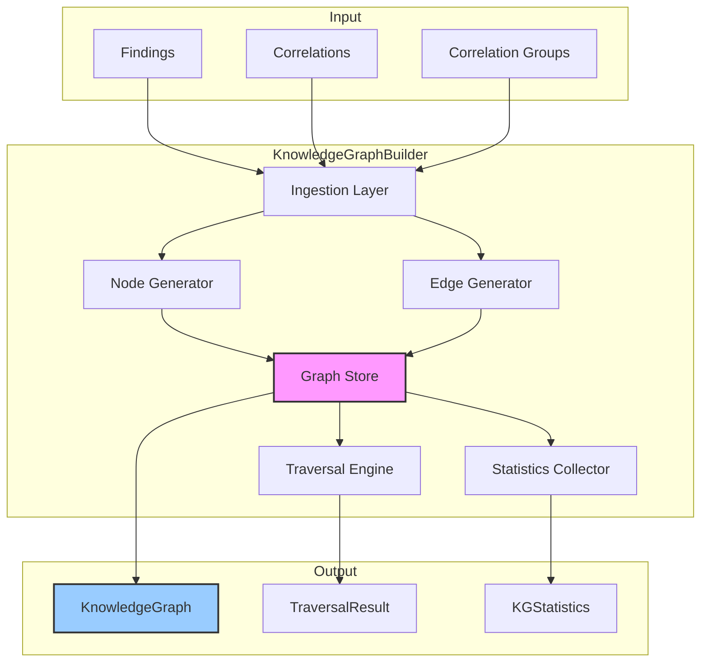

# INT-003 — Knowledge Graph

## Overview

The Knowledge Graph module constructs a rich, queryable graph representation of the security landscape. It ingests normalised findings, correlations, and correlation groups from the upstream pipeline and builds a property graph with 18 node types and 14 edge types. The graph enables powerful traversal queries that reveal hidden relationships, attack surfaces, and structural dependencies that are invisible in flat finding lists.

Key responsibilities:

- **Graph construction** — Build a property graph from findings, correlations, and groups with typed nodes and weighted edges.
- **Traversal** — Support depth-limited graph traversal from any starting node, returning the reachable sub-graph with path information.
- **Statistics** — Provide real-time graph statistics (node/edge counts, type distributions, connectivity metrics).
- **Incremental updates** — Support adding nodes and edges to an existing graph without full reconstruction.

---

## Architecture



The builder pattern allows incremental construction: `buildFromFindings()` creates the base graph, then `addCorrelations()` and `addGroups()` enrich it. Fine-grained control is available via `addNode()` and `addEdge()`.

---

## Data Flow

```
1.  buildFromFindings(findings)
    → Creates nodes for each finding, plus infrastructure nodes (hosts, services, ports, etc.)
    → Creates edges representing finding-to-infrastructure relationships

2.  addCorrelations(correlations, findings)
    → Creates CORRELATES edges between correlated finding nodes
    → Weight derived from CorrelationStrength

3.  addGroups(groups)
    → Creates GROUP_MEMBER edges from a group node to each member finding

4.  addNode / addEdge (manual)
    → Adds arbitrary nodes and edges for custom enrichment

5.  traverse(startId, maxDepth)
    → BFS/DFS from startId, returning reachable sub-graph

6.  getStatistics() / getGraph()
    → Returns current graph state
```

---

## Public API

### Class: `KnowledgeGraphBuilder`

| Method | Signature | Description |
|--------|-----------|-------------|
| `buildFromFindings` | `buildFromFindings(findings: SecurityFinding[]): KnowledgeGraphBuilder` | Create the base graph from findings. Generates nodes for findings and their associated infrastructure. |
| `addCorrelations` | `addCorrelations(correlations: Correlation[], findings: SecurityFinding[]): KnowledgeGraphBuilder` | Add correlation edges between existing finding nodes. |
| `addGroups` | `addGroups(groups: CorrelationGroup[]): KnowledgeGraphBuilder` | Add group nodes and member edges. |
| `addNode` | `addNode(id: string, type: NodeType, label: string, props?: Record<string, unknown>): KnowledgeGraphBuilder` | Add a single node manually. |
| `addEdge` | `addEdge(source: string, target: string, type: EdgeType, props?: Record<string, unknown>, weight?: number): KnowledgeGraphBuilder` | Add a single edge manually. |
| `traverse` | `traverse(startId: string, maxDepth: number): TraversalResult` | Depth-limited traversal from a given node. |
| `getStatistics` | `getStatistics(): KGStatistics` | Return current graph statistics. |
| `getGraph` | `getGraph(): KnowledgeGraph` | Return the full graph object. |

### Types

#### `KGNode`

```typescript
interface KGNode {
  id: string;
  type: NodeType;
  label: string;
  properties: Record<string, unknown>;
}
```

#### `KGEdge`

```typescript
interface KGEdge {
  id: string;
  source: string;
  target: string;
  type: EdgeType;
  properties: Record<string, unknown>;
  weight: number;
}
```

#### `NodeType`

```typescript
enum NodeType {
  Finding = "finding",
  Host = "host",
  Service = "service",
  Port = "port",
  Application = "application",
  Container = "container",
  Image = "image",
  Package = "package",
  Vulnerability = "vulnerability",
  User = "user",
  Network = "network",
  Database = "database",
  ApiEndpoint = "api_endpoint",
  Certificate = "certificate",
  Configuration = "configuration",
  CloudResource = "cloud_resource",
  CorrelationGroup = "correlation_group",
  AttackStep = "attack_step",
}
```

#### `EdgeType`

```typescript
enum EdgeType {
  Affects = "affects",
  RunsOn = "runs_on",
  Exposes = "exposes",
  DependsOn = "depends_on",
  CommunicatesWith = "communicates_with",
  Contains = "contains",
  Correlates = "correlates",
  GroupMember = "group_member",
  Exploits = "exploits",
  Mitigates = "mitigates",
  BelongsTo = "belongs_to",
  Accesses = "accesses",
  Hosts = "hosts",
  Triggers = "triggers",
}
```

#### `KnowledgeGraph`

```typescript
interface KnowledgeGraph {
  nodes: Map<string, KGNode>;
  edges: KGEdge[];
  adjacency: Map<string, string[]>;  // nodeId → edgeIds
}
```

#### `KGStatistics`

```typescript
interface KGStatistics {
  totalNodes: number;
  totalEdges: number;
  nodeTypeDistribution: Record<NodeType, number>;
  edgeTypeDistribution: Record<EdgeType, number>;
  averageDegree: number;
  maxDegree: number;
  connectedComponents: number;
  density: number;
}
```

#### `TraversalResult`

```typescript
interface TraversalResult {
  startId: string;
  maxDepth: number;
  visitedNodes: KGNode[];
  visitedEdges: KGEdge[];
  paths: Map<string, string[]>;  // nodeId → path from start
  depth: Map<string, number>;    // nodeId → depth from start
}
```

---

## Extension Points

1. **Custom `NodeType` / `EdgeType`** — Add domain-specific node and edge types by extending the enums and using `addNode()` / `addEdge()` directly.
2. **Custom traversal strategies** — Override the traversal algorithm by wrapping the `KnowledgeGraph` and implementing custom BFS/DFS/A* logic.
3. **Property enrichment** — Nodes and edges accept arbitrary `properties` records, enabling custom metadata without schema changes.
4. **Weight functions** — Edge weights can be set per-edge via `addEdge()`, allowing domain-specific importance scoring.
5. **External graph stores** — The `KnowledgeGraph` interface is serialisable; export to Neo4j, Neptune, or other graph databases for advanced queries.

---

## Examples

### Building a Knowledge Graph

```typescript
import { KnowledgeGraphBuilder, NodeType, EdgeType } from './knowledge-graph';

const builder = new KnowledgeGraphBuilder();

// Step 1: Build base graph from findings
builder.buildFromFindings(normalizedFindings);

// Step 2: Enrich with correlations
builder.addCorrelations(correlations, normalizedFindings);

// Step 3: Add correlation groups
builder.addGroups(correlationGroups);

const graph = builder.getGraph();
const stats = builder.getStatistics();

console.log(`Graph has ${stats.totalNodes} nodes and ${stats.totalEdges} edges`);
console.log(`Connected components: ${stats.connectedComponents}`);
```

### Manual Node and Edge Addition

```typescript
const builder = new KnowledgeGraphBuilder();

// Add infrastructure nodes
builder
  .addNode("user-admin", NodeType.User, "Admin User", { role: "admin", mfa: false })
  .addNode("db-prod", NodeType.Database, "Production DB", { engine: "postgres", version: "15.2" })
  .addNode("api-users", NodeType.ApiEndpoint, "/api/users", { method: "GET", auth: "token" });

// Add relationships
builder
  .addEdge("user-admin", "api-users", EdgeType.Accesses, { frequency: "daily" }, 0.8)
  .addEdge("api-users", "db-prod", EdgeType.CommunicatesWith, { protocol: "tcp" }, 0.9);

// Then add findings on top
builder.buildFromFindings(normalizedFindings);
```

### Graph Traversal

```typescript
// Traverse from a critical host, up to depth 3
const result = builder.traverse("host-api-prod-01", 3);

console.log(`Visited ${result.visitedNodes.length} nodes from host-api-prod-01`);
console.log(`Paths:`);
for (const [nodeId, path] of result.paths) {
  const depth = result.depth.get(nodeId);
  console.log(`  ${nodeId} (depth ${depth}): ${path.join(" → ")}`);
}

// Find all findings reachable from a compromised service
const reachable = result.visitedNodes.filter(n => n.type === NodeType.Finding);
console.log(`${reachable.length} findings reachable within 3 hops`);
```

### Inspecting Graph Statistics

```typescript
const stats = builder.getStatistics();

// Node type breakdown
for (const [type, count] of Object.entries(stats.nodeTypeDistribution)) {
  console.log(`  ${type}: ${count}`);
}

// Most connected nodes
const maxDegree = stats.maxDegree;
console.log(`Max node degree: ${maxDegree}`);

// Graph density
console.log(`Graph density: ${stats.density.toFixed(4)}`);
```

---

## Performance Notes

| Aspect | Detail |
|--------|--------|
| **Time complexity** | `buildFromFindings`: O(n) for n findings. `traverse`: O(V + E) for visited sub-graph. `addCorrelations` / `addGroups`: O(c) / O(g). |
| **Memory** | Graph stored as adjacency lists + node/edge maps. Roughly 500 bytes per node + 200 bytes per edge. A graph with 10 000 nodes and 30 000 edges uses ~12 MB. |
| **Traversal** | BFS is the default strategy. Depth-limited traversal avoids full-graph scans. For dense graphs, limit `maxDepth` to ≤ 5. |
| **Incremental updates** | `addNode` / `addEdge` are O(1). No full recomputation required. |
| **Serialisation** | `getGraph()` returns a serialisable object. JSON stringification of large graphs (> 100 k nodes) may take 1–2 seconds. |
| **Scaling** | For > 100 k nodes, consider exporting to an external graph database and using Cypher/Gremlin queries instead of in-memory traversal. |
