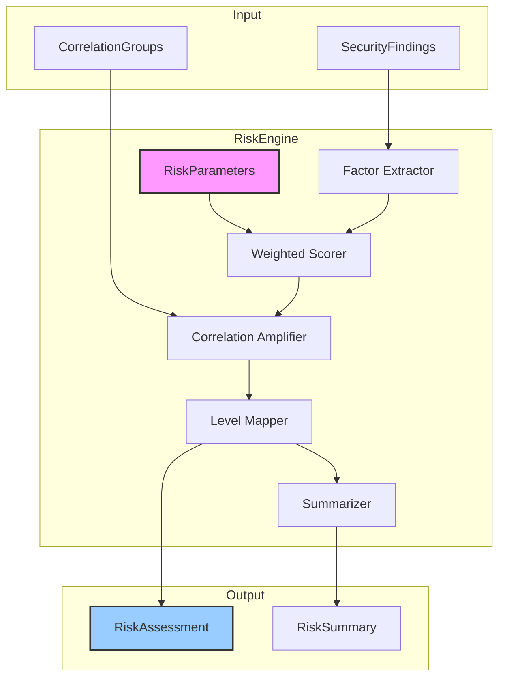

# INT-004 — Risk Assessment Engine

## Overview

The Risk Assessment Engine quantifies the risk posed by each security finding using a multi-factor scoring model. It combines severity, confidence, exposure, impact, and exploitability into a single numeric risk score, then maps that score to a `RiskLevel`. When correlation groups are available, a configurable correlation multiplier amplifies risk for findings that are part of attack clusters — reflecting the compounding danger of correlated vulnerabilities.

Key responsibilities:

- **Multi-factor scoring** — Weight five risk factors into a composite score.
- **Correlation amplification** — Multiply risk for findings in correlation groups.
- **Batch assessment** — Process all findings in a single call with aggregated summary.
- **Configurable parameters** — All weights and multipliers are overridable via `RiskParameters`.

---

## Architecture



---

## Data Flow

```
1.  setCorrelationGroups(groups) — register groups (optional, before assess/assessAll)
2.  assess(finding) or assessAll(findings):
    a.  Extract factors: severity, confidence, exposure, impact, exploitability
    b.  Compute weighted score: Σ(factor × weight) ∈ [0, 1]
    c.  If finding is in a correlation group, apply correlationMultiplier
    d.  Map score → RiskLevel
    e.  Return RiskAssessment with per-factor breakdown
3.  summarize(assessments) — aggregate into RiskSummary
```

---

## Public API

### Class: `RiskEngine`

| Method | Signature | Description |
|--------|-----------|-------------|
| `constructor` | `new RiskEngine(params?: Partial<RiskParameters>)` | Create engine with optional parameter overrides. |
| `setCorrelationGroups` | `setCorrelationGroups(groups: CorrelationGroup[]): void` | Register correlation groups for risk amplification. Must be called before `assess`/`assessAll`. |
| `assess` | `assess(finding: SecurityFinding): RiskAssessment` | Compute risk assessment for a single finding. |
| `assessAll` | `assessAll(findings: SecurityFinding[]): RiskAssessment[]` | Batch-assess all findings. |
| `summarize` | `summarize(assessments: RiskAssessment[]): RiskSummary` | Produce an aggregated risk summary. |

### Types

#### `RiskParameters`

```typescript
interface RiskParameters {
  severityWeight: number;       // default: 0.35
  confidenceWeight: number;     // default: 0.15
  exposureWeight: number;       // default: 0.20
  impactWeight: number;         // default: 0.15
  exploitabilityWeight: number; // default: 0.15
  correlationMultiplier: number;// default: 1.5
}
```

> All weights should sum to 1.0. The constructor accepts `Partial<RiskParameters>`, so only the fields you want to override need to be specified.

#### `RiskAssessment`

```typescript
interface RiskAssessment {
  findingId: string;
  score: number;               // 0.0 – 1.0 (after correlation amplification)
  baseScore: number;           // 0.0 – 1.0 (before amplification)
  level: RiskLevel;
  factors: RiskFactor[];
  correlationGroupId?: string;
  correlationAmplified: boolean;
}
```

#### `RiskLevel`

```typescript
enum RiskLevel {
  Critical = "critical",  // score ≥ 0.9
  High = "high",          // score ≥ 0.7
  Medium = "medium",      // score ≥ 0.4
  Low = "low",            // score ≥ 0.2
  Negligible = "negligible", // score < 0.2
}
```

#### `RiskFactor`

```typescript
interface RiskFactor {
  name: string;         // "severity" | "confidence" | "exposure" | "impact" | "exploitability"
  value: number;        // normalised 0.0 – 1.0
  weight: number;       // from RiskParameters
  contribution: number; // value × weight
}
```

#### `RiskSummary`

```typescript
interface RiskSummary {
  totalFindings: number;
  levelDistribution: Record<RiskLevel, number>;
  averageScore: number;
  maxScore: number;
  correlatedFindings: number;
  amplifiedFindings: number;
  topRisks: RiskAssessment[];   // top 10 by score
}
```

---

## Extension Points

1. **Custom `RiskParameters`** — Override any weight or the correlation multiplier to align with organisational risk appetite.
2. **Factor extraction** — The factor extraction logic is internally pluggable. Override how severity/confidence map to numeric values by subclassing (planned for v2).
3. **Risk level thresholds** — The score-to-level mapping can be customised by providing alternative threshold logic.
4. **Additional factors** — Custom `RiskFactor` entries can be appended to the assessment for domain-specific considerations (e.g. "regulatory impact").

---

## Examples

### Basic Risk Assessment

```typescript
import { RiskEngine } from './risk-assessment';

const engine = new RiskEngine();

const assessments = engine.assessAll(normalizedFindings);

for (const assessment of assessments) {
  console.log(`${assessment.findingId}: score=${assessment.score.toFixed(3)} level=${assessment.level}`);
}
```

### With Custom Parameters

```typescript
// Prioritise severity even more; increase correlation amplification
const engine = new RiskEngine({
  severityWeight: 0.45,
  confidenceWeight: 0.10,
  exposureWeight: 0.20,
  impactWeight: 0.15,
  exploitabilityWeight: 0.10,
  correlationMultiplier: 2.0,
});

engine.setCorrelationGroups(correlationGroups);

const assessments = engine.assessAll(normalizedFindings);
```

### With Correlation Amplification

```typescript
const engine = new RiskEngine();
engine.setCorrelationGroups(correlationGroups);

const assessments = engine.assessAll(normalizedFindings);

// Check which findings were amplified
const amplified = assessments.filter(a => a.correlationAmplified);
console.log(`${amplified.length} findings had risk amplified by correlation`);

for (const a of amplified) {
  console.log(
    `  ${a.findingId}: base=${a.baseScore.toFixed(3)} → amplified=${a.score.toFixed(3)} ` +
    `(group: ${a.correlationGroupId})`
  );
}
```

### Summarising Risk

```typescript
const assessments = engine.assessAll(normalizedFindings);
const summary = engine.summarize(assessments);

console.log(`Average risk score: ${summary.averageScore.toFixed(3)}`);
console.log(`Max risk score: ${summary.maxScore.toFixed(3)}`);
console.log(`Level distribution:`);
for (const [level, count] of Object.entries(summary.levelDistribution)) {
  console.log(`  ${level}: ${count}`);
}
console.log(`Top risks:`);
for (const risk of summary.topRisks) {
  console.log(`  ${risk.findingId} (${risk.level}, score=${risk.score.toFixed(3)})`);
}
```

### Inspecting Individual Factors

```typescript
const assessment = engine.assess(normalizedFindings[0]);

for (const factor of assessment.factors) {
  console.log(
    `${factor.name}: value=${factor.value.toFixed(2)}, ` +
    `weight=${factor.weight.toFixed(2)}, ` +
    `contribution=${factor.contribution.toFixed(3)}`
  );
}
// severity:  value=0.80, weight=0.35, contribution=0.280
// confidence: value=0.70, weight=0.15, contribution=0.105
// exposure:  value=0.60, weight=0.20, contribution=0.120
// impact:    value=0.50, weight=0.15, contribution=0.075
// exploitability: value=0.40, weight=0.15, contribution=0.060
```

---

## Performance Notes

| Aspect | Detail |
|--------|--------|
| **Time complexity** | `assess`: O(1) per finding. `assessAll`: O(n) for n findings + O(g) for group lookup. |
| **Correlation lookup** | Uses a pre-built Map from finding ID to group. `setCorrelationGroups()` builds this in O(g × m) where g = groups and m = average group size. |
| **Throughput** | ~100 000 assessments/sec on a single core. |
| **Memory** | Each `RiskAssessment` is ~500 bytes. 100 k assessments ≈ 50 MB. |
| **Thread safety** | `setCorrelationGroups()` and `assessAll()` should not be called concurrently. Set groups once, then assess. |
| **Parameter validation** | Weights are not automatically normalised. Ensure they sum to 1.0 for meaningful scores. |
