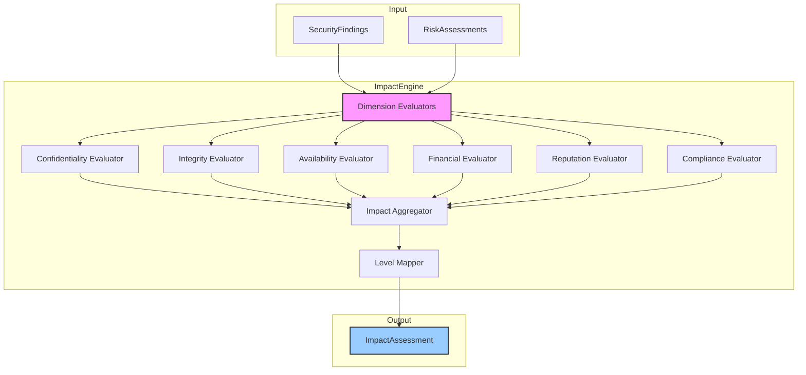

# INT-006 — Impact Engine

## Overview

The Impact Engine evaluates the *business* and *technical* consequences of security findings across six impact dimensions: confidentiality, integrity, availability, financial, reputation, and compliance. Unlike the Risk Assessment Engine (INT-004), which produces a single composite score, the Impact Engine produces a multi-dimensional `ImpactAssessment` that captures *how* a finding affects the organisation, not just *how much* risk it poses.

Key responsibilities:

- **Multi-dimensional assessment** — Score each finding across all six `ImpactDimension` values independently.
- **Risk-informed scoring** — Use the `RiskAssessment` from INT-004 to calibrate impact severity.
- **Dimensional aggregation** — Produce an overall `ImpactLevel` from the dimensional scores.
- **Batch processing** — Assess all findings in a single call.

---

## Architecture



Each dimension evaluator combines finding metadata (category, severity, affected asset) with the risk score to produce a dimension-specific impact value. The aggregator then combines dimensional scores into an overall assessment.

---

## Data Flow

```
1.  assess(finding, risk) or assessAll(findings, risks):
    a.  For each ImpactDimension:
        i.   Evaluate the finding's relevance to the dimension.
        ii.  Derive an impact score (0.0 – 1.0) from finding metadata + risk score.
    b.  Aggregate dimensional scores → overall impact score.
    c.  Map to ImpactLevel.
    d.  Return ImpactAssessment.
```

---

## Public API

### Class: `ImpactEngine`

| Method | Signature | Description |
|--------|-----------|-------------|
| `assess` | `assess(finding: SecurityFinding, risk: RiskAssessment): ImpactAssessment` | Assess the impact of a single finding. |
| `assessAll` | `assessAll(findings: SecurityFinding[], risks: RiskAssessment[]): ImpactAssessment[]` | Batch-assess all findings. Findings and risks are matched by `findingId`. |

### Types

#### `ImpactAssessment`

```typescript
interface ImpactAssessment {
  findingId: string;
  overallLevel: ImpactLevel;
  overallScore: number;           // 0.0 – 1.0
  dimensions: Record<ImpactDimension, number>;  // per-dimension scores
  primaryDimension: ImpactDimension;  // highest-impact dimension
  justification: string;              // human-readable explanation
}
```

#### `ImpactLevel`

```typescript
enum ImpactLevel {
  Catastrophic = "catastrophic",  // score ≥ 0.9
  Severe = "severe",              // score ≥ 0.7
  Significant = "significant",    // score ≥ 0.5
  Moderate = "moderate",          // score ≥ 0.3
  Minor = "minor",                // score ≥ 0.1
  Negligible = "negligible",      // score < 0.1
}
```

#### `ImpactDimension`

```typescript
enum ImpactDimension {
  Confidentiality = "confidentiality",
  Integrity = "integrity",
  Availability = "availability",
  Financial = "financial",
  Reputation = "reputation",
  Compliance = "compliance",
}
```

---

## Extension Points

1. **Custom dimension evaluators** — Each dimension evaluator is internally pluggable. Override the scoring logic for a specific dimension (e.g. custom financial impact model) by subclassing the engine.
2. **Dimension weighting** — The aggregation step weights all dimensions equally by default. Custom weight vectors can be applied by post-processing the `dimensions` record.
3. **Additional dimensions** — The `ImpactDimension` enum can be extended with domain-specific dimensions (e.g. `Operational`, `Legal`).
4. **Justification templates** — The `justification` string is generated from templates. Custom templates can be registered for specific finding categories.

---

## Examples

### Basic Impact Assessment

```typescript
import { ImpactEngine } from './impact';

const engine = new ImpactEngine();

const impact = engine.assess(normalizedFindings[0], riskAssessments[0]);

console.log(`Overall: ${impact.overallLevel} (score: ${impact.overallScore.toFixed(3)})`);
console.log(`Primary dimension: ${impact.primaryDimension}`);
console.log(`Justification: ${impact.justification}`);
```

### Batch Assessment

```typescript
const impacts = engine.assessAll(normalizedFindings, riskAssessments);

// Find findings with catastrophic confidentiality impact
const confBreaches = impacts.filter(
  i => i.dimensions.confidentiality >= 0.9
);

console.log(`${confBreaches.length} findings with catastrophic confidentiality impact`);

// Find findings with compliance impact
const complianceIssues = impacts.filter(
  i => i.dimensions.compliance >= 0.5
);
console.log(`${complianceIssues.length} findings with significant+ compliance impact`);
```

### Dimensional Analysis

```typescript
const impact = engine.assess(normalizedFindings[0], riskAssessments[0]);

for (const [dim, score] of Object.entries(impact.dimensions)) {
  console.log(`  ${dim}: ${score.toFixed(3)}`);
}
// confidentiality: 0.850
// integrity: 0.600
// availability: 0.300
// financial: 0.700
// reputation: 0.500
// compliance: 0.900
```

### Integrating with Risk Assessment

```typescript
import { RiskEngine } from './risk-assessment';
import { ImpactEngine } from './impact';

const riskEngine = new RiskEngine();
const impactEngine = new ImpactEngine();

const risks = riskEngine.assessAll(normalizedFindings);
const impacts = impactEngine.assessAll(normalizedFindings, risks);

// Cross-reference: high risk + high compliance impact = regulatory priority
const regulatoryPriorities = normalizedFindings.filter((_, i) => {
  const risk = risks[i];
  const impact = impacts[i];
  return risk.level === "high" && impact.dimensions.compliance >= 0.7;
});

console.log(`${regulatoryPriorities.length} regulatory-priority findings`);
```

---

## Performance Notes

| Aspect | Detail |
|--------|--------|
| **Time complexity** | O(n × d) where n = findings and d = 6 dimensions. Each dimension evaluation is O(1). |
| **Throughput** | ~80 000 assessments/sec on a single core. |
| **Memory** | Each `ImpactAssessment` is ~400 bytes. Negligible overhead even for 100 k findings. |
| **Risk dependency** — `assessAll()` requires a 1:1 mapping between findings and risks by `findingId`. Mismatched arrays will produce skipped assessments. |
| **Batch vs. single** | `assessAll()` is more efficient than looping `assess()` due to internal caching of evaluation context. |
