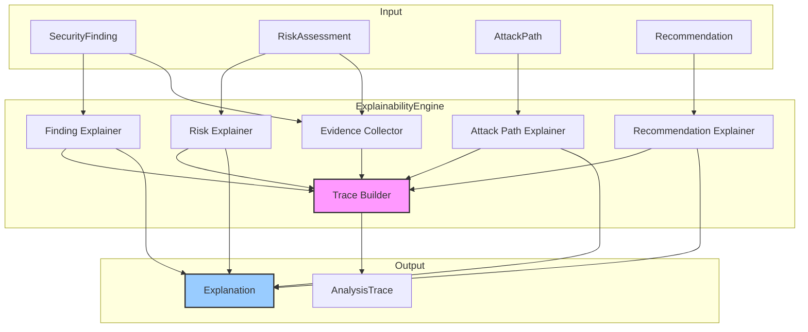

# INT-008 — Explainability Engine

## Overview

The Explainability Engine produces human-readable explanations for every stage of the security intelligence pipeline. It transforms opaque risk scores, attack paths, and recommendations into structured, evidence-backed narratives that security analysts, compliance officers, and executives can understand and act upon. The engine also creates full `AnalysisTrace` objects that reconstruct the reasoning chain from raw finding to final recommendation.

Key responsibilities:

- **Finding explanation** — Explain why a finding is significant, its risk, and its impact.
- **Risk explanation** — Decompose a risk score into its contributing factors with evidence.
- **Attack path explanation** — Narrate a multi-step attack path in plain language.
- **Recommendation explanation** — Justify why a specific remediation was chosen.
- **Trace creation** — Build a complete reasoning trace across all pipeline stages.

---

## Architecture



Each explainer produces an `Explanation` with typed steps and supporting evidence. The trace builder composes these into a linear `AnalysisTrace` that reconstructs the full reasoning chain.

---

## Data Flow

```
1.  explainFinding(finding, risk?):
    → Produces an Explanation describing the finding's nature, significance, and context.

2.  explainRisk(risk, finding):
    → Produces an Explanation decomposing the risk score into factors with evidence.

3.  explainAttackPath(path):
    → Produces an Explanation narrating each step of the attack path.

4.  explainRecommendation(rec):
    → Produces an Explanation justifying the recommendation and its priority.

5.  createTrace(stages):
    → Composes multiple explanations into an AnalysisTrace with ordered TraceStages.
```

---

## Public API

### Class: `ExplainabilityEngine`

| Method | Signature | Description |
|--------|-----------|-------------|
| `explainFinding` | `explainFinding(finding: SecurityFinding, risk?: RiskAssessment): Explanation` | Generate a human-readable explanation for a finding. |
| `explainRisk` | `explainRisk(risk: RiskAssessment, finding: SecurityFinding): Explanation` | Decompose a risk score into contributing factors. |
| `explainAttackPath` | `explainAttackPath(path: AttackPath): Explanation` | Narrate an attack path step by step. |
| `explainRecommendation` | `explainRecommendation(rec: Recommendation): Explanation` | Justify a recommendation's actions and priority. |
| `createTrace` | `createTrace(stages: TraceStage[]): AnalysisTrace` | Compose an end-to-end reasoning trace from pipeline stages. |

### Types

#### `Explanation`

```typescript
interface Explanation {
  type: ExplanationType;
  title: string;
  summary: string;                   // one-paragraph executive summary
  steps: ExplanationStep[];          // ordered reasoning steps
  evidence: ExplanationEvidence[];   // supporting data
  confidence: number;                // 0.0 – 1.0, how confident the explanation is
}
```

#### `ExplanationType`

```typescript
enum ExplanationType {
  Finding = "finding",
  Risk = "risk",
  AttackPath = "attack_path",
  Recommendation = "recommendation",
  Trace = "trace",
}
```

#### `ExplanationStep`

```typescript
interface ExplanationStep {
  order: number;
  title: string;
  description: string;
  evidence: string[];               // IDs of supporting evidence items
  implication: string;              // what this step means for the user
}
```

#### `ExplanationEvidence`

```typescript
interface ExplanationEvidence {
  id: string;
  type: "data" | "rule" | "reference" | "calculation";
  source: string;                   // module or rule that produced this
  value: unknown;                   // the actual evidence data
  description: string;              // human-readable description
}
```

#### `AnalysisTrace`

```typescript
interface AnalysisTrace {
  id: string;
  stages: TraceStage[];
  totalSteps: number;
  createdAt: Date;
}
```

#### `TraceStage`

```typescript
interface TraceStage {
  name: string;                     // e.g. "normalization", "correlation", "risk_assessment"
  explanation: Explanation;
  inputSummary: string;             // brief description of what went in
  outputSummary: string;            // brief description of what came out
  duration: number;                 // ms
}
```

---

## Extension Points

1. **Custom explainers** — Each explanation type is handled by an internal explainer function. Override or extend these for domain-specific language (e.g. compliance-focused terminology).
2. **Evidence enrichment** — Add custom `ExplanationEvidence` items by intercepting the evidence collector and appending external data (e.g. regulatory citations).
3. **Step templates** — Explanation step text is generated from templates. Custom templates can be registered for specific finding categories or risk patterns.
4. **Trace stages** — `createTrace()` accepts arbitrary `TraceStage[]`, enabling custom pipeline stages or third-party module integration.

---

## Examples

### Explaining a Finding

```typescript
import { ExplainabilityEngine } from './explainability';

const engine = new ExplainabilityEngine();

const explanation = engine.explainFinding(normalizedFindings[0], riskAssessments[0]);

console.log(explanation.title);
// "SQL Injection in User API — Critical Risk"

console.log(explanation.summary);
// "A SQL injection vulnerability was found in the /api/users endpoint..."

for (const step of explanation.steps) {
  console.log(`  ${step.order}. ${step.title}: ${step.description}`);
}
// 1. Vulnerability Identified: A SQL injection flaw allows...
// 2. Risk Assessment: The finding was rated Critical with a score of 0.92...
// 3. Exposure Analysis: The endpoint is publicly accessible...

console.log(`Confidence: ${(explanation.confidence * 100).toFixed(0)}%`);
```

### Explaining a Risk Score

```typescript
const riskExplanation = engine.explainRisk(riskAssessments[0], normalizedFindings[0]);

console.log(riskExplanation.title);
// "Risk Score Breakdown for SQL Injection Finding"

for (const step of riskExplanation.steps) {
  console.log(`  ${step.title}: ${step.implication}`);
}

// Inspect evidence
for (const ev of riskExplanation.evidence) {
  console.log(`  Evidence [${ev.type}]: ${ev.description}`);
  console.log(`    Source: ${ev.source}`);
  console.log(`    Value: ${JSON.stringify(ev.value)}`);
}
```

### Explaining an Attack Path

```typescript
const pathExplanation = engine.explainAttackPath(attackPaths[0]);

console.log(pathExplanation.summary);
// "An attacker can chain 3 vulnerabilities to escalate from an exposed API..."

for (const step of pathExplanation.steps) {
  console.log(`  Step ${step.order}: ${step.title}`);
  console.log(`    ${step.description}`);
  console.log(`    Implication: ${step.implication}`);
}
```

### Explaining a Recommendation

```typescript
const recExplanation = engine.explainRecommendation(recommendations[0]);

console.log(recExplanation.summary);
// "Immediate patching is recommended to eliminate the SQL injection vector..."

for (const step of recExplanation.steps) {
  console.log(`  ${step.title}: ${step.description}`);
}
```

### Creating a Full Analysis Trace

```typescript
import { ExplainabilityEngine, TraceStage } from './explainability';

const engine = new ExplainabilityEngine();

// Build trace stages from pipeline outputs
const stages: TraceStage[] = [
  {
    name: "normalization",
    explanation: engine.explainFinding(normalizedFindings[0]),
    inputSummary: "1 raw finding from Semgrep",
    outputSummary: "1 normalised SecurityFinding (Critical severity)",
    duration: 12,
  },
  {
    name: "risk_assessment",
    explanation: engine.explainRisk(riskAssessments[0], normalizedFindings[0]),
    inputSummary: "1 finding, severity=Critical",
    outputSummary: "Risk score=0.92, level=Critical",
    duration: 5,
  },
  {
    name: "recommendation",
    explanation: engine.explainRecommendation(recommendations[0]),
    inputSummary: "1 finding, risk=Critical",
    outputSummary: "1 critical-priority recommendation with 2 actions",
    duration: 8,
  },
];

const trace = engine.createTrace(stages);

console.log(`Analysis Trace: ${trace.totalSteps} steps across ${trace.stages.length} stages`);
for (const stage of trace.stages) {
  console.log(`  ${stage.name}: ${stage.inputSummary} → ${stage.outputSummary} (${stage.duration}ms)`);
}
```

---

## Performance Notes

| Aspect | Detail |
|--------|--------|
| **Time complexity** | O(1) per explanation for simple types (finding, risk). O(k) for attack path explanations where k = path length. |
| **Throughput** | ~20 000 explanations/sec for finding/risk types. Attack path explanations scale linearly with path length. |
| **Memory** | Each `Explanation` is ~1–5 KB depending on step/evidence count. An `AnalysisTrace` for a full pipeline is typically ~10 KB. |
| **Evidence size** — Evidence items with large `value` payloads (e.g. full HTTP responses) can increase memory usage. Consider trimming evidence values. |
| **Trace composition** — `createTrace()` is O(s) for s stages. No recomputation; it merely assembles pre-built explanations. |
