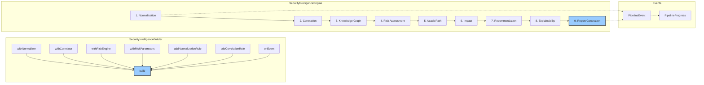

# INT-009 — Orchestrator (Security Intelligence Engine)

## Overview

The Orchestrator — exposed as `SecurityIntelligenceEngine` — is the central coordinator that wires together every module in the security intelligence pipeline. It accepts a `ScanInput`, runs it through 9 sequential stages (normalisation → correlation → knowledge graph → risk → attack path → impact → recommendation → explainability → report), and produces a `SecurityIntelligenceReport`. The engine supports an event-driven architecture via `onEvent()` for real-time progress tracking, and a fluent builder (`SecurityIntelligenceBuilder`) for configuration.

Key responsibilities:

- **Pipeline orchestration** — Execute 9 stages in sequence with dependency injection between stages.
- **Event emission** — Fire `PipelineEvent` objects for progress, stage completion, and errors.
- **Builder pattern** — `SecurityIntelligenceBuilder` provides a fluent API for engine configuration.
- **Metrics collection** — Track per-stage timing, throughput, and error rates via `PipelineMetrics`.
- **Error handling** — Graceful degradation: a stage failure does not abort the entire pipeline.

---

## Architecture



---

## Data Flow

```
1.  Configure via SecurityIntelligenceBuilder
    → withNormalizer(), withCorrelator(), withRiskEngine(), withRiskParameters()
    → addNormalizationRule(), addCorrelationRule()
    → onEvent(handler)
    → build() → SecurityIntelligenceEngine

2.  analyze(input, options?)
    → Pipeline stages execute sequentially:
        Stage 1:  Normalisation    — RawFinding[] → SecurityFinding[]
        Stage 2:  Correlation      — SecurityFinding[] → Correlation[], CorrelationGroup[]
        Stage 3:  Knowledge Graph  — findings + correlations → KnowledgeGraph
        Stage 4:  Risk Assessment  — findings + groups → RiskAssessment[]
        Stage 5:  Attack Path      — findings + risks + graph → AttackPath[], AttackGraph
        Stage 6:  Impact           — findings + risks → ImpactAssessment[]
        Stage 7:  Recommendation   — findings + risks → Recommendation[], RemediationPlan
        Stage 8:  Explainability   — all outputs → Explanation[], AnalysisTrace[]
        Stage 9:  Report           — aggregate all → SecurityIntelligenceReport

3.  Events emitted at each stage transition:
    → stage_start, stage_complete, stage_error, pipeline_complete
```

---

## Public API

### Class: `SecurityIntelligenceEngine`

| Method | Signature | Description |
|--------|-----------|-------------|
| `analyze` | `analyze(input: ScanInput, options?: AnalysisOptions): Promise<SecurityIntelligenceReport>` | Run the full 9-stage pipeline. Returns a promise resolving to the final report. |
| `onEvent` | `onEvent(handler: PipelineEventHandler): void` | Register an event handler for pipeline events. Multiple handlers can be registered. |

### Class: `SecurityIntelligenceBuilder`

| Method | Signature | Description |
|--------|-----------|-------------|
| `withNormalizer` | `withNormalizer(): SecurityIntelligenceBuilder` | Enable the normalisation stage with defaults. |
| `withCorrelator` | `withCorrelator(): SecurityIntelligenceBuilder` | Enable the correlation stage with default rules. |
| `withRiskEngine` | `withRiskEngine(): SecurityIntelligenceBuilder` | Enable the risk assessment stage with default parameters. |
| `withRiskParameters` | `withRiskParameters(params: Partial<RiskParameters>): SecurityIntelligenceBuilder` | Override risk engine parameters. |
| `addNormalizationRule` | `addNormalizationRule(rule: NormalizationRule): SecurityIntelligenceBuilder` | Add a custom normalisation rule. |
| `addCorrelationRule` | `addCorrelationRule(rule: CorrelationRule): SecurityIntelligenceBuilder` | Add a custom correlation rule. |
| `onEvent` | `onEvent(handler: PipelineEventHandler): SecurityIntelligenceBuilder` | Register a pipeline event handler (builder variant). |
| `build` | `build(): SecurityIntelligenceEngine` | Construct and return the configured engine. |

### Constant

```typescript
const STAGES = 9;  // number of pipeline stages
```

### Types

#### `PipelineStage`

```typescript
enum PipelineStage {
  Normalization = "normalization",
  Correlation = "correlation",
  KnowledgeGraph = "knowledge_graph",
  RiskAssessment = "risk_assessment",
  AttackPath = "attack_path",
  Impact = "impact",
  Recommendation = "recommendation",
  Explainability = "explainability",
  Report = "report",
}
```

#### `StageStatus`

```typescript
enum StageStatus {
  Pending = "pending",
  Running = "running",
  Completed = "completed",
  Failed = "failed",
  Skipped = "skipped",
}
```

#### `StageResult`

```typescript
interface StageResult {
  stage: PipelineStage;
  status: StageStatus;
  duration: number;              // ms
  output: unknown;               // stage-specific output
  error?: Error;
}
```

#### `PipelineProgress`

```typescript
interface PipelineProgress {
  currentStage: PipelineStage;
  stageIndex: number;            // 0-based
  totalStages: number;           // always 9
  stageStatus: Record<PipelineStage, StageStatus>;
  elapsedMs: number;
  estimatedRemainingMs?: number;
}
```

#### `PipelineEvent`

```typescript
interface PipelineEvent {
  type: PipelineEventType;
  stage: PipelineStage;
  timestamp: Date;
  progress: PipelineProgress;
  data?: unknown;
  error?: Error;
}
```

#### `PipelineEventType`

```typescript
enum PipelineEventType {
  PipelineStart = "pipeline_start",
  StageStart = "stage_start",
  StageComplete = "stage_complete",
  StageError = "stage_error",
  PipelineComplete = "pipeline_complete",
  PipelineError = "pipeline_error",
}
```

#### `PipelineEventHandler`

```typescript
type PipelineEventHandler = (event: PipelineEvent) => void;
```

#### `PipelineMetrics`

```typescript
interface PipelineMetrics {
  totalDuration: number;
  stageDurations: Record<PipelineStage, number>;
  stageStatuses: Record<PipelineStage, StageStatus>;
  findingsInput: number;
  findingsOutput: number;
  correlationsFound: number;
  groupsFound: number;
  pathsFound: number;
  recommendationsGenerated: number;
}
```

#### `AnalysisOptions`

```typescript
interface AnalysisOptions {
  skipStages?: PipelineStage[];   // stages to skip
  maxAttackPathDepth?: number;
  includeRawFindings?: boolean;
  includeAttackGraph?: boolean;
}
```

#### `ScanInput`

```typescript
interface ScanInput {
  rawFindings: RawFinding[];
  metadata?: {
    scanId?: string;
    scanDate?: Date;
    scanner?: string;
    environment?: string;
  };
}
```

#### `SecurityIntelligenceReport`

```typescript
interface SecurityIntelligenceReport {
  scanId: string;
  timestamp: Date;
  findings: SecurityFinding[];
  correlations: Correlation[];
  correlationGroups: CorrelationGroup[];
  knowledgeGraph: KnowledgeGraph;
  riskAssessments: RiskAssessment[];
  riskSummary: RiskSummary;
  attackPaths: AttackPath[];
  attackGraph: AttackGraph;
  impactAssessments: ImpactAssessment[];
  recommendations: Recommendation[];
  remediationPlan: RemediationPlan;
  explanations: Explanation[];
  traces: AnalysisTrace[];
  metrics: PipelineMetrics;
}
```

---

## Extension Points

1. **Custom stages** — While the pipeline is fixed at 9 stages, the `skipStages` option in `AnalysisOptions` allows disabling stages. Custom logic can be injected via event handlers that modify intermediate results.
2. **Event-driven integration** — `onEvent()` enables real-time UI updates, logging, and audit trails without modifying the pipeline.
3. **Builder composition** — The builder's fluent API allows multiple engine configurations from the same base builder.
4. **Stage skipping** — Use `AnalysisOptions.skipStages` to bypass stages (e.g. skip attack path discovery for low-risk scans).
5. **Error recovery** — Failed stages are marked `Failed` but the pipeline continues. Downstream stages receive empty/default inputs for failed stages.

---

## Examples

### Building and Running the Engine

```typescript
import {
  SecurityIntelligenceBuilder,
  Severity,
  FindingCategory,
} from './orchestrator';

const engine = new SecurityIntelligenceBuilder()
  .withNormalizer()
  .withCorrelator()
  .withRiskEngine()
  .withRiskParameters({ correlationMultiplier: 2.0 })
  .addNormalizationRule({
    name: "semgrep-override",
    match: { scanner: "semgrep" },
    transform: {
      severityMap: { ERROR: Severity.High, WARNING: Severity.Medium },
    },
  })
  .addCorrelationRule({
    name: "shared-cve",
    type: "shared_cve" as any,
    defaultStrength: "strong" as any,
    match: (a, b) => a.cve.some(c => b.cve.includes(c)),
  })
  .onEvent(event => {
    if (event.type === "stage_complete") {
      console.log(`✓ ${event.stage} (${event.progress.elapsedMs}ms)`);
    }
  })
  .build();

const report = await engine.analyze({
  rawFindings: rawFindings,
  metadata: {
    scanId: "scan-2024-001",
    environment: "production",
  },
});

console.log(`Report generated: ${report.findings.length} findings`);
console.log(`Risk summary: ${report.riskSummary.averageScore.toFixed(3)} average score`);
```

### Real-Time Progress Tracking

```typescript
const engine = new SecurityIntelligenceBuilder()
  .withNormalizer()
  .withCorrelator()
  .withRiskEngine()
  .onEvent(event => {
    const { progress } = event;
    const pct = ((progress.stageIndex + 1) / progress.totalStages * 100).toFixed(0);
    switch (event.type) {
      case "stage_start":
        console.log(`[${pct}%] Starting ${event.stage}...`);
        break;
      case "stage_complete":
        console.log(`[${pct}%] Completed ${event.stage}`);
        break;
      case "stage_error":
        console.error(`[${pct}%] ERROR in ${event.stage}: ${event.error?.message}`);
        break;
    }
  })
  .build();

const report = await engine.analyze({ rawFindings });
```

### Skipping Stages

```typescript
const report = await engine.analyze(
  { rawFindings },
  {
    skipStages: ["attack_path" as any, "explainability" as any],
    includeAttackGraph: false,
    includeRawFindings: false,
  }
);
```

### Inspecting Pipeline Metrics

```typescript
const report = await engine.analyze({ rawFindings });

console.log("Pipeline Metrics:");
console.log(`  Total duration: ${report.metrics.totalDuration}ms`);
for (const [stage, duration] of Object.entries(report.metrics.stageDurations)) {
  const status = report.metrics.stageStatuses[stage as PipelineStage];
  console.log(`  ${stage}: ${duration}ms (${status})`);
}
console.log(`  Findings: ${report.metrics.findingsInput} → ${report.metrics.findingsOutput}`);
console.log(`  Correlations: ${report.metrics.correlationsFound}`);
console.log(`  Attack paths: ${report.metrics.pathsFound}`);
console.log(`  Recommendations: ${report.metrics.recommendationsGenerated}`);
```

---

## Performance Notes

| Aspect | Detail |
|--------|--------|
| **Total pipeline time** | Typically 5–30 seconds for 1 000–10 000 findings, depending on graph density and path discovery depth. |
| **Bottleneck stages** | Correlation (O(n²)) and Attack Path (combinatorial) are the slowest stages. Consider `skipStages` for speed-critical workflows. |
| **Memory** | The full report accumulates all intermediate results. For 10 000 findings, expect ~200–500 MB. Use `includeRawFindings: false` to reduce memory. |
| **Event overhead** | Event handlers are called synchronously. Keep handlers lightweight (< 1 ms) to avoid slowing the pipeline. |
| **Parallelism** | Currently single-threaded. Stages execute sequentially. Future versions may parallelise independent stages. |
| **Error resilience** — A failed stage produces a `StageResult` with `status: Failed` and `error`. Downstream stages receive empty defaults, allowing partial reports. |
