# INT-010 — Persistence Engine

## Overview

The Persistence Engine provides durable storage for all pipeline outputs — reports, findings, risks, correlations, attack paths, recommendations, explainability traces, and snapshots. It wraps a pluggable storage backend (default: JSON files via `JsonPersistenceProvider`) behind 8 typed repository interfaces, ensuring that consumers never deal with serialisation or I/O directly. A builder (`PersistenceBuilder`) configures the engine, and an event system enables audit logging and cache invalidation.

Key responsibilities:

- **Repository pattern** — 8 specialised repositories for each data type, each with CRUD operations.
- **Pluggable backends** — Swap JSON files for databases via the `PersistenceProvider` interface.
- **Snapshots** — Create and restore point-in-time snapshots of all stored data.
- **Migration** — Track schema versions and apply migrations via `MigrationInfo`.
- **Health & metrics** — Monitor storage health, capacity, and performance.

---

## Architecture

```mermaid
graph TB
    subgraph PersistenceBuilder
        WDD[withDataDir]
        OE2[onEvent]
        B2[build]
    end

    WDD --> B2
    OE2 --> B2

    subgraph PersistenceEngine
        INIT[initialize]
        SHUTDOWN[shutdown]
        HEALTH[isHealthy]
        REPOS[Repository Accessors]
        OPS[Save/Load/Delete]
        SNAP[Snapshot Manager]
        METRICS[Metrics Collector]
    end

    B2 --> INIT
    REPOS --> OPS
    OPS --> SNAP
    OPS --> METRICS

    subgraph Repositories
        RR[ReportRepository]
        FR[FindingRepository]
        RKR[RiskRepository]
        CR[CorrelationRepository]
        APR[AttackPathRepository]
        RECR[RecommendationRepository]
        ER[ExplainabilityRepository]
        SR[SnapshotRepository]
    end

    REPOS --> RR
    REPOS --> FR
    REPOS --> RKR
    REPOS --> CR
    REPOS --> APR
    REPOS --> RECR
    REPOS --> ER
    REPOS --> SR

    subgraph StorageBackend
        JPP[JsonPersistenceProvider]
        CUSTOM[Custom Provider]
    end

    RR --> JPP
    FR --> JPP
    RKR --> JPP
    CR --> JPP
    APR --> JPP
    RECR --> JPP
    ER --> JPP
    SR --> JPP
    CUSTOM -.-> JPP

    style REPOS fill:#f9f,stroke:#333,stroke-width:2px
    style JPP fill:#9cf,stroke:#333,stroke-width:2px
```



---

## Data Flow

```
1.  PersistenceBuilder.withDataDir(dir).onEvent(handler).build() → PersistenceEngine
2.  engine.initialize() — create storage directories, validate schema, run migrations
3.  Repository access:
    - getReportRepository() → ReportRepository
    - getFindingRepository() → FindingRepository
    - ... (6 more)
4.  CRUD via repositories:
    - save(item) → stored with generated ID
    - load(id) → deserialised item
    - delete(id) → removed
    - query(criteria?) → filtered results
5.  Convenience methods on engine:
    - saveReport(report) → stores full report + extracts into typed repos
    - loadReport(id) → reassembles full report from typed repos
    - deleteReport(id) → cascading delete
6.  Snapshots:
    - createSnapshot(label?) → SnapshotResult
    - restoreSnapshot(id) → reverts all repos to snapshot state
7.  engine.shutdown() — flush buffers, release resources
```

---

## Public API

### Class: `PersistenceEngine`

| Method | Signature | Description |
|--------|-----------|-------------|
| `initialize` | `initialize(): Promise<void>` | Initialise storage, run migrations. Must be called before any other method. |
| `shutdown` | `shutdown(): Promise<void>` | Flush buffers and release resources. |
| `isHealthy` | `isHealthy(): boolean` | Check if the storage backend is responsive. |
| `getReportRepository` | `getReportRepository(): ReportRepository` | Access the report repository. |
| `getFindingRepository` | `getFindingRepository(): FindingRepository` | Access the finding repository. |
| `getRiskRepository` | `getRiskRepository(): RiskRepository` | Access the risk assessment repository. |
| `getCorrelationRepository` | `getCorrelationRepository(): CorrelationRepository` | Access the correlation repository. |
| `getAttackPathRepository` | `getAttackPathRepository(): AttackPathRepository` | Access the attack path repository. |
| `getRecommendationRepository` | `getRecommendationRepository(): RecommendationRepository` | Access the recommendation repository. |
| `getExplainabilityRepository` | `getExplainabilityRepository(): ExplainabilityRepository` | Access the explainability repository. |
| `getSnapshotRepository` | `getSnapshotRepository(): SnapshotRepository` | Access the snapshot repository. |
| `getStatistics` | `getStatistics(): StorageStatistics` | Get current storage statistics. |
| `saveReport` | `saveReport(report: SecurityIntelligenceReport): Promise<string>` | Save a full report (extracts into all typed repos). Returns the report ID. |
| `loadReport` | `loadReport(id: string): Promise<SecurityIntelligenceReport>` | Load and reassemble a full report from typed repos. |
| `deleteReport` | `deleteReport(id: string): Promise<void>` | Delete a report and all its associated data. |
| `createSnapshot` | `createSnapshot(label?: string): Promise<SnapshotResult>` | Create a point-in-time snapshot of all data. |
| `restoreSnapshot` | `restoreSnapshot(id: string): Promise<void>` | Restore all repos to a snapshot's state. |
| `getMetrics` | `getMetrics(): PersistenceMetrics` | Get I/O and performance metrics. |

### Class: `PersistenceBuilder`

| Method | Signature | Description |
|--------|-----------|-------------|
| `withDataDir` | `withDataDir(dir: string): PersistenceBuilder` | Set the root data directory. |
| `onEvent` | `onEvent(handler: (event: PersistenceEvent) => void): PersistenceBuilder` | Register a persistence event handler. |
| `build` | `build(): PersistenceEngine` | Construct and return the persistence engine. |

### Class: `JsonPersistenceProvider`

Default file-based persistence provider. Reads/writes JSON files in the configured data directory.

### Repository Interfaces (8)

Each repository follows this pattern:

```typescript
interface ReportRepository {
  save(report: SecurityIntelligenceReport): Promise<string>;
  load(id: string): Promise<SecurityIntelligenceReport | null>;
  delete(id: string): Promise<void>;
  list(): Promise<string[]>;
  query(criteria?: Partial<SecurityIntelligenceReport>): Promise<SecurityIntelligenceReport[]>;
}

interface FindingRepository {
  save(finding: SecurityFinding): Promise<string>;
  load(id: string): Promise<SecurityFinding | null>;
  delete(id: string): Promise<void>;
  list(): Promise<string[]>;
  query(criteria?: Partial<SecurityFinding>): Promise<SecurityFinding[]>;
}

interface RiskRepository {
  save(risk: RiskAssessment): Promise<string>;
  load(id: string): Promise<RiskAssessment | null>;
  delete(id: string): Promise<void>;
  list(): Promise<string[]>;
  query(criteria?: Partial<RiskAssessment>): Promise<RiskAssessment[]>;
}

interface CorrelationRepository {
  save(correlation: Correlation): Promise<string>;
  load(id: string): Promise<Correlation | null>;
  delete(id: string): Promise<void>;
  list(): Promise<string[]>;
  query(criteria?: Partial<Correlation>): Promise<Correlation[]>;
}

interface AttackPathRepository {
  save(path: AttackPath): Promise<string>;
  load(id: string): Promise<AttackPath | null>;
  delete(id: string): Promise<void>;
  list(): Promise<string[]>;
  query(criteria?: Partial<AttackPath>): Promise<AttackPath[]>;
}

interface RecommendationRepository {
  save(rec: Recommendation): Promise<string>;
  load(id: string): Promise<Recommendation | null>;
  delete(id: string): Promise<void>;
  list(): Promise<string[]>;
  query(criteria?: Partial<Recommendation>): Promise<Recommendation[]>;
}

interface ExplainabilityRepository {
  save(trace: AnalysisTrace): Promise<string>;
  load(id: string): Promise<AnalysisTrace | null>;
  delete(id: string): Promise<void>;
  list(): Promise<string[]>;
  query(criteria?: Partial<AnalysisTrace>): Promise<AnalysisTrace[]>;
}

interface SnapshotRepository {
  save(metadata: SnapshotMetadata): Promise<string>;
  load(id: string): Promise<SnapshotMetadata | null>;
  delete(id: string): Promise<void>;
  list(): Promise<string[]>;
}
```

### Types

#### `StorageBackend`

```typescript
enum StorageBackend {
  Json = "json",
  Sqlite = "sqlite",
  Postgres = "postgres",
  Custom = "custom",
}
```

#### `PersistenceProvider`

```typescript
interface PersistenceProvider {
  initialise(): Promise<void>;
  shutdown(): Promise<void>;
  isHealthy(): boolean;
  save(collection: string, id: string, data: unknown): Promise<void>;
  load(collection: string, id: string): Promise<unknown | null>;
  delete(collection: string, id: string): Promise<void>;
  list(collection: string): Promise<string[]>;
  query(collection: string, criteria?: Record<string, unknown>): Promise<unknown[]>;
}
```

#### `SerializationFormat`

```typescript
enum SerializationFormat {
  Json = "json",
  MsgPack = "msgpack",
  Binary = "binary",
}
```

#### `SnapshotMetadata`

```typescript
interface SnapshotMetadata {
  id: string;
  label?: string;
  createdAt: Date;
  totalRecords: number;
  collections: Record<string, number>;  // collection → record count
  sizeBytes: number;
}
```

#### `SnapshotResult`

```typescript
interface SnapshotResult {
  id: string;
  label?: string;
  createdAt: Date;
  totalRecords: number;
  sizeBytes: number;
}
```

#### `MigrationInfo`

```typescript
interface MigrationInfo {
  currentVersion: number;
  appliedMigrations: number[];
  pendingMigrations: number[];
  lastMigrationDate?: Date;
}
```

#### `StorageStatistics`

```typescript
interface StorageStatistics {
  totalRecords: number;
  totalSizeBytes: number;
  collectionCounts: Record<string, number>;
  collectionSizes: Record<string, number>;
  oldestRecord?: Date;
  newestRecord?: Date;
  backend: StorageBackend;
}
```

#### `PersistenceEvent`

```typescript
interface PersistenceEvent {
  type: "save" | "load" | "delete" | "snapshot_create" | "snapshot_restore" | "error";
  collection: string;
  id?: string;
  timestamp: Date;
  duration?: number;
  error?: Error;
}
```

#### `PersistenceMetrics`

```typescript
interface PersistenceMetrics {
  totalSaves: number;
  totalLoads: number;
  totalDeletes: number;
  totalSnapshots: number;
  averageSaveTimeMs: number;
  averageLoadTimeMs: number;
  errorCount: number;
  lastError?: Error;
  uptimeMs: number;
}
```

---

## Extension Points

1. **Custom `PersistenceProvider`** — Implement the `PersistenceProvider` interface to back the engine with PostgreSQL, MongoDB, Redis, or any other store. The provider is injected at build time.
2. **Serialization format** — Swap JSON for MessagePack or a binary format by implementing a custom serialiser within your provider.
3. **Event handlers** — Register handlers via `onEvent()` for audit logging, cache invalidation, or analytics.
4. **Migration scripts** — Add `MigrationInfo` entries and migration functions to handle schema evolution across versions.
5. **Custom query criteria** — The `query()` method on each repository accepts partial objects for basic matching. Advanced queries (range, regex, full-text) require a custom provider.

---

## Examples

### Basic Setup

```typescript
import { PersistenceBuilder } from './persistence';

const engine = new PersistenceBuilder()
  .withDataDir("/data/sec-scanner")
  .onEvent(event => {
    console.log(`[${event.type}] ${event.collection}/${event.id ?? "*"} ${event.duration ?? ""}ms`);
  })
  .build();

await engine.initialize();

// Use repositories
const findingRepo = engine.getFindingRepository();
const riskRepo = engine.getRiskRepository();

await findingRepo.save(normalizedFindings[0]);
const loaded = await findingRepo.load(normalizedFindings[0].id);
```

### Saving a Full Report

```typescript
// Save the complete report — automatically extracts into all typed repos
const reportId = await engine.saveReport(securityIntelligenceReport);

console.log(`Report saved with ID: ${reportId}`);

// Load it back — reassembles from typed repos
const loadedReport = await engine.loadReport(reportId);
console.log(`Loaded report with ${loadedReport.findings.length} findings`);
```

### Working with Individual Repositories

```typescript
// Save individual items
const findingRepo = engine.getFindingRepository();
for (const finding of normalizedFindings) {
  await findingRepo.save(finding);
}

// Query findings by criteria
const criticalFindings = await findingRepo.query({
  severity: "critical" as any,
});

// List all finding IDs
const allIds = await findingRepo.list();
console.log(`${allIds.length} findings stored`);

// Delete a specific finding
await findingRepo.delete(normalizedFindings[0].id);
```

### Snapshots

```typescript
// Create a snapshot before a destructive operation
const snapshot = await engine.createSnapshot("pre-cleanup");
console.log(`Snapshot created: ${snapshot.id} (${snapshot.totalRecords} records, ${snapshot.sizeBytes} bytes)`);

// ... perform operations ...

// Restore to the snapshot if something went wrong
await engine.restoreSnapshot(snapshot.id);
console.log("Restored to pre-cleanup state");
```

### Monitoring Metrics

```typescript
const metrics = engine.getMetrics();
console.log(`Persistence Metrics:`);
console.log(`  Saves: ${metrics.totalSaves}`);
console.log(`  Loads: ${metrics.totalLoads}`);
console.log(`  Deletes: ${metrics.totalDeletes}`);
console.log(`  Avg save time: ${metrics.averageSaveTimeMs.toFixed(2)}ms`);
console.log(`  Avg load time: ${metrics.averageLoadTimeMs.toFixed(2)}ms`);
console.log(`  Errors: ${metrics.errorCount}`);
console.log(`  Uptime: ${(metrics.uptimeMs / 1000 / 60).toFixed(1)} min`);

// Storage statistics
const stats = engine.getStatistics();
console.log(`  Total records: ${stats.totalRecords}`);
console.log(`  Total size: ${(stats.totalSizeBytes / 1024 / 1024).toFixed(2)} MB`);
for (const [collection, count] of Object.entries(stats.collectionCounts)) {
  console.log(`  ${collection}: ${count} records`);
}
```

### Graceful Shutdown

```typescript
// Always shut down cleanly
await engine.shutdown();
console.log("Persistence engine shut down");
```

---

## Performance Notes

| Aspect | Detail |
|--------|--------|
| **I/O model** | `JsonPersistenceProvider` uses async file I/O. Each `save`/`load` is a separate file read/write. |
| **Throughput** | ~1 000 saves/sec, ~5 000 loads/sec with the JSON provider on SSD. Database-backed providers can be significantly faster. |
| **Memory** | The JSON provider does not cache data in memory. Every `load` reads from disk. Consider adding an LRU cache layer for hot data. |
| **Report save** | `saveReport()` is a multi-write operation (report + extracted entities). For large reports (> 5 000 findings), this can take 5–10 seconds with the JSON provider. |
| **Snapshots** | Snapshot creation copies all data files. For large datasets (> 1 GB), snapshots may take 10–30 seconds and double disk usage. |
| **Concurrency** | The JSON provider uses file-level locking. Concurrent writes to the same collection are serialised. For high concurrency, use a database-backed provider. |
| **Query performance** — `query()` with the JSON provider is a full-scan operation. For > 10 000 records per collection, use a database-backed provider with indexes. |
