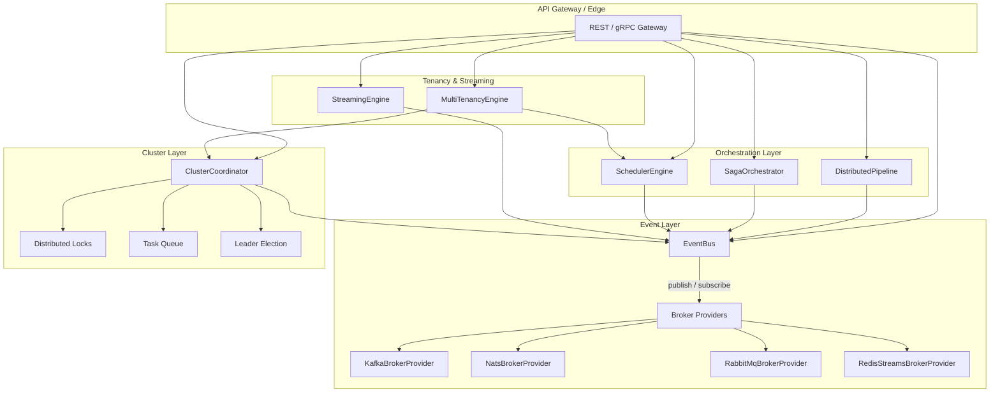
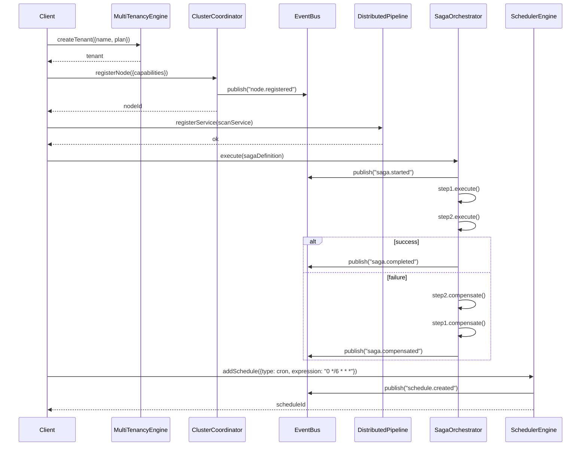

# INT-011 — Distributed Platform

## Overview

The Distributed Platform module provides the foundational infrastructure for running security scanning at scale across multiple nodes, tenants, and data streams. It encapsulates seven subsystems — Event Bus, Broker Providers, Distributed Pipeline, Saga Orchestrator, Scheduler Engine, Cluster Coordinator, and Multi-Tenancy Engine — along with a Streaming Engine for high-throughput data processing. Together these subsystems enable fault-tolerant, horizontally-scalable security operations with built-in circuit breaking, saga-based transaction compensation, and per-tenant resource isolation.

---

## Architecture



### Subsystem Responsibilities

| Subsystem | Purpose |
|---|---|
| **EventBus** | Central publish/subscribe backbone with replay, batch publishing, and event-store pruning |
| **Broker Providers** | Pluggable message-broker adapters (Kafka, NATS, RabbitMQ, Redis Streams) via `EventBusProvider` interface |
| **DistributedPipeline** | Registers and orchestrates long-running scan services across nodes with per-service circuit breakers |
| **SagaOrchestrator** | Executes multi-step distributed transactions with compensating actions on failure |
| **SchedulerEngine** | Cron, interval, one-time, and periodic-scan scheduling with dead-letter handling |
| **ClusterCoordinator** | Node registration, leader election, distributed locking, and work-queue distribution |
| **MultiTenancyEngine** | Tenant CRUD, user membership, RBAC permission checks, resource-limit enforcement, and usage metering |
| **StreamingEngine** | Real-time data pipelines for ingesting, transforming, and outputting high-volume security telemetry |

---

## Data Flow



---

## Public API

### EventBus

```typescript
class EventBus {
  publish(event: string, payload: unknown, metadata?: EventMetadata): Promise<EventAck>;
  publishBatch(events: Array<{ event: string; payload: unknown; metadata?: EventMetadata }>): Promise<EventAck[]>;
  subscribe(event: string, handler: (envelope: EventEnvelope) => Promise<void>, subscription?: Partial<EventSubscription>): Promise<string>;
  unsubscribe(subscriptionId: string): Promise<void>;
  replay(request: ReplayRequest): Promise<EventEnvelope[]>;
  getEvent(eventId: string): Promise<EventEnvelope | null>;
  getStatistics(): Promise<{ totalEvents: number; totalSubscriptions: number; storeSize: number }>;
  clearStore(): Promise<void>;
  prune(beforeDate: Date): Promise<number>;
}
```

**Exported Types**

| Type | Description |
|---|---|
| `EventEnvelope` | Wraps event payload + metadata + id + timestamp |
| `EventMetadata` | Correlation-id, source, tenant-id, trace headers |
| `EventSubscription` | Subscription id, event name, filter, retry config |
| `EventAck` | Acknowledgement with event id and broker offset |
| `RetryPolicy` | maxRetries, backoffMs, backoffStrategy, deadLetter flag |
| `ReplayRequest` | fromTimestamp, toTimestamp, eventNames[], limit |

---

### Broker Providers (`EventBusProvider` Interface)

```typescript
interface EventBusProvider {
  connect(): Promise<void>;
  disconnect(): Promise<void>;
  publish(event: string, payload: unknown, metadata?: EventMetadata): Promise<EventAck>;
  subscribe(event: string, handler: (envelope: EventEnvelope) => Promise<void>): Promise<string>;
  unsubscribe(subscriptionId: string): Promise<void>;
  ack(eventId: string): Promise<void>;
  nack(eventId: string): Promise<void>;
  replay(request: ReplayRequest): Promise<EventEnvelope[]>;
  health(): Promise<{ status: string; latencyMs: number }>;
  metrics(): Promise<{ messagesIn: number; messagesOut: number; consumerLag: number }>;
}

// Concrete providers
class KafkaBrokerProvider implements EventBusProvider { /* ... */ }
class NatsBrokerProvider implements EventBusProvider { /* ... */ }
class RabbitMqBrokerProvider implements EventBusProvider { /* ... */ }
class RedisStreamsBrokerProvider implements EventBusProvider { /* ... */ }

// Factory
function createBrokerProvider(config: BrokerProviderConfig): EventBusProvider;
```

---

### DistributedPipeline

```typescript
class DistributedPipeline {
  registerService(service: PipelineService): void;
  execute(serviceName: string, input: unknown): Promise<unknown>;
  startAll(): Promise<void>;
  stopAll(): Promise<void>;
  getHealth(): Promise<Record<string, { status: string; circuitState: string }>>;
  getTopology(): Promise<{ services: string[]; dependencies: Record<string, string[]> }>;
}

interface PipelineService {
  name: string;
  dependencies?: string[];
  execute(input: unknown): Promise<unknown>;
  health(): Promise<{ status: string }>;
}

class CircuitBreaker {
  readonly state: 'closed' | 'open' | 'half-open';
  trip(): void;
  reset(): void;
  execute<T>(fn: () => Promise<T>): Promise<T>;
}
```

---

### SagaOrchestrator

```typescript
class SagaOrchestrator {
  execute(definition: { steps: SagaStep[]; metadata?: Record<string, unknown> }): Promise<{ sagaId: string; status: string }>;
  getSaga(sagaId: string): Promise<SagaInstance | null>;
  getActiveSagas(): Promise<SagaInstance[]>;
  getCompletedSagas(limit?: number): Promise<SagaInstance[]>;
  getStatistics(): Promise<{ total: number; active: number; completed: number; compensated: number }>;
}

interface SagaStep {
  name: string;
  execute(context: SagaContext): Promise<unknown>;
  compensate(context: SagaContext): Promise<void>;
}
```

---

### SchedulerEngine

```typescript
class SchedulerEngine {
  start(): Promise<void>;
  stop(): Promise<void>;
  addSchedule(schedule: { name: string; type: ScheduleType; expression?: string; handler: () => Promise<void> }): Promise<string>;
  removeSchedule(scheduleId: string): Promise<void>;
  toggleSchedule(scheduleId: string, enabled: boolean): Promise<void>;
  getDeadLetterQueue(): Promise<DeadLetterEntry[]>;
  retryDeadLetter(entryId: string): Promise<void>;
  getStatistics(): Promise<{ total: number; active: number; deadLetters: number }>;
}

type ScheduleType = 'cron' | 'interval' | 'one-time' | 'periodic-scan';
```

---

### ClusterCoordinator

```typescript
class ClusterCoordinator {
  start(): Promise<void>;
  stop(): Promise<void>;
  registerNode(node: { id?: string; capabilities: string[] }): Promise<string>;
  removeNode(nodeId: string): Promise<void>;
  acquireLock(resource: string, ttlMs: number): Promise<string | null>;
  releaseLock(lockId: string): Promise<void>;
  renewLock(lockId: string, ttlMs: number): Promise<void>;
  enqueueTask(task: { type: string; payload: unknown; priority?: number }): Promise<string>;
  registerTaskHandler(type: string, handler: (payload: unknown) => Promise<void>): void;
  processNextTask(): Promise<boolean>;
  isLeader(): boolean;
  getLeader(): Promise<string | null>;
  getNodes(): Promise<NodeInfo[]>;
  getWorkersForCapability(capability: string): Promise<NodeInfo[]>;
  getStatistics(): Promise<{ nodes: number; tasks: number; locks: number }>;
}
```

---

### MultiTenancyEngine

```typescript
class MultiTenancyEngine {
  createTenant(data: { name: string; slug: string; plan: TenantPlan }): Promise<Tenant>;
  getTenant(tenantId: string): Promise<Tenant | null>;
  getTenantBySlug(slug: string): Promise<Tenant | null>;
  updateTenant(tenantId: string, updates: Partial<Tenant>): Promise<Tenant>;
  suspendTenant(tenantId: string, reason?: string): Promise<void>;
  deleteTenant(tenantId: string): Promise<void>;
  addUser(tenantId: string, userId: string, role: string): Promise<void>;
  removeUser(tenantId: string, userId: string): Promise<void>;
  hasPermission(tenantId: string, userId: string, permission: string): Promise<boolean>;
  checkResourceLimit(tenantId: string, resource: string, requested: number): Promise<boolean>;
  recordUsage(tenantId: string, resource: string, amount: number): Promise<void>;
  listTenants(filter?: { plan?: TenantPlan; status?: string }): Promise<Tenant[]>;
  getStatistics(): Promise<{ totalTenants: number; byPlan: Record<TenantPlan, number> }>;
}

type TenantPlan = 'free' | 'starter' | 'professional' | 'enterprise';
```

---

### StreamingEngine

```typescript
class StreamingEngine {
  createPipeline(definition: StreamingPipelineDefinition): Promise<string>;
  startPipeline(pipelineId: string): Promise<void>;
  stopPipeline(pipelineId: string): Promise<void>;
  processBatch(pipelineId: string, records: unknown[]): Promise<{ processed: number; errors: number }>;
  getPipelineStatus(pipelineId: string): Promise<{ status: string; throughput: number; lag: number }>;
  getPipelines(): Promise<Array<{ id: string; name: string; status: string }>>;
  getStatistics(): Promise<{ pipelines: number; totalProcessed: number; totalErrors: number }>;
}
```

---

## Extension Points

| Extension Point | Mechanism | Example |
|---|---|---|
| **Custom Broker Provider** | Implement `EventBusProvider` | Implement a Pulsar broker adapter |
| **Pipeline Service** | Implement `PipelineService` | Add a custom `VulnerabilityAggregatorService` |
| **Saga Step** | Provide `SagaStep` objects with `execute` + `compensate` | Add a `NotifySlackStep` to a scanning saga |
| **Schedule Handler** | Pass a callback to `addSchedule()` | Schedule custom compliance report generation |
| **Task Handler** | Register via `registerTaskHandler(type, fn)` | Add an `image-scan` task type |
| **Tenant Plan** | Extend `TenantPlan` union and resource-limit config | Add a `trial` plan with 7-day expiry |
| **Streaming Pipeline** | Define a `StreamingPipelineDefinition` | Create a pipeline that enriches CVE data from external feeds |

---

## Examples

### Creating a Tenant and Running a Distributed Scan Saga

```typescript
import {
  MultiTenancyEngine,
  ClusterCoordinator,
  SagaOrchestrator,
  EventBus,
  createBrokerProvider,
} from '@sec-scanner/distributed-platform';

// 1. Bootstrap the event bus with Kafka
const broker = createBrokerProvider({ type: 'kafka', brokers: ['kafka:9092'] });
const eventBus = new EventBus(broker);
await eventBus.publish('system.initialized', { version: '2.0' });

// 2. Create a tenant
const tenancy = new MultiTenancyEngine();
const tenant = await tenancy.createTenant({
  name: 'Acme Corp',
  slug: 'acme-corp',
  plan: 'professional',
});

// 3. Register cluster nodes
const cluster = new ClusterCoordinator();
await cluster.start();
const nodeId = await cluster.registerNode({ capabilities: ['port-scan', 'web-scan'] });

// 4. Execute a saga that scans and notifies
const saga = new SagaOrchestrator();
const result = await saga.execute({
  steps: [
    {
      name: 'port-scan',
      execute: async (ctx) => {
        return { openPorts: [22, 80, 443] };
      },
      compensate: async (ctx) => {
        // Clean up scan artifacts
      },
    },
    {
      name: 'web-scan',
      execute: async (ctx) => {
        const ports = ctx.results['port-scan'];
        return { vulnerabilities: 3 };
      },
      compensate: async (ctx) => {
        // Remove temporary scan data
      },
    },
  ],
  metadata: { tenantId: tenant.id },
});

console.log(`Saga ${result.sagaId} → ${result.status}`);
```

### Scheduling a Periodic Scan with Dead-Letter Retry

```typescript
import { SchedulerEngine } from '@sec-scanner/distributed-platform';

const scheduler = new SchedulerEngine();
await scheduler.start();

const scheduleId = await scheduler.addSchedule({
  name: 'nightly-full-scan',
  type: 'cron',
  expression: '0 2 * * *',
  handler: async () => {
    await runFullSecurityScan();
  },
});

// Later — inspect dead letters and retry
const dlq = await scheduler.getDeadLetterQueue();
for (const entry of dlq) {
  await scheduler.retryDeadLetter(entry.id);
}
```

### Streaming Pipeline for Real-Time Log Ingestion

```typescript
import { StreamingEngine } from '@sec-scanner/distributed-platform';

const streaming = new StreamingEngine();

const pipelineId = await streaming.createPipeline({
  name: 'syslog-ingest',
  source: { type: 'kafka', topic: 'syslog' },
  transforms: [
    { type: 'filter', expression: 'severity >= "ERROR"' },
    { type: 'enrich', lookup: 'threat-intel' },
  ],
  sink: { type: 'data-lake', table: 'security_events' },
});

await streaming.startPipeline(pipelineId);

// Process a batch manually (e.g., from a test harness)
const result = await streaming.processBatch(pipelineId, logEntries);
console.log(`Processed ${result.processed}, errors ${result.errors}`);
```

---

## Performance Notes

- **EventBus** — Batching via `publishBatch()` reduces round-trips by 5-10× under load. Event-store pruning (`prune()`) should be scheduled daily to prevent unbounded disk growth.
- **Broker Providers** — Kafka provides the highest throughput (100 k+ msgs/sec per partition). Redis Streams is suitable for low-latency, moderate-volume use cases. RabbitMQ excels at complex routing. NATS is ideal for lightweight, low-latency fan-out.
- **DistributedPipeline** — Each `PipelineService` is guarded by an independent `CircuitBreaker` with configurable thresholds. Opening a breaker prevents cascading failures; half-open probes auto-recover when the downstream service recovers.
- **SagaOrchestrator** — Compensation is executed in reverse step order. Long-running sagas should set per-step timeouts to avoid indefinite blocking. Active-saga state is held in memory; completed sagas are persisted to the event store.
- **SchedulerEngine** — Cron evaluation is O(1) per tick with a sorted schedule heap. Dead-letter retry is idempotent — the same entry cannot be retried concurrently.
- **ClusterCoordinator** — Distributed locks use a heartbeat-based TTL. Lock renewal should be performed at ~TTL/2 intervals. Leader election is piggybacked on lock acquisition — only one node holds the "leader" lock at a time.
- **MultiTenancyEngine** — `checkResourceLimit()` and `recordUsage()` are designed for hot-path invocation and use atomic counters in Redis. Plan-level limits are cached with a 60-second TTL to avoid per-request DB lookups.
- **StreamingEngine** — Throughput is bounded by the broker and sink. For parquet-backed sinks, `processBatch()` auto-flushes at 10 000 records or 64 MB, whichever is hit first. Backpressure is signaled to the source via the broker's native consumer-pause mechanism.
