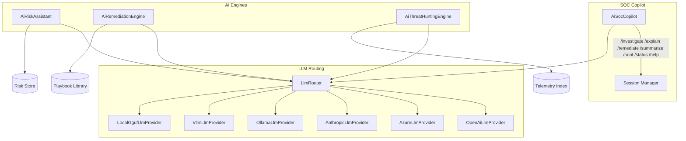
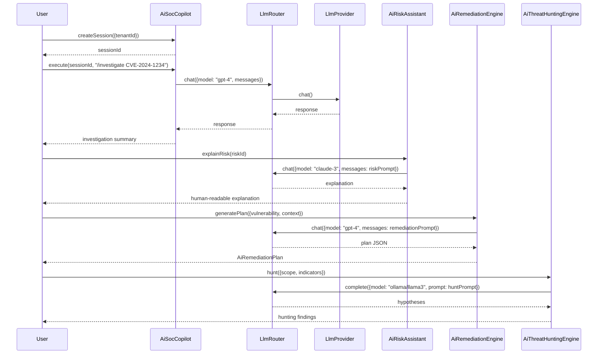

# INT-012 — AI Layer

## Overview

The AI Layer module exposes large-language-model capabilities and AI-powered security assistants to the rest of the platform. It comprises three tiers:

1. **LLM Provider tier** — Pluggable adapters for OpenAI, Azure OpenAI, Anthropic, Ollama, vLLM, and local GGUF runtimes, all conforming to the `LlmProvider` interface. A `LlmRouter` sits on top to route requests by model name, cost, or availability.
2. **Specialized AI Engines** — Purpose-built engines for risk explanation, remediation planning, and threat hunting that compose LLM calls with domain-specific prompts and tool use.
3. **SOC Copilot** — An interactive, session-based AI assistant that supports slash commands (`/investigate`, `/explain`, `/remediate`, `/summarize`, `/hunt`, `/status`, `/help`) for security operations centre workflows.

---

## Architecture



---

## Data Flow



---

## Public API

### LLM Providers (`LlmProvider` Interface)

```typescript
interface LlmProvider {
  chat(request: LlmChatRequest): Promise<LlmChatResponse>;
  complete(request: LlmCompletionRequest): Promise<LlmCompletionResponse>;
  embed(request: LlmEmbedRequest): Promise<LlmEmbedResponse>;
  health(): Promise<{ status: string; model: string; latencyMs: number }>;
  getModels(): Promise<string[]>;
}

interface LlmChatRequest {
  model: string;
  messages: Array<{ role: 'system' | 'user' | 'assistant'; content: string }>;
  temperature?: number;
  maxTokens?: number;
  stop?: string[];
  tools?: LlmTool[];
}

interface LlmChatResponse {
  id: string;
  choices: Array<{ message: { role: string; content: string }; finishReason: string }>;
  usage: { promptTokens: number; completionTokens: number; totalTokens: number };
}

interface LlmCompletionRequest {
  model: string;
  prompt: string;
  temperature?: number;
  maxTokens?: number;
}

interface LlmCompletionResponse {
  id: string;
  text: string;
  usage: { promptTokens: number; completionTokens: number };
}

interface LlmEmbedRequest {
  model: string;
  input: string | string[];
}

interface LlmEmbedResponse {
  embeddings: number[][];
  usage: { promptTokens: number };
}

// Concrete providers
class OpenAiLlmProvider implements LlmProvider { /* ... */ }
class AzureLlmProvider implements LlmProvider { /* ... */ }
class AnthropicLlmProvider implements LlmProvider { /* ... */ }
class OllamaLlmProvider implements LlmProvider { /* ... */ }
class VllmLlmProvider implements LlmProvider { /* ... */ }
class LocalGgufLlmProvider implements LlmProvider { /* ... */ }

// Factory
function createLlmProvider(config: LlmProviderConfig): LlmProvider;
```

---

### LlmRouter

```typescript
class LlmRouter {
  registerProvider(name: string, provider: LlmProvider): void;
  chat(request: LlmChatRequest): Promise<LlmChatResponse>;
  complete(request: LlmCompletionRequest): Promise<LlmCompletionResponse>;
  embed(request: LlmEmbedRequest): Promise<LlmEmbedResponse>;
  getProvider(name: string): LlmProvider | undefined;
  listProviders(): Array<{ name: string; models: string[]; healthy: boolean }>;
}
```

---

### AiRiskAssistant

```typescript
class AiRiskAssistant {
  explainRisk(riskId: string, options?: { audience?: 'executive' | 'technical' | 'developer' }): Promise<RiskExplanation>;
  compareRisks(riskIds: string[]): Promise<RiskComparison>;
}

interface RiskExplanation {
  riskId: string;
  summary: string;
  impact: string;
  likelihood: string;
  recommendation: string;
  audience: string;
}

interface RiskComparison {
  risks: Array<{ riskId: string; score: number; rationale: string }>;
  ranking: string[];
  keyDifferences: string[];
}
```

---

### AiRemediationEngine

```typescript
class AiRemediationEngine {
  generatePlan(params: {
    vulnerability: string;
    context?: Record<string, unknown>;
    priority?: 'low' | 'medium' | 'high' | 'critical';
  }): Promise<AiRemediationPlan>;
}

interface AiRemediationPlan {
  vulnerability: string;
  priority: string;
  phases: RemediationPhase[];
  playbook: Playbook;
  rollbackPlan: RollbackPlan;
}

interface RemediationPhase {
  name: string;
  description: string;
  steps: string[];
  estimatedTime: string;
  riskLevel: 'low' | 'medium' | 'high';
}

interface Playbook {
  name: string;
  steps: Array<{ order: number; action: string; verification: string }>;
}

interface RollbackPlan {
  steps: string[];
  estimatedTime: string;
}
```

---

### AiThreatHuntingEngine

```typescript
class AiThreatHuntingEngine {
  hunt(params: {
    scope: string;
    indicators: string[];
    timeRange?: { from: Date; to: Date };
  }): Promise<HuntingResult>;
  findLateralMovement(params: {
    sourceHost: string;
    timeRange?: { from: Date; to: Date };
  }): Promise<LateralMovementResult>;
}

interface HuntingResult {
  findings: Array<{
    type: string;
    description: string;
    confidence: number;
    indicators: string[];
    recommendedActions: string[];
  }>;
  summary: string;
}

interface LateralMovementResult {
  paths: Array<{
    from: string;
    to: string;
    technique: string;
    evidence: string[];
  }>;
  riskScore: number;
}
```

---

### AiSocCopilot

```typescript
class AiSocCopilot {
  createSession(params: { tenantId: string; userId: string }): Promise<{ sessionId: string }>;
  execute(sessionId: string, command: string): Promise<CopilotResponse>;
  getSessionHistory(sessionId: string): Promise<CopilotMessage[]>;
  listSessions(filter?: { userId?: string; tenantId?: string }): Promise<Array<{ sessionId: string; createdAt: Date }>>;
  endSession(sessionId: string): Promise<void>;
}

interface CopilotResponse {
  sessionId: string;
  output: string;
  artifacts?: unknown[];
  suggestions?: string[];
}

interface CopilotMessage {
  role: 'user' | 'assistant';
  content: string;
  timestamp: Date;
  command?: string;
}

// Supported slash commands:
// /investigate  — Deep-dive into an alert, CVE, or incident
// /explain      — Explain a security concept, finding, or policy
// /remediate    — Generate a remediation plan for a vulnerability
// /summarize    — Summarize recent alerts, scan results, or incidents
// /hunt         — Initiate a threat-hunting session
// /status       — Show current system and scan status
// /help         — List available commands and usage tips
```

---

## Extension Points

| Extension Point | Mechanism | Example |
|---|---|---|
| **Custom LLM Provider** | Implement `LlmProvider` | Add a Cohere or Mistral provider |
| **Router Strategy** | Override provider selection in `LlmRouter` | Implement cost-aware or latency-aware routing |
| **Risk Explanation Audience** | Pass `audience` parameter to `explainRisk()` | Add a `compliance-officer` audience template |
| **Remediation Phase Template** | Extend `RemediationPhase` with custom fields | Add infrastructure-as-code references per phase |
| **Hunting Plugin** | Extend `AiThreatHuntingEngine` with new hunt types | Add cloud-native lateral-movement detection |
| **Copilot Command** | Register custom slash commands in `AiSocCopilot` | Add `/triage` for automated alert triage |

---

## Examples

### Using the LLM Router with Multiple Providers

```typescript
import { LlmRouter, createLlmProvider } from '@sec-scanner/ai-layer';

const router = new LlmRouter();

router.registerProvider('openai', createLlmProvider({
  type: 'openai',
  apiKey: process.env.OPENAI_API_KEY!,
}));

router.registerProvider('ollama', createLlmProvider({
  type: 'ollama',
  baseUrl: 'http://ollama:11434',
}));

router.registerProvider('anthropic', createLlmProvider({
  type: 'anthropic',
  apiKey: process.env.ANTHROPIC_API_KEY!,
}));

// Chat with a specific provider
const response = await router.chat({
  model: 'gpt-4',
  messages: [
    { role: 'system', content: 'You are a security analyst assistant.' },
    { role: 'user', content: 'Explain CVE-2024-1234' },
  ],
  temperature: 0.3,
});

console.log(response.choices[0].message.content);

// List available providers
const providers = router.listProviders();
console.log(providers);
// [{ name: 'openai', models: ['gpt-4', ...], healthy: true }, ...]
```

### Generating a Remediation Plan

```typescript
import { AiRemediationEngine } from '@sec-scanner/ai-layer';

const remediation = new AiRemediationEngine();

const plan = await remediation.generatePlan({
  vulnerability: 'CVE-2024-1234',
  context: { asset: 'web-prod-01', os: 'Ubuntu 22.04' },
  priority: 'critical',
});

console.log(`Plan for ${plan.vulnerability}:`);
for (const phase of plan.phases) {
  console.log(`  Phase: ${phase.name} (${phase.estimatedTime})`);
  for (const step of phase.steps) {
    console.log(`    - ${step}`);
  }
}
console.log(`Rollback plan has ${plan.rollbackPlan.steps.length} steps`);
```

### SOC Copilot Interactive Session

```typescript
import { AiSocCopilot } from '@sec-scanner/ai-layer';

const copilot = new AiSocCopilot();

const { sessionId } = await copilot.createSession({
  tenantId: 'acme-corp',
  userId: 'analyst-42',
});

// Investigate a CVE
let resp = await copilot.execute(sessionId, '/investigate CVE-2024-5678');
console.log(resp.output);

// Generate a remediation plan
resp = await copilot.execute(sessionId, '/remediate CVE-2024-5678');
console.log(resp.output);

// Hunt for lateral movement
resp = await copilot.execute(sessionId, '/hunt scope=network indicators=suspicious-rdp');
console.log(resp.output);

// Check status
resp = await copilot.execute(sessionId, '/status');
console.log(resp.output);

// Review session history
const history = await copilot.getSessionHistory(sessionId);
console.log(`Session has ${history.length} messages`);

// End session
await copilot.endSession(sessionId);
```

### Risk Comparison

```typescript
import { AiRiskAssistant } from '@sec-scanner/ai-layer';

const assistant = new AiRiskAssistant();

// Compare multiple risks
const comparison = await assistant.compareRisks([
  'RISK-001',
  'RISK-002',
  'RISK-003',
]);

console.log('Ranking:');
for (const riskId of comparison.ranking) {
  const risk = comparison.risks.find((r) => r.riskId === riskId)!;
  console.log(`  ${riskId}: score=${risk.score} — ${risk.rationale}`);
}
```

---

## Performance Notes

- **LlmRouter** — Provider selection is O(1) by model-name lookup. Health checks are cached for 30 seconds to avoid per-request probing. For high-QPS workloads, consider pre-warming the connection pool via `registerProvider()`.
- **Chat / Complete** — Latency is dominated by the upstream LLM API (typically 500 ms – 5 s per request). Streaming responses are not yet supported but are planned; until then, use `maxTokens` judiciously to avoid timeouts on long generations.
- **Embed** — Batch embedding is significantly faster than single-item calls. Pass arrays to `embed()` whenever possible; the provider batches internally.
- **LocalGgufLlmProvider** — Inference speed depends on GPU/CPU availability. For models > 7 B parameters on CPU, expect 2-10 tokens/sec. Use vLLM for GPU-accelerated local serving.
- **AiRemediationEngine** — Plan generation involves a multi-turn LLM conversation (typically 2-3 round-trips). Average latency is 3-8 seconds. Cache plans by vulnerability ID for repeat queries.
- **AiThreatHuntingEngine** — Hunting is I/O-bound (querying telemetry stores) in addition to LLM calls. The `hunt()` method parallelises telemetry queries where possible.
- **AiSocCopilot** — Session state is held in memory with a configurable TTL (default: 1 hour). For multi-node deployments, session state should be externalised to Redis. Slash-command dispatch is O(1); command execution latency depends on the underlying engine invoked.
