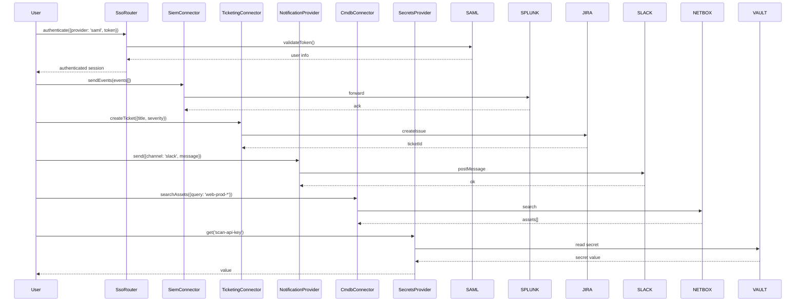

# INT-013 — Enterprise Integrations

## Overview

The Enterprise Integrations module provides a uniform adapter layer for connecting the security platform to external enterprise systems. It covers six integration domains:

1. **SSO** — Single sign-on via SAML 2.0, OIDC, LDAP, and Active Directory.
2. **SIEM** — Event forwarding and querying to Splunk, QRadar, Microsoft Sentinel, Elastic SIEM, and Google Chronicle.
3. **Ticketing** — Bi-directional ticket management with Jira, ServiceNow, GitHub Issues, GitLab Issues, and Azure DevOps.
4. **Notification** — Alert delivery through Slack, Microsoft Teams, Discord, Telegram, Email, PagerDuty, OpsGenie, and generic webhooks.
5. **CMDB** — Asset synchronisation with ServiceNow CMDB, NetBox, and Backstage.
6. **Secrets** — Secrets management via HashiCorp Vault, AWS Secrets Manager, Azure Key Vault, and GCP Secret Manager.

All adapters conform to domain-specific interfaces (`SsoProvider`, `SiemConnector`, `TicketingConnector`, `NotificationProvider`, `CmdbConnector`, `SecretsProvider`), enabling consistent configuration, health monitoring, and hot-swapping of backends.

---

## Architecture

```mermaid
graph TB
  subgraph "Enterprise Gateway"
    EG[Integration Gateway]
  end

  subgraph "SSO"
    SSO_ROUTER[SsoRouter]
    SSO_ROUTER --> SAML[SamlSsoProvider]
    SSO_ROUTER --> OIDC[OidcSsoProvider]
    SSO_ROUTER --> LDAP[LdapSsoProvider]
    SSO_ROUTER --> AD[AdSsoProvider]
  end

  subgraph "SIEM"
    SIEM_MGR[SIEM Manager]
    SIEM_MGR --> SPLUNK[SplunkConnector]
    SIEM_MGR --> QRADAR[QradarConnector]
    SIEM_MGR --> SENTINEL[SentinelConnector]
    SIEM_MGR --> ELASTIC[ElasticSiemConnector]
    SIEM_MGR --> CHRONICLE[ChronicleConnector]
  end

  subgraph "Ticketing"
    TICK_MGR[Ticketing Manager]
    TICK_MGR --> JIRA[JiraConnector]
    TICK_MGR --> SNOW[ServiceNowConnector]
    TICK_MGR --> GH[GitHubConnector]
    TICK_MGR --> GL[GitLabConnector]
    TICK_MGR --> ADO[AzureDevOpsConnector]
  end

  subgraph "Notification"
    NOTIF_MGR[Notification Manager]
    NOTIF_MGR --> SLACK[SlackProvider]
    NOTIF_MGR --> TEAMS[TeamsProvider]
    NOTIF_MGR --> DISCORD[DiscordProvider]
    NOTIF_MGR --> TELEGRAM[TelegramProvider]
    NOTIF_MGR --> EMAIL[EmailProvider]
    NOTIF_MGR --> PD[PagerDutyProvider]
    NOTIF_MGR --> OG[OpsGenieProvider]
    NOTIF_MGR --> WH[WebhookProvider]
  end

  subgraph "CMDB"
    CMDB_MGR[CMDB Manager]
    CMDB_MGR --> SNOW_CMDB[ServiceNowCmdb]
    CMDB_MGR --> NETBOX[NetBoxCmdb]
    CMDB_MGR --> BACKSTAGE[BackstageCmdb]
  end

  subgraph "Secrets"
    SEC_MGR[Secrets Manager]
    SEC_MGR --> VAULT[VaultProvider]
    SEC_MGR --> AWS[AwsSecretsProvider]
    SEC_MGR --> AZ_KV[AzureKvProvider]
    SEC_MGR --> GCP[GcpSecretsProvider]
  end

  EG --> SSO_ROUTER
  EG --> SIEM_MGR
  EG --> TICK_MGR
  EG --> NOTIF_MGR
  EG --> CMDB_MGR
  EG --> SEC_MGR
```



---

## Data Flow



---

## Public API

### SSO (`SsoProvider` Interface)

```typescript
interface SsoProvider {
  authenticate(credentials: SsoCredentials): Promise<SsoAuthResult>;
  validateToken(token: string): Promise<SsoTokenValidation>;
  refreshToken(refreshToken: string): Promise<SsoAuthResult>;
  getUserInfo(accessToken: string): Promise<SsoUserInfo>;
  logout(accessToken: string): Promise<void>;
  health(): Promise<{ status: string; provider: string }>;
}

interface SsoCredentials {
  // SAML: assertion; OIDC: authCode; LDAP/AD: username+password
  assertion?: string;
  authCode?: string;
  username?: string;
  password?: string;
  redirectUri?: string;
}

interface SsoAuthResult {
  accessToken: string;
  refreshToken?: string;
  expiresIn: number;
  tokenType: string;
}

interface SsoTokenValidation {
  valid: boolean;
  expiresAt: Date;
  userId: string;
  roles: string[];
}

interface SsoUserInfo {
  userId: string;
  email: string;
  displayName: string;
  groups: string[];
  attributes: Record<string, string[]>;
}

class SamlSsoProvider implements SsoProvider { /* ... */ }
class OidcSsoProvider implements SsoProvider { /* ... */ }
class LdapSsoProvider implements SsoProvider { /* ... */ }
class AdSsoProvider implements SsoProvider { /* ... */ }

class SsoRouter {
  registerProvider(name: string, provider: SsoProvider): void;
  authenticate(providerName: string, credentials: SsoCredentials): Promise<SsoAuthResult>;
  validateToken(providerName: string, token: string): Promise<SsoTokenValidation>;
  refreshToken(providerName: string, refreshToken: string): Promise<SsoAuthResult>;
  getUserInfo(providerName: string, accessToken: string): Promise<SsoUserInfo>;
  logout(providerName: string, accessToken: string): Promise<void>;
}

function createSsoProvider(config: SsoProviderConfig): SsoProvider;
```

---

### SIEM (`SiemConnector` Interface)

```typescript
interface SiemConnector {
  connect(): Promise<void>;
  disconnect(): Promise<void>;
  sendEvents(events: SiemEvent[]): Promise<{ sent: number; failed: number }>;
  query(params: SiemQueryParams): Promise<SiemQueryResult>;
  health(): Promise<{ status: string; connected: boolean; latencyMs: number }>;
}

interface SiemEvent {
  timestamp: Date;
  source: string;
  eventType: string;
  severity: 'info' | 'low' | 'medium' | 'high' | 'critical';
  payload: Record<string, unknown>;
}

interface SiemQueryParams {
  query: string;
  timeRange: { from: Date; to: Date };
  limit?: number;
}

interface SiemQueryResult {
  total: number;
  events: SiemEvent[];
}

class SplunkConnector implements SiemConnector { /* ... */ }
class QradarConnector implements SiemConnector { /* ... */ }
class SentinelConnector implements SiemConnector { /* ... */ }
class ElasticSiemConnector implements SiemConnector { /* ... */ }
class ChronicleConnector implements SiemConnector { /* ... */ }
```

---

### Ticketing (`TicketingConnector` Interface)

```typescript
interface TicketingConnector {
  createTicket(params: CreateTicketParams): Promise<Ticket>;
  updateTicket(ticketId: string, updates: Partial<Ticket>): Promise<Ticket>;
  getTicket(ticketId: string): Promise<Ticket>;
  addComment(ticketId: string, comment: string): Promise<void>;
  listTickets(filter?: TicketFilter): Promise<Ticket[]>;
  health(): Promise<{ status: string; connected: boolean }>;
}

interface CreateTicketParams {
  title: string;
  description: string;
  severity: 'low' | 'medium' | 'high' | 'critical';
  assignee?: string;
  labels?: string[];
  metadata?: Record<string, unknown>;
}

interface Ticket {
  id: string;
  title: string;
  status: string;
  severity: string;
  assignee?: string;
  createdAt: Date;
  updatedAt: Date;
  url: string;
}

interface TicketFilter {
  status?: string;
  severity?: string;
  assignee?: string;
  limit?: number;
}

class JiraConnector implements TicketingConnector { /* ... */ }
class ServiceNowConnector implements TicketingConnector { /* ... */ }
class GitHubConnector implements TicketingConnector { /* ... */ }
class GitLabConnector implements TicketingConnector { /* ... */ }
class AzureDevOpsConnector implements TicketingConnector { /* ... */ }
```

---

### Notification (`NotificationProvider` Interface)

```typescript
interface NotificationProvider {
  send(notification: Notification): Promise<{ delivered: boolean; messageId?: string }>;
  sendBatch(notifications: Notification[]): Promise<Array<{ delivered: boolean; messageId?: string }>>;
  health(): Promise<{ status: string; provider: string }>;
}

interface Notification {
  channel: string;
  recipient: string;
  subject?: string;
  message: string;
  severity?: 'info' | 'warning' | 'error' | 'critical';
  metadata?: Record<string, unknown>;
}

// Concrete providers
class SlackNotificationProvider implements NotificationProvider { /* ... */ }
class TeamsNotificationProvider implements NotificationProvider { /* ... */ }
class DiscordNotificationProvider implements NotificationProvider { /* ... */ }
class TelegramNotificationProvider implements NotificationProvider { /* ... */ }
class EmailNotificationProvider implements NotificationProvider { /* ... */ }
class PagerDutyNotificationProvider implements NotificationProvider { /* ... */ }
class OpsGenieNotificationProvider implements NotificationProvider { /* ... */ }
class WebhookNotificationProvider implements NotificationProvider { /* ... */ }
```

---

### CMDB (`CmdbConnector` Interface)

```typescript
interface CmdbConnector {
  getAsset(assetId: string): Promise<CmdbAsset>;
  searchAssets(params: CmdbSearchParams): Promise<CmdbAsset[]>;
  createAsset(asset: Partial<CmdbAsset>): Promise<CmdbAsset>;
  updateAsset(assetId: string, updates: Partial<CmdbAsset>): Promise<CmdbAsset>;
  deleteAsset(assetId: string): Promise<void>;
  getRelatedAssets(assetId: string): Promise<CmdbAsset[]>;
  sync(options?: { full?: boolean }): Promise<{ synced: number; errors: number }>;
  health(): Promise<{ status: string; lastSync?: Date }>;
}

interface CmdbAsset {
  id: string;
  name: string;
  type: string;
  status: string;
  owner?: string;
  tags: Record<string, string>;
  attributes: Record<string, unknown>;
  createdAt: Date;
  updatedAt: Date;
}

interface CmdbSearchParams {
  query: string;
  type?: string;
  status?: string;
  limit?: number;
}

class ServiceNowCmdbConnector implements CmdbConnector { /* ... */ }
class NetBoxCmdbConnector implements CmdbConnector { /* ... */ }
class BackstageCmdbConnector implements CmdbConnector { /* ... */ }
```

---

### Secrets (`SecretsProvider` Interface)

```typescript
interface SecretsProvider {
  get(path: string): Promise<string>;
  set(path: string, value: string, options?: { ttl?: number; tags?: Record<string, string> }): Promise<void>;
  delete(path: string): Promise<void>;
  list(prefix: string): Promise<string[]>;
  health(): Promise<{ status: string; sealed?: boolean }>;
}

class VaultSecretsProvider implements SecretsProvider { /* ... */ }
class AwsSecretsProvider implements SecretsProvider { /* ... */ }
class AzureKvSecretsProvider implements SecretsProvider { /* ... */ }
class GcpSecretsProvider implements SecretsProvider { /* ... */ }
```

---

## Extension Points

| Extension Point | Mechanism | Example |
|---|---|---|
| **Custom SSO Provider** | Implement `SsoProvider` | Add a Duo MFA-backed SSO provider |
| **Custom SIEM Connector** | Implement `SiemConnector` | Add a Humio/Sumo Logic connector |
| **Custom Ticketing Connector** | Implement `TicketingConnector` | Add a Freshservice connector |
| **Custom Notification Provider** | Implement `NotificationProvider` | Add a Microsoft Teams Adaptive Card provider |
| **Custom CMDB Connector** | Implement `CmdbConnector` | Add a Collibra data-governance connector |
| **Custom Secrets Provider** | Implement `SecretsProvider` | Add a 1Password Secrets Automation provider |
| **SSO Router Rules** | Extend `SsoRouter` with custom resolution logic | Route by email domain to different IdPs |
| **Event Enrichment** | Hook into `SiemConnector.sendEvents()` | Enrich events with geo-IP or asset metadata before forwarding |

---

## Examples

### SSO Authentication Flow

```typescript
import { SsoRouter, createSsoProvider } from '@sec-scanner/enterprise';

const router = new SsoRouter();

router.registerProvider('okta', createSsoProvider({
  type: 'oidc',
  issuer: 'https://acme.okta.com',
  clientId: 'xxx',
  clientSecret: 'yyy',
  redirectUri: 'https://scanner.acme.com/callback',
}));

router.registerProvider('corp-ad', createSsoProvider({
  type: 'ad',
  url: 'ldap://ad.acme.corp',
  baseDn: 'DC=acme,DC=corp',
}));

// OIDC login
const oidcResult = await router.authenticate('okta', {
  authCode: 'authorization-code-from-callback',
  redirectUri: 'https://scanner.acme.com/callback',
});
console.log(`Access token: ${oidcResult.accessToken}`);

// Active Directory login
const adResult = await router.authenticate('corp-ad', {
  username: 'jdoe',
  password: '***',
});
console.log(`Authenticated: ${adResult.tokenType} expires in ${oidcResult.expiresIn}s`);
```

### Forwarding Security Events to SIEM

```typescript
import { SplunkConnector } from '@sec-scanner/enterprise';

const siem = new SplunkConnector({
  url: 'https://splunk.acme.corp:8089',
  token: process.env.SPLUNK_HEC_TOKEN!,
  index: 'security',
});

await siem.connect();

const result = await siem.sendEvents([
  {
    timestamp: new Date(),
    source: 'port-scanner',
    eventType: 'vulnerability-found',
    severity: 'high',
    payload: { host: '10.0.1.42', cve: 'CVE-2024-1234', port: 443 },
  },
]);
console.log(`Sent ${result.sent}, failed ${result.failed}`);

// Query historical events
const queryResult = await siem.query({
  query: 'search index=security severity=critical',
  timeRange: { from: new Date(Date.now() - 86400000), to: new Date() },
  limit: 50,
});
console.log(`Found ${queryResult.total} critical events`);
```

### Creating a Ticket and Sending Notifications

```typescript
import { JiraConnector, SlackNotificationProvider } from '@sec-scanner/enterprise';

const ticketing = new JiraConnector({
  host: 'https://acme.atlassian.net',
  token: process.env.JIRA_TOKEN!,
  projectKey: 'SEC',
});

const notifier = new SlackNotificationProvider({
  webhookUrl: process.env.SLACK_WEBHOOK!,
  channel: '#security-alerts',
});

// Create a ticket for a critical finding
const ticket = await ticketing.createTicket({
  title: 'Critical RCE on web-prod-01',
  description: 'CVE-2024-5678 allows remote code execution via deserialization',
  severity: 'critical',
  assignee: 'security-lead',
  labels: ['rce', 'production'],
});

// Notify the team
await notifier.send({
  channel: '#security-alerts',
  recipient: 'team',
  subject: 'Critical RCE Detected',
  message: `New critical ticket: ${ticket.title}\nJira: ${ticket.url}`,
  severity: 'critical',
});

// Update the ticket
await ticketing.addComment(ticket.id, 'Patched in v2.3.1 — pending verification scan.');
```

### Retrieving a Secret from Vault

```typescript
import { VaultSecretsProvider } from '@sec-scanner/enterprise';

const secrets = new VaultSecretsProvider({
  address: 'https://vault.acme.corp:8200',
  token: process.env.VAULT_TOKEN!,
});

// Retrieve a scan credential
const apiKey = await secrets.get('secret/scanner/aws-access-key');
console.log(`Retrieved secret (${apiKey.length} chars)`);

// List secrets under a prefix
const paths = await secrets.list('secret/scanner/');
console.log(`Found ${paths.length} scanner secrets`);

// Store a new secret
await secrets.set('secret/scanner/new-key', 'ak-xxx', {
  ttl: 86400,
  tags: { owner: 'security-team', rotation: '30d' },
});
```

---

## Performance Notes

- **SSO** — Token validation is cached for the token's remaining TTL (or 5 minutes, whichever is shorter). LDAP/AD `authenticate()` opens a pooled connection; the pool size is configurable (default: 10). For high-login-rate scenarios, enable OIDC refresh-token rotation to avoid re-authentication round-trips.
- **SIEM** — `sendEvents()` batches events internally (default batch size: 100). The HEC (HTTP Event Collector) protocol used by Splunk supports gzip compression — enable it for WAN deployments. `query()` latency depends entirely on the SIEM backend; set a client-side timeout (default: 30 s).
- **Ticketing** — `createTicket()` and `updateTicket()` are synchronous REST calls; average latency is 200–800 ms depending on the provider. `listTickets()` should use the `limit` parameter to avoid fetching entire backlogs.
- **Notification** — `sendBatch()` parallelises deliveries across channels. Slack and Teams rate-limit at ~1 msg/sec per channel; the provider implements token-bucket throttling automatically. PagerDuty and OpsGenie use synchronous incident APIs — avoid calling them in hot paths.
- **CMDB** — `sync({ full: true })` is expensive (full asset dump + diff). Use incremental sync by default. `searchAssets()` delegates to the CMDB's native search; index your CMDB by hostname and IP for optimal scanner lookups.
- **Secrets** — `get()` is cached in-process for 60 seconds by default. For high-frequency secret access (e.g., per-scan credentials), increase the cache TTL or use `set()` to pre-warm the cache. Vault's lease renewal is handled automatically by the provider.
