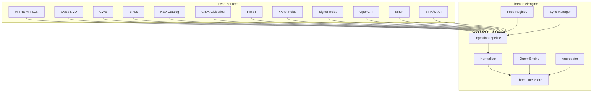
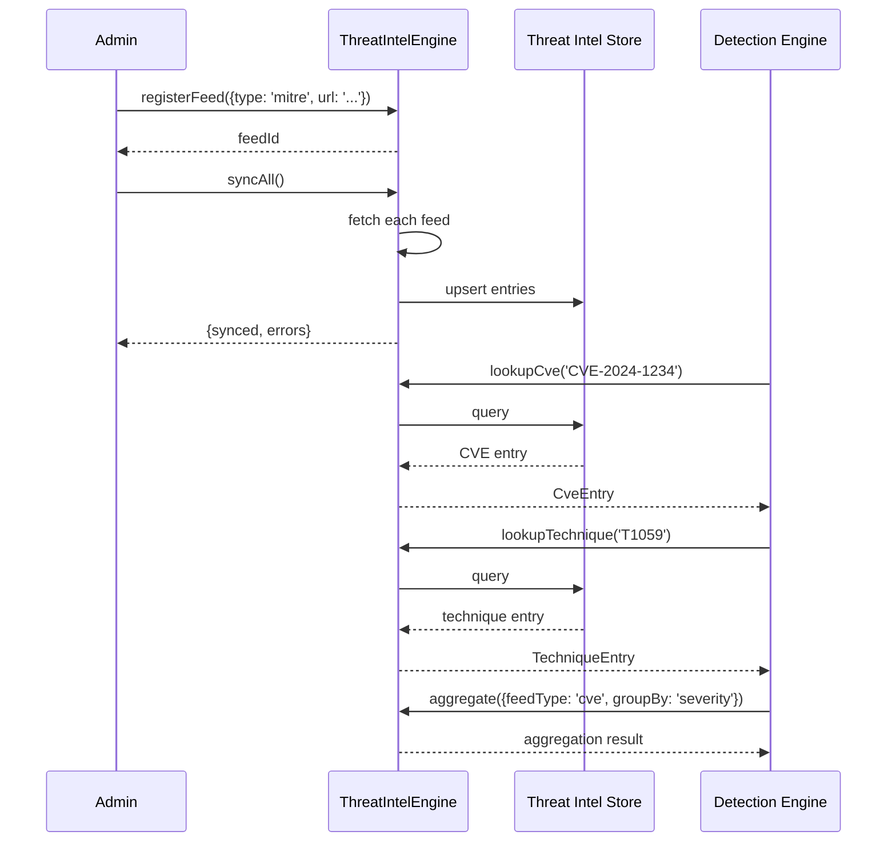

# INT-014 — Threat Intelligence

## Overview

The Threat Intelligence module provides a unified engine for ingesting, storing, querying, and distributing threat-intel data from diverse feeds. It supports 12 feed types — MITRE ATT&CK, CVE, CWE, EPSS, KEV, CISA advisories, FIRST, YARA, Sigma, OpenCTI, MISP, and STIX/TAXII — and offers both structured API access and raw STIX 2.1 object retrieval. The engine normalises incoming data into a common schema, maintains per-feed statistics, and supports full and incremental synchronisation.

---

## Architecture



---

## Data Flow



---

## Public API

### ThreatIntelEngine

```typescript
class ThreatIntelEngine {
  registerFeed(config: FeedConfig): Promise<string>;
  ingest(feedId: string, data: unknown): Promise<{ ingested: number; skipped: number; errors: number }>;
  ingestStix(stixBundle: StixBundle): Promise<{ ingested: number; skipped: number }>;
  query(params: ThreatIntelQueryParams): Promise<ThreatIntelEntry[]>;
  getEntry(entryId: string): Promise<ThreatIntelEntry | null>;
  lookupCve(cveId: string): Promise<CveEntry | null>;
  lookupTechnique(techniqueId: string): Promise<TechniqueEntry | null>;
  getStixObjects(params: { type?: string; limit?: number }): Promise<StixObject[]>;
  aggregate(params: AggregationParams): Promise<AggregationResult>;
  syncAll(): Promise<{ feeds: number; synced: number; errors: number }>;
  getFeeds(): Promise<FeedInfo[]>;
  getStatistics(): Promise<ThreatIntelStatistics>;
}
```

**Exported Types**

| Type | Description |
|---|---|
| `FeedType` | `'mitre' \| 'cve' \| 'cwe' \| 'epss' \| 'kev' \| 'cisa' \| 'first' \| 'yara' \| 'sigma' \| 'opencti' \| 'misp' \| 'stix-taxii'` |
| `FeedConfig` | `{ type: FeedType; url: string; apiKey?: string; refreshInterval?: string; filters?: Record<string, unknown> }` |
| `FeedInfo` | `{ id: string; type: FeedType; url: string; lastSync: Date; entryCount: number; status: string }` |
| `ThreatIntelQueryParams` | `{ feedType?: FeedType; search?: string; filters?: Record<string, unknown>; limit?: number; offset?: number }` |
| `ThreatIntelEntry` | `{ id: string; feedType: FeedType; sourceId: string; data: Record<string, unknown>; ingestedAt: Date; updatedAt: Date }` |
| `CveEntry` | `{ id: string; cveId: string; description: string; severity: string; cvss: number; epss?: number; kev?: boolean; references: string[]; publishedAt: Date; modifiedAt: Date }` |
| `TechniqueEntry` | `{ id: string; techniqueId: string; name: string; tactic: string; description: string; subTechniques: string[]; mitigations: string[]; detection: string }` |
| `StixBundle` | `{ type: 'bundle'; objects: StixObject[] }` |
| `StixObject` | `{ type: string; id: string; [key: string]: unknown }` |
| `AggregationParams` | `{ feedType?: FeedType; groupBy: string; filters?: Record<string, unknown> }` |
| `AggregationResult` | `{ groups: Array<{ key: string; count: number; entries?: ThreatIntelEntry[] }> }` |
| `ThreatIntelStatistics` | `{ totalEntries: number; byFeedType: Record<FeedType, number>; lastSync: Date; feeds: number }` |

---

## Extension Points

| Extension Point | Mechanism | Example |
|---|---|---|
| **Custom Feed Type** | Extend `FeedType` union + register a normaliser | Add a `vulncheck` feed type with its own schema |
| **Ingestion Pipeline** | Pre-process hooks before `ingest()` writes to store | Deduplicate entries by external ID before upsert |
| **Normaliser** | Per-feed-type normalisation functions | Custom mapping for a proprietary MISP feed |
| **Query Plugins** | Extend `query()` with domain-specific filters | Add a "exploit-available" filter that cross-references KEV and EPSS |
| **STIX Mapping** | Extend `ingestStix()` with custom STIX type handlers | Map custom STIX extension objects to internal entries |
| **Sync Strategy** | Override per-feed sync behaviour | Implement delta-sync via HTTP ETags for large NVD feeds |

---

## Examples

### Registering Feeds and Syncing

```typescript
import { ThreatIntelEngine } from '@sec-scanner/threat-intel';

const engine = new ThreatIntelEngine();

// Register multiple feeds
const mitreFeedId = await engine.registerFeed({
  type: 'mitre',
  url: 'https://raw.githubusercontent.com/mitre/cti/master/enterprise-attack/enterprise-attack.json',
});

const cveFeedId = await engine.registerFeed({
  type: 'cve',
  url: 'https://nvd.nist.gov/feeds/json/cve/1.1/nvdcve-1.1-recent.json.gz',
  refreshInterval: '24h',
});

const epssFeedId = await engine.registerFeed({
  type: 'epss',
  url: 'https://epss.cyentia.com/epss_scores-current.csv.gz',
  refreshInterval: '24h',
});

// Synchronise all registered feeds
const syncResult = await engine.syncAll();
console.log(`Synced ${syncResult.synced}/${syncResult.feeds} feeds, ${syncResult.errors} errors`);
```

### Looking Up a CVE with EPSS and KEV Context

```typescript
const cve = await engine.lookupCve('CVE-2024-1234');
if (cve) {
  console.log(`${cve.cveId}: ${cve.description}`);
  console.log(`  Severity: ${cve.severity} (CVSS ${cve.cvss})`);
  console.log(`  EPSS: ${cve.epss ?? 'N/A'}`);
  console.log(`  In KEV catalog: ${cve.kev ? 'YES' : 'no'}`);
  console.log(`  References: ${cve.references.length}`);
}
```

### Querying MITRE Techniques

```typescript
const techniques = await engine.query({
  feedType: 'mitre',
  search: 'lateral movement',
  filters: { tactic: 'TA0008' },
  limit: 10,
});

for (const entry of techniques) {
  const tech = entry.data as TechniqueEntry;
  console.log(`${tech.techniqueId}: ${tech.name} — ${tech.tactic}`);
}
```

### Ingesting a STIX Bundle

```typescript
const stixBundle: StixBundle = {
  type: 'bundle',
  objects: [
    {
      type: 'vulnerability',
      id: 'vulnerability--abc123',
      name: 'CVE-2024-5678',
      description: 'Buffer overflow in ExampleSoft',
      created: '2024-03-15T00:00:00Z',
      modified: '2024-03-16T00:00:00Z',
    },
    {
      type: 'indicator',
      id: 'indicator--def456',
      pattern: "[file:hashes.'SHA-256' = 'abc...']",
      valid_from: '2024-03-15T00:00:00Z',
    },
  ],
};

const result = await engine.ingestStix(stixBundle);
console.log(`Ingested ${result.ingested} STIX objects, skipped ${result.skipped}`);
```

### Aggregating Vulnerabilities by Severity

```typescript
const agg = await engine.aggregate({
  feedType: 'cve',
  groupBy: 'severity',
});

for (const group of agg.groups) {
  console.log(`${group.key}: ${group.count} CVEs`);
}
// critical: 1243 CVEs
// high: 5678 CVEs
// medium: 12345 CVEs
// low: 8901 CVEs
```

---

## Performance Notes

- **Ingestion** — Bulk ingest is the preferred path for initial load. `ingest()` writes in batches of 1 000 entries with a single transaction per batch. For the full NVD CVE feed (~200 K entries), expect 30–60 seconds on SSD-backed storage.
- **STIX Ingestion** — `ingestStix()` parses and validates the bundle in a streaming fashion, keeping peak memory proportional to the largest STIX object rather than the entire bundle.
- **Query** — `query()` uses indexed lookups on `feedType`, `sourceId`, and a full-text search index on `data`. Complex filters that span multiple fields may degrade to collection scans; ensure the `feedType` filter is always specified.
- **`lookupCve()` / `lookupTechnique()`** — These are O(1) indexed lookups. Results are cached in-process for 5 minutes by default.
- **Aggregation** — `aggregate()` runs a map-reduce over the filtered entry set. For the full CVE dataset, aggregation by severity completes in < 2 seconds. Avoid ad-hoc groupBy on unindexed fields.
- **`syncAll()`** — Sync operations are parallelised across feeds (max concurrency: 5). Feeds are fetched via HTTP with ETag/If-Modified-Since support — unchanged feeds are skipped at the network level.
- **Storage** — The default store uses a local SQLite database. For production deployments with > 1 M entries, switch to the PostgreSQL-backed store by configuring the engine's storage adapter.
