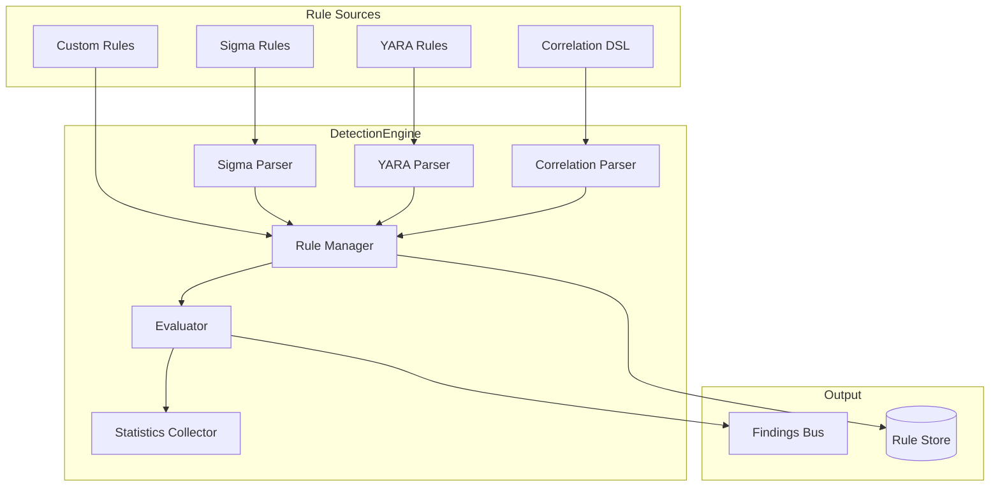
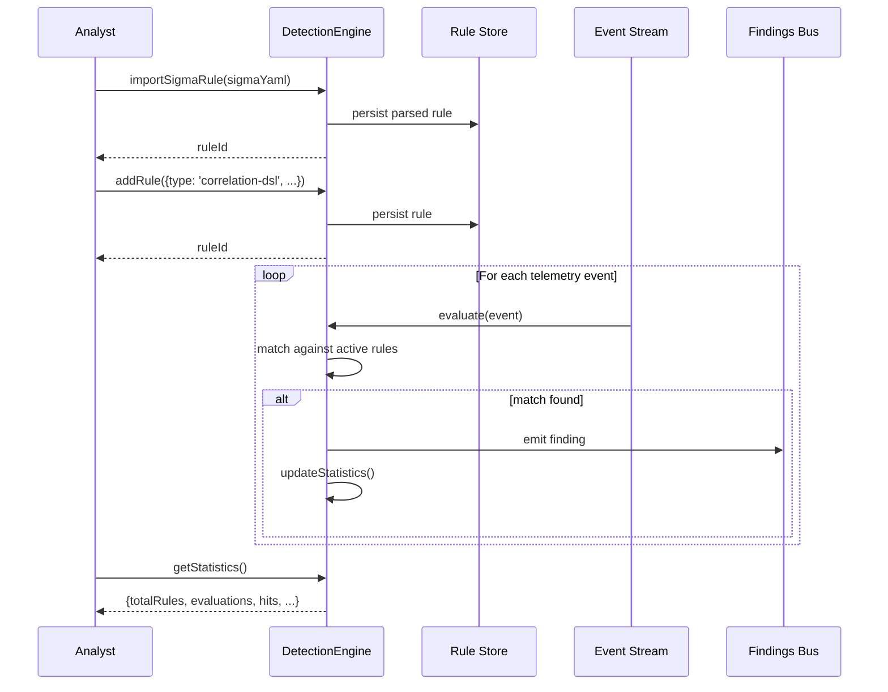

# INT-015 — Detection Engine

## Overview

The Detection Engine is the rule-evaluation core of the security platform. It ingests detection rules in multiple formats — Sigma, YARA, Correlation DSL, and custom — and evaluates them against incoming telemetry to produce findings. The engine supports hot-loading of rules, rule versioning, and real-time statistics on rule performance (hit count, false-positive rate, evaluation latency).

---

## Architecture



---

## Data Flow



---

## Public API

### DetectionEngine

```typescript
class DetectionEngine {
  addRule(rule: RuleDefinition): Promise<string>;
  importSigmaRule(sigmaYaml: string): Promise<string>;
  importYaraRule(yaraRule: string): Promise<string>;
  evaluate(event: Record<string, unknown>): Promise<Finding[]>;
  getRule(ruleId: string): Promise<Rule | null>;
  listRules(filter?: RuleFilter): Promise<Rule[]>;
  updateRule(ruleId: string, updates: Partial<RuleDefinition>): Promise<Rule>;
  deleteRule(ruleId: string): Promise<void>;
  getStatistics(): Promise<DetectionStatistics>;
}
```

**Exported Types**

| Type | Description |
|---|---|
| `RuleType` | `'sigma' \| 'yara' \| 'correlation-dsl' \| 'custom'` |
| `RuleDefinition` | `{ type: RuleType; name: string; description?: string; severity?: string; enabled?: boolean; source: string \| object }` |
| `Rule` | `{ id: string; type: RuleType; name: string; description?: string; severity: string; enabled: boolean; source: string \| object; createdAt: Date; updatedAt: Date; hitCount: number }` |
| `RuleFilter` | `{ type?: RuleType; severity?: string; enabled?: boolean; search?: string; limit?: number; offset?: number }` |
| `Finding` | `{ ruleId: string; ruleName: string; severity: string; description: string; event: Record<string, unknown>; matchedFields: string[]; timestamp: Date }` |
| `DetectionStatistics` | `{ totalRules: number; enabledRules: number; totalEvaluations: number; totalHits: number; evaluationsPerSecond: number; byType: Record<RuleType, { count: number; hits: number }> }` |

---

## Extension Points

| Extension Point | Mechanism | Example |
|---|---|---|
| **Custom Rule Type** | Extend `RuleType` + register a parser/evaluator | Add a Suricata rule type for network IDS |
| **Sigma Custom Log Sources** | Extend the Sigma parser with custom log-source mappings | Map `log_source: kubernetes` to k8s audit log fields |
| **YARA Custom Modules** | Provide YARA module extensions | Add a `pe scanner` module for PE file analysis |
| **Correlation DSL Functions** | Extend the DSL with custom aggregation/window functions | Add a `distinct_count` windowed aggregation |
| **Finding Enrichment** | Post-process hook on findings before emission | Enrich findings with asset-owner data from CMDB |
| **Rule Validation** | Pre-insert hook on `addRule()` | Validate that Sigma rules conform to your naming convention |

---

## Examples

### Importing and Evaluating a Sigma Rule

```typescript
import { DetectionEngine } from '@sec-scanner/detection';

const engine = new DetectionEngine();

// Import a Sigma rule for PowerShell execution
const ruleId = await engine.importSigmaRule(`
title: Suspicious PowerShell Execution
id: 8e5a1d3e-7b2c-4f9e-a1d3-5e7b2c4f9ea1
status: experimental
logsource:
    category: process_creation
    product: windows
detection:
    selection:
        Image|endswith: '\\\\powershell.exe'
        CommandLine|contains: '-enc'
    condition: selection
severity: high
tags:
    - attack.execution
    - attack.t1059.001
`);

console.log(`Imported rule: ${ruleId}`);

// Evaluate an incoming event
const findings = await engine.evaluate({
  Image: 'C:\\Windows\\System32\\WindowsPowerShell\\v1.0\\powershell.exe',
  CommandLine: 'powershell.exe -enc SQBFAFgA...',
  EventID: 4688,
  Computer: 'WORKSTATION-01',
});

if (findings.length > 0) {
  for (const finding of findings) {
    console.log(`[${finding.severity}] ${finding.ruleName}: ${finding.description}`);
    console.log(`  Matched fields: ${finding.matchedFields.join(', ')}`);
  }
}
```

### Adding a Correlation DSL Rule

```typescript
const corrRuleId = await engine.addRule({
  type: 'correlation-dsl',
  name: 'Multiple Failed Logins Followed by Success',
  description: 'Detects brute-force login attempts',
  severity: 'medium',
  source: {
    sequence: [
      { filter: 'event.action == "login-failed"', window: '5m', threshold: 5 },
      { filter: 'event.action == "login-success"' },
    ],
    groupBy: ['event.sourceIp', 'event.username'],
  },
});

console.log(`Created correlation rule: ${corrRuleId}`);
```

### Importing a YARA Rule

```typescript
const yaraRuleId = await engine.importYaraRule(`
rule SuspiciousWebShell {
    meta:
        description = "Detects common web shell patterns"
        severity = "critical"
        author = "Security Team"
    strings:
        $s1 = "eval($_POST[" ascii
        $s2 = "base64_decode($_GET[" ascii
        $s3 = "system($_REQUEST[" ascii
    condition:
        any of ($s1, $s2, $s3)
}
`);

console.log(`Imported YARA rule: ${yaraRuleId}`);
```

### Querying Rules and Statistics

```typescript
// List all enabled Sigma rules
const sigmaRules = await engine.listRules({
  type: 'sigma',
  enabled: true,
  limit: 50,
});

console.log(`${sigmaRules.length} enabled Sigma rules`);
for (const rule of sigmaRules) {
  console.log(`  ${rule.name} — hits: ${rule.hitCount}`);
}

// Get overall statistics
const stats = await engine.getStatistics();
console.log(`Total rules: ${stats.totalRules}`);
console.log(`Enabled: ${stats.enabledRules}`);
console.log(`Evaluations: ${stats.totalEvaluations}`);
console.log(`Hits: ${stats.totalHits}`);
console.log(`Evaluations/sec: ${stats.evaluationsPerSecond}`);

for (const [type, typeStats] of Object.entries(stats.byType)) {
  console.log(`  ${type}: ${typeStats.count} rules, ${typeStats.hits} hits`);
}
```

### Updating and Deleting Rules

```typescript
// Disable a rule
await engine.updateRule(ruleId, { enabled: false });

// Change severity
await engine.updateRule(ruleId, { severity: 'critical' });

// Delete a rule
await engine.deleteRule(ruleId);
```

---

## Performance Notes

- **Rule Loading** — Rules are compiled into an intermediate representation at load time. Sigma rules compile in < 1 ms each; YARA rules compile in 1–10 ms depending on complexity. Importing 1 000 Sigma rules takes ~0.5 seconds.
- **Evaluation** — `evaluate()` is designed for per-event invocation in the hot path. A single event is evaluated against all enabled rules in O(R) where R is the number of rules. For 1 000 rules, average evaluation time is 0.5–2 ms per event. Rule types are evaluated in parallel where possible.
- **Sigma Evaluation** — Sigma rules are compiled to boolean predicate trees. Field matching uses short-circuit evaluation. Wildcard and regex matches are pre-compiled.
- **YARA Evaluation** — YARA rules operate on string/buffer payloads, not structured events. The YARA subsystem uses the libyara C library via native bindings for maximum throughput (~1 GB/sec on a single core).
- **Correlation DSL** — Correlation rules maintain in-memory windows with configurable TTL. Window state is periodically flushed (default: every 60 seconds) to prevent unbounded memory growth. The number of active correlation windows is tracked in statistics.
- **Statistics** — Hit counts and evaluation counters are maintained with atomic operations and do not block the evaluation path. `getStatistics()` reads a snapshot and returns immediately.
- **Hot Loading** — `addRule()`, `updateRule()`, and `deleteRule()` take effect immediately without requiring a restart. The internal rule index is rebuilt incrementally — O(log R) per mutation — not from scratch.
