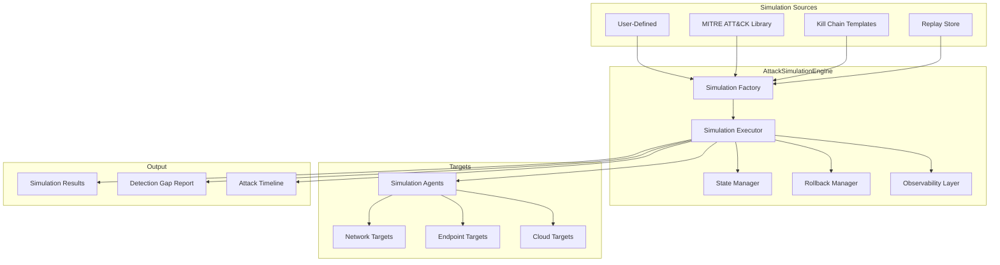
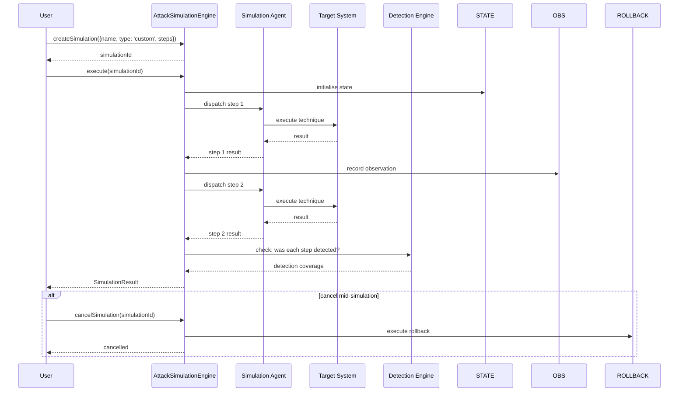

# INT-016 — Attack Simulation

## Overview

The Attack Simulation module enables security teams to safely emulate adversary techniques against their own infrastructure. It provides four simulation modes:

1. **Custom Simulation** — User-defined attack chains with arbitrary steps.
2. **MITRE ATT&CK Emulation** — Auto-generated simulation plans mapped to MITRE techniques.
3. **Kill Chain Simulation** — End-to-end adversary lifecycle emulation (recon → weaponize → deliver → exploit → install → C2 → act).
4. **Replay Simulation** — Replay previously recorded or imported attack scenarios.

All simulations run in a controlled, instrumented environment with rollback capabilities and produce detailed results for purple-team exercises and detection-gap analysis.

---

## Architecture



---

## Data Flow



---

## Public API

### AttackSimulationEngine

```typescript
class AttackSimulationEngine {
  createSimulation(params: SimulationParams): Promise<string>;
  execute(simulationId: string): Promise<SimulationResult>;
  generateMitreEmulation(params: MitreEmulationParams): Promise<string>;
  generateKillChainSimulation(params: KillChainParams): Promise<string>;
  createReplaySimulation(params: ReplayParams): Promise<string>;
  getSimulation(simulationId: string): Promise<Simulation | null>;
  listSimulations(filter?: SimulationFilter): Promise<Simulation[]>;
  cancelSimulation(simulationId: string): Promise<void>;
}
```

**Exported Types**

| Type | Description |
|---|---|
| `SimulationParams` | `{ name: string; type: 'custom'; target: TargetConfig; steps: SimulationStep[]; options?: SimulationOptions }` |
| `SimulationStep` | `{ name: string; technique?: string; action: string; params?: Record<string, unknown>; onFail?: 'stop' \| 'skip' \| 'continue' }` |
| `SimulationOptions` | `{ timeout?: number; dryRun?: boolean; rollbackOnFailure?: boolean; tags?: string[] }` |
| `TargetConfig` | `{ type: 'agent' \| 'network' \| 'endpoint' \| 'cloud'; endpoint: string; credentials?: string; metadata?: Record<string, unknown> }` |
| `MitreEmulationParams` | `{ name: string; techniques: string[]; target: TargetConfig; options?: SimulationOptions }` |
| `KillChainParams` | `{ name: string; phases?: KillChainPhase[]; target: TargetConfig; options?: SimulationOptions }` |
| `KillChainPhase` | `'reconnaissance' \| 'weaponization' \| 'delivery' \| 'exploitation' \| 'installation' \| 'command-and-control' \| 'actions-on-objectives'` |
| `ReplayParams` | `{ name: string; sourceSimulationId: string; target: TargetConfig; options?: SimulationOptions }` |
| `Simulation` | `{ id: string; name: string; status: SimulationStatus; steps: SimulationStepResult[]; startedAt?: Date; completedAt?: Date }` |
| `SimulationStatus` | `'pending' \| 'running' \| 'completed' \| 'failed' \| 'cancelled'` |
| `SimulationStepResult` | `{ stepName: string; status: 'success' \| 'failed' \| 'skipped'; output?: unknown; detected: boolean; duration: number }` |
| `SimulationResult` | `{ simulationId: string; status: SimulationStatus; stepsCompleted: number; stepsTotal: number; detectionCoverage: number; timeline: TimelineEntry[]; gapReport?: DetectionGapReport }` |
| `SimulationFilter` | `{ status?: SimulationStatus; nameContains?: string; limit?: number; offset?: number }` |
| `TimelineEntry` | `{ timestamp: Date; step: string; action: string; result: string; detected: boolean }` |
| `DetectionGapReport` | `{ totalSteps: number; detectedSteps: number; undetectedSteps: string[]; coveragePercent: number; recommendations: string[] }` |

---

## Extension Points

| Extension Point | Mechanism | Example |
|---|---|---|
| **Custom Simulation Agent** | Implement a simulation agent protocol | Build a containerised agent for Kubernetes targets |
| **MITRE Technique Library** | Extend the technique-to-action mapping | Add technique-specific Atomic Red Task references |
| **Kill Chain Phase Templates** | Add or modify phase definitions and default actions | Customise the C2 phase with Sliver/Covenant templates |
| **Rollback Strategy** | Custom rollback per step type | Add infrastructure-as-code revert for cloud steps |
| **Observability Hook** | Subscribe to simulation events for external logging | Forward step results to a SIEM in real time |
| **Detection Gap Analysis** | Extend the gap report with custom metrics | Add MITRE sub-technique coverage breakdown |

---

## Examples

### Running a Custom Attack Simulation

```typescript
import { AttackSimulationEngine } from '@sec-scanner/attack-sim';

const engine = new AttackSimulationEngine();

// Create a custom simulation
const simId = await engine.createSimulation({
  name: 'Phishing + Lateral Movement',
  type: 'custom',
  target: {
    type: 'endpoint',
    endpoint: 'https://sim-agent.acme.corp:8443',
    credentials: 'vault:sim-agent-creds',
  },
  steps: [
    {
      name: 'send-phishing-email',
      technique: 'T1566.001',
      action: 'simulate-phishing',
      params: { template: 'credential-harvest', targetUser: 'jdoe@acme.corp' },
      onFail: 'stop',
    },
    {
      name: 'execute-payload',
      technique: 'T1204.002',
      action: 'execute-macro-payload',
      params: { payload: 'benign-beacon' },
      onFail: 'skip',
    },
    {
      name: 'lateral-movement-rdp',
      technique: 'T1021.001',
      action: 'rdp-brute-force',
      params: { targetHost: '10.0.2.50', username: 'admin' },
      onFail: 'continue',
    },
  ],
  options: {
    timeout: 3600000,
    rollbackOnFailure: true,
    tags: ['purple-team', 'q1-2024'],
  },
});

// Execute
const result = await engine.execute(simId);
console.log(`Simulation ${result.simulationId}: ${result.status}`);
console.log(`Steps: ${result.stepsCompleted}/${result.stepsTotal}`);
console.log(`Detection coverage: ${result.detectionCoverage}%`);

// Review the gap report
if (result.gapReport) {
  console.log(`\nUndetected steps:`);
  for (const step of result.gapReport.undetectedSteps) {
    console.log(`  ❌ ${step}`);
  }
  console.log(`\nRecommendations:`);
  for (const rec of result.gapReport.recommendations) {
    console.log(`  → ${rec}`);
  }
}
```

### Generating a MITRE ATT&CK Emulation

```typescript
// Auto-generate a simulation from MITRE techniques
const mitreSimId = await engine.generateMitreEmulation({
  name: 'APT29 Emulation',
  techniques: [
    'T1566.001', // Spearphishing Attachment
    'T1204.002', // Malicious File
    'T1059.001', // PowerShell
    'T1055.001', // DLL Injection
    'T1071.001', // Web Protocols (C2)
    'T1041',     // Exfiltration Over C2 Channel
  ],
  target: {
    type: 'network',
    endpoint: 'https://sim-agent.acme.corp:8443',
  },
  options: { dryRun: true },
});

const result = await engine.execute(mitreSimId);
console.log(`MITRE emulation result: ${result.status}`);
console.log(`Detection coverage: ${result.detectionCoverage}%`);
```

### Kill Chain Simulation

```typescript
const kcSimId = await engine.generateKillChainSimulation({
  name: 'Full Kill Chain — External Adversary',
  phases: [
    'reconnaissance',
    'weaponization',
    'delivery',
    'exploitation',
    'installation',
    'command-and-control',
    'actions-on-objectives',
  ],
  target: {
    type: 'cloud',
    endpoint: 'https://cloud-sim-agent.acme.corp:8443',
  },
});

const result = await engine.execute(kcSimId);

// Inspect the timeline
for (const entry of result.timeline) {
  const detected = entry.detected ? '🟢' : '🔴';
  console.log(`${detected} ${entry.timestamp.toISOString()} — ${entry.step}: ${entry.action}`);
}
```

### Replaying a Previous Simulation

```typescript
const replayId = await engine.createReplaySimulation({
  name: 'Q1 APT29 Replay',
  sourceSimulationId: 'sim-abc-123',
  target: {
    type: 'endpoint',
    endpoint: 'https://sim-agent-staging.acme.corp:8443',
  },
  options: { rollbackOnFailure: false },
});

const replayResult = await engine.execute(replayId);
console.log(`Replay detection coverage: ${replayResult.detectionCoverage}%`);
```

### Listing and Cancelling Simulations

```typescript
// List all running simulations
const running = await engine.listSimulations({ status: 'running' });
console.log(`${running.length} simulations in progress`);

// Cancel a long-running simulation
await engine.cancelSimulation(running[0].id);
console.log('Cancelled simulation');
```

---

## Performance Notes

- **Simulation Creation** — `createSimulation()` validates the step definitions and target config synchronously; it does not execute anything. Typical latency: < 10 ms.
- **Execution** — `execute()` is asynchronous and long-running. Step execution is sequential by default (steps may depend on prior step output). For independent steps, set `parallel: true` in `SimulationOptions` (not yet exposed in the API but planned). Step timeout defaults to 5 minutes per step; override with `step.timeout`.
- **MITRE Emulation Generation** — `generateMitreEmulation()` resolves technique IDs to concrete actions using the MITRE technique library. Library lookups are O(1) by technique ID. Generation of a 20-technique emulation plan takes < 50 ms.
- **Kill Chain Simulation** — Phase ordering is fixed (7 phases). Each phase maps to a set of candidate actions selected based on the target type. Generation is O(P) where P = number of phases.
- **Replay** — `createReplaySimulation()` copies the step definitions from the source simulation and re-targets them. The source simulation's results are **not** copied — the replay produces fresh results against the new target.
- **Cancellation** — `cancelSimulation()` signals the executor to stop between steps. The currently executing step is allowed to finish (or time out). Rollback is executed for completed steps if `rollbackOnFailure` was set.
- **Detection Gap Analysis** — The gap report cross-references simulation step results with detection engine findings. This is a post-processing step that adds ~100–500 ms depending on the number of steps and the detection engine's query latency.
- **Scalability** — Multiple simulations can run concurrently (bounded by the number of available simulation agents). Each agent handles one simulation at a time. For large-scale purple-team exercises, deploy multiple agents and distribute simulations across them.
