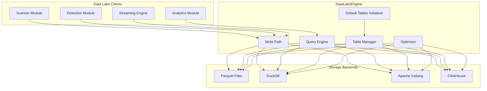
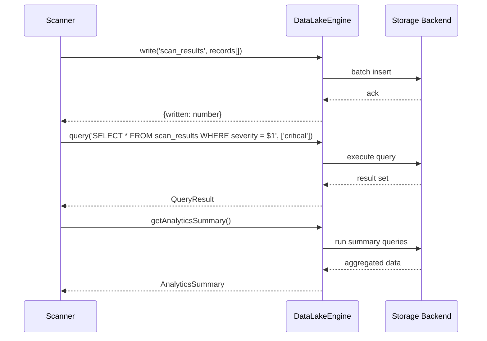

# INT-017 — Data Lake

## Overview

The Data Lake module provides a unified storage and query engine for the security platform's analytical data. It supports four storage backends — Parquet (local/S3), DuckDB (embedded analytical DB), Apache Iceberg (table format with snapshot isolation), and ClickHouse (columnar OLAP) — and exposes a consistent API for writing, querying, and managing structured security data. The engine auto-creates default tables for scan results, findings, events, and metrics, and provides an analytics summary endpoint for quick dashboards.

---

## Architecture



---

## Data Flow



---

## Public API

### DataLakeEngine

```typescript
class DataLakeEngine {
  write(table: string, records: Record<string, unknown>[]): Promise<{ written: number }>;
  query(sql: string, params?: unknown[]): Promise<QueryResult>;
  createTable(definition: TableDefinition): Promise<void>;
  dropTable(tableName: string): Promise<void>;
  listTables(): Promise<TableInfo[]>;
  getTableSchema(tableName: string): Promise<TableSchema>;
  optimize(tableName: string, options?: OptimizeOptions): Promise<OptimizeResult>;
  health(): Promise<{ status: string; backend: string; latencyMs: number }>;
  initializeDefaultTables(): Promise<void>;
  getAnalyticsSummary(): Promise<AnalyticsSummary>;
}
```

**Exported Types**

| Type | Description |
|---|---|
| `DataLakeBackend` | `'parquet' \| 'duckdb' \| 'iceberg' \| 'clickhouse'` |
| `TableDefinition` | `{ name: string; columns: ColumnDef[]; partitionBy?: string[]; orderBy?: string[]; ttl?: string }` |
| `ColumnDef` | `{ name: string; type: string; nullable?: boolean; default?: unknown }` |
| `TableInfo` | `{ name: string; rowCount: number; sizeBytes: number; createdAt: Date; updatedAt: Date }` |
| `TableSchema` | `{ name: string; columns: ColumnDef[]; partitionBy?: string[]; orderBy?: string[] }` |
| `QueryResult` | `{ columns: string[]; rows: Record<string, unknown>[]; rowCount: number; executionTimeMs: number }` |
| `OptimizeOptions` | `{ compact?: boolean; deduplicate?: boolean; rebuildIndex?: boolean; maxSegmentSize?: number }` |
| `OptimizeResult` | `{ filesBefore: number; filesAfter: number; bytesReclaimed: number; durationMs: number }` |
| `AnalyticsSummary` | `{ totalScans: number; totalFindings: number; findingsBySeverity: Record<string, number>; scansLast24h: number; topVulnerableAssets: Array<{ asset: string; findingCount: number }> }` |

---

## Extension Points

| Extension Point | Mechanism | Example |
|---|---|---|
| **Custom Storage Backend** | Implement the internal `StorageBackend` interface | Add a Delta Lake backend |
| **Table Migrations** | Hook into `createTable()` for schema evolution | Add column addition with default back-fill |
| **Query Middleware** | Pre/post-process SQL queries | Inject tenant-id filtering for multi-tenant isolation |
| **Optimize Strategies** | Custom compaction/deduplication logic | Implement time-partition-based compaction for Iceberg |
| **Default Tables** | Extend `initializeDefaultTables()` | Add a `threat_intel_entries` default table |
| **Analytics Plugins** | Extend `getAnalyticsSummary()` | Add MITRE heat-map data to the summary |

---

## Examples

### Writing and Querying Scan Results

```typescript
import { DataLakeEngine } from '@sec-scanner/data-lake';

const lake = new DataLakeEngine({ backend: 'duckdb', path: '/data/lake' });

await lake.initializeDefaultTables();

// Write scan results
await lake.write('scan_results', [
  {
    scanId: 'scan-001',
    target: '10.0.1.42',
    port: 443,
    service: 'https',
    severity: 'high',
    cve: 'CVE-2024-1234',
    timestamp: new Date().toISOString(),
  },
  {
    scanId: 'scan-001',
    target: '10.0.1.43',
    port: 22,
    service: 'ssh',
    severity: 'medium',
    cve: null,
    timestamp: new Date().toISOString(),
  },
]);

// Query for critical findings
const result = await lake.query(
  'SELECT target, cve, severity FROM scan_results WHERE severity = $1 ORDER BY timestamp DESC',
  ['high'],
);

console.log(`Found ${result.rowCount} high-severity results in ${result.executionTimeMs}ms`);
for (const row of result.rows) {
  console.log(`  ${row.target}: ${row.cve} (${row.severity})`);
}
```

### Creating a Custom Table

```typescript
await lake.createTable({
  name: 'network_flows',
  columns: [
    { name: 'src_ip', type: 'VARCHAR', nullable: false },
    { name: 'dst_ip', type: 'VARCHAR', nullable: false },
    { name: 'dst_port', type: 'INTEGER', nullable: false },
    { name: 'protocol', type: 'VARCHAR', nullable: false },
    { name: 'bytes', type: 'BIGINT', nullable: true },
    { name: 'packets', type: 'BIGINT', nullable: true },
    { name: 'timestamp', type: 'TIMESTAMP', nullable: false },
  ],
  partitionBy: ['date_trunc(\'day\', timestamp)'],
  orderBy: ['timestamp'],
  ttl: '90d',
});

// Write flow data
await lake.write('network_flows', flowRecords);
```

### Getting an Analytics Summary

```typescript
const summary = await lake.getAnalyticsSummary();
console.log(`Total scans: ${summary.totalScans}`);
console.log(`Total findings: ${summary.totalFindings}`);
console.log('Findings by severity:');
for (const [severity, count] of Object.entries(summary.findingsBySeverity)) {
  console.log(`  ${severity}: ${count}`);
}
console.log(`Scans in last 24h: ${summary.scansLast24h}`);
console.log('Top vulnerable assets:');
for (const asset of summary.topVulnerableAssets) {
  console.log(`  ${asset.asset}: ${asset.findingCount} findings`);
}
```

### Optimizing a Table

```typescript
const optimizeResult = await lake.optimize('scan_results', {
  compact: true,
  deduplicate: true,
  rebuildIndex: true,
  maxSegmentSize: 128 * 1024 * 1024, // 128 MB
});

console.log(`Optimized: ${optimizeResult.filesBefore} → ${optimizeResult.filesAfter} files`);
console.log(`Reclaimed ${optimizeResult.bytesReclaimed} bytes in ${optimizeResult.durationMs}ms`);
```

### Using ClickHouse Backend

```typescript
const clickhouseLake = new DataLakeEngine({
  backend: 'clickhouse',
  url: 'clickhouse://ch.acme.corp:9000',
  database: 'security_lake',
  username: 'scanner',
  password: '***',
});

await clickhouseLake.initializeDefaultTables();

// High-performance analytics query
const result = await clickhouseLake.query(`
  SELECT
    target,
    count() AS finding_count,
    arrayJoin(severity) AS sev,
    countIf(sev = 'critical') AS critical_count
  FROM scan_results
  WHERE timestamp >= now() - INTERVAL 7 DAY
  GROUP BY target
  ORDER BY critical_count DESC
  LIMIT 20
`);
```

---

## Performance Notes

- **DuckDB Backend** — Best for single-node, embedded analytics. Queries on 10 M rows complete in 100–500 ms. Zero external dependencies. Not suitable for concurrent multi-process writes (DuckDB supports a single writer).
- **Parquet Backend** — Write throughput is ~50 MB/sec per thread on local SSD; ~200 MB/sec on S3 with multipart upload. Queries require full file scans unless partition pruning is enabled. Best for append-only, batch-analytical workloads.
- **Iceberg Backend** — Provides snapshot isolation, schema evolution, and time-travel queries. Write throughput is comparable to Parquet (Iceberg files are Parquet underneath). Metadata lookups add ~50 ms overhead per query. Best for multi-writer, versioned datasets.
- **ClickHouse Backend** — Highest query throughput (10+ GB/sec scan speed on a single node). Supports real-time ingestion at 100 K+ rows/sec. Requires a running ClickHouse server. Best for large-scale, low-latency analytical dashboards.
- **`write()`** — Records are buffered in memory and flushed in batches (default: 10 000 rows or 64 MB). For high-throughput ingestion, call `write()` with larger batches rather than many small calls.
- **`query()`** — SQL is passed through to the backend verbatim. Use parameterised queries (`$1`, `$2`, ...) to prevent injection. Complex joins across large tables should be optimised at the backend level (indexes, materialised views).
- **`optimize()`** — Compaction merges small files into larger segments. Deduplication removes exact-duplicate rows based on a configured key. On a 100 GB table, compaction takes 5–15 minutes depending on the backend. Schedule optimisation during off-peak hours.
- **`initializeDefaultTables()`** — Creates ~8 default tables (scan_results, findings, events, metrics, etc.) if they don't exist. Idempotent — safe to call on every startup.
