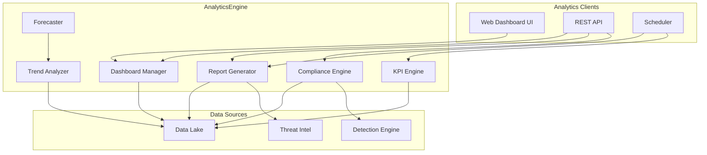
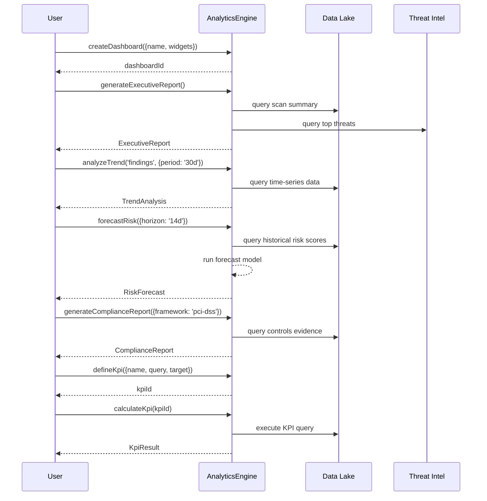

# INT-018 — Analytics

## Overview

The Analytics module provides dashboards, reporting, trend analysis, forecasting, and KPI management for the security platform. It comprises five functional areas:

1. **Dashboards** — CRUD for custom dashboards with configurable widgets and layout.
2. **Executive Reporting** — Auto-generated executive and compliance reports.
3. **Trend Analysis & Forecasting** — Time-series analysis with risk forecasting.
4. **Compliance Reporting** — Framework-specific compliance status and gap reports.
5. **KPI Management** — Define, calculate, and track key performance indicators with built-in defaults.

---

## Architecture



---

## Data Flow



---

## Public API

### AnalyticsEngine

```typescript
class AnalyticsEngine {
  // --- Dashboards ---
  createDashboard(params: DashboardParams): Promise<string>;
  getDashboard(dashboardId: string): Promise<Dashboard>;
  listDashboards(filter?: DashboardFilter): Promise<DashboardSummary[]>;
  updateDashboard(dashboardId: string, updates: Partial<DashboardParams>): Promise<Dashboard>;
  deleteDashboard(dashboardId: string): Promise<void>;

  // --- Executive Reports ---
  generateExecutiveReport(params?: ExecutiveReportParams): Promise<ExecutiveReport>;
  generateDefaultExecutiveReport(): Promise<ExecutiveReport>;

  // --- Trend & Forecast ---
  analyzeTrend(metric: string, params: TrendParams): Promise<TrendAnalysis>;
  forecastRisk(params: ForecastParams): Promise<RiskForecast>;

  // --- Compliance ---
  generateComplianceReport(params: ComplianceReportParams): Promise<ComplianceReport>;
  getComplianceReport(reportId: string): Promise<ComplianceReport>;

  // --- KPIs ---
  defineKpi(params: KpiDefinition): Promise<string>;
  calculateKpi(kpiId: string): Promise<KpiResult>;
  listKpis(): Promise<KpiSummary[]>;
  getDefaultKpis(): Promise<KpiDefinition[]>;
}
```

**Exported Types**

| Type | Description |
|---|---|
| `DashboardParams` | `{ name: string; description?: string; widgets: Widget[]; layout?: LayoutConfig; refreshInterval?: number }` |
| `Widget` | `{ id: string; type: 'chart' \| 'table' \| 'metric' \| 'heatmap' \| 'timeline'; title: string; query: string; options?: Record<string, unknown> }` |
| `LayoutConfig` | `{ columns: number; rows: WidgetPosition[] }` |
| `WidgetPosition` | `{ widgetId: string; x: number; y: number; w: number; h: number }` |
| `Dashboard` | `{ id: string; name: string; description?: string; widgets: Widget[]; layout?: LayoutConfig; createdAt: Date; updatedAt: Date }` |
| `DashboardSummary` | `{ id: string; name: string; widgetCount: number; updatedAt: Date }` |
| `DashboardFilter` | `{ nameContains?: string; limit?: number; offset?: number }` |
| `ExecutiveReportParams` | `{ title?: string; period?: { from: Date; to: Date }; includeSections?: string[] }` |
| `ExecutiveReport` | `{ id: string; title: string; period: { from: Date; to: Date }; sections: ReportSection[]; generatedAt: Date }` |
| `ReportSection` | `{ title: string; type: string; content: Record<string, unknown> }` |
| `TrendParams` | `{ period: string; granularity?: 'hour' \| 'day' \| 'week' \| 'month'; filters?: Record<string, unknown> }` |
| `TrendAnalysis` | `{ metric: string; dataPoints: Array<{ timestamp: Date; value: number }>; trend: 'increasing' \| 'decreasing' \| 'stable'; changeRate: number; anomalyPoints: Array<{ timestamp: Date; value: number; deviation: number }> }` |
| `ForecastParams` | `{ horizon: string; confidenceLevel?: number; includeHistory?: boolean }` |
| `RiskForecast` | `{ forecastPoints: Array<{ date: Date; predicted: number; lowerBound: number; upperBound: number }>; confidence: number; method: string }` |
| `ComplianceReportParams` | `{ framework: string; scope?: string[]; asOfDate?: Date }` |
| `ComplianceReport` | `{ id: string; framework: string; asOfDate: Date; overallScore: number; controls: ControlResult[]; gaps: ComplianceGap[]; generatedAt: Date }` |
| `ControlResult` | `{ control: string; status: 'pass' \| 'fail' \| 'partial' \| 'not-assessed'; evidence: string[]; notes?: string }` |
| `ComplianceGap` | `{ control: string; description: string; remediation: string; priority: 'low' \| 'medium' \| 'high' \| 'critical' }` |
| `KpiDefinition` | `{ name: string; description?: string; query: string; target?: number; unit?: string; frequency?: string }` |
| `KpiResult` | `{ kpiId: string; name: string; value: number; target?: number; unit: string; trend: 'up' \| 'down' \| 'flat'; calculatedAt: Date }` |
| `KpiSummary` | `{ id: string; name: string; currentValue?: number; target?: number; lastCalculated?: Date }` |

---

## Extension Points

| Extension Point | Mechanism | Example |
|---|---|---|
| **Custom Widget Type** | Extend the `Widget.type` union + renderer | Add a 'geo-map' widget type |
| **Report Section Template** | Add custom section generators to `generateExecutiveReport()` | Add a "Zero Trust Maturity" section |
| **Forecast Model** | Swap the underlying forecasting algorithm | Replace exponential smoothing with Prophet |
| **Compliance Framework** | Register new framework definitions | Add HIPAA, SOX, or ISO 27001 frameworks |
| **KPI Query Language** | Extend the KPI `query` syntax | Add a DSL for cross-metric KPIs |
| **Dashboard Import/Export** | Serialise/deserialise dashboard configs | Export a dashboard as JSON for version control |
| **Anomaly Detection** | Plug custom anomaly detectors into `analyzeTrend()` | Use isolation-forest-based anomaly detection |

---

## Examples

### Creating a Custom Dashboard

```typescript
import { AnalyticsEngine } from '@sec-scanner/analytics';

const analytics = new AnalyticsEngine();

const dashboardId = await analytics.createDashboard({
  name: 'Security Operations Overview',
  description: 'Real-time view of security posture',
  widgets: [
    {
      id: 'w1',
      type: 'metric',
      title: 'Open Critical Findings',
      query: 'SELECT count() FROM findings WHERE severity = $1 AND status = $2',
      options: { parameters: ['critical', 'open'], thresholds: { warning: 10, critical: 25 } },
    },
    {
      id: 'w2',
      type: 'chart',
      title: 'Findings Over Time',
      query: 'SELECT date_trunc(\'day\', timestamp) AS day, severity, count() FROM findings GROUP BY day, severity ORDER BY day',
      options: { chartType: 'stacked-bar' },
    },
    {
      id: 'w3',
      type: 'heatmap',
      title: 'Vulnerability Heat Map by Asset',
      query: 'SELECT target, severity, count() FROM scan_results GROUP BY target, severity',
      options: { xField: 'target', yField: 'severity', valueField: 'count()' },
    },
    {
      id: 'w4',
      type: 'table',
      title: 'Top 10 Vulnerable Assets',
      query: 'SELECT target, count() AS finding_count FROM findings GROUP BY target ORDER BY finding_count DESC LIMIT 10',
      options: { columns: ['target', 'finding_count'] },
    },
  ],
  layout: {
    columns: 12,
    rows: [
      { widgetId: 'w1', x: 0, y: 0, w: 4, h: 2 },
      { widgetId: 'w2', x: 4, y: 0, w: 8, h: 4 },
      { widgetId: 'w3', x: 0, y: 2, w: 6, h: 4 },
      { widgetId: 'w4', x: 6, y: 4, w: 6, h: 4 },
    ],
  },
  refreshInterval: 300000, // 5 minutes
});
```

### Generating an Executive Report

```typescript
const report = await analytics.generateExecutiveReport({
  title: 'Q1 2024 Security Posture Report',
  period: {
    from: new Date('2024-01-01'),
    to: new Date('2024-03-31'),
  },
  includeSections: ['summary', 'risk-posture', 'top-threats', 'compliance', 'recommendations'],
});

console.log(`Report: ${report.title}`);
for (const section of report.sections) {
  console.log(`  ${section.title} (${section.type})`);
}
```

### Trend Analysis and Risk Forecasting

```typescript
// Analyze the trend of critical findings over 90 days
const trend = await analytics.analyzeTrend('critical_findings', {
  period: '90d',
  granularity: 'week',
});

console.log(`Trend: ${trend.trend} (change rate: ${trend.changeRate.toFixed(1)}%/week)`);
if (trend.anomalyPoints.length > 0) {
  console.log('Anomalies detected:');
  for (const anomaly of trend.anomalyPoints) {
    console.log(`  ${anomaly.timestamp.toISOString()}: ${anomaly.value} (deviation: ${anomaly.deviation.toFixed(2)})`);
  }
}

// Forecast risk score for the next 14 days
const forecast = await analytics.forecastRisk({
  horizon: '14d',
  confidenceLevel: 0.95,
  includeHistory: true,
});

console.log(`Forecast method: ${forecast.method}, confidence: ${forecast.confidence}`);
for (const point of forecast.forecastPoints.slice(0, 5)) {
  console.log(
    `  ${point.date.toISOString()}: predicted=${point.predicted.toFixed(1)} ` +
    `[${point.lowerBound.toFixed(1)} – ${point.upperBound.toFixed(1)}]`,
  );
}
```

### Compliance Reporting

```typescript
const complianceReport = await analytics.generateComplianceReport({
  framework: 'pci-dss',
  scope: ['payment-processing', 'cardholder-data'],
  asOfDate: new Date(),
});

console.log(`PCI-DSS Compliance Score: ${complianceReport.overallScore}%`);
console.log(`Controls assessed: ${complianceReport.controls.length}`);
console.log(`Gaps: ${complianceReport.gaps.length}`);

for (const gap of complianceReport.gaps) {
  console.log(`  [${gap.priority}] ${gap.control}: ${gap.description}`);
  console.log(`    Remediation: ${gap.remediation}`);
}
```

### Defining and Calculating KPIs

```typescript
// Use default KPIs
const defaultKpis = await analytics.getDefaultKpis();
console.log(`${defaultKpis.length} default KPIs available`);

// Define a custom KPI
const meanTimeToRemediate = await analytics.defineKpi({
  name: 'Mean Time to Remediate (Critical)',
  description: 'Average time from finding to remediation for critical-severity issues',
  query: `SELECT avg(date_diff('hour', discovered_at, remediated_at)) FROM findings WHERE severity = 'critical' AND status = 'remediated'`,
  target: 72,
  unit: 'hours',
  frequency: 'daily',
});

// Calculate the KPI
const result = await analytics.calculateKpi(meanTimeToRemediate);
console.log(`${result.name}: ${result.value} ${result.unit} (target: ${result.target} ${result.unit}, trend: ${result.trend})`);

// List all KPIs
const allKpis = await analytics.listKpis();
for (const kpi of allKpis) {
  console.log(`  ${kpi.name}: ${kpi.currentValue ?? 'N/A'} (target: ${kpi.target ?? 'N/A'})`);
}
```

---

## Performance Notes

- **Dashboards** — Dashboard creation and updates are O(W) where W = number of widgets. Widget queries are not executed at creation time — they are executed when the dashboard is rendered or refreshed. For dashboards with > 20 widgets, consider increasing the `refreshInterval` to reduce backend load.
- **Executive Reports** — `generateExecutiveReport()` executes multiple sequential queries against the Data Lake. For large datasets (> 10 M rows), report generation can take 10–30 seconds. Use `generateDefaultExecutiveReport()` for a faster, pre-templated version with cached intermediate results.
- **Trend Analysis** — `analyzeTrend()` queries time-series data at the specified granularity. Daily granularity over a year (365 data points) completes in < 1 second on DuckDB; on ClickHouse, < 100 ms. Anomaly detection uses a z-score method by default — O(N) in the number of data points.
- **Forecasting** — `forecastRisk()` uses exponential smoothing with configurable confidence intervals. Forecasting over a 14-day horizon with 90 days of history takes < 500 ms. For longer horizons (> 90 days), accuracy degrades; consider re-training the model with more history.
- **Compliance Reports** — `generateComplianceReport()` evaluates each control against the evidence in the Data Lake. The number of controls varies by framework (PCI-DSS: ~250, NIST 800-53: ~1 000). Each control evaluation is an independent query; they are parallelised with a concurrency of 10. Full PCI-DSS report generation takes 5–15 seconds.
- **KPI Calculation** — `calculateKpi()` executes the KPI's query against the Data Lake. KPI queries should be optimised (indexed, aggregated) to complete in < 5 seconds. The `frequency` field is used by the scheduler to auto-calculate KPIs at the specified interval.
- **Caching** — Dashboard data, trend analyses, and KPI results are cached in-memory for the dashboard's `refreshInterval` or 60 seconds (whichever is greater). Force a refresh by recalculating or re-rendering.
