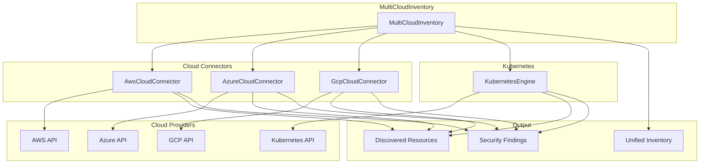
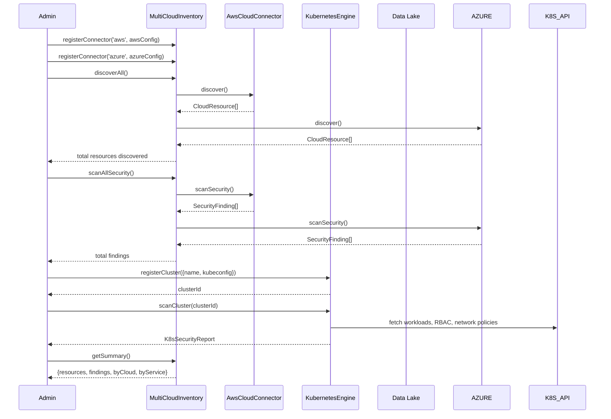

# INT-019 — Cloud & Kubernetes

## Overview

The Cloud & Kubernetes module provides unified multi-cloud discovery, security scanning, and asset inventory across AWS, Azure, and GCP, with first-class Kubernetes cluster support. A `MultiCloudInventory` façade aggregates all cloud connectors and the Kubernetes engine, enabling cross-cloud security posture assessment and a single pane of glass for cloud asset management.

---

## Architecture



---

## Data Flow



---

## Public API

### Cloud Connectors (Common Interface)

Each cloud connector — `AwsCloudConnector`, `AzureCloudConnector`, `GcpCloudConnector` — exposes the same interface:

```typescript
interface CloudConnector {
  discover(): Promise<CloudResource[]>;
  getResource(resourceId: string): Promise<CloudResource>;
  listResources(filter?: ResourceFilter): Promise<CloudResource[]>;
  scanSecurity(): Promise<SecurityFinding[]>;
  health(): Promise<{ status: string; account?: string; region?: string; latencyMs: number }>;
}

class AwsCloudConnector implements CloudConnector { /* ... */ }
class AzureCloudConnector implements CloudConnector { /* ... */ }
class GcpCloudConnector implements CloudConnector { /* ... */ }
```

**Exported Types**

| Type | Description |
|---|---|
| `CloudProvider` | `'aws' \| 'azure' \| 'gcp'` |
| `CloudResource` | `{ id: string; provider: CloudProvider; type: string; region: string; name: string; arn?: string; tags: Record<string, string>; configuration: Record<string, unknown>; discoveredAt: Date }` |
| `ResourceFilter` | `{ type?: string; region?: string; tags?: Record<string, string>; limit?: number }` |
| `SecurityFinding` | `{ id: string; resourceId: string; provider: CloudProvider; severity: 'low' \| 'medium' \| 'high' \| 'critical'; rule: string; description: string; remediation: string; compliance?: string[] }` |

---

### KubernetesEngine

```typescript
class KubernetesEngine {
  registerCluster(config: ClusterConfig): Promise<string>;
  getCluster(clusterId: string): Promise<ClusterInfo | null>;
  listClusters(): Promise<ClusterSummary[]>;
  scanCluster(clusterId: string): Promise<K8sSecurityReport>;
}

interface ClusterConfig {
  name: string;
  kubeconfig: string; // path or inline YAML
  context?: string;
  labels?: Record<string, string>;
}

interface ClusterInfo {
  id: string;
  name: string;
  version: string;
  nodes: number;
  namespaces: string[];
  status: string;
  registeredAt: Date;
}

interface ClusterSummary {
  id: string;
  name: string;
  status: string;
  nodes: number;
}

interface K8sSecurityReport {
  clusterId: string;
  clusterName: string;
  scannedAt: Date;
  findings: K8sSecurityFinding[];
  summary: {
    totalFindings: number;
    bySeverity: Record<string, number>;
    byCategory: Record<string, number>;
  };
}

interface K8sSecurityFinding {
  severity: string;
  category: 'rbac' | 'network-policy' | 'pod-security' | 'image' | 'secrets' | 'misconfiguration';
  resource: string;
  namespace: string;
  description: string;
  remediation: string;
}
```

---

### MultiCloudInventory

```typescript
class MultiCloudInventory {
  registerConnector(name: string, connector: CloudConnector): void;
  discoverAll(): Promise<{ total: number; byProvider: Record<string, number> }>;
  scanAllSecurity(): Promise<{ total: number; byProvider: Record<string, number> }>;
  getConnector(name: string): CloudConnector;
  getK8sEngine(): KubernetesEngine;
  getSummary(): Promise<MultiCloudSummary>;
}

interface MultiCloudSummary {
  totalResources: number;
  totalFindings: number;
  resourcesByProvider: Record<string, number>;
  resourcesByType: Record<string, number>;
  findingsBySeverity: Record<string, number>;
  findingsByProvider: Record<string, number>;
  clusters: number;
  lastDiscovery: Date;
  lastSecurityScan: Date;
}
```

---

## Extension Points

| Extension Point | Mechanism | Example |
|---|---|---|
| **Custom Cloud Connector** | Implement `CloudConnector` | Add an Oracle Cloud (OCI) connector |
| **Security Rule Packs** | Extend `scanSecurity()` with custom rule packs | Add CIS Benchmark rules for AWS |
| **Kubernetes Check Plugins** | Extend `scanCluster()` with custom checks | Add a Kyverno policy validation plugin |
| **Resource Enrichment** | Post-process discovered resources | Enrich resources with cost data from CloudHealth |
| **Multi-Cloud Correlation** | Extend `scanAllSecurity()` with cross-cloud checks | Detect public S3 buckets referenced by public Azure VMs |
| **Inventory Export** | Custom serialisation of `MultiCloudSummary` | Export inventory as a CMDB-compatible CSV |

---

## Examples

### Setting Up Multi-Cloud Discovery

```typescript
import {
  MultiCloudInventory,
  AwsCloudConnector,
  AzureCloudConnector,
  GcpCloudConnector,
  KubernetesEngine,
} from '@sec-scanner/cloud';

const inventory = new MultiCloudInventory();

// Register cloud connectors
inventory.registerConnector('aws', new AwsCloudConnector({
  region: 'us-east-1',
  credentials: { accessKeyId: '...', secretAccessKey: '...' },
}));

inventory.registerConnector('azure', new AzureCloudConnector({
  subscriptionId: 'xxx-xxx-xxx',
  credentials: { tenantId: '...', clientId: '...', clientSecret: '...' },
}));

inventory.registerConnector('gcp', new GcpCloudConnector({
  projectId: 'my-project',
  credentials: { keyFilename: '/path/to/service-account.json' },
}));

// Discover all cloud resources
const discovery = await inventory.discoverAll();
console.log(`Discovered ${discovery.total} resources:`);
for (const [provider, count] of Object.entries(discovery.byProvider)) {
  console.log(`  ${provider}: ${count}`);
}
```

### Registering and Scanning Kubernetes Clusters

```typescript
const k8s = inventory.getK8sEngine();

// Register production cluster
const prodClusterId = await k8s.registerCluster({
  name: 'prod-us-east',
  kubeconfig: '/home/z/.kube/config',
  context: 'prod-us-east',
  labels: { env: 'production', team: 'platform' },
});

// Register staging cluster
const stagingClusterId = await k8s.registerCluster({
  name: 'staging-us-east',
  kubeconfig: '/home/z/.kube/config',
  context: 'staging-us-east',
});

// Scan production cluster
const report = await k8s.scanCluster(prodClusterId);
console.log(`K8s Security Report for ${report.clusterName}:`);
console.log(`  Total findings: ${report.summary.totalFindings}`);
for (const [severity, count] of Object.entries(report.summary.bySeverity)) {
  console.log(`  ${severity}: ${count}`);
}

// Show RBAC issues
const rbacFindings = report.findings.filter((f) => f.category === 'rbac');
for (const finding of rbacFindings) {
  console.log(`  [${finding.severity}] ${finding.resource} in ${finding.namespace}: ${finding.description}`);
}
```

### Security Scanning Across All Clouds

```typescript
const scanResult = await inventory.scanAllSecurity();
console.log(`Found ${scanResult.total} security issues across all clouds:`);
for (const [provider, count] of Object.entries(scanResult.byProvider)) {
  console.log(`  ${provider}: ${count}`);
}
```

### Listing and Filtering Resources

```typescript
const aws = inventory.getConnector('aws');

// List all S3 buckets
const buckets = await aws.listResources({ type: 's3-bucket' });
console.log(`${buckets.length} S3 buckets`);

// Get details of a specific resource
const resource = await aws.getResource('arn:aws:s3:::my-bucket');
console.log(`Bucket: ${resource.name}, region: ${resource.region}`);
console.log(`Tags: ${JSON.stringify(resource.tags)}`);

// Filter by tag
const tagged = await aws.listResources({
  tags: { Environment: 'production' },
});
console.log(`${tagged.length} production resources`);
```

### Getting the Unified Summary

```typescript
const summary = await inventory.getSummary();
console.log('=== Multi-Cloud Summary ===');
console.log(`Resources: ${summary.totalResources}`);
console.log(`Findings: ${summary.totalFindings}`);
console.log(`Clusters: ${summary.clusters}`);
console.log('Resources by provider:');
for (const [provider, count] of Object.entries(summary.resourcesByProvider)) {
  console.log(`  ${provider}: ${count}`);
}
console.log('Findings by severity:');
for (const [severity, count] of Object.entries(summary.findingsBySeverity)) {
  console.log(`  ${severity}: ${count}`);
}
console.log(`Last discovery: ${summary.lastDiscovery.toISOString()}`);
console.log(`Last security scan: ${summary.lastSecurityScan.toISOString()}`);
```

---

## Performance Notes

- **Discovery** — `discover()` makes paginated API calls to each cloud provider. For large accounts (> 10 000 resources), discovery can take 2–5 minutes per connector. Discovery is parallelised across resource types within each connector (e.g., EC2, S3, IAM are fetched concurrently).
- **Security Scanning** — `scanSecurity()` evaluates each resource against a rule pack. Rule evaluation is O(R × K) where R = resources, K = rules. For AWS with 5 000 resources and 200 CIS rules, scanning takes ~60 seconds. Rules are evaluated in parallel with a concurrency of 50.
- **Kubernetes Scanning** — `scanCluster()` fetches all namespaces, workloads, RBAC bindings, network policies, and secrets (metadata only). For a cluster with 1 000 pods across 20 namespaces, scanning takes 10–30 seconds depending on API server latency.
- **MultiCloudInventory** — `discoverAll()` and `scanAllSecurity()` execute across all registered connectors in parallel. Total time = max(individual connector times). For 3 connectors each taking 2 minutes, total time ≈ 2 minutes.
- **Rate Limiting** — All connectors implement per-provider rate limiting (AWS: 10 req/sec, Azure: 20 req/sec, GCP: 15 req/sec by default). Rate limits are configurable via the connector constructor options.
- **Caching** — Discovered resources are cached in-memory for 15 minutes. Security findings are not cached (they may change as rules are updated). Use `health()` to check connector latency and adjust cache TTL.
- **Large-Scale Deployments** — For organisations with > 100 000 cloud resources, consider running discovery per-region and aggregating results in the Data Lake rather than holding everything in memory.
