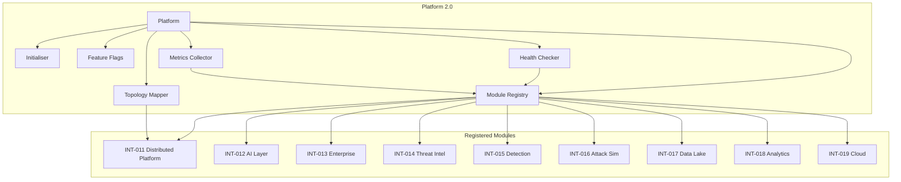
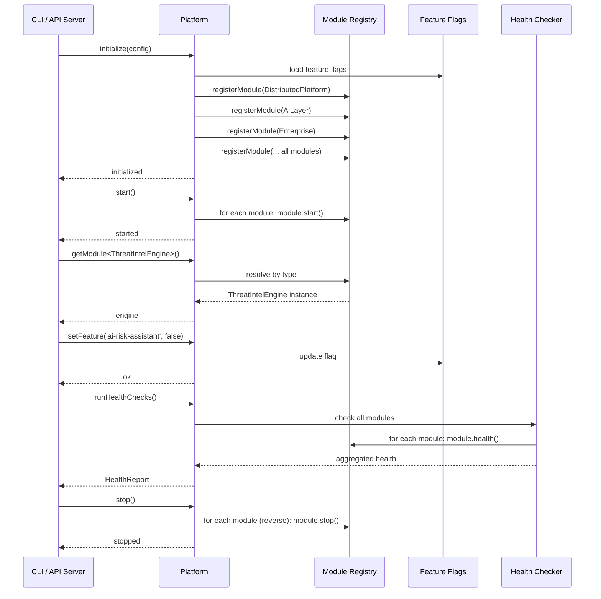

# INT-020 — Platform 2.0

## Overview

Platform 2.0 is the top-level orchestrator that initialises, configures, and governs all security platform modules. It provides:

- **Lifecycle Management** — Ordered initialisation, graceful start/stop, and health checking of every module.
- **Feature Flags** — Runtime toggling of 25+ platform features without redeployment.
- **Module Registry** — Dynamic registration and retrieval of any module by type, enabling loose coupling between modules.
- **Health & Metrics** — Aggregated health checks and metrics across all registered modules.
- **Pipeline Topology** — Visualisation and introspection of the distributed pipeline graph.

The `Platform` class is the single entry point for both the CLI and the API server. All other modules (INT-011 through INT-019) are registered with and accessed through it.

---

## Architecture



---

## Data Flow



---

## Public API

### Platform

```typescript
class Platform {
  initialize(config: PlatformConfig): Promise<void>;
  start(): Promise<void>;
  stop(): Promise<void>;
  getStatus(): PlatformStatus;
  getConfig(): PlatformConfig;
  setFeature(feature: string, enabled: boolean): void;
  getModuleStatus(moduleName: string): ModuleStatus;
  registerModule<T>(name: string, module: T): void;
  getModule<T>(name: string): T;
  runHealthChecks(): Promise<HealthReport>;
  getMetrics(): Promise<MetricsSnapshot>;
  getPipelineTopology(): Promise<PipelineTopology>;
}
```

**Exported Types**

| Type | Description |
|---|---|
| `PlatformConfig` | `{ features?: FeatureFlagsConfig; modules?: ModuleConfig[]; logging?: LoggingConfig; telemetry?: TelemetryConfig }` |
| `PlatformStatus` | `'uninitialized' \| 'initialized' \| 'starting' \| 'running' \| 'stopping' \| 'stopped' \| 'error'` |
| `ModuleStatus` | `'registered' \| 'initializing' \| 'running' \| 'stopped' \| 'error'` |
| `FeatureFlagsConfig` | `Record<string, boolean>` — maps feature names to enabled/disabled |
| `ModuleConfig` | `{ name: string; enabled: boolean; config: Record<string, unknown> }` |
| `HealthReport` | `{ status: 'healthy' \| 'degraded' \| 'unhealthy'; checks: HealthCheck[]; timestamp: Date }` |
| `HealthCheck` | `{ module: string; status: 'healthy' \| 'degraded' \| 'unhealthy'; latencyMs: number; details?: string }` |
| `MetricsSnapshot` | `{ timestamp: Date; uptimeMs: number; modules: ModuleMetrics[]; system: SystemMetrics }` |
| `ModuleMetrics` | `{ name: string; status: string; requestCount: number; errorCount: number; avgLatencyMs: number }` |
| `SystemMetrics` | `{ cpuPercent: number; memoryUsedMb: number; memoryTotalMb: number; eventLoopLagMs: number }` |
| `PipelineTopology` | `{ services: ServiceNode[]; edges: Edge[]; }` |
| `ServiceNode` | `{ id: string; name: string; status: string; dependencies: string[] }` |
| `Edge` | `{ from: string; to: string; type: 'sync' \| 'async' }` |

### Feature Flags

The following feature flags are supported (25+). All default to `true` unless otherwise specified.

| Flag | Description | Default |
|---|---|---|
| `distributed-event-bus` | Enable the distributed event bus | `true` |
| `distributed-pipeline` | Enable the distributed pipeline orchestration | `true` |
| `saga-orchestrator` | Enable saga-based distributed transactions | `true` |
| `scheduler-engine` | Enable cron/interval scheduling | `true` |
| `cluster-coordinator` | Enable cluster coordination and leader election | `true` |
| `multi-tenancy` | Enable multi-tenant isolation and resource limits | `true` |
| `streaming-engine` | Enable real-time streaming pipelines | `true` |
| `ai-llm-router` | Enable the LLM routing layer | `true` |
| `ai-risk-assistant` | Enable AI-powered risk explanation | `true` |
| `ai-remediation` | Enable AI remediation plan generation | `true` |
| `ai-threat-hunting` | Enable AI threat hunting | `true` |
| `ai-soc-copilot` | Enable the SOC copilot assistant | `true` |
| `enterprise-sso` | Enable SSO integration | `true` |
| `enterprise-siem` | Enable SIEM connectors | `true` |
| `enterprise-ticketing` | Enable ticketing connectors | `true` |
| `enterprise-notification` | Enable notification providers | `true` |
| `enterprise-cmdb` | Enable CMDB connectors | `true` |
| `enterprise-secrets` | Enable secrets management | `true` |
| `threat-intel` | Enable threat intelligence ingestion | `true` |
| `detection-engine` | Enable the detection engine | `true` |
| `attack-simulation` | Enable attack simulation | `true` |
| `data-lake` | Enable the data lake storage engine | `true` |
| `analytics` | Enable dashboards, reports, and KPIs | `true` |
| `cloud-discovery` | Enable cloud resource discovery | `true` |
| `kubernetes-scanning` | Enable Kubernetes security scanning | `true` |

---

## Extension Points

| Extension Point | Mechanism | Example |
|---|---|---|
| **Custom Module** | `registerModule()` with any object | Register a custom `ComplianceAutomationModule` |
| **Feature Flags** | `setFeature()` at runtime | Disable AI features in air-gapped environments |
| **Health Check Hooks** | Register custom health checks per module | Add a database-connection health check |
| **Metrics Export** | Extend `getMetrics()` with custom exporters | Export Prometheus-format metrics |
| **Initialisation Order** | Control module registration order | Ensure Data Lake starts before Analytics |
| **Lifecycle Hooks** | Subscribe to platform lifecycle events | Execute data migrations before `start()` |
| **Pipeline Topology** | Extend `getPipelineTopology()` with custom service graphs | Include external service dependencies |

---

## Examples

### Bootstrapping the Platform

```typescript
import { Platform } from '@sec-scanner/platform';

const platform = new Platform();

// Initialize with configuration
await platform.initialize({
  features: {
    'ai-soc-copilot': true,
    'attack-simulation': false, // disabled for this deployment
    'kubernetes-scanning': true,
  },
  modules: [
    { name: 'data-lake', enabled: true, config: { backend: 'duckdb', path: '/data/lake' } },
    { name: 'threat-intel', enabled: true, config: { autoSync: true } },
    { name: 'detection-engine', enabled: true, config: { maxRules: 5000 } },
    { name: 'analytics', enabled: true, config: {} },
    { name: 'cloud', enabled: true, config: {} },
  ],
  logging: { level: 'info', format: 'json' },
  telemetry: { enabled: true, endpoint: 'http://otel-collector:4318' },
});

// Start all modules
await platform.start();
console.log(`Platform status: ${platform.getStatus()}`);
```

### Accessing Modules

```typescript
import { ThreatIntelEngine } from '@sec-scanner/threat-intel';
import { DataLakeEngine } from '@sec-scanner/data-lake';
import { DetectionEngine } from '@sec-scanner/detection';

// Retrieve registered modules by type
const threatIntel = platform.getModule<ThreatIntelEngine>('threat-intel');
const dataLake = platform.getModule<DataLakeEngine>('data-lake');
const detection = platform.getModule<DetectionEngine>('detection-engine');

// Use them normally
const cve = await threatIntel.lookupCve('CVE-2024-1234');
const stats = await detection.getStatistics();
console.log(`CVE: ${cve?.cveId}, Detection rules: ${stats.totalRules}`);
```

### Feature Flag Management

```typescript
// Disable AI features for an air-gapped deployment
platform.setFeature('ai-llm-router', false);
platform.setFeature('ai-risk-assistant', false);
platform.setFeature('ai-remediation', false);
platform.setFeature('ai-threat-hunting', false);
platform.setFeature('ai-soc-copilot', false);

// Check module status (affected by feature flags)
const aiStatus = platform.getModuleStatus('ai-layer');
console.log(`AI Layer status: ${aiStatus}`); // 'stopped' if all AI features disabled

// Re-enable at runtime
platform.setFeature('ai-risk-assistant', true);
```

### Health Checks and Metrics

```typescript
// Run comprehensive health checks
const health = await platform.runHealthChecks();
console.log(`Platform health: ${health.status}`);
for (const check of health.checks) {
  const icon = check.status === 'healthy' ? '✅' : check.status === 'degraded' ? '⚠️' : '❌';
  console.log(`  ${icon} ${check.module}: ${check.status} (${check.latencyMs}ms)`);
  if (check.details) {
    console.log(`     ${check.details}`);
  }
}

// Get metrics snapshot
const metrics = await platform.getMetrics();
console.log(`Uptime: ${Math.floor(metrics.uptimeMs / 3600000)}h`);
console.log(`CPU: ${metrics.system.cpuPercent}%`);
console.log(`Memory: ${metrics.system.memoryUsedMb}/${metrics.system.memoryTotalMb} MB`);
for (const mod of metrics.modules) {
  console.log(`  ${mod.name}: ${mod.requestCount} req, ${mod.errorCount} err, ${mod.avgLatencyMs}ms avg`);
}
```

### Pipeline Topology

```typescript
const topology = await platform.getPipelineTopology();
console.log(`Pipeline services: ${topology.services.length}`);

for (const service of topology.services) {
  console.log(`  ${service.name} [${service.status}] → depends on: ${service.dependencies.join(', ') || 'none'}`);
}

console.log(`Edges: ${topology.edges.length}`);
for (const edge of topology.edges) {
  console.log(`  ${edge.from} → ${edge.to} (${edge.type})`);
}
```

### Graceful Shutdown

```typescript
// Graceful stop — modules are stopped in reverse registration order
process.on('SIGTERM', async () => {
  console.log('Received SIGTERM, shutting down...');
  await platform.stop();
  console.log(`Platform status: ${platform.getStatus()}`);
  process.exit(0);
});
```

### Registering a Custom Module

```typescript
// Define a custom module
class ComplianceAutomationModule {
  async start(): Promise<void> { /* ... */ }
  async stop(): Promise<void> { /* ... */ }
  async health(): Promise<{ status: string }> { return { status: 'healthy' }; }

  async runAudit(framework: string): Promise<unknown> { /* ... */ }
}

// Register it with the platform
const complianceModule = new ComplianceAutomationModule();
platform.registerModule('compliance-automation', complianceModule);

// Access it later
const compliance = platform.getModule<ComplianceAutomationModule>('compliance-automation');
const auditResult = await compliance.runAudit('pci-dss');
```

---

## Performance Notes

- **Initialisation** — `initialize()` loads configuration, feature flags, and registers modules but does **not** start them. Typical latency: < 500 ms. The heavy lifting happens in `start()`.
- **Start** — `start()` initialises modules in registration order. Each module's `start()` is awaited sequentially to respect dependency order. For 10 modules each taking 1–3 seconds to start, total startup is ~15–30 seconds. Future versions will support parallel start for independent modules.
- **Stop** — `stop()` shuts down modules in reverse registration order. Each module's `stop()` is given a 30-second timeout; if it doesn't stop cleanly, it is force-killed. Total shutdown time: typically 5–20 seconds.
- **Feature Flags** — `setFeature()` takes effect immediately for new requests. In-flight operations are not interrupted. Feature-flag checks are in-memory hash lookups (O(1)).
- **Module Registry** — `getModule<T>()` is a synchronous map lookup (O(1)). No reflection or dynamic loading is performed at retrieval time.
- **Health Checks** — `runHealthChecks()` executes all registered health checks in parallel with a 10-second timeout per check. For 10 modules, total health-check time = max(individual check times), typically 1–5 seconds.
- **Metrics** — `getMetrics()` collects metrics from all modules in parallel. Metric collection is lightweight (counters and gauges); the dominant cost is the system-metrics sampling (CPU, memory), which takes < 50 ms.
- **Pipeline Topology** — `getPipelineTopology()` introspects the distributed pipeline module (INT-011). For pipelines with < 100 services, topology generation takes < 200 ms. For very large pipelines, the topology is cached for 60 seconds.
- **Memory** — The platform itself has minimal memory overhead (< 50 MB). Total memory consumption is dominated by the registered modules. Monitor via `getMetrics().system.memoryUsedMb`.
